# Cubes in a cube

s = container edge / piece edge; every row certified in exact arithmetic.

| n | s | touching limit | closed form (conj.) | previous best | volume bound | density | picture |
|---|---|---|---|---|---|---|---|
| 2 | [2.00000+](cubincub_n02.json) | 2.000000000000 | 2 | 2.00000 (Friedman catalogue) | 1.25992 | 0.2500 | 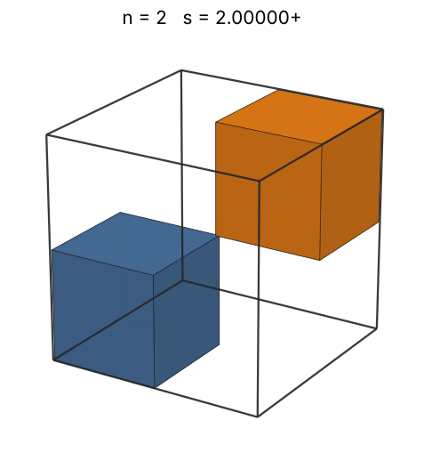 |
| 3 | [2.00000+](cubincub_n03.json) | 2.000000000000 | 2 | 2.00000 (Friedman catalogue) | 1.44225 | 0.3750 | 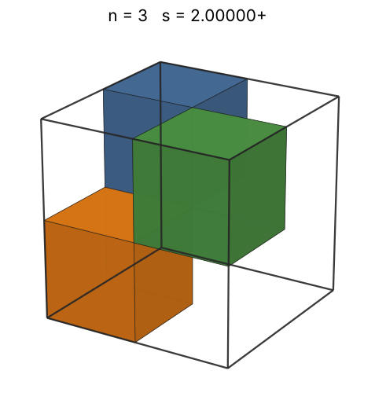 |
| 4 | [2.00000+](cubincub_n04.json) | 2.000000000000 | 2 | 2.00000 (Friedman catalogue) | 1.58740 | 0.5000 | 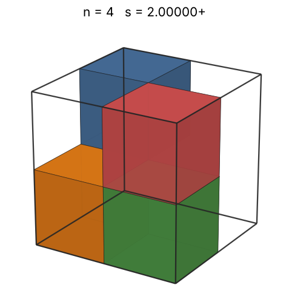 |
| 5 | [2.00000+](cubincub_n05.json) | 2.000000000000 | 2 | 2.00000 (Friedman catalogue) | 1.70998 | 0.6250 | 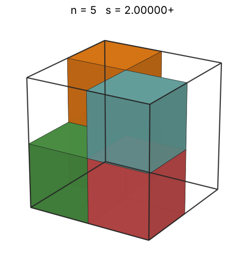 |
| 6 | [2.00000+](cubincub_n06.json) | 2.000000000000 | 2 | 2.00000 (Friedman catalogue) | 1.81712 | 0.7500 | 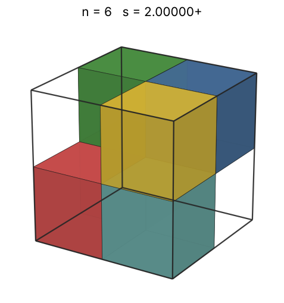 |
| 7 | [2.00000+](cubincub_n07.json) | 2.000000000000 | 2 | 2.00000 (Friedman catalogue) | 1.91293 | 0.8750 | 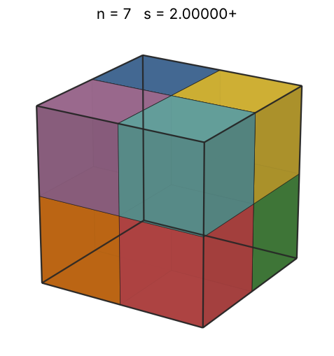 |
| 8 | [2.00000+](cubincub_n08.json) | 2.000000000000 | 2 | 2.00000 (Friedman catalogue) | 2.00000 | 1.0000 | 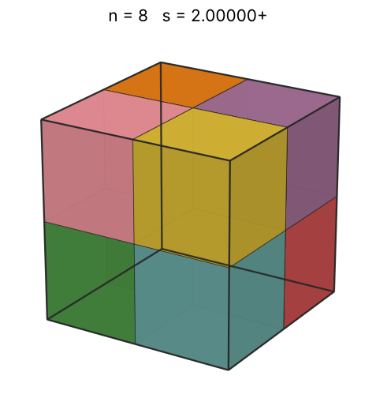 |
| 9 | [2.70710+](cubincub_n09.json) | 2.707106781187 | (4 + √2)/2 | 2.70711 (Friedman catalogue (2 + 1/sqrt2)) | 2.08008 | 0.4537 | 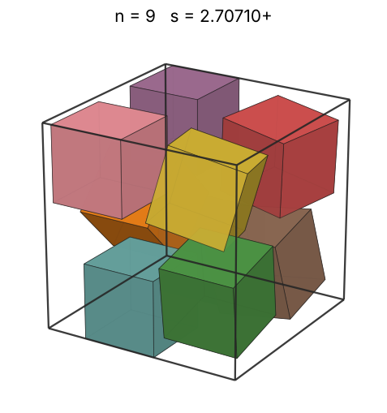 |
| 10 | [2.87182+](cubincub_n10.json) | 2.871822117693 |  | 2.70711 (Friedman catalogue (2 + 1/sqrt2)) | 2.15443 | 0.4222 | 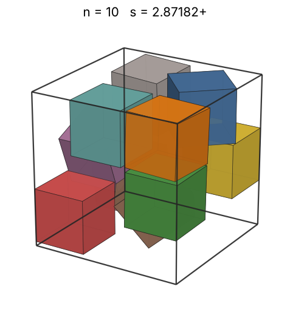 |
| 11 | [2.91209+](cubincub_n11.json) | 2.912095586463 |  | 2.88295 (Hyra-results (Haowei Lin), 2026) | 2.22398 | 0.4454 | 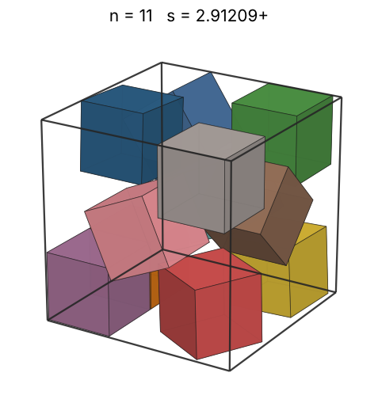 |
| 12 | [2.97661+](cubincub_n12.json) | 2.976619590102 |  | 2.93152 (Y. Nakajima, Oct 2026) | 2.28943 | 0.4550 | 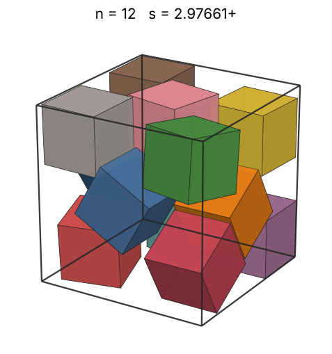 |
| 13 | [2.97661+](cubincub_n13.json) | 2.976619590102 |  | 2.95600 (Friedman catalogue (truncated)) | 2.35133 | 0.4929 | 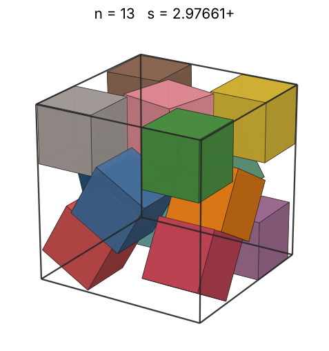 |
| 14 | [3.00000+](cubincub_n14.json) | 3.000000000000 | 3 | 2.98995 (Friedman catalogue) | 2.41014 | 0.5185 | 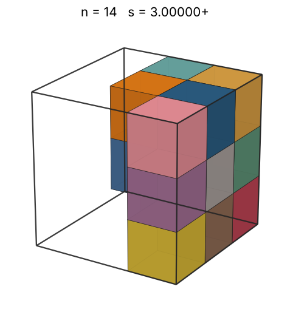 |
| 15 | [3.00000+](cubincub_n15.json) | 3.000000000000 | 3 | 3.00000 (Friedman catalogue) | 2.46621 | 0.5556 | 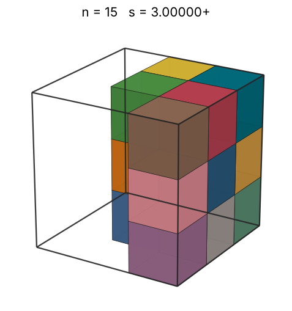 |
| 16 | [3.00000+](cubincub_n16.json) | 3.000000000000 | 3 | 3.00000 (Friedman catalogue) | 2.51984 | 0.5926 | 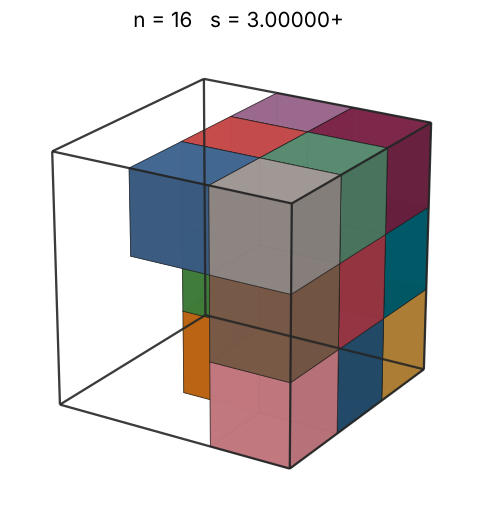 |
| 17 | [3.00000+](cubincub_n17.json) | 3.000000000000 | 3 | 3.00000 (Friedman catalogue) | 2.57128 | 0.6296 | 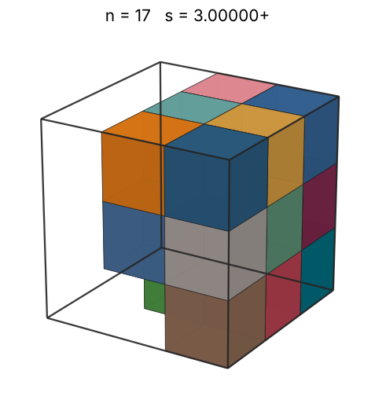 |
| 18 | [3.00000+](cubincub_n18.json) | 3.000000000000 | 3 |  | 2.62074 | 0.6667 | 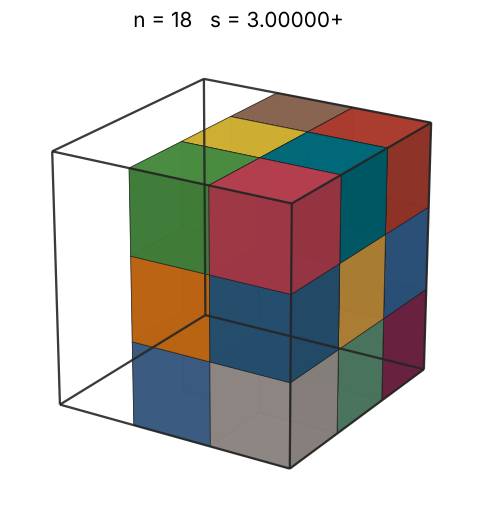 |
| 19 | [3.00000+](cubincub_n19.json) | 3.000000000000 | 3 |  | 2.66840 | 0.7037 | 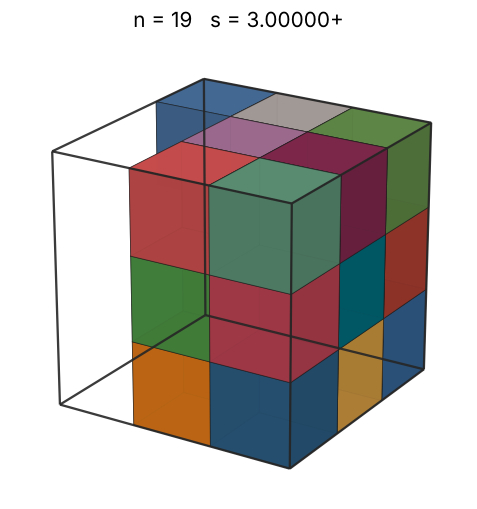 |
| 20 | [3.00000+](cubincub_n20.json) | 3.000000000000 | 3 |  | 2.71442 | 0.7407 | 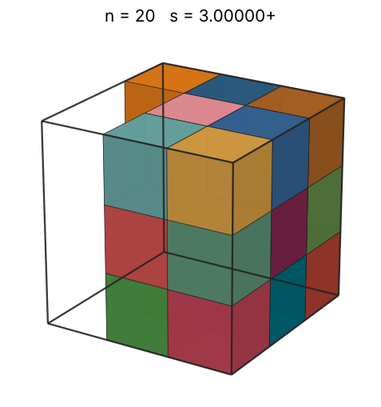 |
| 21 | [3.00000+](cubincub_n21.json) | 3.000000000000 | 3 |  | 2.75892 | 0.7778 | 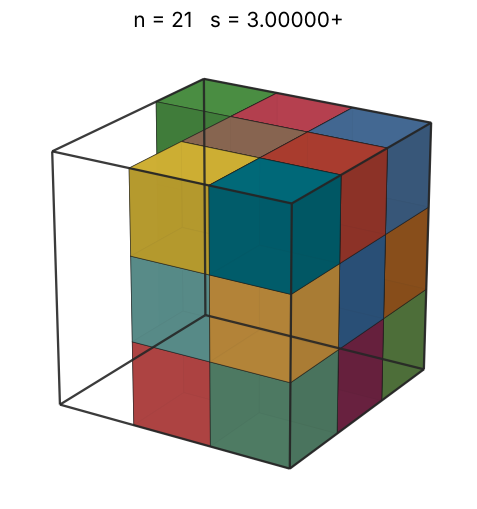 |
| 22 | [3.00000+](cubincub_n22.json) | 3.000000000000 | 3 |  | 2.80204 | 0.8148 | 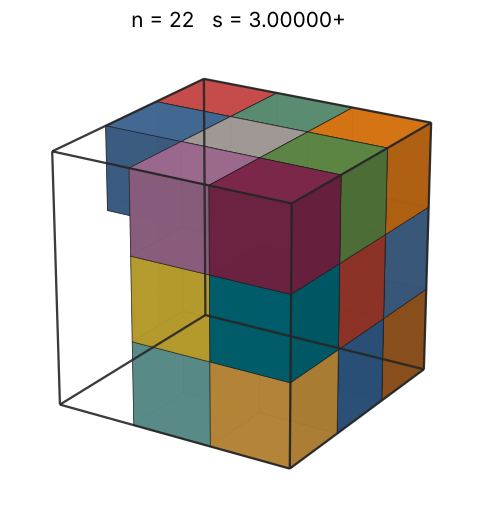 |
| 23 | [3.00000+](cubincub_n23.json) | 3.000000000000 | 3 |  | 2.84387 | 0.8519 | 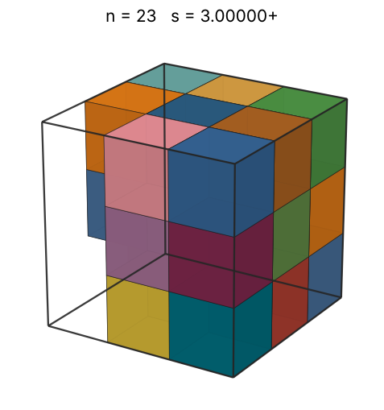 |
| 24 | [3.00000+](cubincub_n24.json) | 3.000000000000 | 3 |  | 2.88450 | 0.8889 | 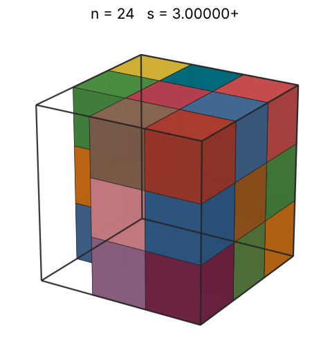 |
| 25 | [3.00000+](cubincub_n25.json) | 3.000000000000 | 3 |  | 2.92402 | 0.9259 | 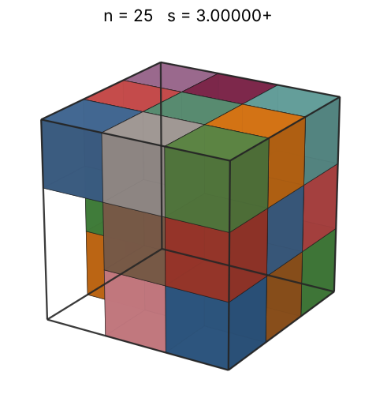 |
| 26 | [3.00000+](cubincub_n26.json) | 3.000000000000 | 3 |  | 2.96250 | 0.9630 | 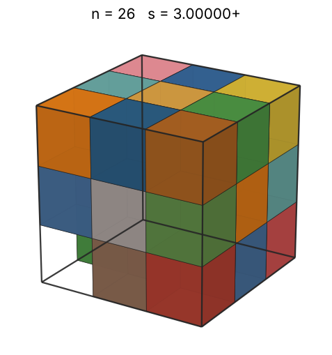 |
| 27 | [3.00000+](cubincub_n27.json) | 3.000000000000 | 3 |  | 3.00000 | 1.0000 | 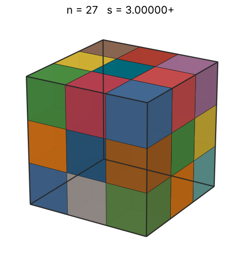 |
| 28 | [3.80747+](cubincub_n28.json) | 3.807470498662 |  |  | 3.03659 | 0.5073 | 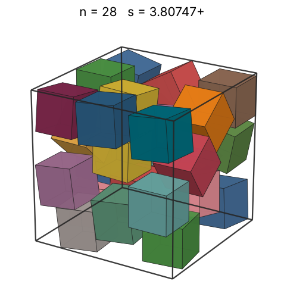 |
| 29 | [3.80748+](cubincub_n29.json) | 3.807482396967 |  |  | 3.07232 | 0.5254 | 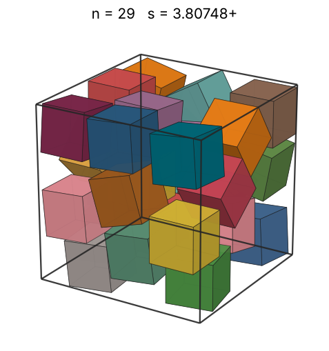 |
| 30 | [3.83089+](cubincub_n30.json) | 3.830893250073 |  |  | 3.10723 | 0.5336 | 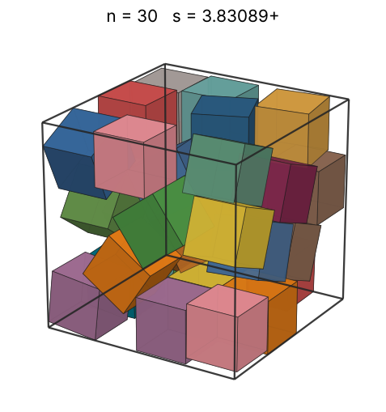 |
| 31 | [3.92328+](cubincub_n31.json) | 3.923287303717 |  |  | 3.14138 | 0.5133 | 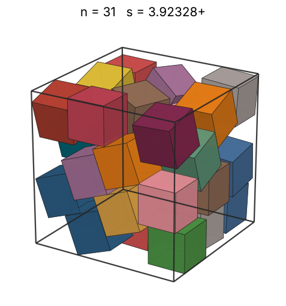 |
| 32 | [3.93967+](cubincub_n32.json) | 3.939677897336 |  |  | 3.17480 | 0.5233 | 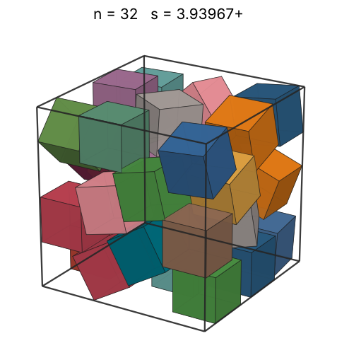 |
| 33 | [3.94675+](cubincub_n33.json) | 3.946750676029 |  |  | 3.20753 | 0.5368 | 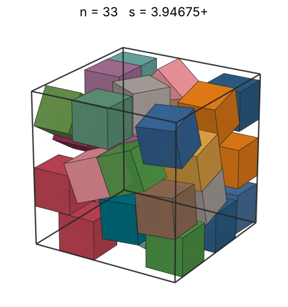 |
| 34 | [3.97662+](cubincub_n34.json) | 3.976619590261 |  |  | 3.23961 | 0.5407 | 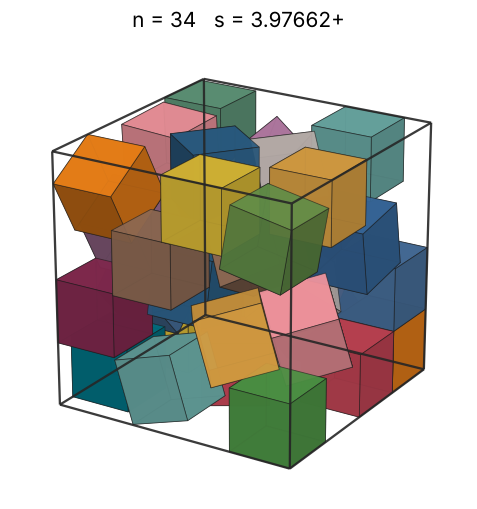 |
| 35 | [4.00000+](cubincub_n35.json) | 4.000000000000 | 4 |  | 3.27107 | 0.5469 | 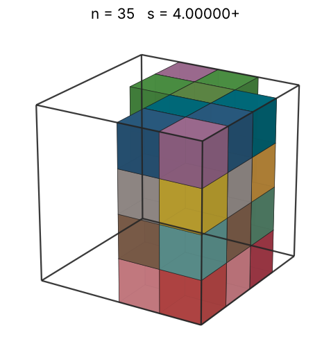 |
| 36 | [4.00000+](cubincub_n36.json) | 4.000000000000 | 4 |  | 3.30193 | 0.5625 | 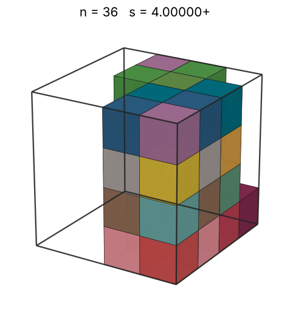 |
| 37 | [4.00000+](cubincub_n37.json) | 4.000000000000 | 4 |  | 3.33222 | 0.5781 | 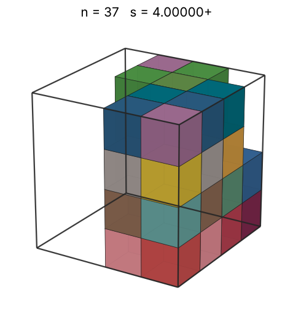 |
| 38 | [4.00000+](cubincub_n38.json) | 4.000000000000 | 4 |  | 3.36198 | 0.5937 | 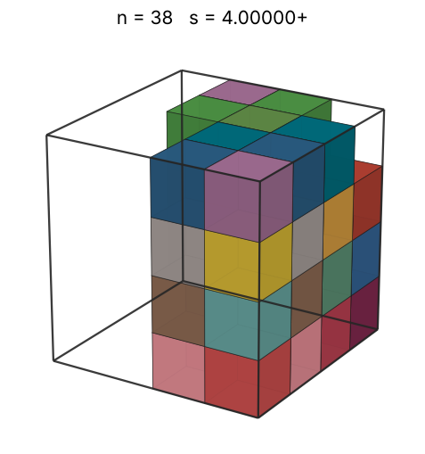 |
| 39 | [4.00000+](cubincub_n39.json) | 4.000000000000 | 4 |  | 3.39121 | 0.6094 | 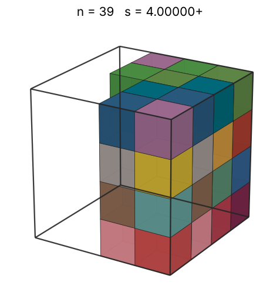 |
| 40 | [4.00000+](cubincub_n40.json) | 4.000000000000 | 4 |  | 3.41995 | 0.6250 | 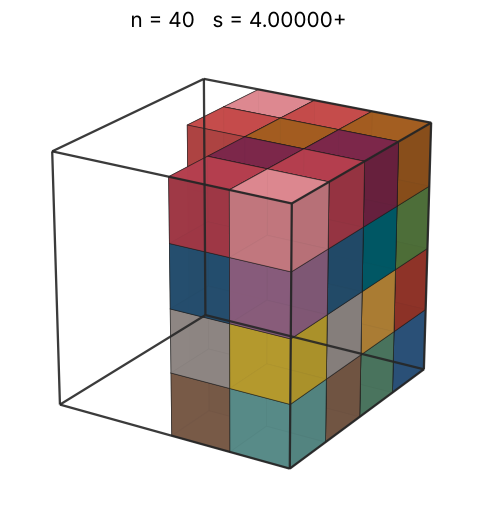 |
