# Cubes in an octahedron

s = container edge / piece edge; every row certified in exact arithmetic.

| n | s | touching limit | closed form (conj.) | previous best | volume bound | density | picture |
|---|---|---|---|---|---|---|---|
| 2 | [2.70710+](cubinoct_n02.json) | 2.707106781187 | (4 + √2)/2 |  | 1.61887 | 0.2139 | 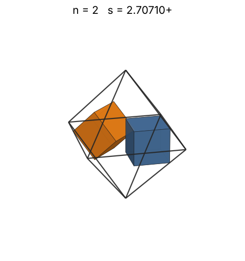 |
| 3 | [2.73922+](cubinoct_n03.json) | 2.739221542354 |  |  | 1.85314 | 0.3096 | 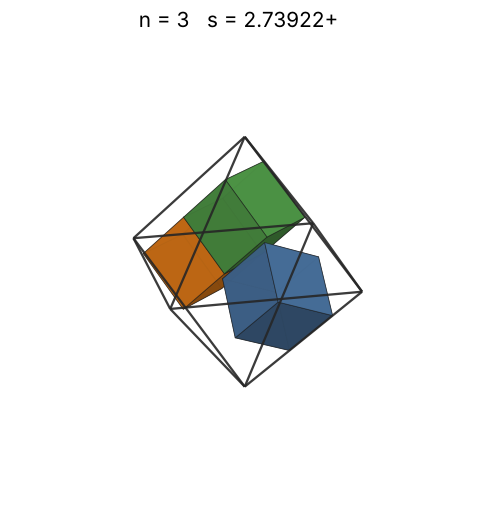 |
| 4 | [2.90963+](cubinoct_n04.json) | 2.909636104097 |  |  | 2.03965 | 0.3445 | 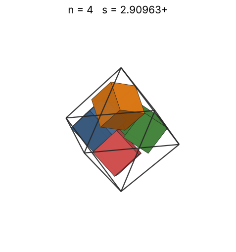 |
| 5 | [2.91436+](cubinoct_n05.json) | 2.914365412135 |  |  | 2.19715 | 0.4285 | 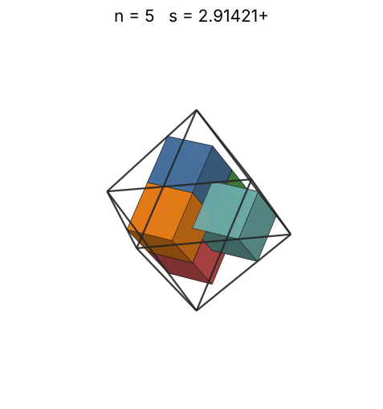 |
| 6 | [2.97542+](cubinoct_n06.json) | 2.975421846681 |  |  | 2.33482 | 0.4832 | 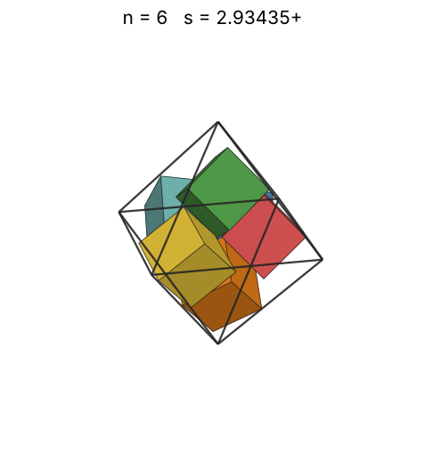 |
| 7 | [3.51403+](cubinoct_n07.json) | 3.514030760596 |  |  | 2.45792 | 0.3422 | 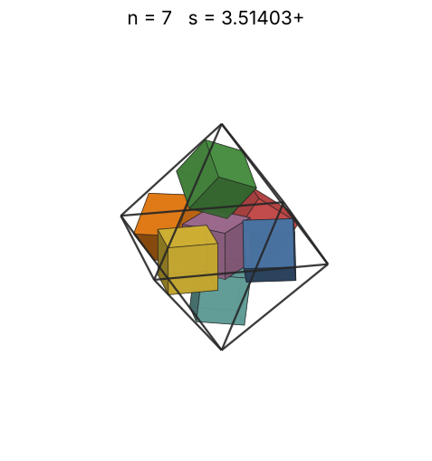 |
| 8 | [3.66717+](cubinoct_n08.json) | 3.667170219933 |  |  | 2.56980 | 0.3441 | 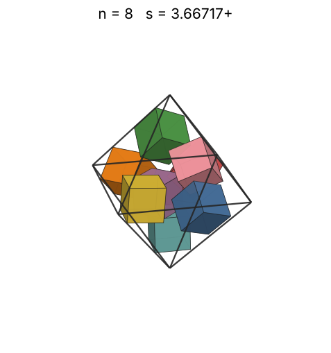 |
| 9 | [3.78769+](cubinoct_n09.json) | 3.787693700235 |  |  | 2.67270 | 0.3513 | 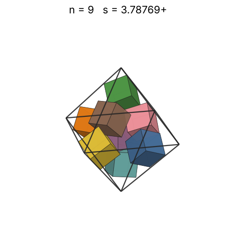 |
| 10 | [3.80694+](cubinoct_n10.json) | 3.806948665062 |  |  | 2.76823 | 0.3845 | 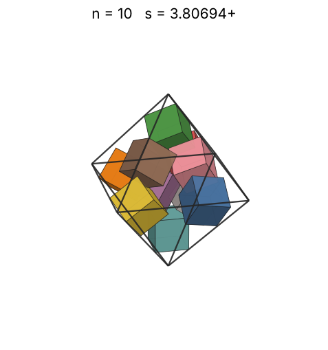 |
| 11 | [3.83656+](cubinoct_n11.json) | 3.836566377318 |  |  | 2.85759 | 0.4132 | 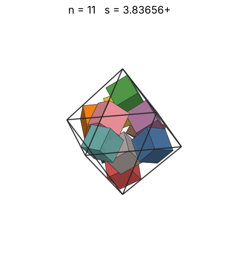 |
| 12 | [3.89218+](cubinoct_n12.json) | 3.892183557183 |  |  | 2.94168 | 0.4317 |  |
| 13 | [3.91747+](cubinoct_n13.json) | 3.917478591147 |  |  | 3.02123 | 0.4587 | 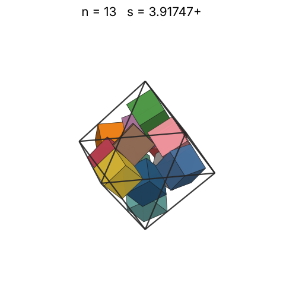 |
| 14 | [3.97196+](cubinoct_n14.json) | 3.971959854898 |  |  | 3.09679 | 0.4739 | 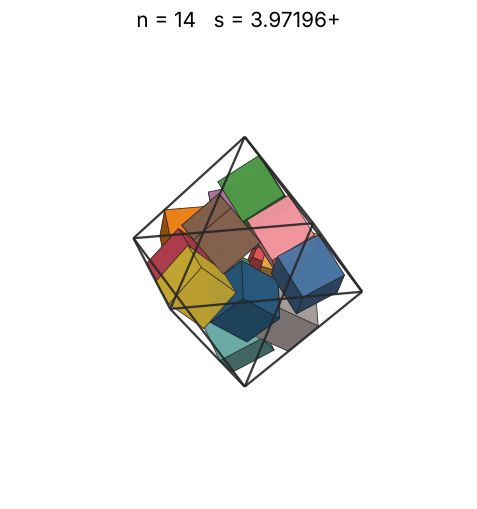 |
| 15 | [4.00291+](cubinoct_n15.json) | 4.002917830759 |  |  | 3.16883 | 0.4961 | 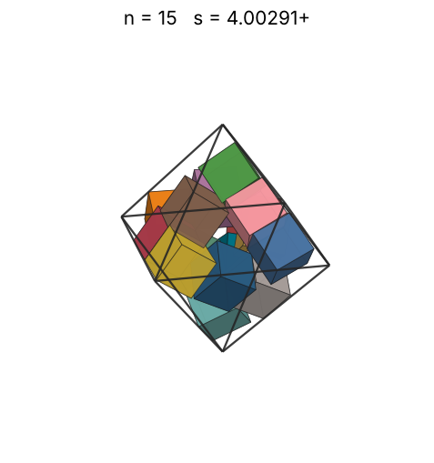 |
| 16 | [4.05119+](cubinoct_n16.json) | 4.051193837405 |  |  | 3.23774 | 0.5105 | 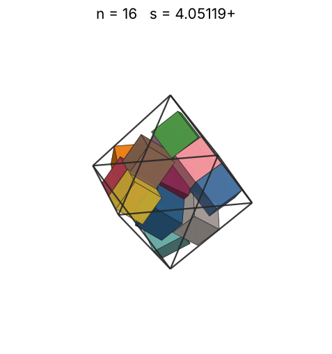 |
| 17 | [4.08304+](cubinoct_n17.json) | 4.083042584054 |  |  | 3.30384 | 0.5298 | 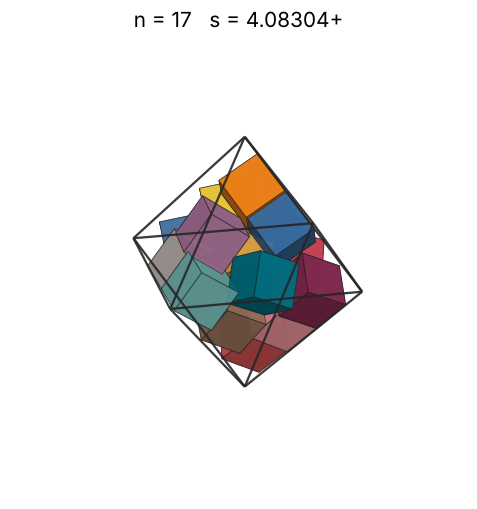 |
| 18 | [4.12288+](cubinoct_n18.json) | 4.122885297937 |  |  | 3.36739 | 0.5448 | 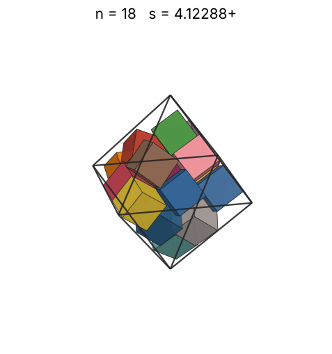 |
| 19 | [4.18384+](cubinoct_n19.json) | 4.183842160851 |  |  | 3.42862 | 0.5503 | 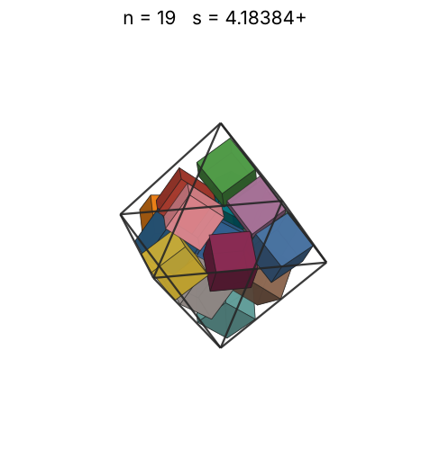 |
| 20 | [4.54434+](cubinoct_n20.json) | 4.544342198418 |  |  | 3.48775 | 0.4521 | 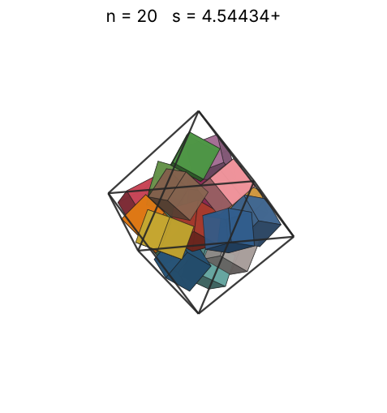 |
| 21 | [4.59641+](cubinoct_n21.json) | 4.596412412368 |  |  | 3.54494 | 0.4587 | 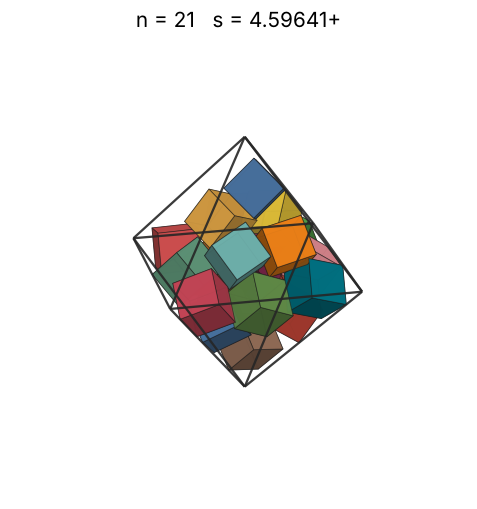 |
| 22 | [4.66648+](cubinoct_n22.json) | 4.666486576541 |  |  | 3.60034 | 0.4593 | 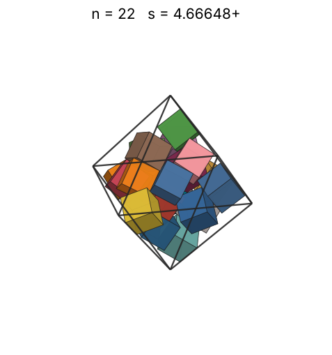 |
| 23 | [4.76333+](cubinoct_n23.json) | 4.763331594574 |  |  | 3.65408 | 0.4514 | 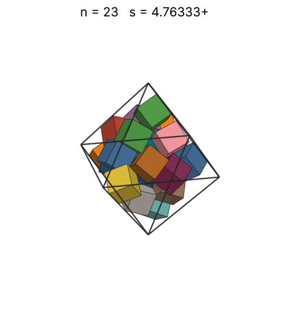 |
| 24 | [4.77227+](cubinoct_n24.json) | 4.772272408034 |  |  | 3.70629 | 0.4684 | 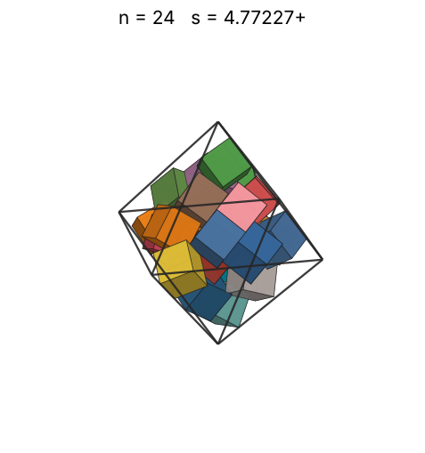 |
| 25 | [4.78494+](cubinoct_n25.json) | 4.784940548263 |  |  | 3.75707 | 0.4841 | 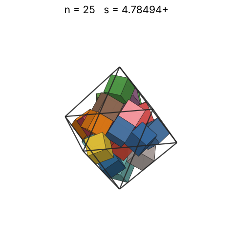 |
| 26 | [4.86888+](cubinoct_n26.json) | 4.868880669416 |  |  | 3.80651 | 0.4779 | 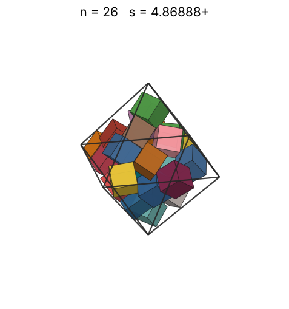 |
| 27 | [4.86919+](cubinoct_n27.json) | 4.869189631969 |  |  | 3.85469 | 0.4961 | 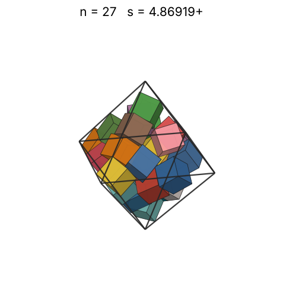 |
| 28 | [4.91681+](cubinoct_n28.json) | 4.916810589404 |  |  | 3.90171 | 0.4997 | 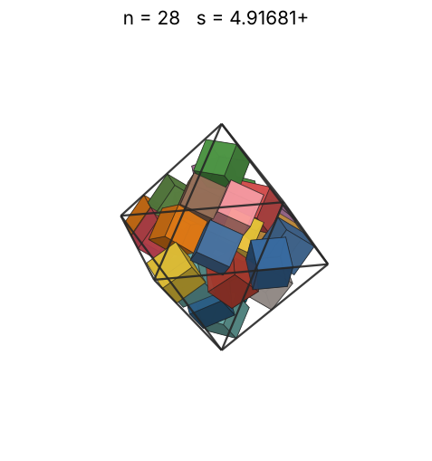 |
| 29 | [4.95963+](cubinoct_n29.json) | 4.959633712670 |  |  | 3.94761 | 0.5043 | 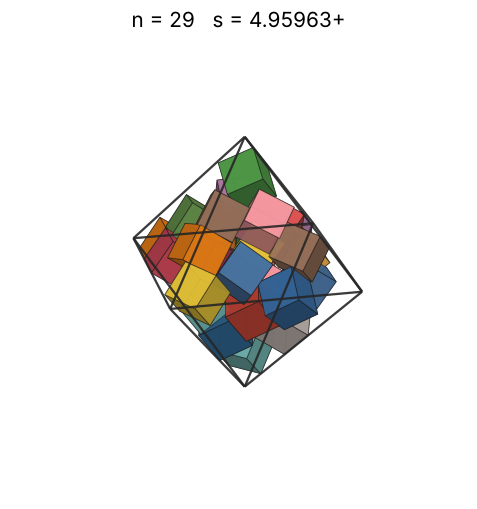 |
| 30 | [5.01902+](cubinoct_n30.json) | 5.019025072513 |  |  | 3.99248 | 0.5033 | 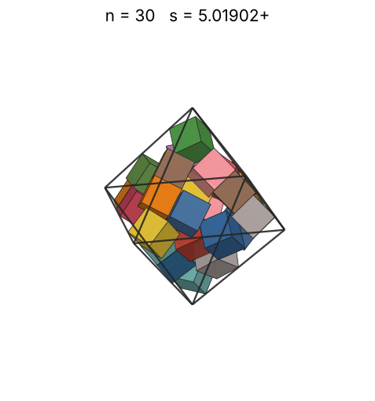 |
| 31 | [5.04940+](cubinoct_n31.json) | 5.049407440802 |  |  | 4.03635 | 0.5108 | 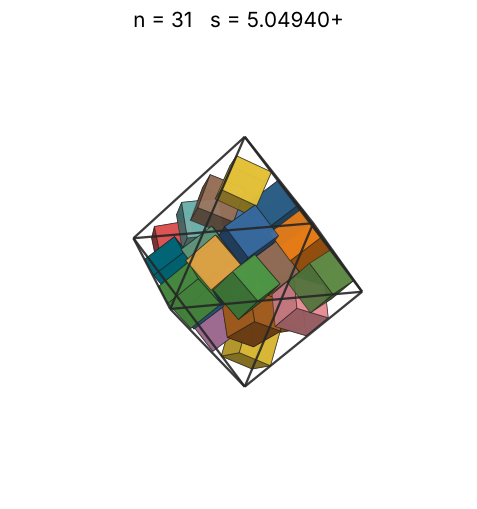 |
| 32 | [5.10740+](cubinoct_n32.json) | 5.107403842823 |  |  | 4.07930 | 0.5095 | 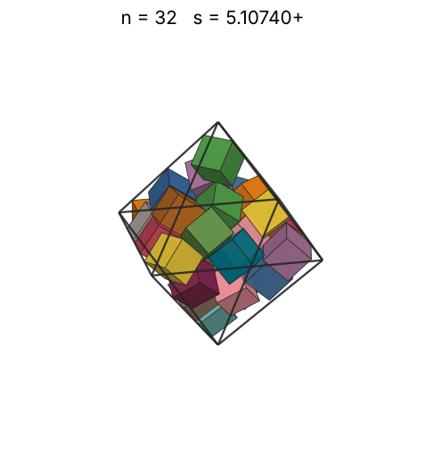 |
| 33 | [5.11401+](cubinoct_n33.json) | 5.114009726235 |  |  | 4.12136 | 0.5234 | 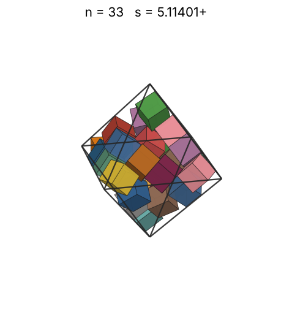 |
| 34 | [5.12013+](cubinoct_n34.json) | 5.120130331461 |  |  | 4.16257 | 0.5373 | 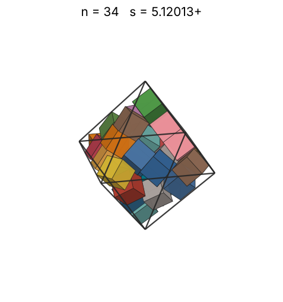 |
| 35 | [5.12318+](cubinoct_n35.json) | 5.123183668456 |  |  | 4.20299 | 0.5521 | 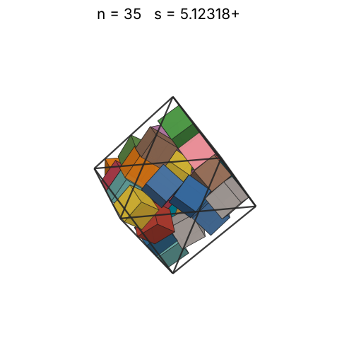 |
| 36 | [5.13680+](cubinoct_n36.json) | 5.136809368531 |  |  | 4.24264 | 0.5634 | 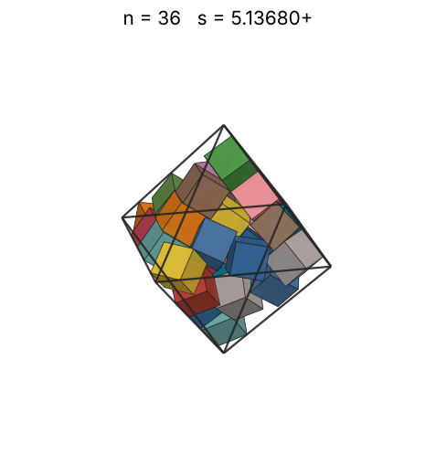 |
| 37 | [5.18079+](cubinoct_n37.json) | 5.180796442244 |  |  | 4.28157 | 0.5644 | 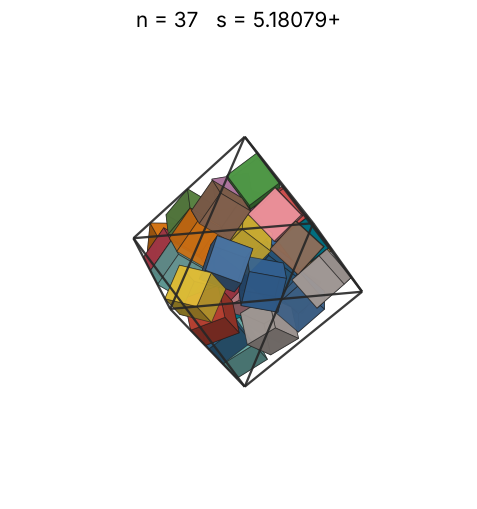 |
| 38 | [5.19775+](cubinoct_n38.json) | 5.197749406615 |  |  | 4.31980 | 0.5740 | 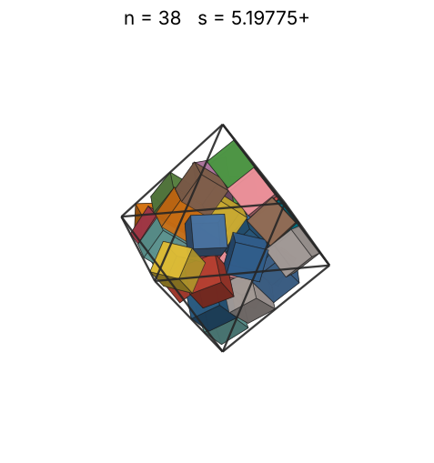 |
| 39 | [5.23722+](cubinoct_n39.json) | 5.237219812531 |  |  | 4.35736 | 0.5759 | 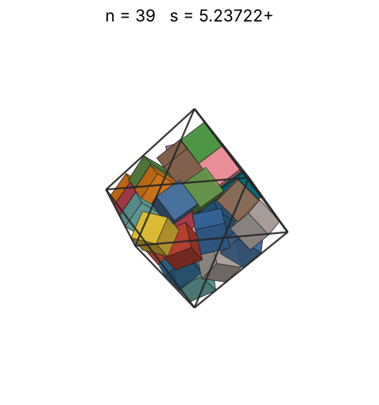 |
| 40 | [5.25848+](cubinoct_n40.json) | 5.258486798090 |  |  | 4.39429 | 0.5836 | 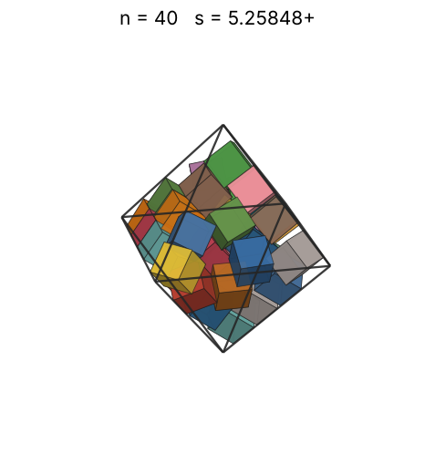 |
