# Dodecahedra in a dodecahedron

s = container edge / piece edge; every row certified in exact arithmetic.

| n | s | touching limit | closed form (conj.) | previous best | volume bound | density | picture |
|---|---|---|---|---|---|---|---|
| 2 | [1.98759+](dodindod_n02.json) | 1.987598085505 |  |  | 1.25992 | 0.2547 | 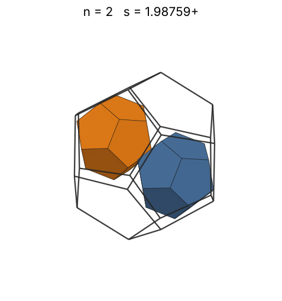 |
| 3 | [2.00000+](dodindod_n03.json) | 2.000000000000 | 2 |  | 1.44225 | 0.3750 | 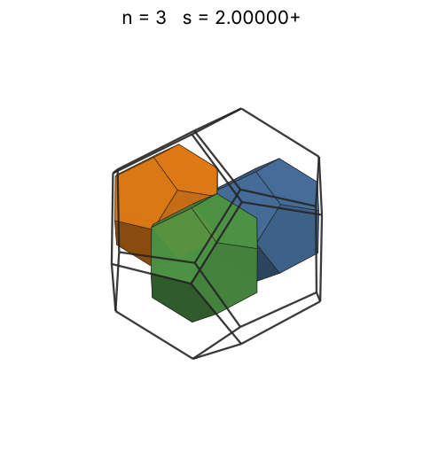 |
| 4 | [2.00000+](dodindod_n04.json) | 2.000000000000 | 2 |  | 1.58740 | 0.5000 | 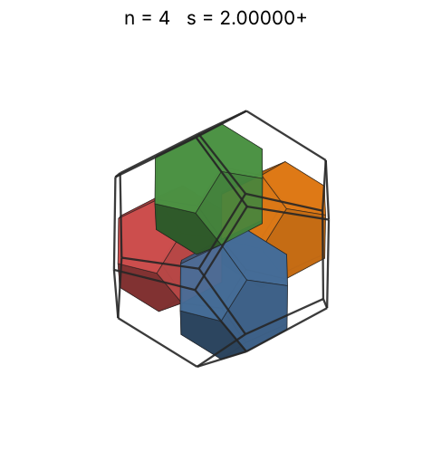 |
| 5 | [2.23606+](dodindod_n05.json) | 2.236067977500 | √5 |  | 1.70998 | 0.4472 | 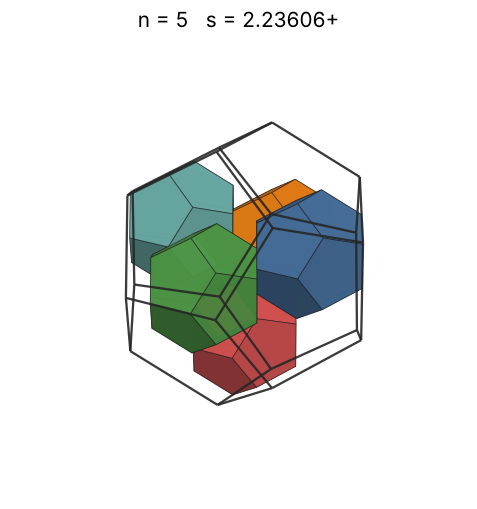 |
| 6 | [2.23606+](dodindod_n06.json) | 2.236067977500 | √5 |  | 1.81712 | 0.5367 | 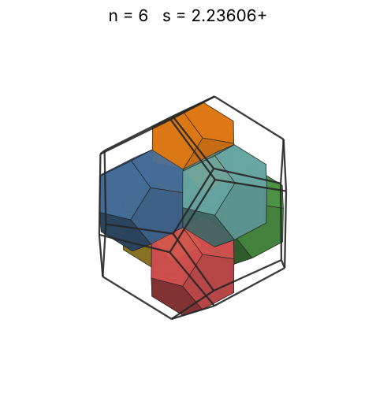 |
| 7 | [2.42705+](dodindod_n07.json) | 2.427050983125 | (3 + 3√5)/4 |  | 1.91293 | 0.4896 | 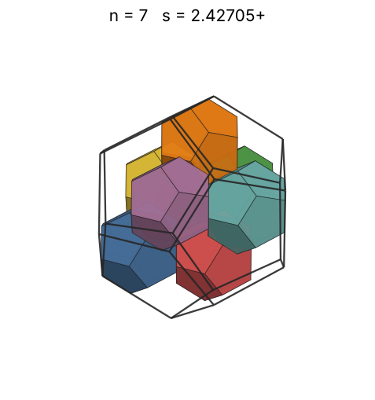 |
| 8 | [2.52786+](dodindod_n08.json) | 2.527864045000 | 7 - 2√5 |  | 2.00000 | 0.4953 | 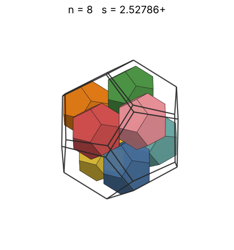 |
| 9 | [2.59888+](dodindod_n09.json) | 2.598882323902 | (35 + 32√5)/41 |  | 2.08008 | 0.5127 | 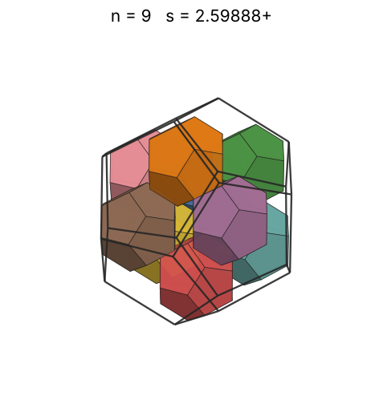 |
| 10 | [2.70520+](dodindod_n10.json) | 2.705201714440 | (101 + 25√5)/58 |  | 2.15443 | 0.5051 | 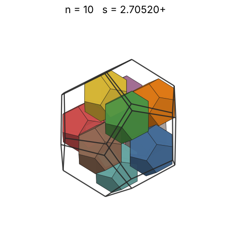 |
| 11 | [2.76393+](dodindod_n11.json) | 2.763932022500 | 5 - √5 |  | 2.22398 | 0.5210 | 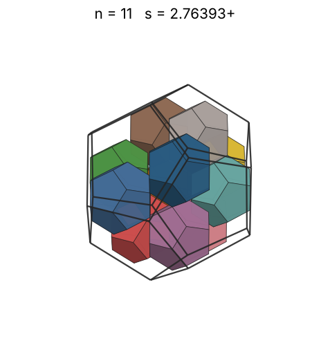 |
| 12 | [2.76393+](dodindod_n12.json) | 2.763932022500 | 5 - √5 |  | 2.28943 | 0.5683 | 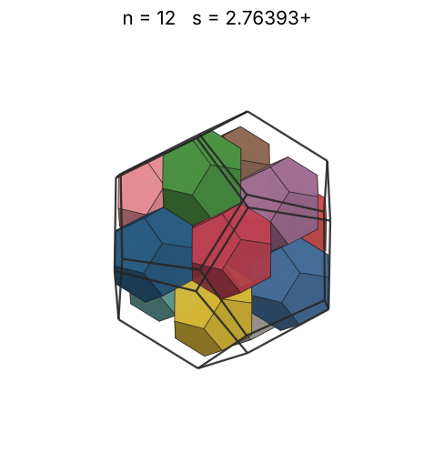 |
| 13 | [2.94621+](dodindod_n13.json) | 2.946218429121 |  |  | 2.35133 | 0.5083 | 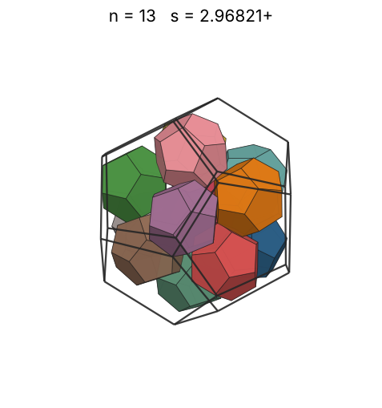 |
| 14 | [3.00000+](dodindod_n14.json) | 3.000000000000 | 3 |  | 2.41014 | 0.5185 | 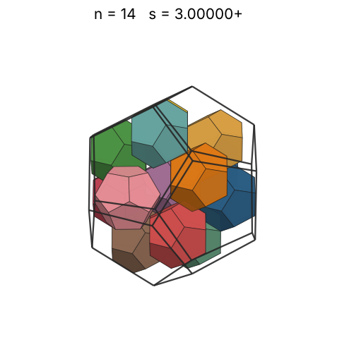 |
| 15 | [3.04091+](dodindod_n15.json) | 3.040910488543 |  |  | 2.46621 | 0.5334 | 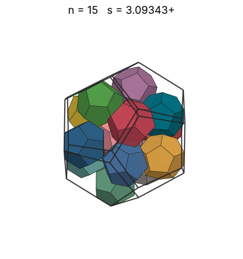 |
| 16 | [3.11020+](dodindod_n16.json) | 3.110207290759 |  |  | 2.51984 | 0.5318 | 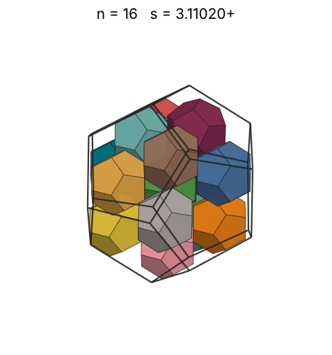 |
| 17 | [3.16774+](dodindod_n17.json) | 3.167739820200 |  |  | 2.57128 | 0.5348 | 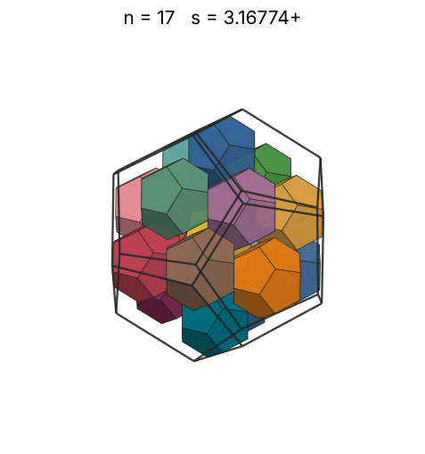 |
| 18 | [3.21549+](dodindod_n18.json) | 3.215490468793 | (53 + 18√5)/29 |  | 2.62074 | 0.5414 | 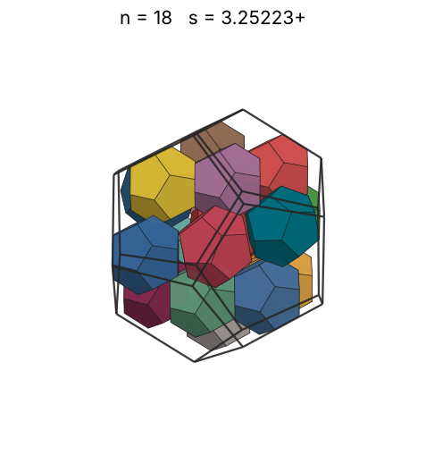 |
| 19 | [3.29218+](dodindod_n19.json) | 3.292182454765 |  |  | 2.66840 | 0.5325 | 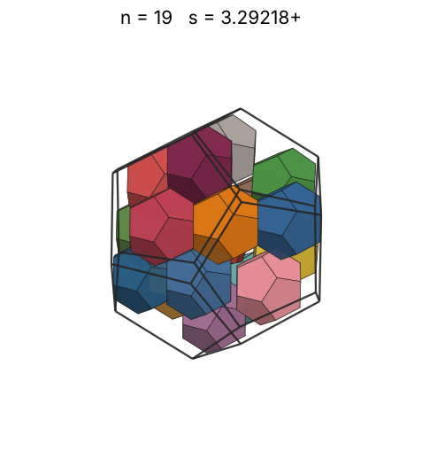 |
| 20 | [3.34969+](dodindod_n20.json) | 3.349698964170 |  |  | 2.71442 | 0.5321 | 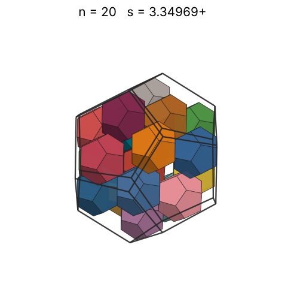 |
| 21 | [3.40990+](dodindod_n21.json) | 3.409905077356 |  |  | 2.75892 | 0.5297 | 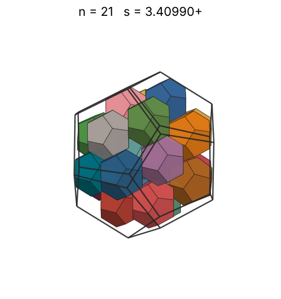 |
| 22 | [3.44721+](dodindod_n22.json) | 3.447213595544 |  |  | 2.80204 | 0.5371 | 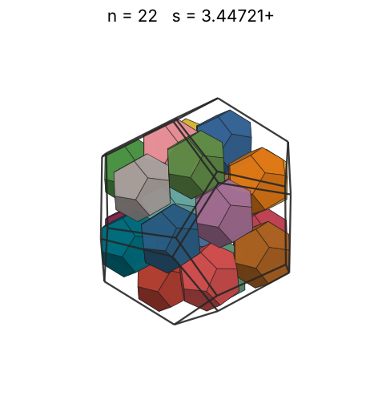 |
| 23 | [3.57425+](dodindod_n23.json) | 3.574259166603 |  |  | 2.84387 | 0.5037 | 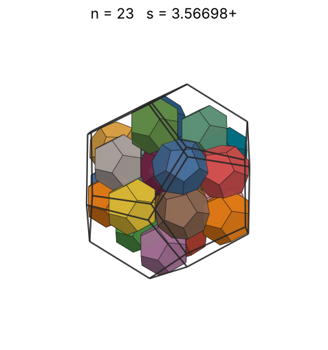 |
| 24 | [3.58445+](dodindod_n24.json) | 3.584451811966 |  |  | 2.88450 | 0.5211 | 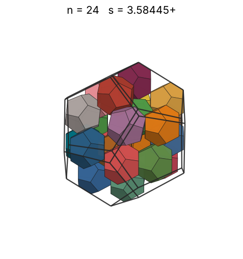 |
| 25 | [3.61889+](dodindod_n25.json) | 3.618890101625 |  |  | 2.92402 | 0.5275 | 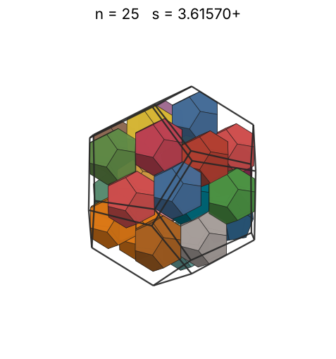 |
| 26 | [3.70130+](dodindod_n26.json) | 3.701301616722 |  |  | 2.96250 | 0.5128 | 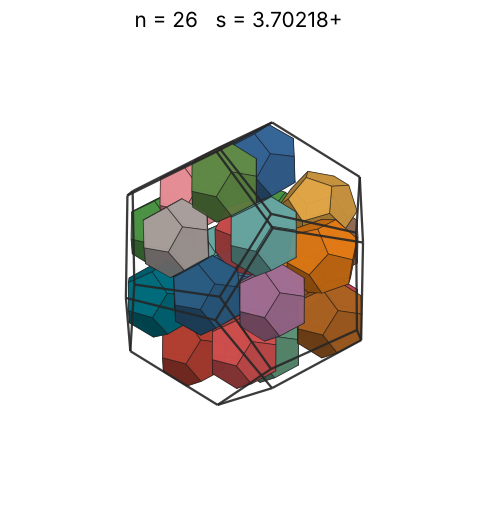 |
| 27 | [3.70130+](dodindod_n27.json) | 3.701301616768 |  |  | 3.00000 | 0.5325 | 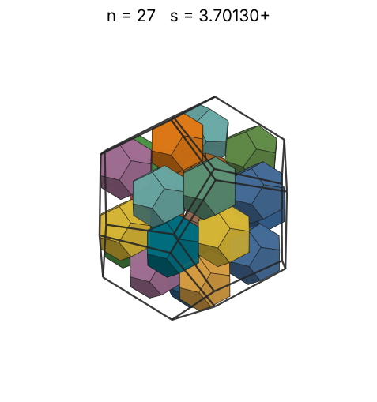 |
| 28 | [3.75361+](dodindod_n28.json) | 3.753615696052 |  |  | 3.03659 | 0.5294 | 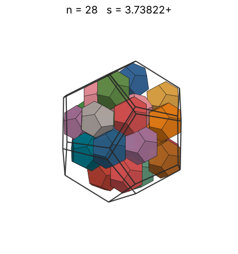 |
| 29 | [3.77551+](dodindod_n29.json) | 3.775517745705 |  |  | 3.07232 | 0.5389 | 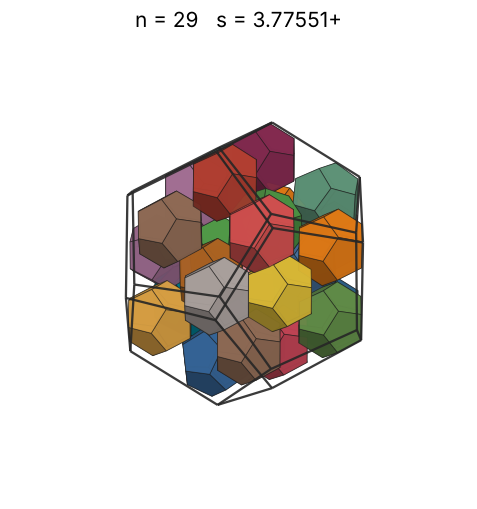 |
| 30 | [3.81322+](dodindod_n30.json) | 3.813220324883 |  |  | 3.10723 | 0.5411 | 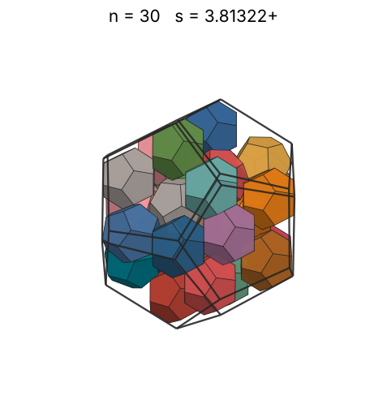 |
| 31 | [3.84532+](dodindod_n31.json) | 3.845320899102 |  |  | 3.14138 | 0.5452 | 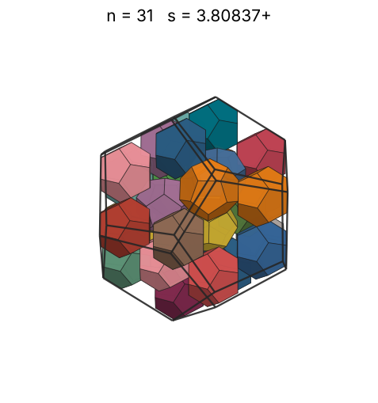 |
| 32 | [3.86124+](dodindod_n32.json) | 3.861241645770 |  |  | 3.17480 | 0.5559 |  |
| 33 | [3.86409+](dodindod_n33.json) | 3.864094055591 |  |  | 3.20753 | 0.5720 | 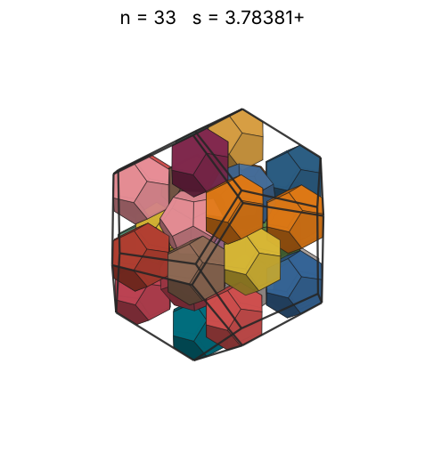 |
| 34 | [3.92110+](dodindod_n34.json) | 3.921106061311 |  |  | 3.23961 | 0.5640 | 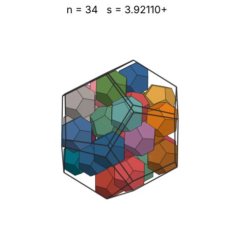 |
| 35 | [4.00000+](dodindod_n35.json) | 4.000000000028 |  |  | 3.27107 | 0.5469 | 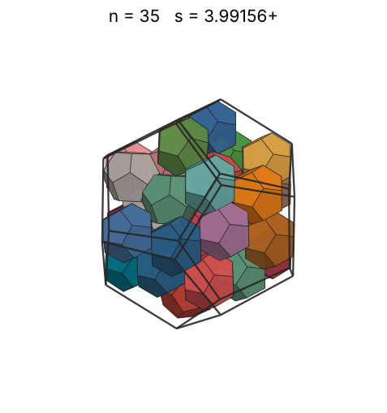 |
| 36 | [4.04530+](dodindod_n36.json) | 4.045308786986 |  |  | 3.30193 | 0.5438 | 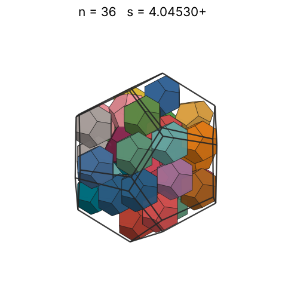 |
| 37 | [4.09883+](dodindod_n37.json) | 4.098837848499 |  |  | 3.33222 | 0.5373 | 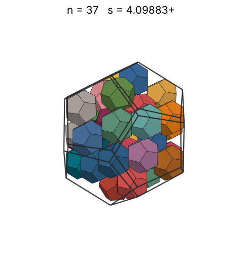 |
| 38 | [4.13265+](dodindod_n38.json) | 4.132651940750 |  |  | 3.36198 | 0.5384 | 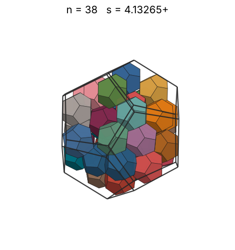 |
| 39 | [4.17275+](dodindod_n39.json) | 4.172754972240 |  |  | 3.39121 | 0.5368 | 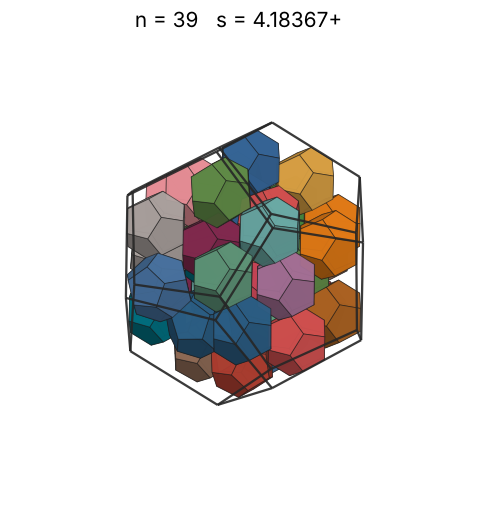 |
| 40 | [4.19119+](dodindod_n40.json) | 4.191190144840 |  |  | 3.41995 | 0.5433 | 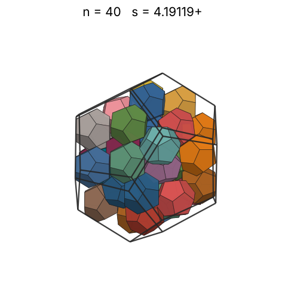 |
