# Dodecahedra in a dodecahedron

s = container edge / piece edge; every row certified in exact arithmetic.

| n | s | touching limit | closed form (conj.) | volume bound | density | picture |
|---|---|---|---|---|---|---|
| 2 | [1.98759+](dodindod_n02.json) | 1.987598085505 |  | 1.25992 | 0.2547 | 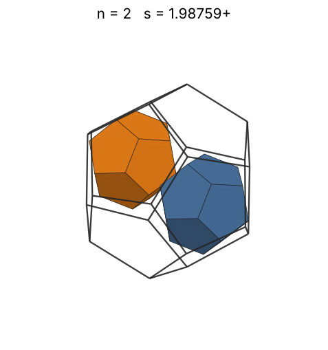 |
| 3 | [2.00000+](dodindod_n03.json) | 2.000000000000 | 2 | 1.44225 | 0.3750 | 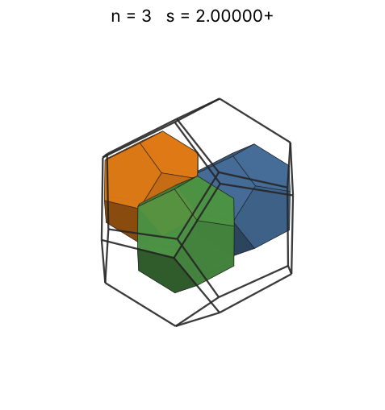 |
| 4 | [2.00000+](dodindod_n04.json) | 2.000000000000 | 2 | 1.58740 | 0.5000 | 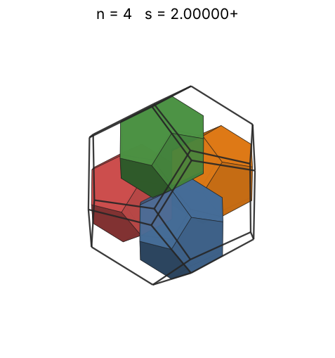 |
| 5 | [2.23606+](dodindod_n05.json) | 2.236067977500 | √5 | 1.70998 | 0.4472 | 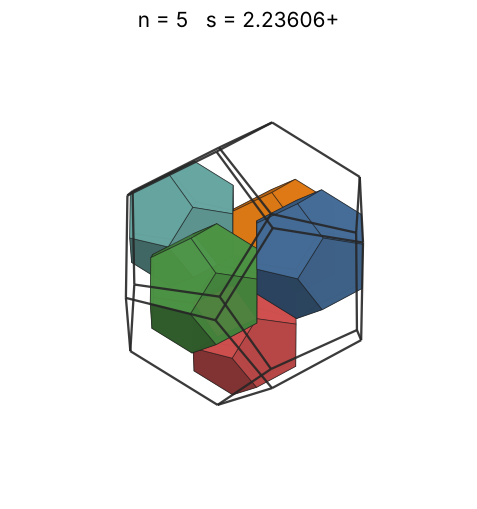 |
| 6 | [2.23606+](dodindod_n06.json) | 2.236067977500 | √5 | 1.81712 | 0.5367 | 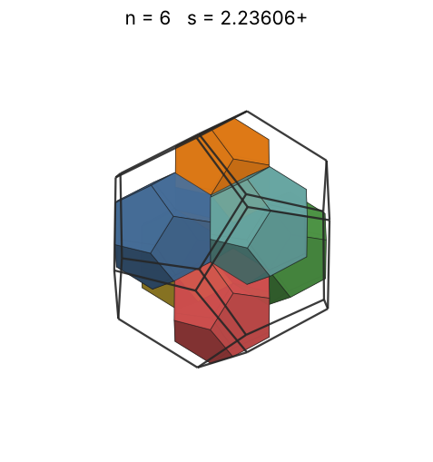 |
| 7 | [2.42705+](dodindod_n07.json) | 2.427050983125 | (3 + 3√5)/4 | 1.91293 | 0.4896 | 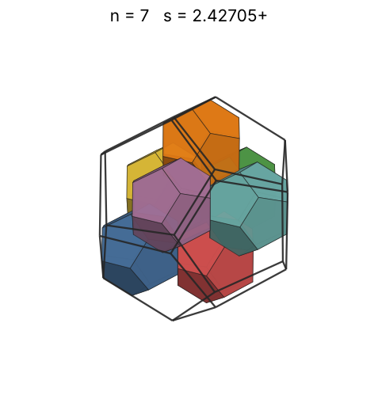 |
| 8 | [2.52786+](dodindod_n08.json) | 2.527864045000 | 7 - 2√5 | 2.00000 | 0.4953 | 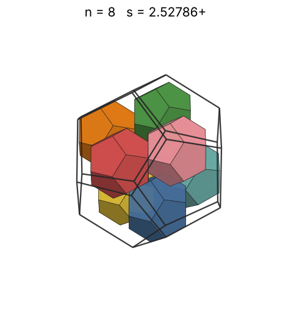 |
| 9 | [2.59888+](dodindod_n09.json) | 2.598882323902 | (35 + 32√5)/41 | 2.08008 | 0.5127 | 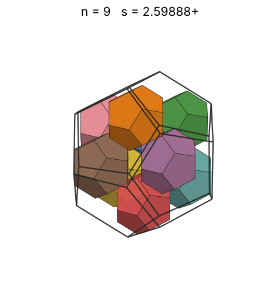 |
| 10 | [2.70520+](dodindod_n10.json) | 2.705201714440 | (101 + 25√5)/58 | 2.15443 | 0.5051 | 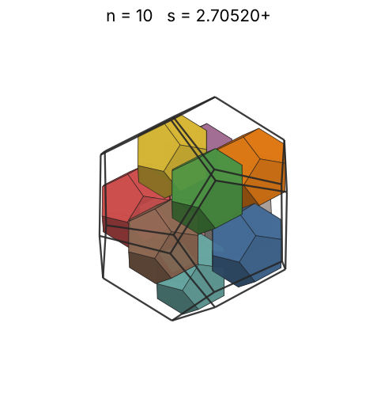 |
| 11 | [2.76393+](dodindod_n11.json) | 2.763932022500 | 5 - √5 | 2.22398 | 0.5210 | 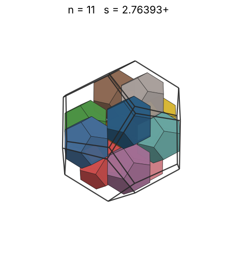 |
| 12 | [2.76393+](dodindod_n12.json) | 2.763932022500 | 5 - √5 | 2.28943 | 0.5683 | 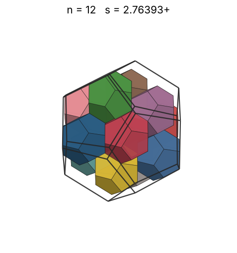 |
| 13 | [2.90557+](dodindod_n13.json) | 2.905572809000 | 19/5 - 2√(5)/5 | 2.35133 | 0.5300 | 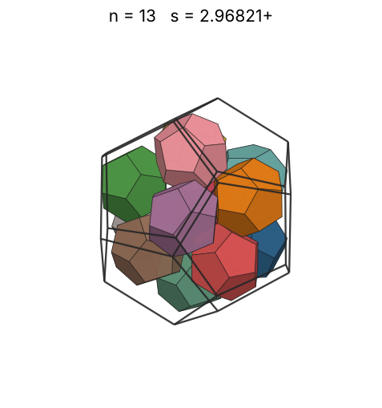 |
| 14 | [2.99979+](dodindod_n14.json) | 2.999798360814 |  | 2.41014 | 0.5186 | 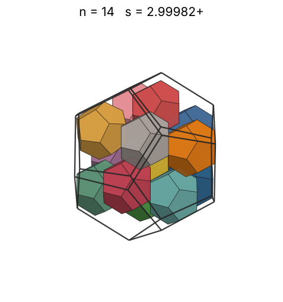 |
| 15 | [3.03743+](dodindod_n15.json) | 3.037436226642 | 223/242 + 229√5/242 | 2.46621 | 0.5353 | 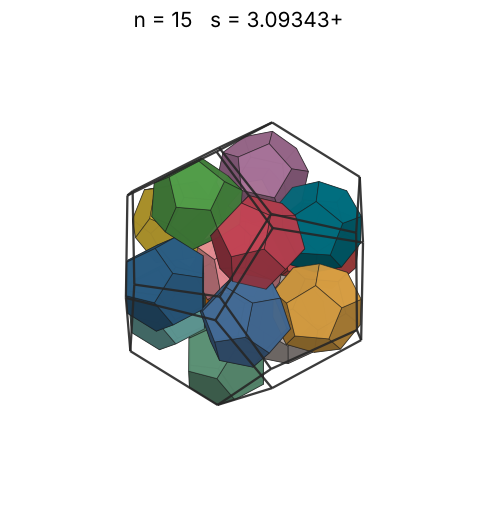 |
| 16 | [3.10210+](dodindod_n16.json) | 3.102104018932 |  | 2.51984 | 0.5360 | 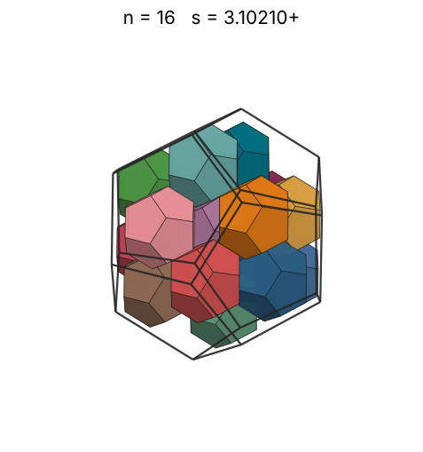 |
| 17 | [3.16774+](dodindod_n17.json) | 3.167739820200 | 6/5 + 22√(5)/25 | 2.57128 | 0.5348 | 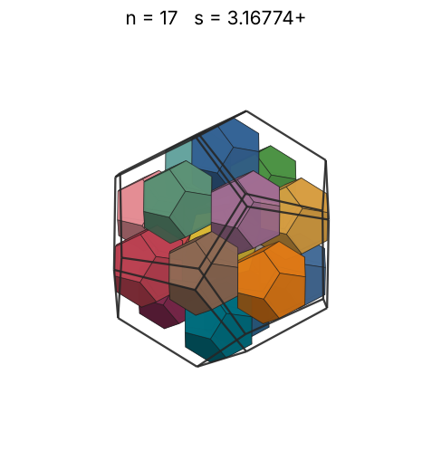 |
| 18 | [3.21549+](dodindod_n18.json) | 3.215490468793 | (53 + 18√5)/29 | 2.62074 | 0.5414 | 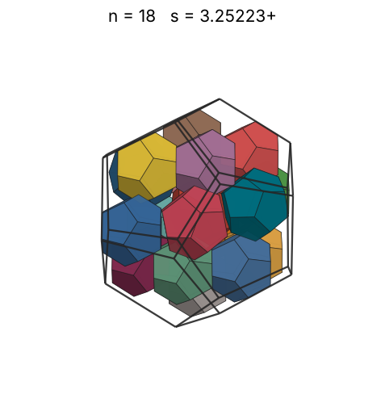 |
| 19 | [3.29218+](dodindod_n19.json) | 3.292182454765 |  | 2.66840 | 0.5325 | 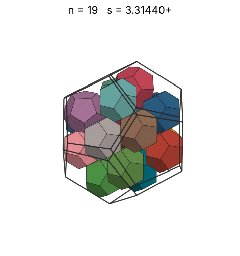 |
| 20 | [3.34969+](dodindod_n20.json) | 3.349698964161 |  | 2.71442 | 0.5321 | 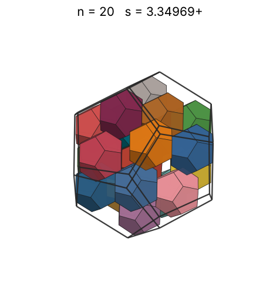 |
| 21 | [3.39148+](dodindod_n21.json) | 3.391485505499 | -6 + 21√(5)/5 | 2.75892 | 0.5383 | 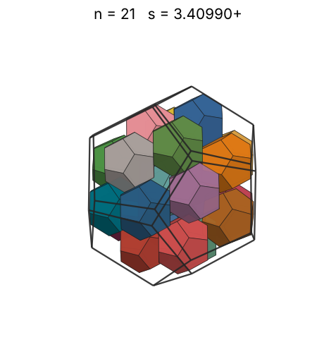 |
| 22 | [3.44428+](dodindod_n22.json) | 3.444286634785 |  | 2.80204 | 0.5384 | 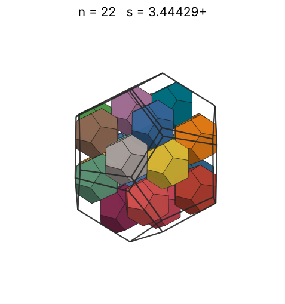 |
| 23 | [3.53929+](dodindod_n23.json) | 3.539292266805 |  | 2.84387 | 0.5188 | 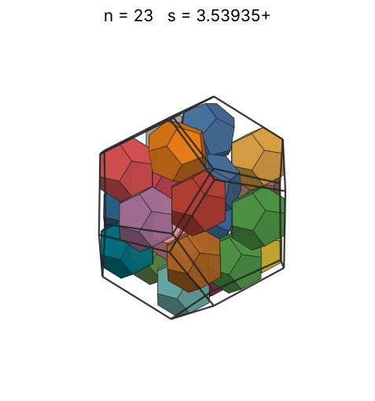 |
| 24 | [3.57860+](dodindod_n24.json) | 3.578599942831 |  | 2.88450 | 0.5237 | 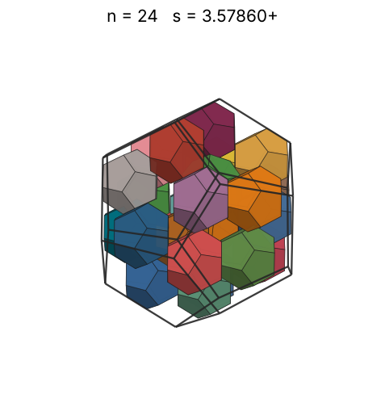 |
| 25 | [3.60237+](dodindod_n25.json) | 3.602375616426 |  | 2.92402 | 0.5348 | 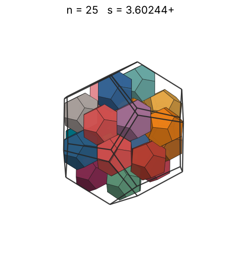 |
| 26 | [3.63718+](dodindod_n26.json) | 3.637181141214 |  | 2.96250 | 0.5404 | 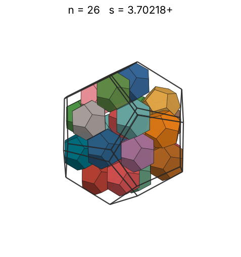 |
| 27 | [3.70130+](dodindod_n27.json) | 3.701301616719 | √(10√5 + 50)/5 + 2 | 3.00000 | 0.5325 | 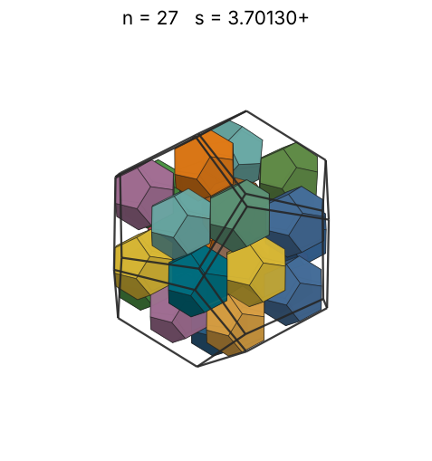 |
| 28 | [3.73369+](dodindod_n28.json) | 3.733694741730 |  | 3.03659 | 0.5379 | 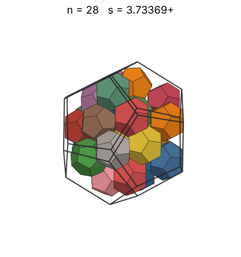 |
| 29 | [3.74709+](dodindod_n29.json) | 3.747090740000 | (55 + 24√5)/29 | 3.07232 | 0.5512 | 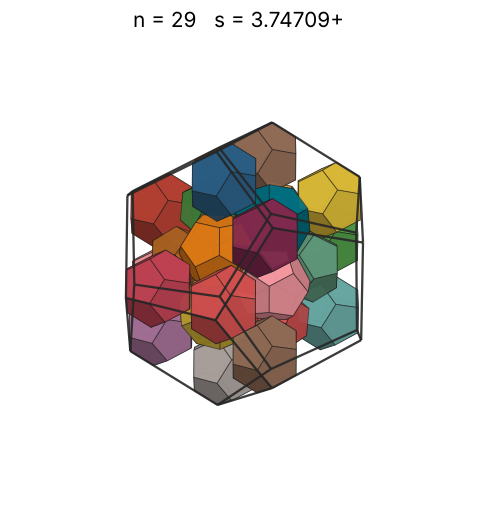 |
| 30 | [3.74709+](dodindod_n30.json) | 3.747090740000 | (55 + 24√5)/29 | 3.10723 | 0.5702 | 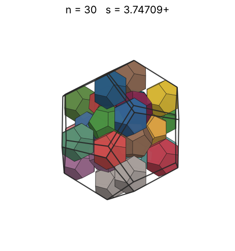 |
| 31 | [3.74709+](dodindod_n31.json) | 3.747090740000 | (55 + 24√5)/29 | 3.14138 | 0.5892 | 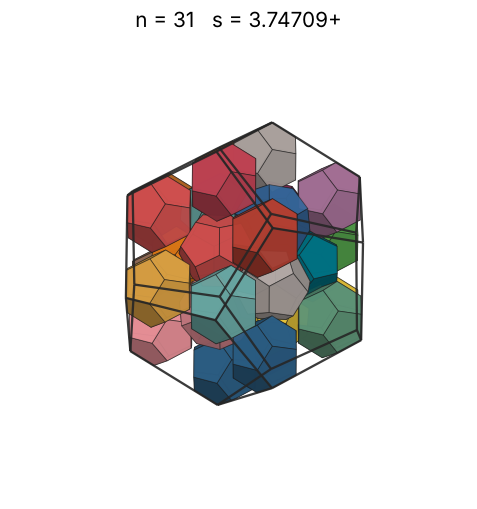 |
| 32 | [3.74709+](dodindod_n32.json) | 3.747090740000 | (55 + 24√5)/29 | 3.17480 | 0.6082 | 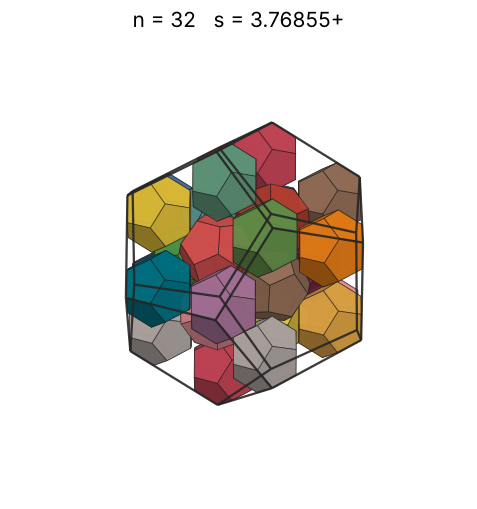 |
| 33 | [3.74709+](dodindod_n33.json) | 3.747090740000 | (55 + 24√5)/29 | 3.20753 | 0.6272 | 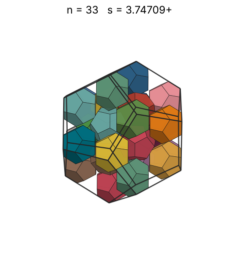 |
| 34 | [3.91148+](dodindod_n34.json) | 3.911488202894 |  | 3.23961 | 0.5681 | 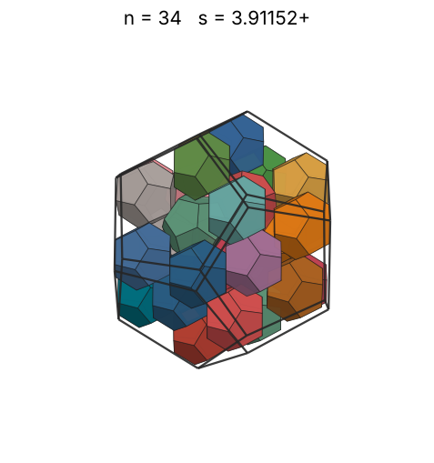 |
| 35 | [3.98565+](dodindod_n35.json) | 3.985652611898 |  | 3.27107 | 0.5528 | 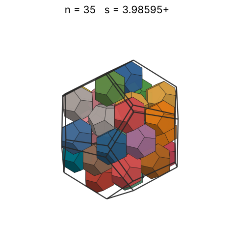 |
| 36 | [4.02142+](dodindod_n36.json) | 4.021420217161 |  | 3.30193 | 0.5536 | 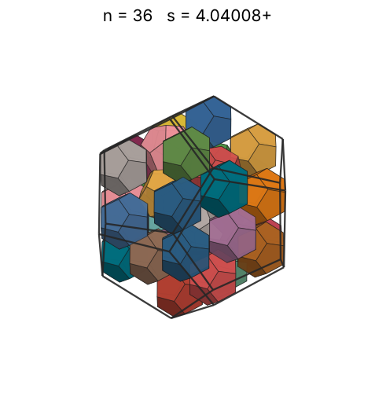 |
| 37 | [4.07872+](dodindod_n37.json) | 4.078724980810 |  | 3.33222 | 0.5453 | 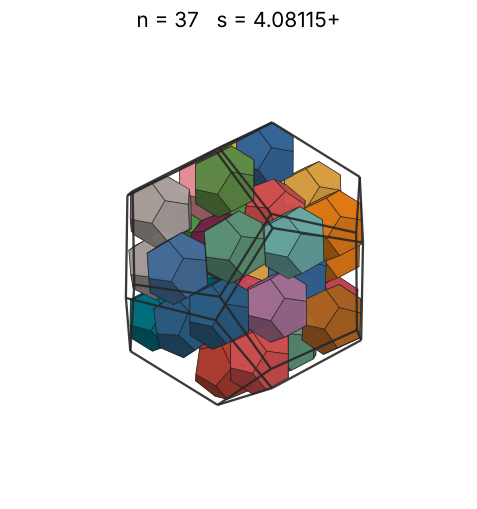 |
| 38 | [4.12050+](dodindod_n38.json) | 4.120500635173 |  | 3.36198 | 0.5432 | 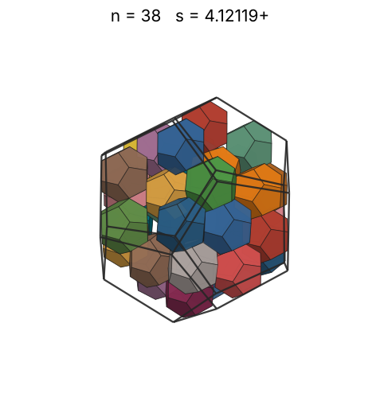 |
| 39 | [4.14221+](dodindod_n39.json) | 4.142216273526 |  | 3.39121 | 0.5487 | 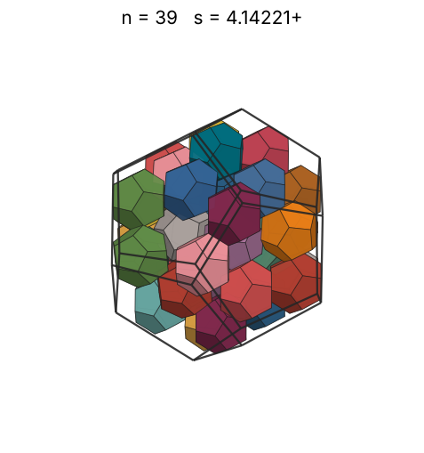 |
| 40 | [4.17626+](dodindod_n40.json) | 4.176265814256 |  | 3.41995 | 0.5492 | 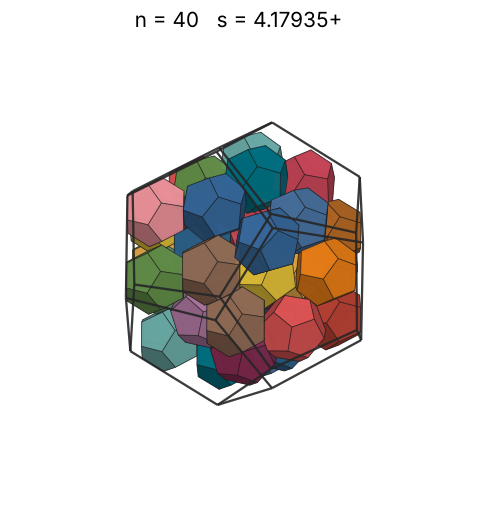 |
| 41 | [4.21499+](dodindod_n41.json) | 4.214991380631 |  | 3.44822 | 0.5475 |  |
| 42 | [4.21790+](dodindod_n42.json) | 4.217901847283 |  | 3.47603 | 0.5597 |  |
| 43 | [4.23606+](dodindod_n43.json) | 4.236068948320 |  | 3.50340 | 0.5657 |  |
| 44 | [4.30785+](dodindod_n44.json) | 4.307855443939 |  | 3.53035 | 0.5504 |  |
| 45 | [4.31860+](dodindod_n45.json) | 4.318608883318 |  | 3.55689 | 0.5587 |  |
| 46 | [4.35527+](dodindod_n46.json) | 4.355274714099 |  | 3.58305 | 0.5568 |  |
| 47 | [4.39501+](dodindod_n47.json) | 4.395012591421 |  | 3.60883 | 0.5536 |  |
| 48 | [4.42640+](dodindod_n48.json) | 4.426403765679 |  | 3.63424 | 0.5535 |  |
| 49 | [4.43648+](dodindod_n49.json) | 4.436488011673 |  | 3.65931 | 0.5611 |  |
| 50 | [4.51902+](dodindod_n50.json) | 4.519019915593 |  | 3.68403 | 0.5418 |  |
| 51 | [4.52823+](dodindod_n51.json) | 4.528237056342 |  | 3.70843 | 0.5493 |  |
| 52 | [4.55249+](dodindod_n52.json) | 4.552489989449 |  | 3.73251 | 0.5511 |  |
| 53 | [4.56601+](dodindod_n53.json) | 4.566014697065 |  | 3.75629 | 0.5568 |  |
| 54 | [4.58196+](dodindod_n54.json) | 4.581963374056 |  | 3.77976 | 0.5614 |  |
| 55 | [4.60857+](dodindod_n55.json) | 4.608575720665 |  | 3.80295 | 0.5619 |  |
| 56 | [4.62073+](dodindod_n56.json) | 4.620730032163 |  | 3.82586 | 0.5676 |  |
| 57 | [4.71361+](dodindod_n57.json) | 4.713611450012 |  | 3.84850 | 0.5443 |  |
| 58 | [4.71488+](dodindod_n58.json) | 4.714885676809 |  | 3.87088 | 0.5534 |  |
| 59 | [4.71510+](dodindod_n59.json) | 4.715103722957 |  | 3.89300 | 0.5628 |  |
| 60 | [4.72445+](dodindod_n60.json) | 4.724450189699 |  | 3.91487 | 0.5690 |  |
| 61 | [4.73770+](dodindod_n61.json) | 4.737700208924 |  | 3.93650 | 0.5736 |  |
| 62 | [4.76997+](dodindod_n62.json) | 4.769975026226 |  | 3.95789 | 0.5713 |  |
| 63 | [4.81788+](dodindod_n63.json) | 4.817880087074 |  | 3.97906 | 0.5633 |  |
| 64 | [4.84672+](dodindod_n64.json) | 4.846724677213 |  | 4.00000 | 0.5621 |  |
| 65 | [4.85833+](dodindod_n65.json) | 4.858338588830 |  | 4.02073 | 0.5668 |  |
| 66 | [4.90375+](dodindod_n66.json) | 4.903750554058 |  | 4.04124 | 0.5597 |  |
| 67 | [5.00000+](dodindod_n67.json) | 5.000001200000 | 5 | 4.06155 | 0.5360 |  |
| 68 | [5.00000+](dodindod_n68.json) | 5.000001200000 | 5 | 4.08166 | 0.5440 |  |
| 69 | [5.00000+](dodindod_n69.json) | 5.000001200000 | 5 | 4.10157 | 0.5520 |  |
| 70 | [5.00000+](dodindod_n70.json) | 5.000001200000 | 5 | 4.12129 | 0.5600 |  |
| 71 | [5.00000+](dodindod_n71.json) | 5.000001200000 | 5 | 4.14082 | 0.5680 |  |
| 72 | [5.00000+](dodindod_n72.json) | 5.000001200000 | 5 | 4.16017 | 0.5760 |  |
| 73 | [5.00000+](dodindod_n73.json) | 5.000001200000 | 5 | 4.17934 | 0.5840 |  |
| 74 | [5.00000+](dodindod_n74.json) | 5.000001200000 | 5 | 4.19834 | 0.5920 |  |
| 75 | [5.00000+](dodindod_n75.json) | 5.000001200000 |  | 4.21716 | 0.6000 |  |
| 76 | [5.02285+](dodindod_n76.json) | 5.022856765341 |  | 4.23582 | 0.5997 |  |
| 77 | [5.17082+](dodindod_n77.json) | 5.170821644496 |  | 4.25432 | 0.5569 |  |
| 78 | [5.18262+](dodindod_n78.json) | 5.182623812835 |  | 4.27266 | 0.5603 |  |
| 79 | [5.19314+](dodindod_n79.json) | 5.193147286356 |  | 4.29084 | 0.5641 |  |
| 80 | [5.19553+](dodindod_n80.json) | 5.195537697041 |  | 4.30887 | 0.5704 |  |
| 81 | [5.19966+](dodindod_n81.json) | 5.199668610702 |  | 4.32675 | 0.5762 |  |
| 82 | [5.20098+](dodindod_n82.json) | 5.200986173705 |  | 4.34448 | 0.5828 |  |
| 83 | [5.20720+](dodindod_n83.json) | 5.207208862986 |  | 4.36207 | 0.5878 |  |
| 84 | [5.20720+](dodindod_n84.json) | 5.207208869973 |  | 4.37952 | 0.5949 |  |
| 85 | [5.21881+](dodindod_n85.json) | 5.218813897006 |  | 4.39683 | 0.5980 |  |
| 86 | [5.22005+](dodindod_n86.json) | 5.220058364490 |  | 4.41400 | 0.6046 |  |
| 87 | [5.38079+](dodindod_n87.json) | 5.380796518754 |  | 4.43105 | 0.5584 |  |
| 88 | [5.38141+](dodindod_n88.json) | 5.381418700727 |  | 4.44796 | 0.5647 |  |
| 89 | [5.40149+](dodindod_n89.json) | 5.401492944538 |  | 4.46475 | 0.5647 |  |
| 90 | [5.47213+](dodindod_n90.json) | 5.472137296640 | 1 + 2√5 | 4.48140 | 0.5493 |  |
| 91 | [5.47213+](dodindod_n91.json) | 5.472137296640 | 1 + 2√5 | 4.49794 | 0.5554 |  |
| 92 | [5.47213+](dodindod_n92.json) | 5.472137296688 | 1 + 2√5 | 4.51436 | 0.5615 |  |
| 93 | [5.47958+](dodindod_n93.json) | 5.479584083210 |  | 4.53065 | 0.5652 |  |
| 94 | [5.54882+](dodindod_n94.json) | 5.548822153449 |  | 4.54684 | 0.5502 |  |
| 95 | [5.56796+](dodindod_n95.json) | 5.567960510513 |  | 4.56290 | 0.5503 |  |
| 96 | [5.56885+](dodindod_n96.json) | 5.568857509779 |  | 4.57886 | 0.5559 |  |
| 97 | [5.57984+](dodindod_n97.json) | 5.579842590119 |  | 4.59470 | 0.5583 |  |
| 98 | [5.58487+](dodindod_n98.json) | 5.584875524281 |  | 4.61044 | 0.5626 |  |
| 99 | [5.61801+](dodindod_n99.json) | 5.618018487681 |  | 4.62607 | 0.5583 |  |
| 100 | [5.61801+](dodindod_n100.json) | 5.618018487681 |  | 4.64159 | 0.5640 |  |
