# Dodecahedra in an icosahedron

s = container edge / piece edge; every row certified in exact arithmetic.

| n | s | touching limit | closed form (conj.) | previous best | volume bound | density | picture |
|---|---|---|---|---|---|---|---|
| 2 | [2.99442+](dodinico_n02.json) | 2.994427191000 |  |  | 1.91520 | 0.2616 | 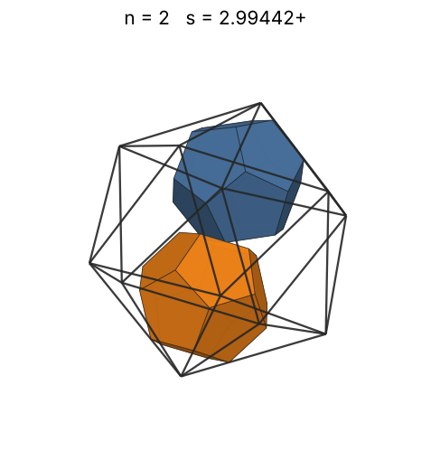 |
| 3 | [3.14954+](dodinico_n03.json) | 3.149542030757 |  |  | 2.19236 | 0.3373 | 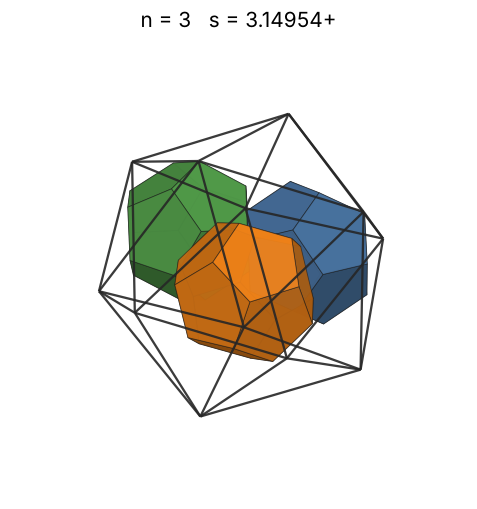 |
| 4 | [3.37546+](dodinico_n04.json) | 3.375463527009 |  |  | 2.41300 | 0.3653 | 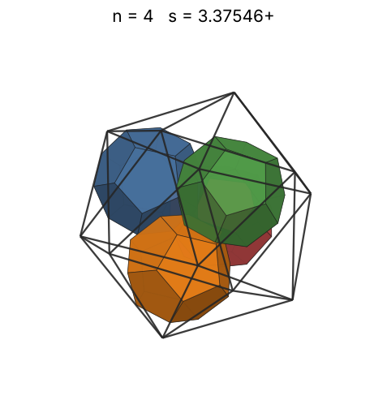 |
| 5 | [3.57660+](dodinico_n05.json) | 3.576607715776 |  |  | 2.59932 | 0.3839 | 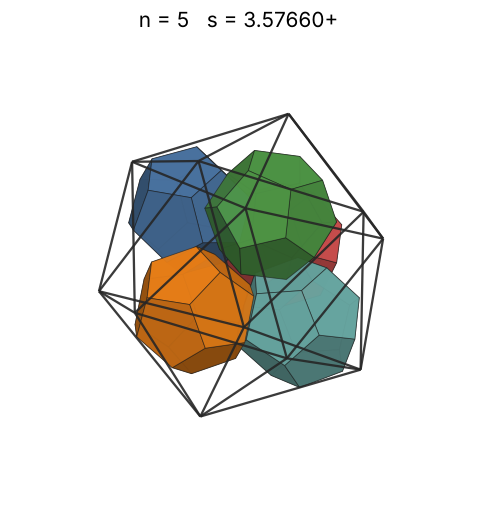 |
| 6 | [3.63755+](dodinico_n06.json) | 3.637559601591 | (2 + 17√5)/11 |  | 2.76219 | 0.4379 | 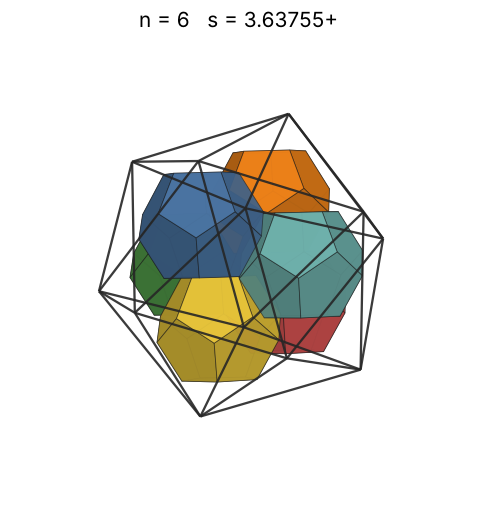 |
| 7 | [3.87251+](dodinico_n07.json) | 3.872517623069 |  |  | 2.90784 | 0.4234 | 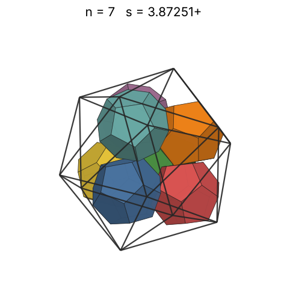 |
| 8 | [3.97060+](dodinico_n08.json) | 3.970602072238 |  |  | 3.04019 | 0.4489 | 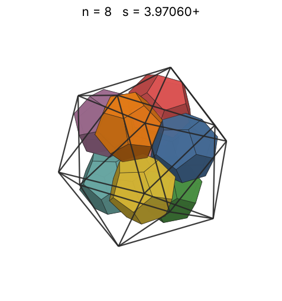 |
| 9 | [4.02206+](dodinico_n09.json) | 4.022063433118 |  |  | 3.16192 | 0.4859 | 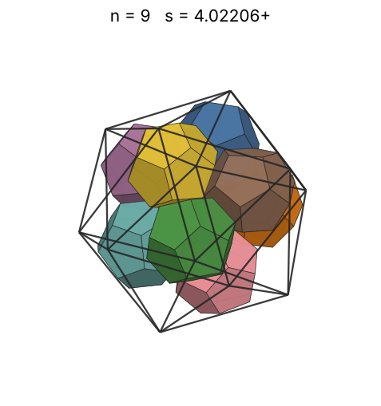 |
| 10 | [4.06524+](dodinico_n10.json) | 4.065247584250 | (25 + 7√5)/10 |  | 3.27494 | 0.5228 | 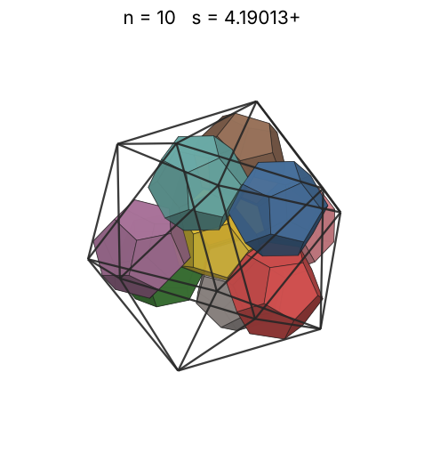 |
| 11 | [4.06524+](dodinico_n11.json) | 4.065247584250 | (25 + 7√5)/10 |  | 3.38066 | 0.5751 | 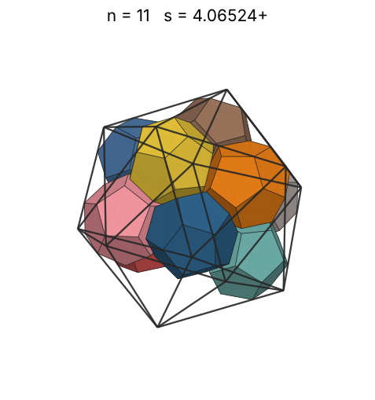 |
| 12 | [4.06524+](dodinico_n12.json) | 4.065247584250 | (25 + 7√5)/10 |  | 3.48015 | 0.6274 | 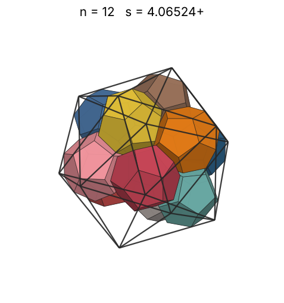 |
| 13 | [4.16524+](dodinico_n13.json) | 4.165247584250 |  |  | 3.57425 | 0.6319 | 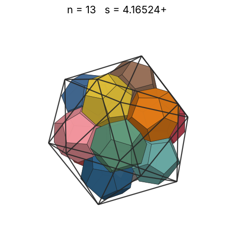 |
| 14 | [4.61150+](dodinico_n14.json) | 4.611505129373 |  |  | 3.66364 | 0.5014 | 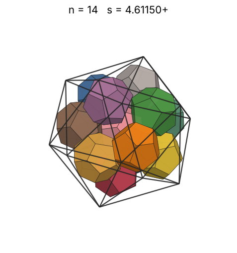 |
| 15 | [4.67765+](dodinico_n15.json) | 4.677654905931 |  |  | 3.74887 | 0.5148 | 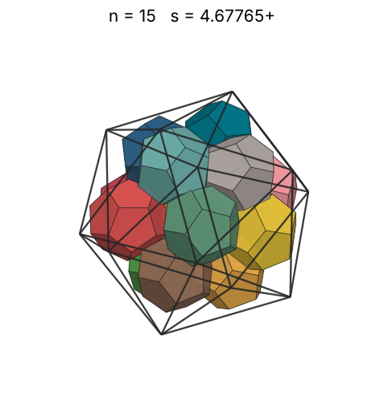 |
| 16 | [4.79487+](dodinico_n16.json) | 4.794873829996 |  |  | 3.83040 | 0.5098 | 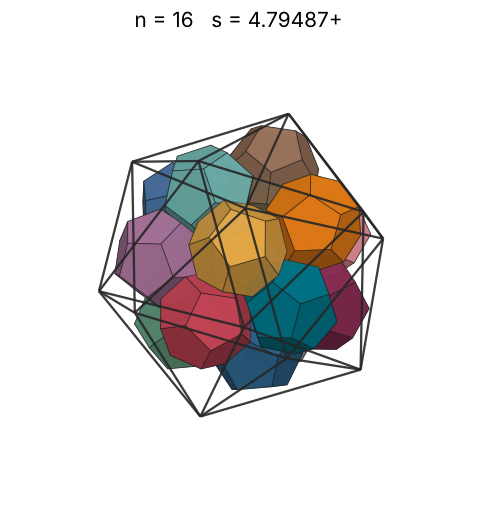 |
| 17 | [4.91131+](dodinico_n17.json) | 4.911319586926 |  |  | 3.90859 | 0.5040 | 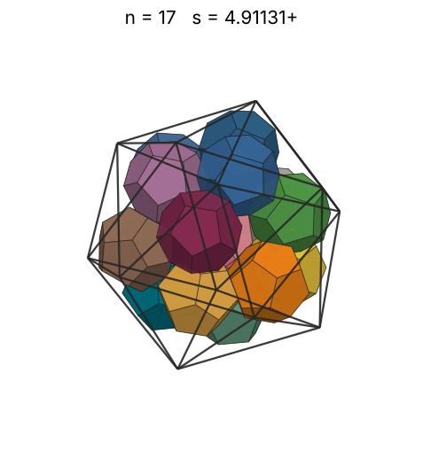 |
| 18 | [4.97248+](dodinico_n18.json) | 4.972484928601 |  |  | 3.98377 | 0.5142 | 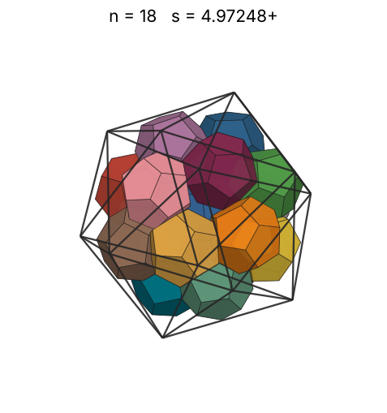 |
| 19 | [5.09383+](dodinico_n19.json) | 5.093833738600 |  |  | 4.05622 | 0.5049 | 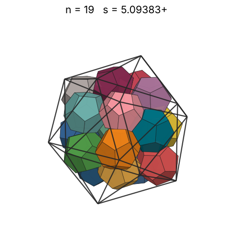 |
| 20 | [5.15761+](dodinico_n20.json) | 5.157611572438 |  |  | 4.12617 | 0.5120 | 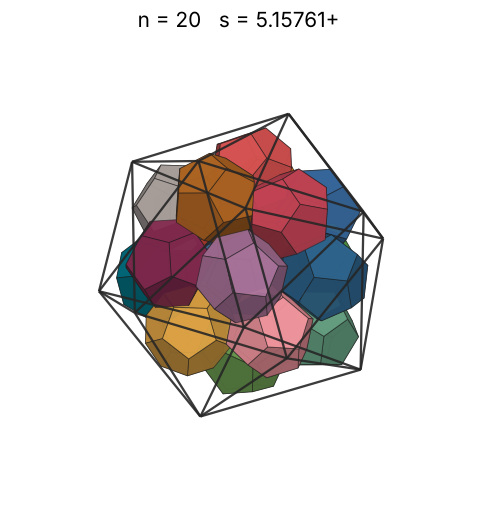 |
| 21 | [5.30070+](dodinico_n21.json) | 5.300706299748 |  |  | 4.19382 | 0.4953 | 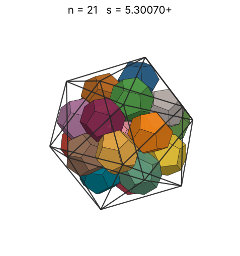 |
| 22 | [5.36236+](dodinico_n22.json) | 5.362367011502 |  |  | 4.25936 | 0.5011 | 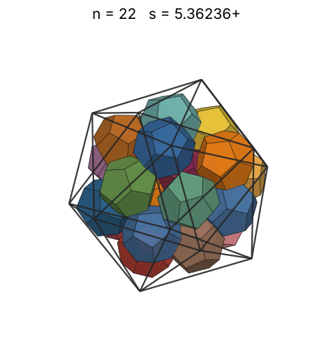 |
| 23 | [5.46968+](dodinico_n23.json) | 5.469684003511 |  |  | 4.32295 | 0.4937 | 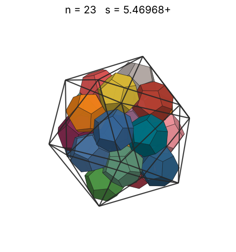 |
| 24 | [5.49963+](dodinico_n24.json) | 5.499630865603 |  |  | 4.38471 | 0.5068 | 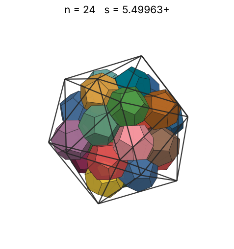 |
| 25 | [5.57301+](dodinico_n25.json) | 5.573014415086 |  |  | 4.44478 | 0.5073 | 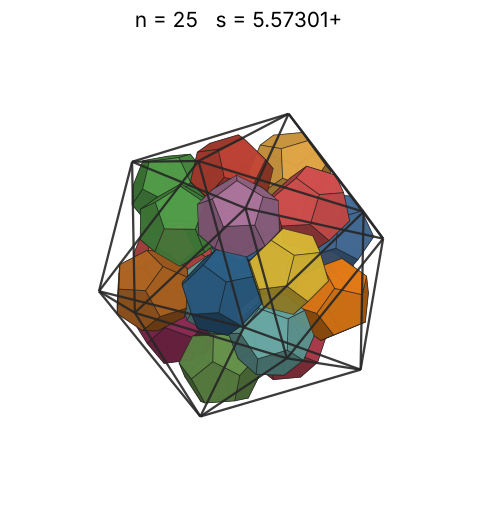 |
| 26 | [5.64729+](dodinico_n26.json) | 5.647296717579 |  |  | 4.50327 | 0.5071 | 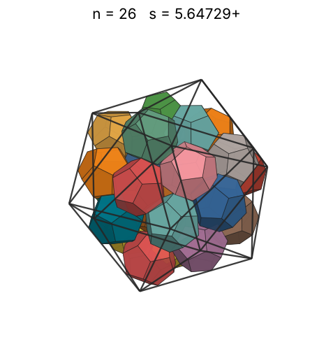 |
| 27 | [5.67926+](dodinico_n27.json) | 5.679261528020 |  |  | 4.56028 | 0.5177 | 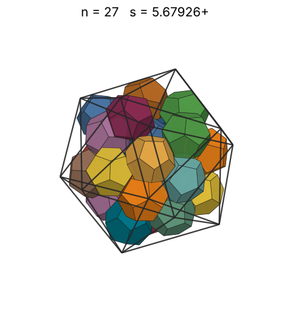 |
| 28 | [5.74960+](dodinico_n28.json) | 5.749600843442 |  |  | 4.61590 | 0.5174 | 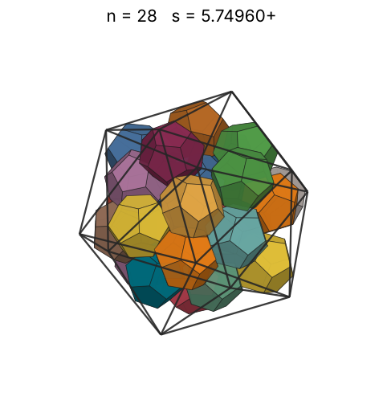 |
| 29 | [5.81056+](dodinico_n29.json) | 5.810559745368 |  |  | 4.67021 | 0.5192 | 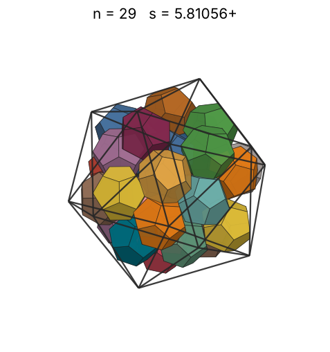 |
| 30 | [5.88554+](dodinico_n30.json) | 5.885541557377 |  |  | 4.72329 | 0.5169 | 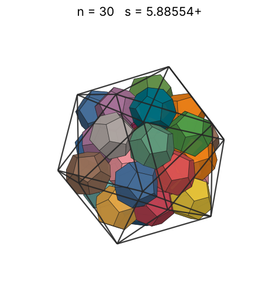 |
| 31 | [5.93069+](dodinico_n31.json) | 5.930691918433 |  |  | 4.77519 | 0.5220 | 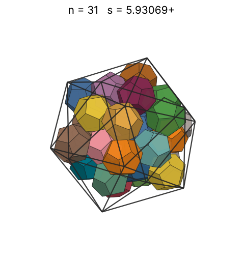 |
| 32 | [5.97179+](dodinico_n32.json) | 5.971793439938 |  |  | 4.82600 | 0.5278 | 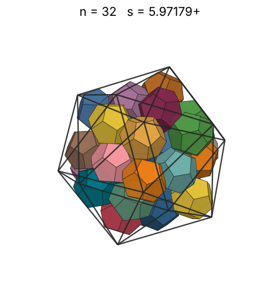 |
| 33 | [6.02721+](dodinico_n33.json) | 6.027210316613 |  |  | 4.87575 | 0.5294 | 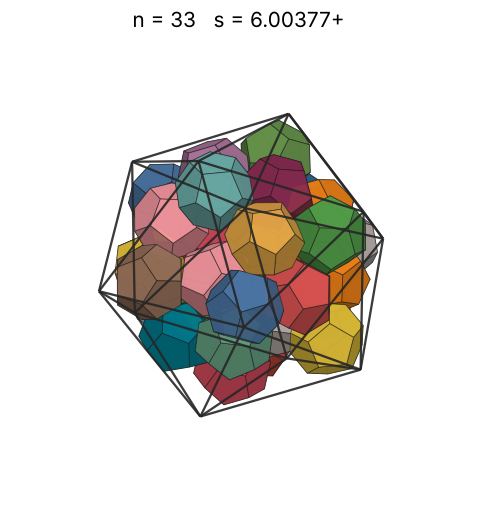 |
| 34 | [6.04766+](dodinico_n34.json) | 6.047663031597 |  |  | 4.92452 | 0.5399 | 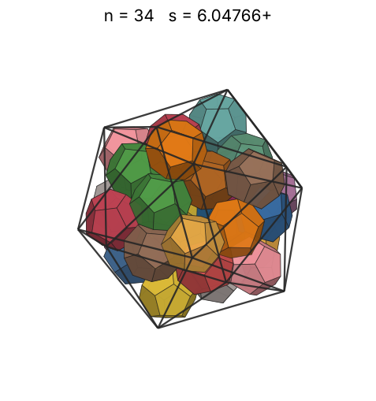 |
| 35 | [6.18846+](dodinico_n35.json) | 6.188468746577 |  |  | 4.97233 | 0.5187 | 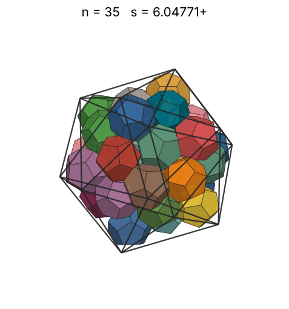 |
| 36 | [6.22314+](dodinico_n36.json) | 6.223144848277 |  |  | 5.01924 | 0.5247 | 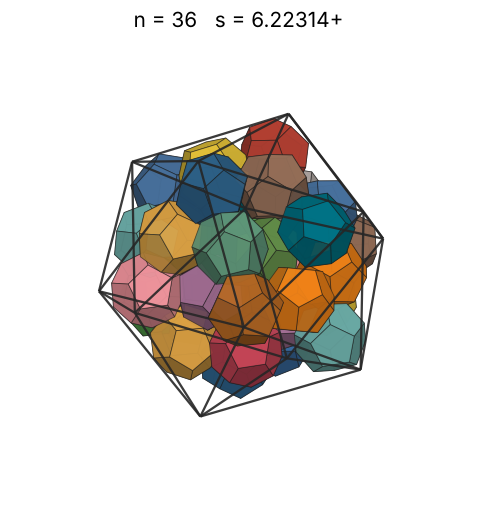 |
| 37 | [6.24851+](dodinico_n37.json) | 6.248517045328 |  |  | 5.06529 | 0.5327 | 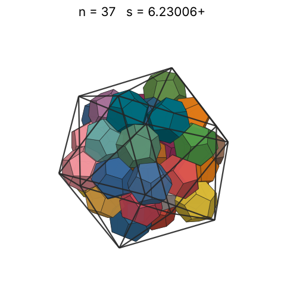 |
| 38 | [6.34275+](dodinico_n38.json) | 6.342750459986 |  |  | 5.11052 | 0.5231 | 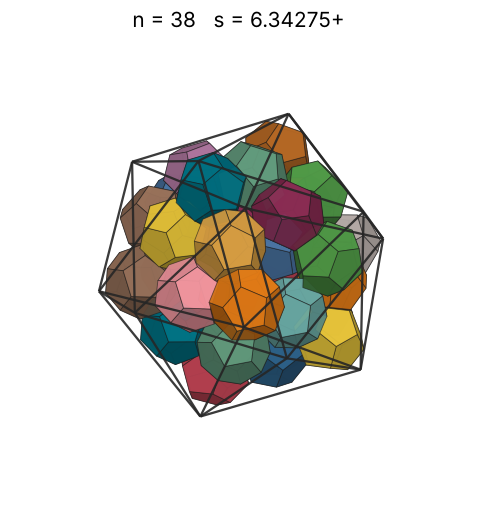 |
| 39 | [6.37764+](dodinico_n39.json) | 6.377648130943 |  |  | 5.15496 | 0.5281 | 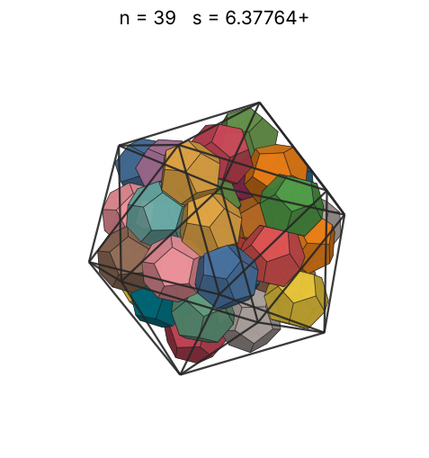 |
| 40 | [6.39792+](dodinico_n40.json) | 6.397920956510 |  |  | 5.19865 | 0.5365 | 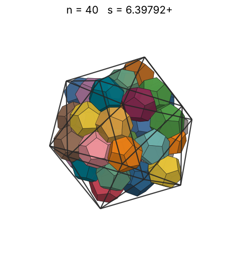 |
