# Dodecahedra in an icosahedron

s = container edge / piece edge; every row certified in exact arithmetic.

| n | s | touching limit | closed form (conj.) | volume bound | density | picture |
|---|---|---|---|---|---|---|
| 2 | [2.89442+](dodinico_n02.json) | 2.894427191000 | (10 + 2√5)/5 | 1.91520 | 0.2897 | 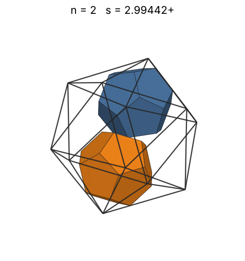 |
| 3 | [3.14562+](dodinico_n03.json) | 3.145623653066 |  | 2.19236 | 0.3385 | 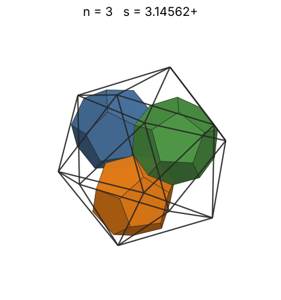 |
| 4 | [3.37546+](dodinico_n04.json) | 3.375463527009 |  | 2.41300 | 0.3653 | 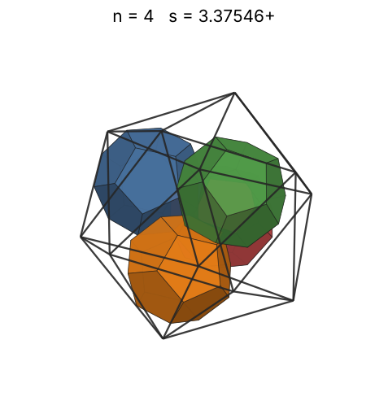 |
| 5 | [3.57490+](dodinico_n05.json) | 3.574901176543 |  | 2.59932 | 0.3844 | 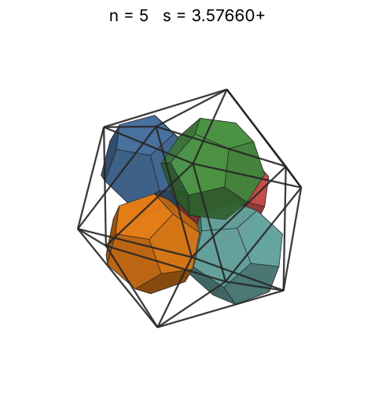 |
| 6 | [3.61803+](dodinico_n06.json) | 3.618034120360 | √5/2 + 5/2 | 2.76219 | 0.4450 | 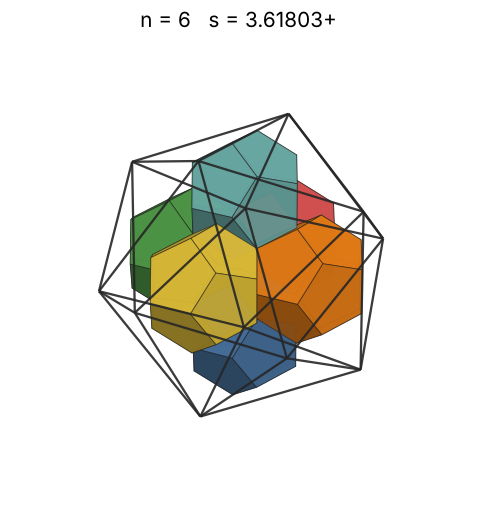 |
| 7 | [3.85641+](dodinico_n07.json) | 3.856415662220 |  | 2.90784 | 0.4287 | 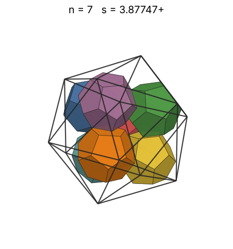 |
| 8 | [3.96508+](dodinico_n08.json) | 3.965082401517 |  | 3.04019 | 0.4508 | 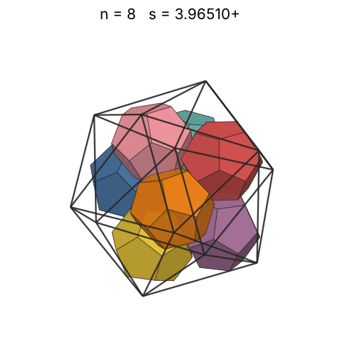 |
| 9 | [4.02206+](dodinico_n09.json) | 4.022063433118 |  | 3.16192 | 0.4859 | 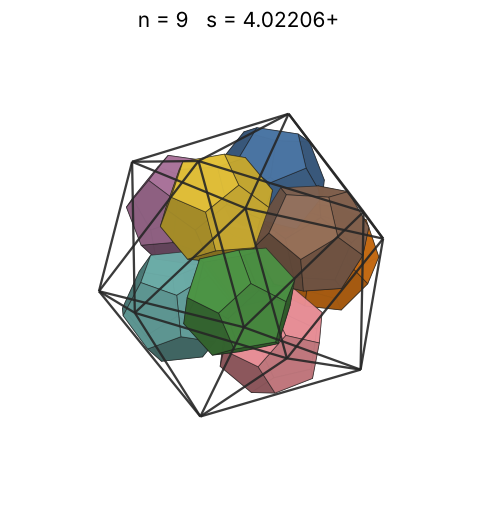 |
| 10 | [4.06524+](dodinico_n10.json) | 4.065247584250 | (25 + 7√5)/10 | 3.27494 | 0.5228 | 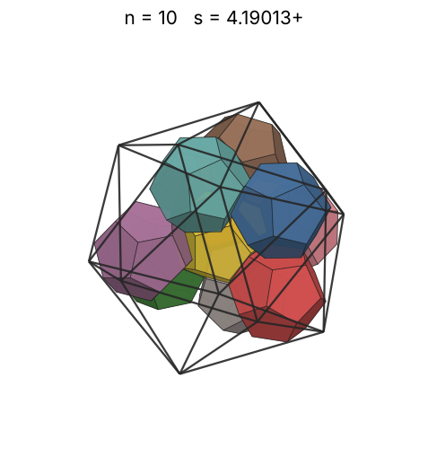 |
| 11 | [4.06524+](dodinico_n11.json) | 4.065247584250 | (25 + 7√5)/10 | 3.38066 | 0.5751 | 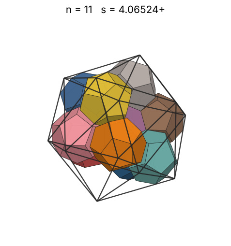 |
| 12 | [4.06524+](dodinico_n12.json) | 4.065247584250 | (25 + 7√5)/10 | 3.48015 | 0.6274 | 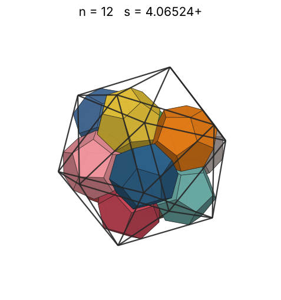 |
| 13 | [4.06524+](dodinico_n13.json) | 4.065247584250 | (25 + 7√5)/10 | 3.57425 | 0.6797 | 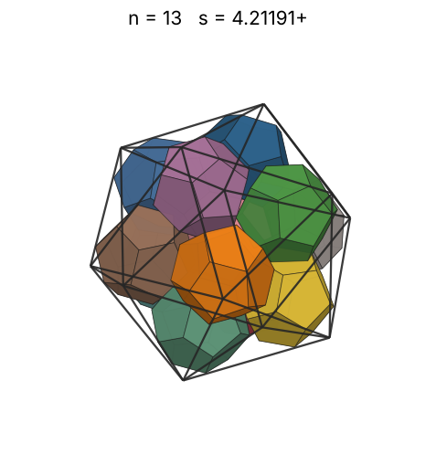 |
| 14 | [4.59694+](dodinico_n14.json) | 4.596948186387 |  | 3.66364 | 0.5062 | 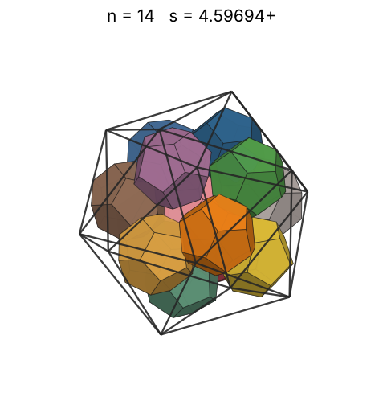 |
| 15 | [4.67481+](dodinico_n15.json) | 4.674811195738 |  | 3.74887 | 0.5157 | 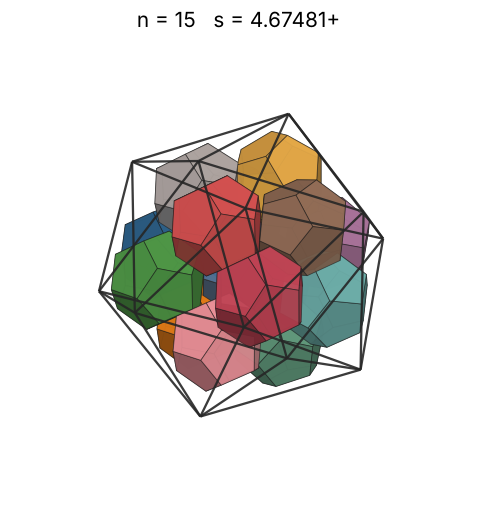 |
| 16 | [4.79245+](dodinico_n16.json) | 4.792453975656 |  | 3.83040 | 0.5106 | 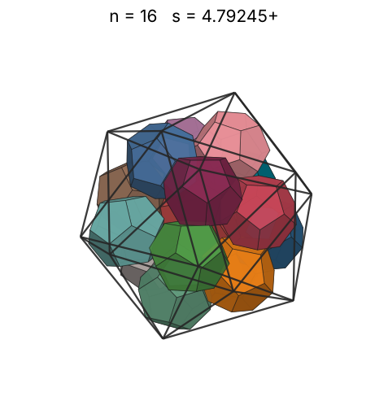 |
| 17 | [4.88916+](dodinico_n17.json) | 4.889162754099 |  | 3.90859 | 0.5109 | 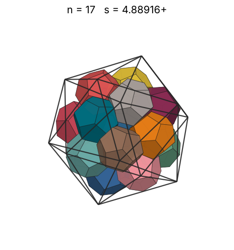 |
| 18 | [4.97123+](dodinico_n18.json) | 4.971238826160 |  | 3.98377 | 0.5146 | 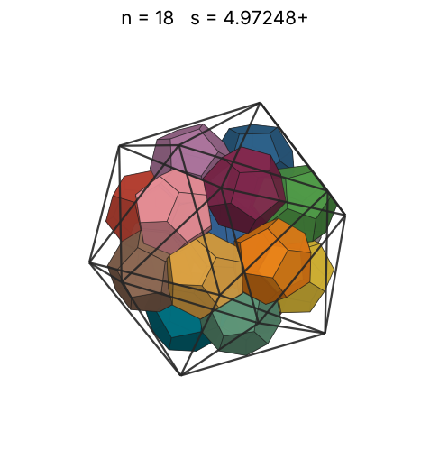 |
| 19 | [5.07936+](dodinico_n19.json) | 5.079366745280 |  | 4.05622 | 0.5093 | 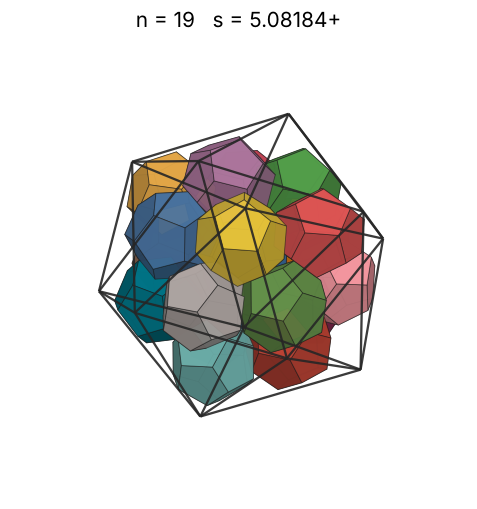 |
| 20 | [5.15760+](dodinico_n20.json) | 5.157603430264 |  | 4.12617 | 0.5120 | 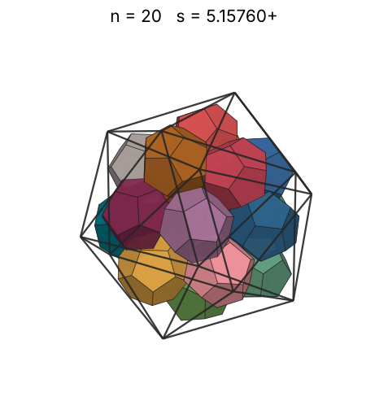 |
| 21 | [5.26142+](dodinico_n21.json) | 5.261428013945 |  | 4.19382 | 0.5064 | 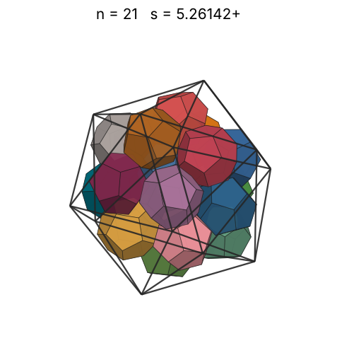 |
| 22 | [5.32240+](dodinico_n22.json) | 5.322409485426 |  | 4.25936 | 0.5125 | 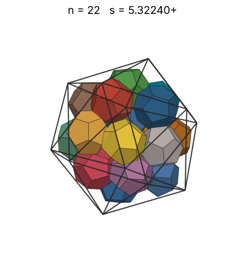 |
| 23 | [5.40195+](dodinico_n23.json) | 5.401953174283 |  | 4.32295 | 0.5125 | 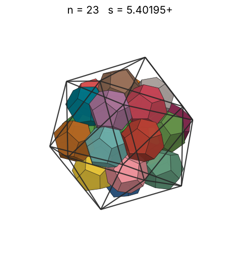 |
| 24 | [5.47474+](dodinico_n24.json) | 5.474744680560 |  | 4.38471 | 0.5137 | 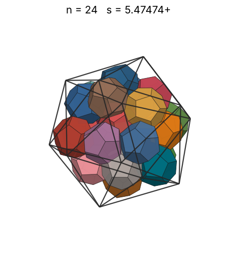 |
| 25 | [5.53087+](dodinico_n25.json) | 5.530872747685 |  | 4.44478 | 0.5190 | 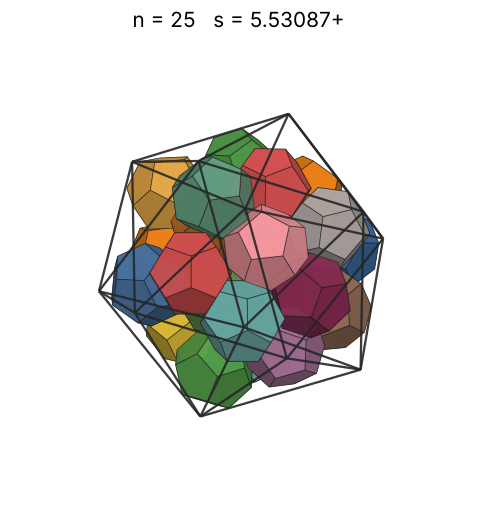 |
| 26 | [5.61552+](dodinico_n26.json) | 5.615524541841 |  | 4.50327 | 0.5157 | 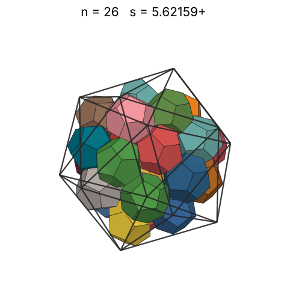 |
| 27 | [5.66985+](dodinico_n27.json) | 5.669857975052 |  | 4.56028 | 0.5203 | 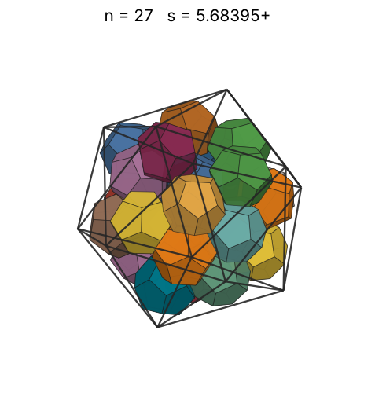 |
| 28 | [5.73945+](dodinico_n28.json) | 5.739449854001 |  | 4.61590 | 0.5202 | 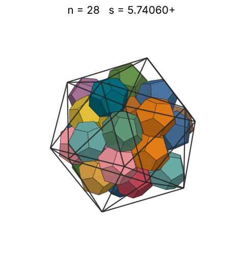 |
| 29 | [5.77917+](dodinico_n29.json) | 5.779178742445 |  | 4.67021 | 0.5277 | 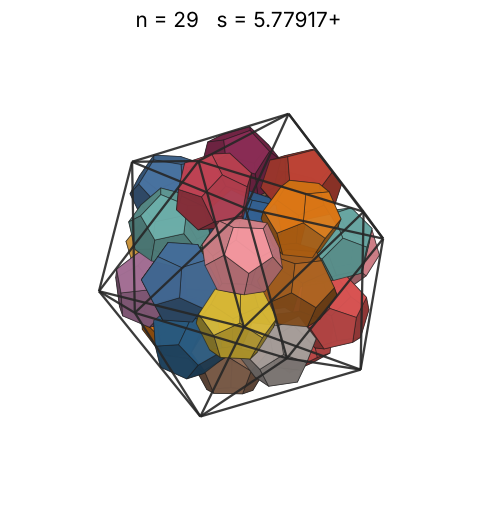 |
| 30 | [5.84833+](dodinico_n30.json) | 5.848338232782 |  | 4.72329 | 0.5268 | 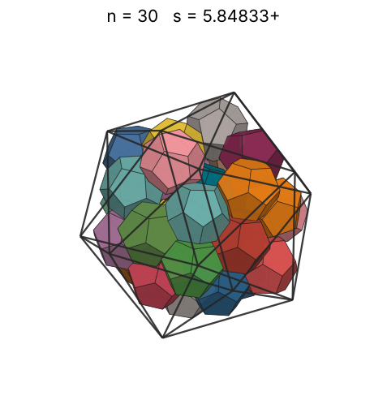 |
| 31 | [5.90253+](dodinico_n31.json) | 5.902532422464 |  | 4.77519 | 0.5295 | 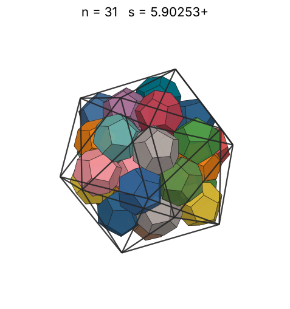 |
| 32 | [5.94969+](dodinico_n32.json) | 5.949693849828 |  | 4.82600 | 0.5337 | 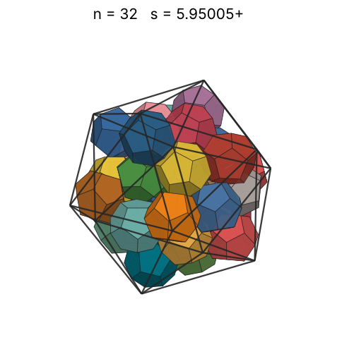 |
| 33 | [5.96371+](dodinico_n33.json) | 5.963712051532 |  | 4.87575 | 0.5465 | 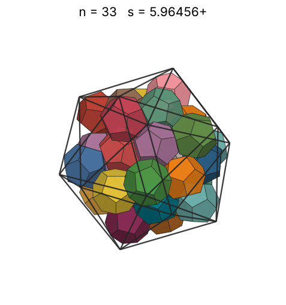 |
| 34 | [5.98812+](dodinico_n34.json) | 5.988125474386 |  | 4.92452 | 0.5562 | 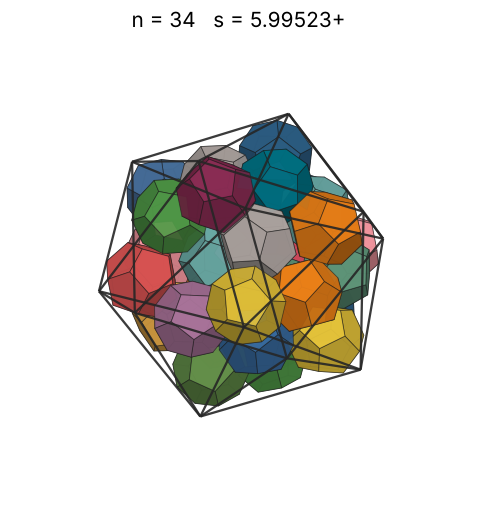 |
| 35 | [6.01397+](dodinico_n35.json) | 6.013971460311 |  | 4.97233 | 0.5652 | 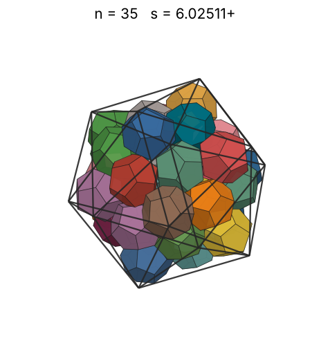 |
| 36 | [6.14069+](dodinico_n36.json) | 6.140695561885 |  | 5.01924 | 0.5461 | 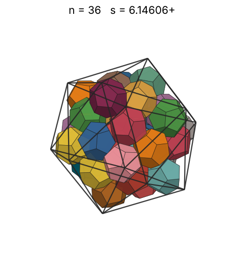 |
| 37 | [6.21295+](dodinico_n37.json) | 6.212956929974 |  | 5.06529 | 0.5419 | 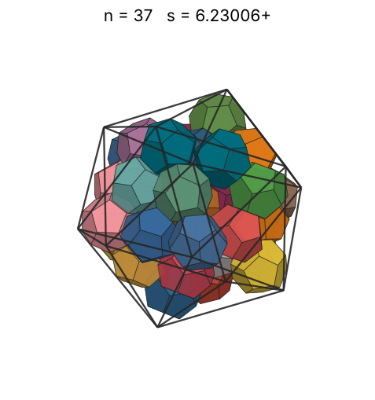 |
| 38 | [6.26922+](dodinico_n38.json) | 6.269229097909 |  | 5.11052 | 0.5417 | 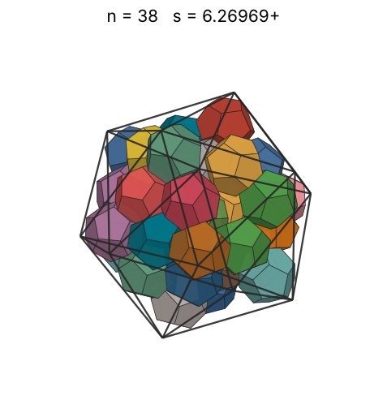 |
| 39 | [6.30736+](dodinico_n39.json) | 6.307365601947 |  | 5.15496 | 0.5459 | 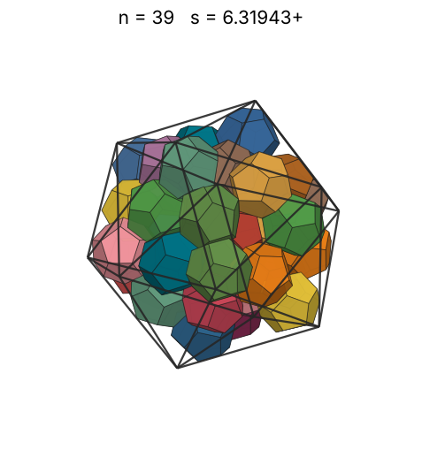 |
| 40 | [6.32472+](dodinico_n40.json) | 6.324721135065 |  | 5.19865 | 0.5553 | 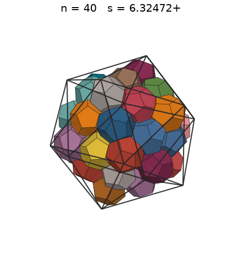 |
| 41 | [6.34609+](dodinico_n41.json) | 6.346094696578 |  | 5.24162 | 0.5635 |  |
| 42 | [6.39496+](dodinico_n42.json) | 6.394965969491 |  | 5.28389 | 0.5641 |  |
| 43 | [6.43814+](dodinico_n43.json) | 6.438149381446 |  | 5.32550 | 0.5660 |  |
| 44 | [6.47794+](dodinico_n44.json) | 6.477946797819 |  | 5.36646 | 0.5685 |  |
| 45 | [6.54511+](dodinico_n45.json) | 6.545112581225 |  | 5.40681 | 0.5637 |  |
| 46 | [6.56306+](dodinico_n46.json) | 6.563060123653 |  | 5.44657 | 0.5715 |  |
| 47 | [6.60564+](dodinico_n47.json) | 6.605647346209 |  | 5.48576 | 0.5727 |  |
| 48 | [6.61802+](dodinico_n48.json) | 6.618028456506 |  | 5.52439 | 0.5817 |  |
| 49 | [6.62060+](dodinico_n49.json) | 6.620608088090 |  | 5.56249 | 0.5931 |  |
| 50 | [6.64468+](dodinico_n50.json) | 6.644680716655 |  | 5.60008 | 0.5986 |  |
| 51 | [6.64773+](dodinico_n51.json) | 6.647737159516 |  | 5.63716 | 0.6098 |  |
| 52 | [6.66374+](dodinico_n52.json) | 6.663747330516 |  | 5.67377 | 0.6172 |  |
| 53 | [6.66812+](dodinico_n53.json) | 6.668119881798 |  | 5.70991 | 0.6279 |  |
| 54 | [6.67170+](dodinico_n54.json) | 6.671700577405 |  | 5.74560 | 0.6387 |  |
| 55 | [6.72759+](dodinico_n55.json) | 6.727595271400 |  | 5.78085 | 0.6344 |  |
| 56 | [6.86952+](dodinico_n56.json) | 6.869525878893 |  | 5.81567 | 0.6068 |  |
| 57 | [7.02911+](dodinico_n57.json) | 7.029117766789 |  | 5.85008 | 0.5765 |  |
| 58 | [7.08980+](dodinico_n58.json) | 7.089802021291 |  | 5.88410 | 0.5717 |  |
| 59 | [7.14427+](dodinico_n59.json) | 7.144273542175 |  | 5.91772 | 0.5683 |  |
| 60 | [7.16995+](dodinico_n60.json) | 7.169956436603 |  | 5.95097 | 0.5718 |  |
| 61 | [7.25164+](dodinico_n61.json) | 7.251649593897 |  | 5.98385 | 0.5619 |  |
| 62 | [7.28362+](dodinico_n62.json) | 7.283623754849 |  | 6.01637 | 0.5636 |  |
| 63 | [7.32425+](dodinico_n63.json) | 7.324252610253 |  | 6.04854 | 0.5632 |  |
| 64 | [7.36278+](dodinico_n64.json) | 7.362789256150 |  | 6.08038 | 0.5632 |  |
| 65 | [7.39775+](dodinico_n65.json) | 7.397758128045 |  | 6.11188 | 0.5639 |  |
| 66 | [7.46254+](dodinico_n66.json) | 7.462547250401 |  | 6.14307 | 0.5578 |  |
| 67 | [7.48504+](dodinico_n67.json) | 7.485047914331 |  | 6.17394 | 0.5612 |  |
| 68 | [7.48827+](dodinico_n68.json) | 7.488273145513 |  | 6.20450 | 0.5688 |  |
| 69 | [7.57595+](dodinico_n69.json) | 7.575953872242 |  | 6.23477 | 0.5574 |  |
| 70 | [7.59604+](dodinico_n70.json) | 7.596041128318 |  | 6.26474 | 0.5610 |  |
| 71 | [7.59879+](dodinico_n71.json) | 7.598793825230 |  | 6.29443 | 0.5684 |  |
| 72 | [7.64844+](dodinico_n72.json) | 7.648442159328 |  | 6.32385 | 0.5652 |  |
| 73 | [7.67081+](dodinico_n73.json) | 7.670814916030 |  | 6.35299 | 0.5681 |  |
| 74 | [7.68093+](dodinico_n74.json) | 7.680933584002 |  | 6.38187 | 0.5736 |  |
| 75 | [7.74860+](dodinico_n75.json) | 7.748608923991 |  | 6.41049 | 0.5662 |  |
| 76 | [7.78874+](dodinico_n76.json) | 7.788749147497 |  | 6.43885 | 0.5650 |  |
| 77 | [7.86491+](dodinico_n77.json) | 7.864910693371 |  | 6.46697 | 0.5559 |  |
| 78 | [7.88489+](dodinico_n78.json) | 7.884895558974 |  | 6.49484 | 0.5589 |  |
| 79 | [7.91400+](dodinico_n79.json) | 7.914001481261 |  | 6.52248 | 0.5598 |  |
| 80 | [7.93495+](dodinico_n80.json) | 7.934954928732 |  | 6.54989 | 0.5624 |  |
| 81 | [7.94869+](dodinico_n81.json) | 7.948698389051 |  | 6.57707 | 0.5665 |  |
| 82 | [7.97765+](dodinico_n82.json) | 7.977655653317 |  | 6.60402 | 0.5673 |  |
| 83 | [8.00548+](dodinico_n83.json) | 8.005486229371 |  | 6.63076 | 0.5682 |  |
| 84 | [8.01460+](dodinico_n84.json) | 8.014603756685 |  | 6.65728 | 0.5731 |  |
| 85 | [8.06634+](dodinico_n85.json) | 8.066344606988 |  | 6.68360 | 0.5689 |  |
| 86 | [8.10153+](dodinico_n86.json) | 8.101531672362 |  | 6.70970 | 0.5681 |  |
| 87 | [8.10306+](dodinico_n87.json) | 8.103068316304 |  | 6.73561 | 0.5744 |  |
| 88 | [8.13932+](dodinico_n88.json) | 8.139322126421 |  | 6.76132 | 0.5732 |  |
| 89 | [8.15070+](dodinico_n89.json) | 8.150703614910 |  | 6.78683 | 0.5773 |  |
| 90 | [8.18605+](dodinico_n90.json) | 8.186054976431 |  | 6.81216 | 0.5763 |  |
| 91 | [8.19376+](dodinico_n91.json) | 8.193765821381 |  | 6.83729 | 0.5810 |  |
| 92 | [8.21187+](dodinico_n92.json) | 8.211878411680 |  | 6.86225 | 0.5835 |  |
| 93 | [8.23998+](dodinico_n93.json) | 8.239984329856 |  | 6.88702 | 0.5839 |  |
| 94 | [8.31165+](dodinico_n94.json) | 8.311654552114 |  | 6.91162 | 0.5750 |  |
| 95 | [8.31302+](dodinico_n95.json) | 8.313025138108 |  | 6.93604 | 0.5808 |  |
| 96 | [8.33225+](dodinico_n96.json) | 8.332252754679 |  | 6.96029 | 0.5829 |  |
| 97 | [8.33625+](dodinico_n97.json) | 8.336255647552 |  | 6.98438 | 0.5881 |  |
| 98 | [8.34798+](dodinico_n98.json) | 8.347985183129 |  | 7.00830 | 0.5917 |  |
| 99 | [8.35538+](dodinico_n99.json) | 8.355383593030 |  | 7.03205 | 0.5961 |  |
| 100 | [8.35538+](dodinico_n100.json) | 8.355383595446 |  | 7.05565 | 0.6022 |  |
