# Icosahedra in a dodecahedron

s = container edge / piece edge; every row certified in exact arithmetic.

| n | s | touching limit | closed form (conj.) | previous best | volume bound | density | picture |
|---|---|---|---|---|---|---|---|
| 2 | [1.23606+](icoindod_n02.json) | 1.236067977500 | -1 + √5 |  | 0.82884 | 0.3015 | 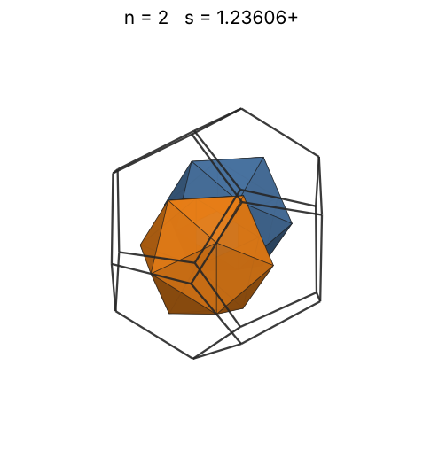 |
| 3 | [1.37303+](icoindod_n03.json) | 1.373033819006 |  |  | 0.94879 | 0.3300 | 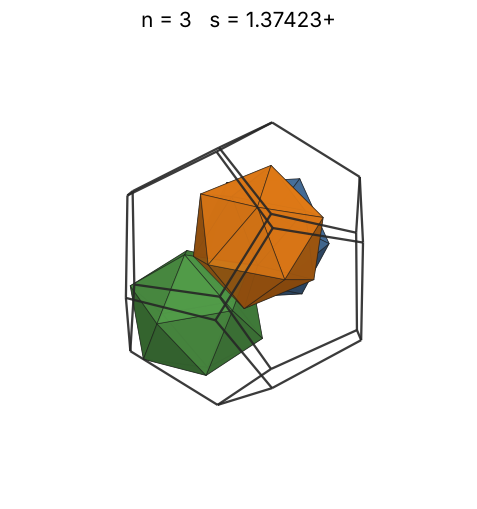 |
| 4 | [1.41064+](icoindod_n04.json) | 1.410641457796 |  |  | 1.04428 | 0.4057 | 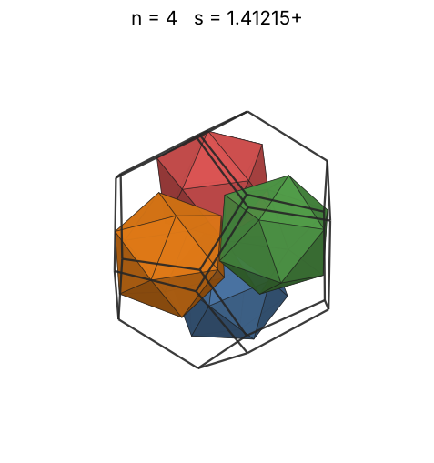 |
| 5 | [1.53319+](icoindod_n05.json) | 1.533190267566 |  |  | 1.12491 | 0.3950 | 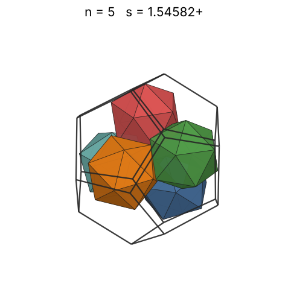 |
| 6 | [1.55131+](icoindod_n06.json) | 1.551315641669 |  |  | 1.19540 | 0.4576 | 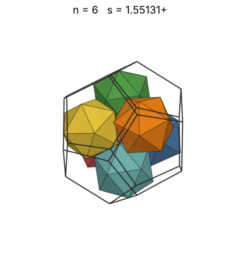 |
| 7 | [1.66970+](icoindod_n07.json) | 1.669708930112 |  |  | 1.25843 | 0.4281 | 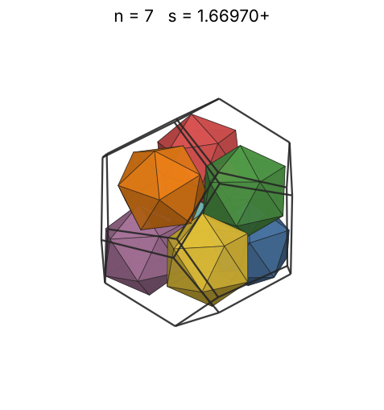 |
| 8 | [1.69786+](icoindod_n08.json) | 1.697868484226 |  |  | 1.31571 | 0.4653 | 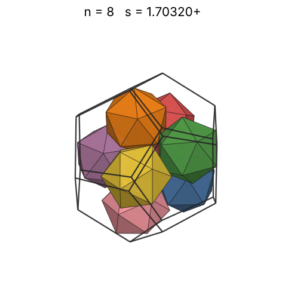 |
| 9 | [1.77163+](icoindod_n09.json) | 1.771633823380 |  |  | 1.36839 | 0.4608 | 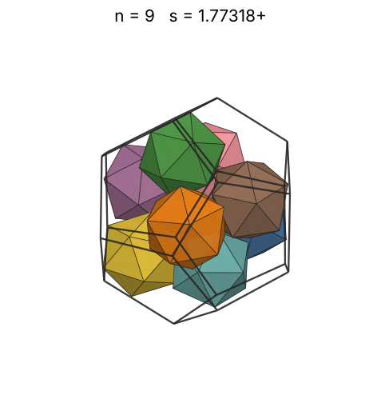 |
| 10 | [1.81824+](icoindod_n10.json) | 1.818246222678 |  |  | 1.41730 | 0.4736 | 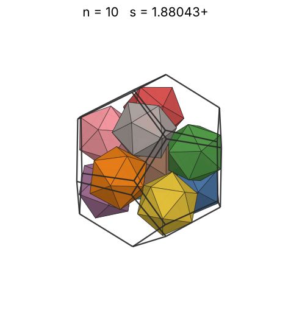 |
| 11 | [1.87157+](icoindod_n11.json) | 1.871570992594 |  |  | 1.46305 | 0.4777 | 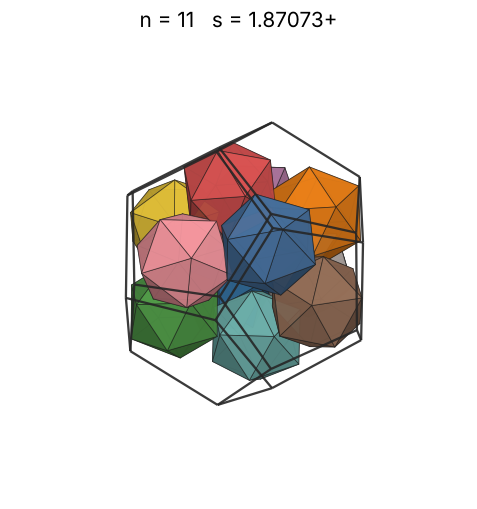 |
| 12 | [1.87497+](icoindod_n12.json) | 1.874970286529 |  |  | 1.50611 | 0.5183 | 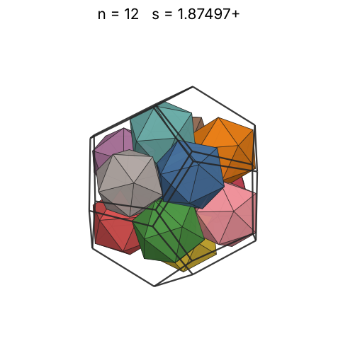 |
| 13 | [1.90402+](icoindod_n13.json) | 1.904024516913 |  |  | 1.54683 | 0.5362 | 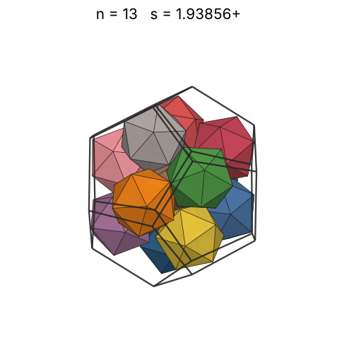 |
| 14 | [1.97164+](icoindod_n14.json) | 1.971646700138 |  |  | 1.58552 | 0.5200 | 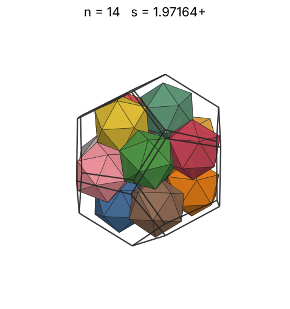 |
| 15 | [2.00000+](icoindod_n15.json) | 2.000000000000 | 2 |  | 1.62241 | 0.5338 | 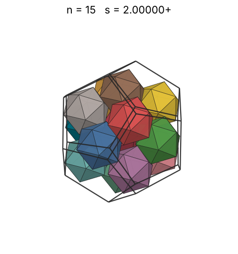 |
| 16 | [2.05681+](icoindod_n16.json) | 2.056819223877 |  |  | 1.65769 | 0.5235 | 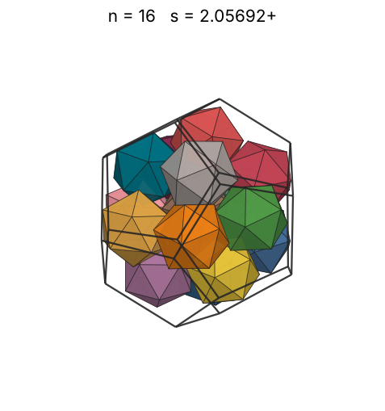 |
| 17 | [2.09164+](icoindod_n17.json) | 2.091643939045 |  |  | 1.69153 | 0.5289 | 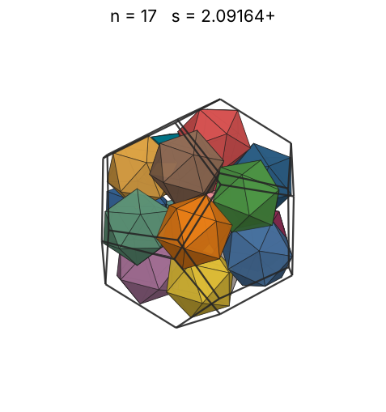 |
| 18 | [2.16296+](icoindod_n18.json) | 2.162969270829 |  |  | 1.72407 | 0.5064 | 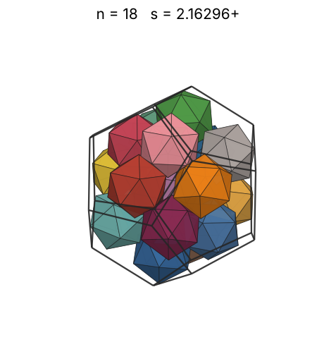 |
| 19 | [2.21543+](icoindod_n19.json) | 2.215431774960 |  |  | 1.75542 | 0.4975 | 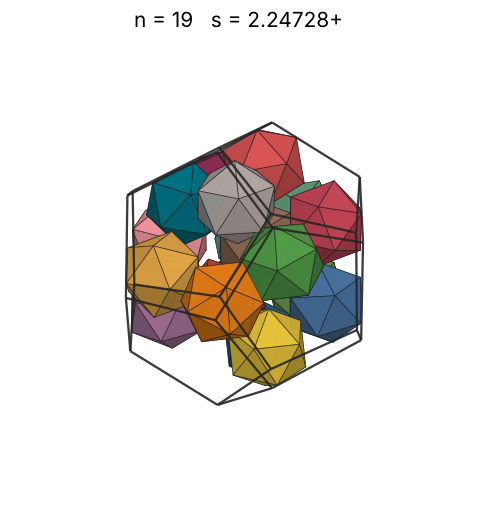 |
| 20 | [2.26198+](icoindod_n20.json) | 2.261981018238 |  |  | 1.78569 | 0.4920 | 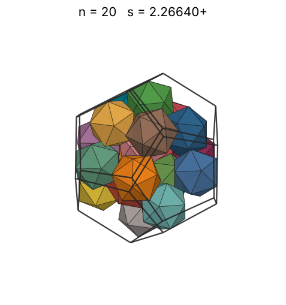 |
| 21 | [2.28655+](icoindod_n21.json) | 2.286557219192 |  |  | 1.81497 | 0.5001 | 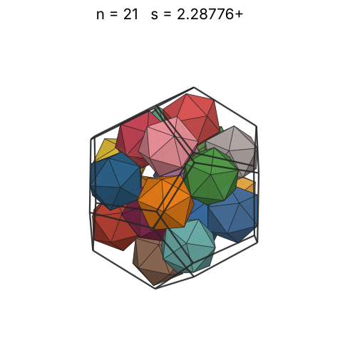 |
| 22 | [2.29681+](icoindod_n22.json) | 2.296815746922 |  |  | 1.84333 | 0.5169 | 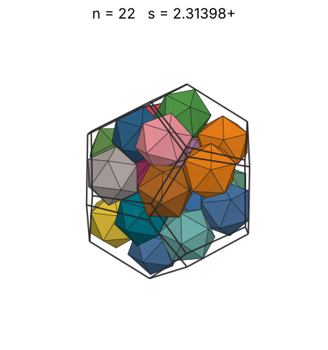 |
| 23 | [2.35168+](icoindod_n23.json) | 2.351689193181 |  |  | 1.87085 | 0.5035 | 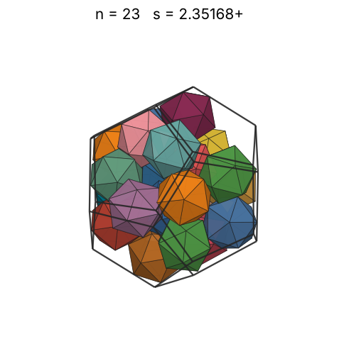 |
| 24 | [2.36821+](icoindod_n24.json) | 2.368219372942 |  |  | 1.89758 | 0.5144 | 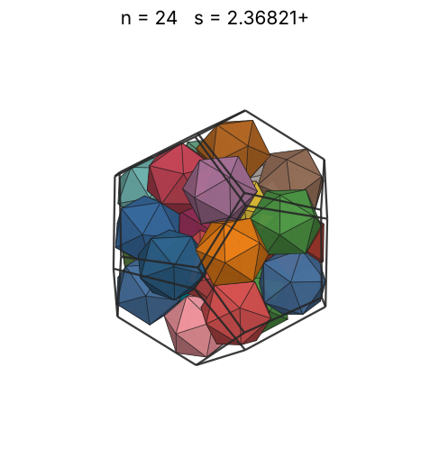 |
| 25 | [2.39941+](icoindod_n25.json) | 2.399410811868 |  |  | 1.92358 | 0.5152 | 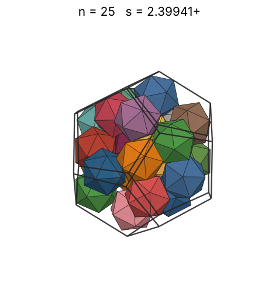 |
| 26 | [2.42395+](icoindod_n26.json) | 2.423953365091 |  |  | 1.94889 | 0.5197 | 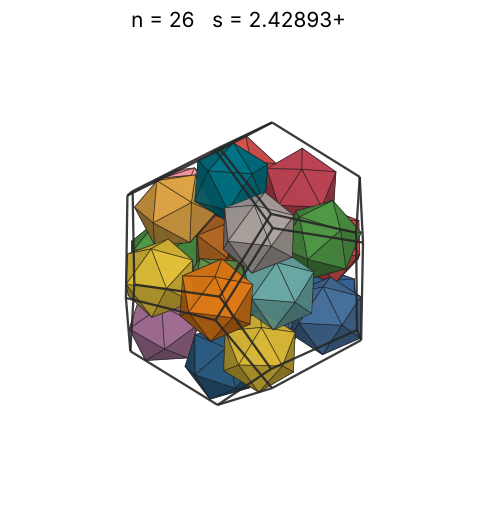 |
| 27 | [2.44802+](icoindod_n27.json) | 2.448022931275 |  |  | 1.97356 | 0.5240 | 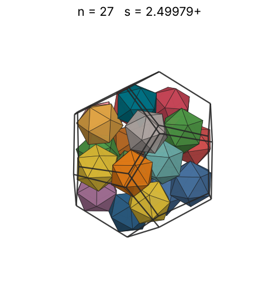 |
| 28 | [2.46857+](icoindod_n28.json) | 2.468571193359 |  |  | 1.99763 | 0.5299 | 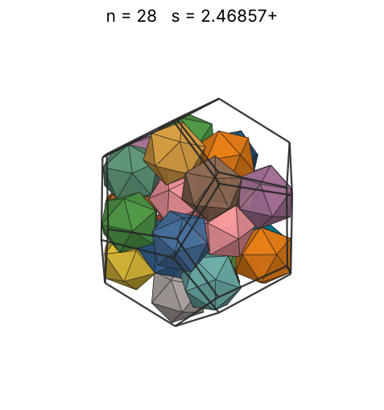 |
| 29 | [2.48324+](icoindod_n29.json) | 2.483246337818 |  |  | 2.02114 | 0.5392 | 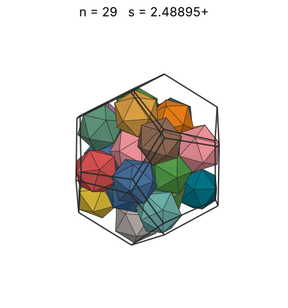 |
| 30 | [2.49070+](icoindod_n30.json) | 2.490704882290 |  |  | 2.04411 | 0.5528 | 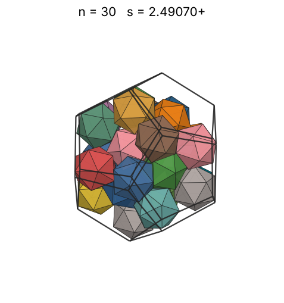 |
| 31 | [2.51421+](icoindod_n31.json) | 2.514213188906 |  |  | 2.06657 | 0.5553 | 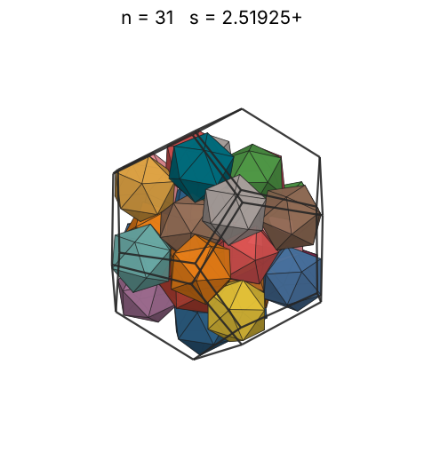 |
| 32 | [2.53937+](icoindod_n32.json) | 2.539374994894 |  |  | 2.08856 | 0.5564 | 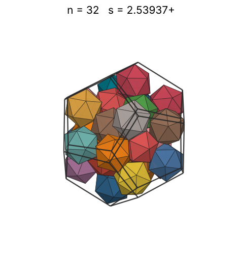 |
| 33 | [2.54174+](icoindod_n33.json) | 2.541742376658 |  |  | 2.11009 | 0.5721 | 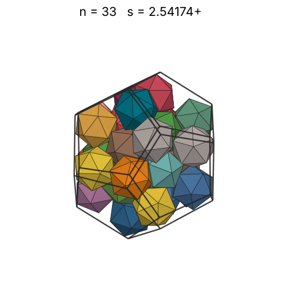 |
| 34 | [2.58825+](icoindod_n34.json) | 2.588254020161 |  |  | 2.13119 | 0.5583 | 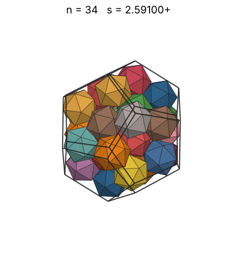 |
| 35 | [2.63084+](icoindod_n35.json) | 2.630840512045 |  |  | 2.15188 | 0.5472 | 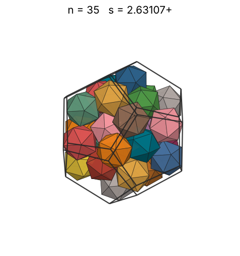 |
| 36 | [2.67523+](icoindod_n36.json) | 2.675238556974 |  |  | 2.17219 | 0.5353 | 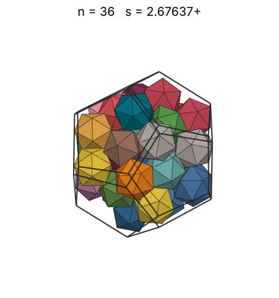 |
| 37 | [2.69183+](icoindod_n37.json) | 2.691839706757 |  |  | 2.19212 | 0.5401 | 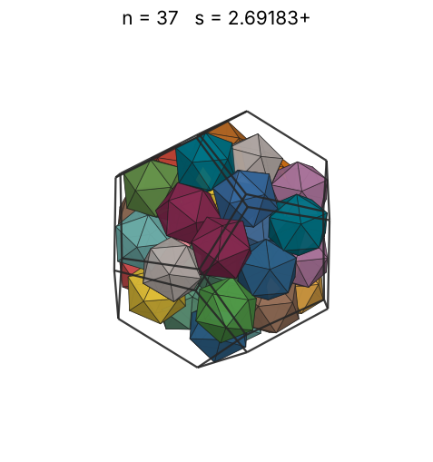 |
| 38 | [2.71125+](icoindod_n38.json) | 2.711257523241 |  |  | 2.21169 | 0.5428 | 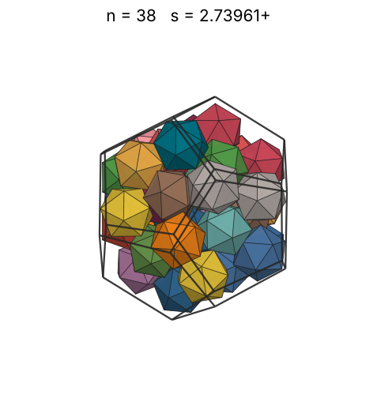 |
| 39 | [2.74199+](icoindod_n39.json) | 2.741991113822 |  |  | 2.23092 | 0.5386 | 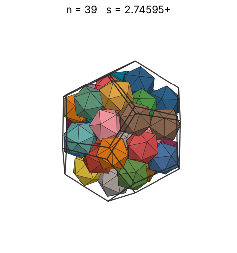 |
| 40 | [2.74852+](icoindod_n40.json) | 2.748522147612 |  |  | 2.24983 | 0.5485 | 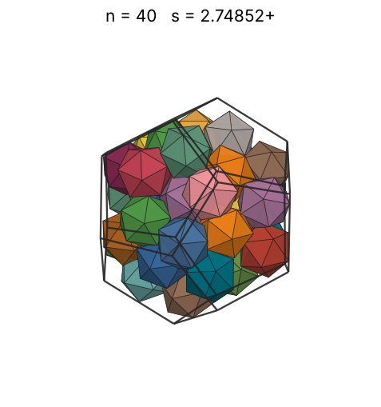 |
