# Icosahedra in a dodecahedron

s = container edge / piece edge; every row certified in exact arithmetic.

| n | s | touching limit | closed form (conj.) | volume bound | density | picture |
|---|---|---|---|---|---|---|
| 2 | [1.23606+](icoindod_n02.json) | 1.236067977500 | -1 + √5 | 0.82884 | 0.3015 | 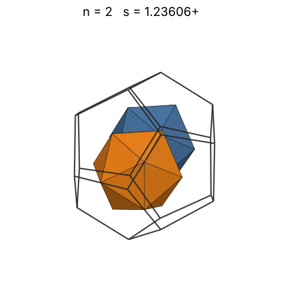 |
| 3 | [1.37303+](icoindod_n03.json) | 1.373033819006 |  | 0.94879 | 0.3300 | 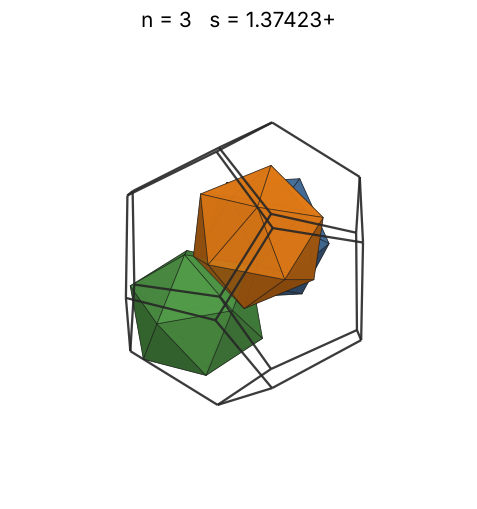 |
| 4 | [1.39344+](icoindod_n04.json) | 1.393446629166 | (-7 + 5√5)/3 | 1.04428 | 0.4209 | 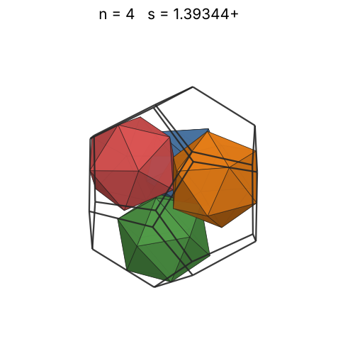 |
| 5 | [1.53319+](icoindod_n05.json) | 1.533190267566 |  | 1.12491 | 0.3950 | 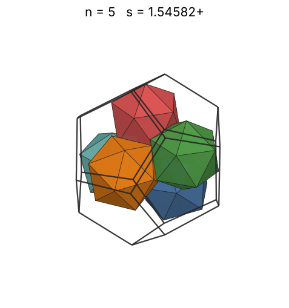 |
| 6 | [1.55131+](icoindod_n06.json) | 1.551315641669 |  | 1.19540 | 0.4576 | 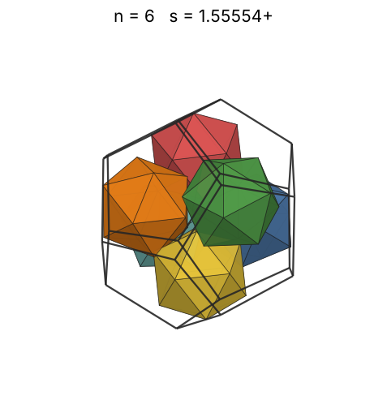 |
| 7 | [1.66853+](icoindod_n07.json) | 1.668531743486 |  | 1.25843 | 0.4290 | 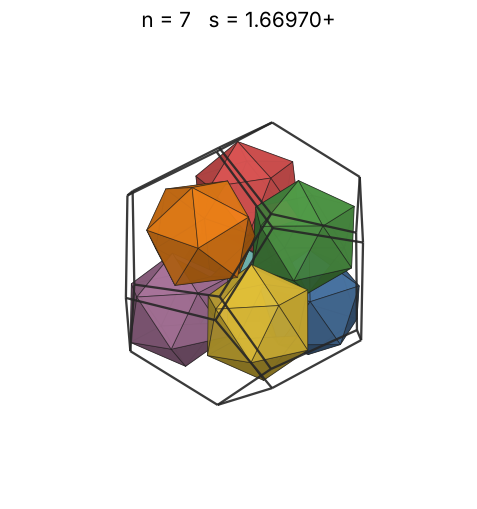 |
| 8 | [1.69778+](icoindod_n08.json) | 1.697789592378 |  | 1.31571 | 0.4654 | 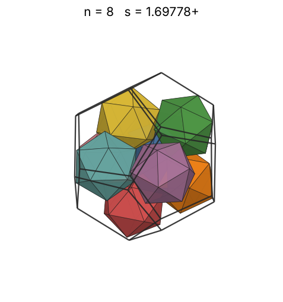 |
| 9 | [1.77163+](icoindod_n09.json) | 1.771633823380 |  | 1.36839 | 0.4608 | 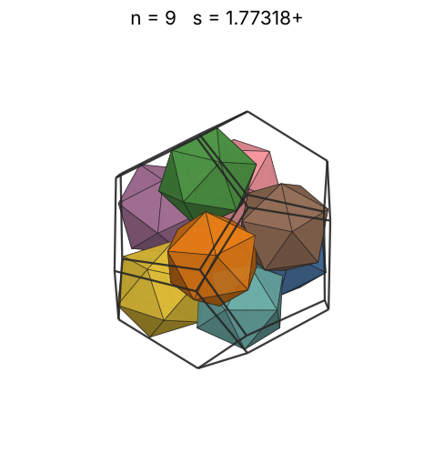 |
| 10 | [1.81821+](icoindod_n10.json) | 1.818214648381 |  | 1.41730 | 0.4736 | 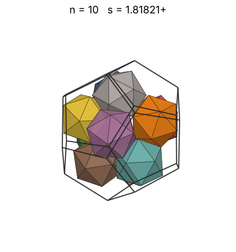 |
| 11 | [1.86714+](icoindod_n11.json) | 1.867141627329 |  | 1.46305 | 0.4811 | 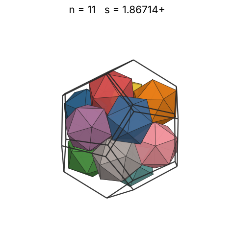 |
| 12 | [1.87422+](icoindod_n12.json) | 1.874220982554 |  | 1.50611 | 0.5189 | 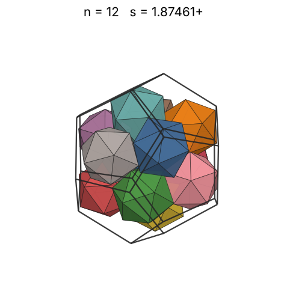 |
| 13 | [1.90402+](icoindod_n13.json) | 1.904024516913 |  | 1.54683 | 0.5362 | 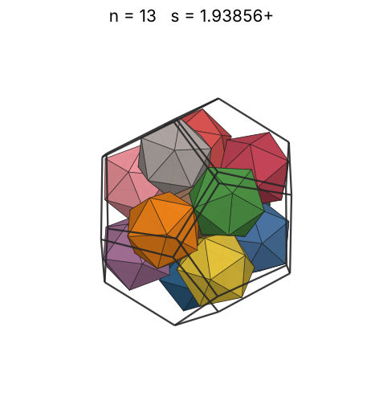 |
| 14 | [1.97107+](icoindod_n14.json) | 1.971077254485 |  | 1.58552 | 0.5205 | 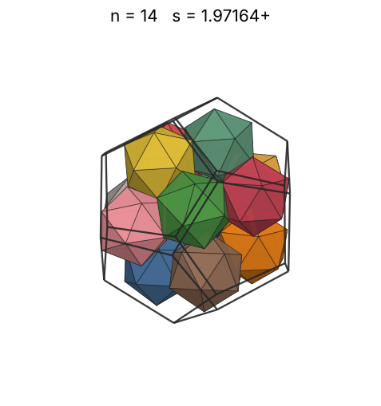 |
| 15 | [2.00000+](icoindod_n15.json) | 2.000000000000 | 2 | 1.62241 | 0.5338 | 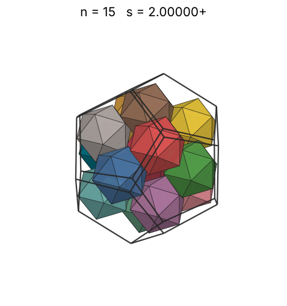 |
| 16 | [2.05510+](icoindod_n16.json) | 2.055105811967 |  | 1.65769 | 0.5248 | 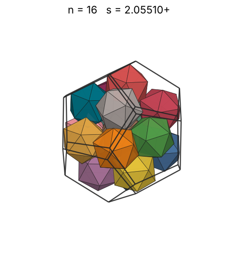 |
| 17 | [2.09085+](icoindod_n17.json) | 2.090857347078 |  | 1.69153 | 0.5295 | 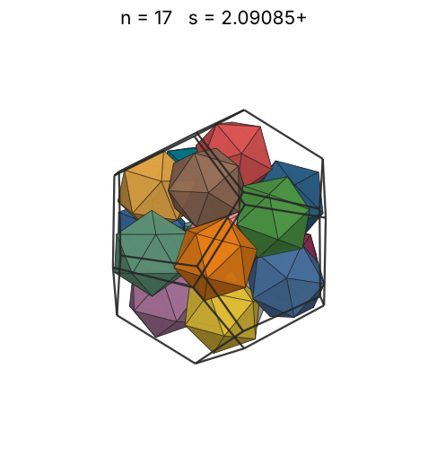 |
| 18 | [2.16215+](icoindod_n18.json) | 2.162158407110 |  | 1.72407 | 0.5070 | 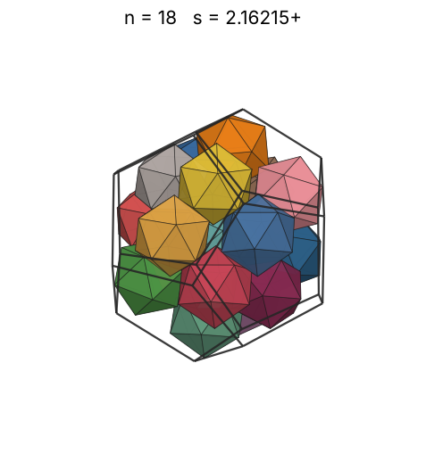 |
| 19 | [2.20355+](icoindod_n19.json) | 2.203558534579 |  | 1.75542 | 0.5056 | 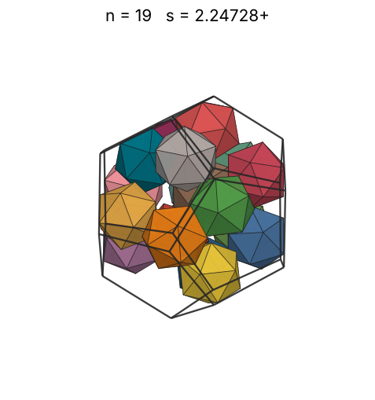 |
| 20 | [2.24176+](icoindod_n20.json) | 2.241765564872 |  | 1.78569 | 0.5054 | 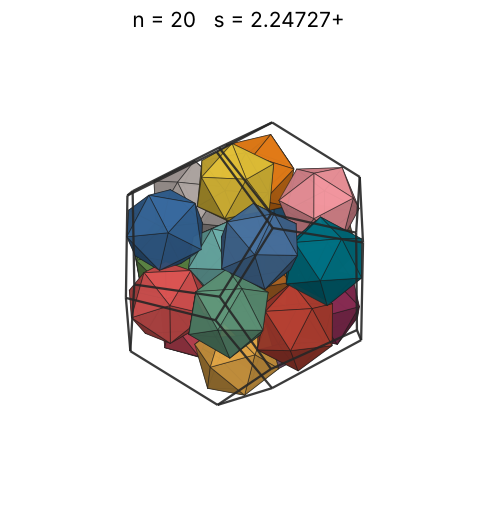 |
| 21 | [2.28370+](icoindod_n21.json) | 2.283706171749 |  | 1.81497 | 0.5020 | 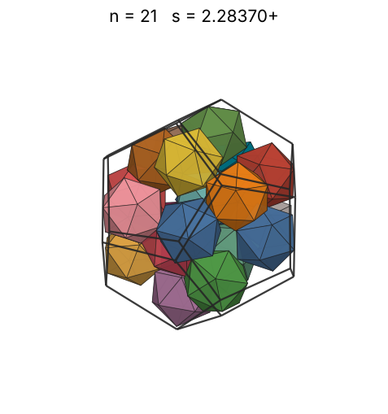 |
| 22 | [2.29459+](icoindod_n22.json) | 2.294591676214 |  | 1.84333 | 0.5184 | 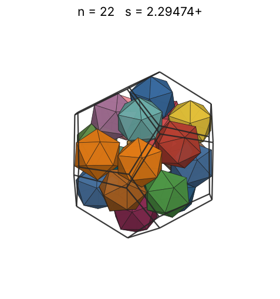 |
| 23 | [2.34871+](icoindod_n23.json) | 2.348719378147 |  | 1.87085 | 0.5054 | 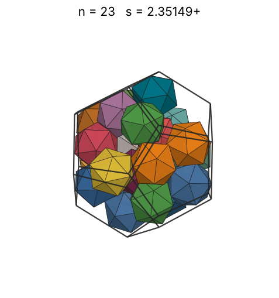 |
| 24 | [2.36541+](icoindod_n24.json) | 2.365414149134 |  | 1.89758 | 0.5163 | 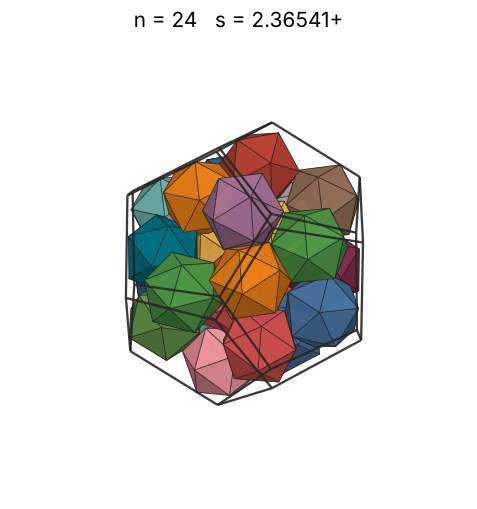 |
| 25 | [2.39258+](icoindod_n25.json) | 2.392585780127 |  | 1.92358 | 0.5197 | 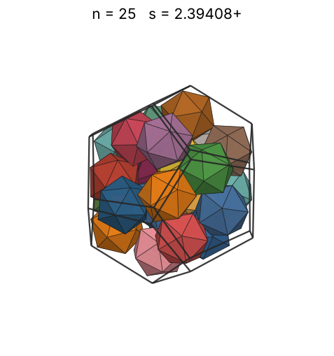 |
| 26 | [2.42244+](icoindod_n26.json) | 2.422443917330 |  | 1.94889 | 0.5207 | 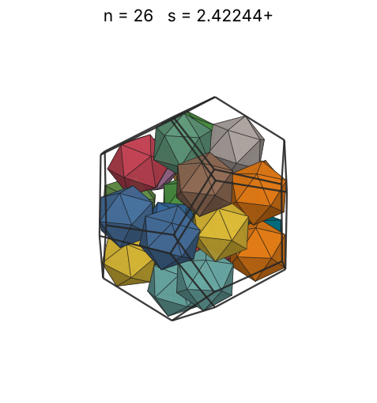 |
| 27 | [2.44475+](icoindod_n27.json) | 2.444756594137 |  | 1.97356 | 0.5261 | 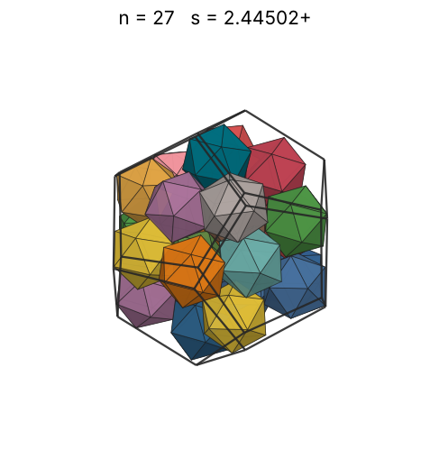 |
| 28 | [2.46823+](icoindod_n28.json) | 2.468239253292 |  | 1.99763 | 0.5301 | 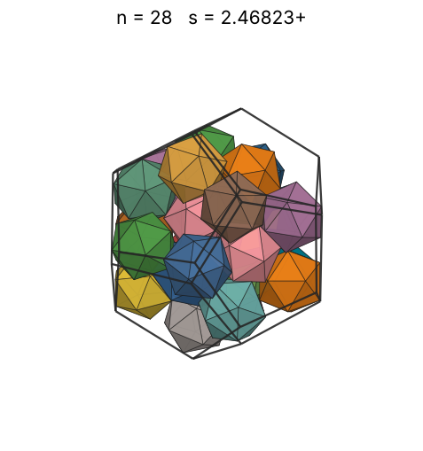 |
| 29 | [2.47572+](icoindod_n29.json) | 2.475721824275 |  | 2.02114 | 0.5441 | 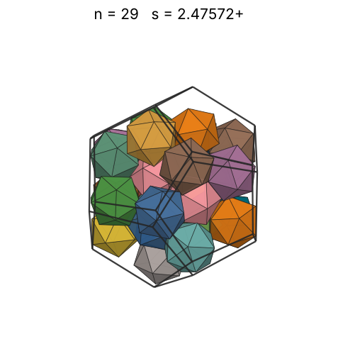 |
| 30 | [2.49070+](icoindod_n30.json) | 2.490703659145 |  | 2.04411 | 0.5528 | 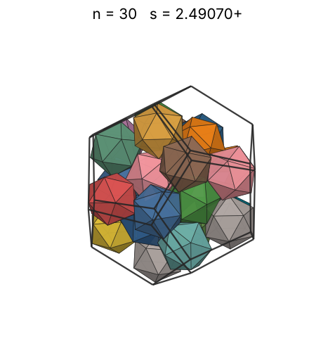 |
| 31 | [2.50914+](icoindod_n31.json) | 2.509148055630 |  | 2.06657 | 0.5587 | 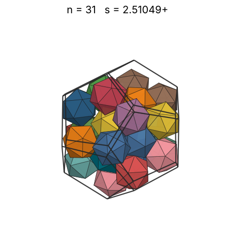 |
| 32 | [2.52216+](icoindod_n32.json) | 2.522169236193 |  | 2.08856 | 0.5678 | 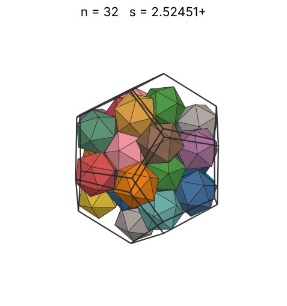 |
| 33 | [2.53601+](icoindod_n33.json) | 2.536010737801 |  | 2.11009 | 0.5760 | 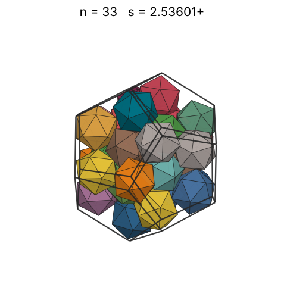 |
| 34 | [2.58115+](icoindod_n34.json) | 2.581151923699 |  | 2.13119 | 0.5629 | 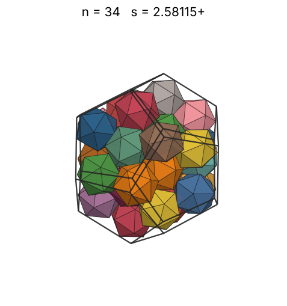 |
| 35 | [2.62753+](icoindod_n35.json) | 2.627530523019 |  | 2.15188 | 0.5493 | 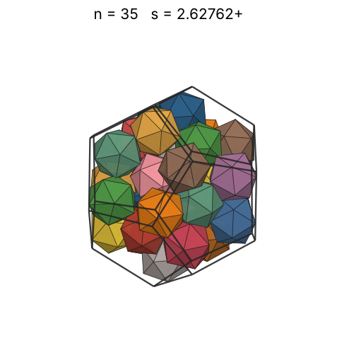 |
| 36 | [2.67096+](icoindod_n36.json) | 2.670961403663 |  | 2.17219 | 0.5379 | 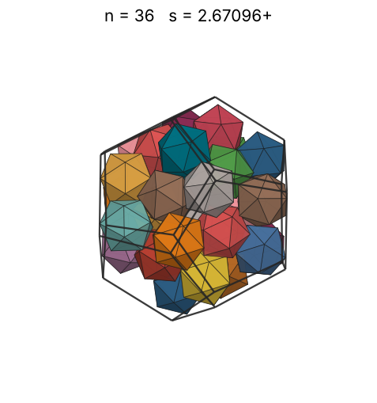 |
| 37 | [2.68581+](icoindod_n37.json) | 2.685818954080 |  | 2.19212 | 0.5437 | 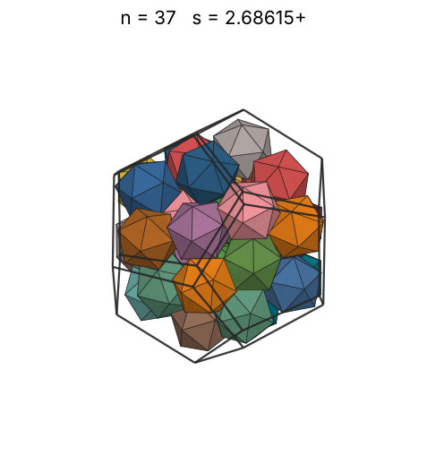 |
| 38 | [2.69655+](icoindod_n38.json) | 2.696558932760 |  | 2.21169 | 0.5517 | 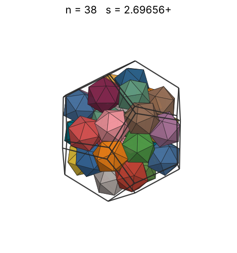 |
| 39 | [2.72805+](icoindod_n39.json) | 2.728053881504 |  | 2.23092 | 0.5469 | 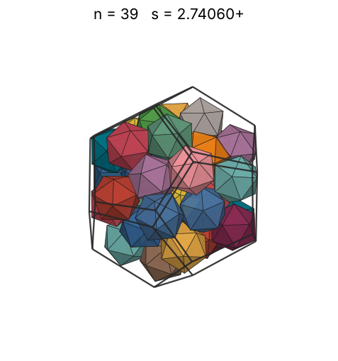 |
| 40 | [2.74184+](icoindod_n40.json) | 2.741841748654 |  | 2.24983 | 0.5525 | 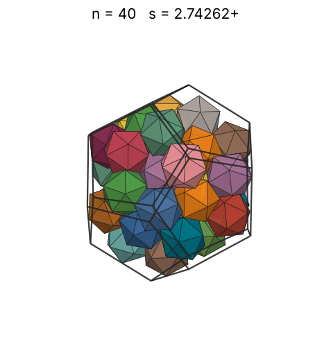 |
| 41 | [2.75334+](icoindod_n41.json) | 2.753346872123 |  | 2.26842 | 0.5592 |  |
| 42 | [2.79183+](icoindod_n42.json) | 2.791829982814 |  | 2.28672 | 0.5495 |  |
| 43 | [2.80895+](icoindod_n43.json) | 2.808951731284 |  | 2.30472 | 0.5524 |  |
| 44 | [2.83489+](icoindod_n44.json) | 2.834892354085 |  | 2.32245 | 0.5498 |  |
| 45 | [2.85393+](icoindod_n45.json) | 2.853936806417 |  | 2.33992 | 0.5511 |  |
| 46 | [2.88406+](icoindod_n46.json) | 2.884059938891 |  | 2.35712 | 0.5459 |  |
| 47 | [2.89596+](icoindod_n47.json) | 2.895965541421 |  | 2.37408 | 0.5509 |  |
| 48 | [2.91933+](icoindod_n48.json) | 2.919332022133 |  | 2.39080 | 0.5493 |  |
| 49 | [2.94019+](icoindod_n49.json) | 2.940196274798 |  | 2.40729 | 0.5489 |  |
| 50 | [2.94823+](icoindod_n50.json) | 2.948232341939 |  | 2.42355 | 0.5555 |  |
| 51 | [2.97207+](icoindod_n51.json) | 2.972071111944 |  | 2.43961 | 0.5531 |  |
| 52 | [2.99335+](icoindod_n52.json) | 2.993358847463 |  | 2.45545 | 0.5520 |  |
| 53 | [2.99714+](icoindod_n53.json) | 2.997146085354 |  | 2.47109 | 0.5605 |  |
| 54 | [3.01843+](icoindod_n54.json) | 3.018430851320 |  | 2.48653 | 0.5590 |  |
| 55 | [3.03097+](icoindod_n55.json) | 3.030976339423 |  | 2.50179 | 0.5623 |  |
| 56 | [3.04006+](icoindod_n56.json) | 3.040066953052 |  | 2.51686 | 0.5674 |  |
| 57 | [3.04325+](icoindod_n57.json) | 3.043259444690 |  | 2.53175 | 0.5758 |  |
| 58 | [3.07123+](icoindod_n58.json) | 3.071230075892 |  | 2.54647 | 0.5700 |  |
| 59 | [3.09613+](icoindod_n59.json) | 3.096130221105 |  | 2.56102 | 0.5660 |  |
| 60 | [3.09731+](icoindod_n60.json) | 3.097314067553 |  | 2.57541 | 0.5749 |  |
| 61 | [3.16285+](icoindod_n61.json) | 3.162858263959 |  | 2.58964 | 0.5489 |  |
| 62 | [3.18154+](icoindod_n62.json) | 3.181545383842 |  | 2.60371 | 0.5481 |  |
| 63 | [3.18311+](icoindod_n63.json) | 3.183115805725 |  | 2.61764 | 0.5561 |  |
| 64 | [3.19209+](icoindod_n64.json) | 3.192090623692 |  | 2.63142 | 0.5602 |  |
| 65 | [3.23121+](icoindod_n65.json) | 3.231218121830 |  | 2.64505 | 0.5485 |  |
| 66 | [3.24707+](icoindod_n66.json) | 3.247075964568 |  | 2.65855 | 0.5489 |  |
| 67 | [3.27954+](icoindod_n67.json) | 3.279549260992 |  | 2.67191 | 0.5408 |  |
| 68 | [3.29509+](icoindod_n68.json) | 3.295090474949 |  | 2.68513 | 0.5411 |  |
| 69 | [3.32327+](icoindod_n69.json) | 3.323275366565 |  | 2.69823 | 0.5352 |  |
| 70 | [3.32588+](icoindod_n70.json) | 3.325884401437 |  | 2.71120 | 0.5417 |  |
| 71 | [3.33352+](icoindod_n71.json) | 3.333527081063 |  | 2.72405 | 0.5457 |  |
| 72 | [3.35448+](icoindod_n72.json) | 3.354485814723 |  | 2.73678 | 0.5431 |  |
| 73 | [3.35450+](icoindod_n73.json) | 3.354503402141 |  | 2.74939 | 0.5506 |  |
| 74 | [3.42676+](icoindod_n74.json) | 3.426763979909 |  | 2.76189 | 0.5236 |  |
| 75 | [3.43211+](icoindod_n75.json) | 3.432118011852 |  | 2.77428 | 0.5282 |  |
| 76 | [3.44638+](icoindod_n76.json) | 3.446385083896 |  | 2.78655 | 0.5286 |  |
| 77 | [3.46954+](icoindod_n77.json) | 3.469548623810 |  | 2.79872 | 0.5249 |  |
| 78 | [3.48096+](icoindod_n78.json) | 3.480965375640 |  | 2.81079 | 0.5265 |  |
| 79 | [3.48703+](icoindod_n79.json) | 3.487032861819 |  | 2.82275 | 0.5305 |  |
| 80 | [3.48703+](icoindod_n80.json) | 3.487032864646 |  | 2.83461 | 0.5372 |  |
| 81 | [3.48789+](icoindod_n81.json) | 3.487899127187 |  | 2.84637 | 0.5435 |  |
| 82 | [3.50008+](icoindod_n82.json) | 3.500087691123 |  | 2.85803 | 0.5445 |  |
| 83 | [3.50257+](icoindod_n83.json) | 3.502576053836 |  | 2.86961 | 0.5499 |  |
| 84 | [3.50626+](icoindod_n84.json) | 3.506262852159 |  | 2.88108 | 0.5548 |  |
| 85 | [3.51123+](icoindod_n85.json) | 3.511238945911 |  | 2.89247 | 0.5590 |  |
| 86 | [3.51577+](icoindod_n86.json) | 3.515777697242 |  | 2.90377 | 0.5634 |  |
| 87 | [3.53163+](icoindod_n87.json) | 3.531630048251 |  | 2.91498 | 0.5623 |  |
| 88 | [3.57462+](icoindod_n88.json) | 3.574623966034 |  | 2.92611 | 0.5485 |  |
| 89 | [3.58747+](icoindod_n89.json) | 3.587474102524 |  | 2.93715 | 0.5488 |  |
| 90 | [3.59167+](icoindod_n90.json) | 3.591675505846 |  | 2.94811 | 0.5530 |  |
| 91 | [3.59167+](icoindod_n91.json) | 3.591675505846 |  | 2.95899 | 0.5592 |  |
| 92 | [3.62229+](icoindod_n92.json) | 3.622298155021 |  | 2.96979 | 0.5511 |  |
| 93 | [3.62229+](icoindod_n93.json) | 3.622298155021 |  | 2.98051 | 0.5571 |  |
| 94 | [3.63875+](icoindod_n94.json) | 3.638757642721 |  | 2.99115 | 0.5555 |  |
| 95 | [3.63875+](icoindod_n95.json) | 3.638757642980 |  | 3.00172 | 0.5614 |  |
| 96 | [3.66610+](icoindod_n96.json) | 3.666102447054 |  | 3.01222 | 0.5547 |  |
| 97 | [3.66610+](icoindod_n97.json) | 3.666102447229 |  | 3.02264 | 0.5605 |  |
| 98 | [3.67233+](icoindod_n98.json) | 3.672333640862 |  | 3.03299 | 0.5634 |  |
| 99 | [3.67978+](icoindod_n99.json) | 3.679782535350 |  | 3.04328 | 0.5657 |  |
| 100 | [3.71647+](icoindod_n100.json) | 3.716476890003 |  | 3.05349 | 0.5546 |  |
