# Icosahedra in an icosahedron

s = container edge / piece edge; every row certified in exact arithmetic.

| n | s | touching limit | closed form (conj.) | previous best | volume bound | density | picture |
|---|---|---|---|---|---|---|---|
| 2 | [1.96308+](icoinico_n02.json) | 1.963086047134 |  |  | 1.25992 | 0.2644 | 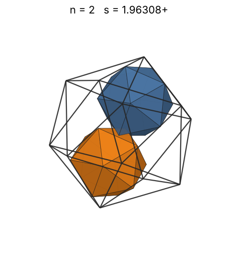 |
| 3 | [2.00000+](icoinico_n03.json) | 2.000000000000 | 2 |  | 1.44225 | 0.3750 | 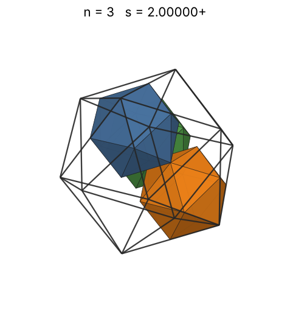 |
| 4 | [2.14589+](icoinico_n04.json) | 2.145898033750 | (11 - 3√5)/2 |  | 1.58740 | 0.4048 | 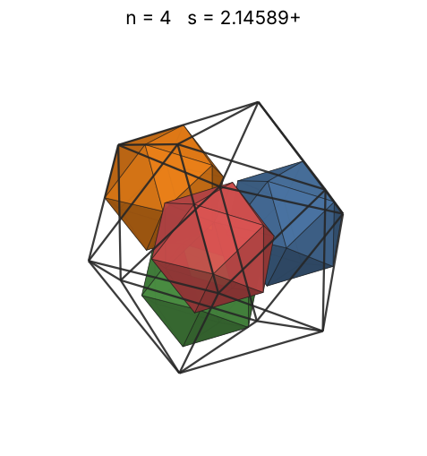 |
| 5 | [2.23606+](icoinico_n05.json) | 2.236067977500 | √5 |  | 1.70998 | 0.4472 | 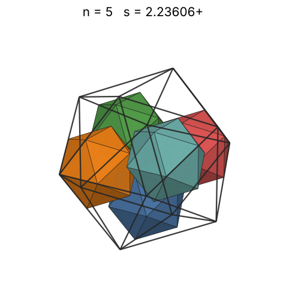 |
| 6 | [2.34164+](icoinico_n06.json) | 2.341640786500 | (5 + 3√5)/5 |  | 1.81712 | 0.4673 | 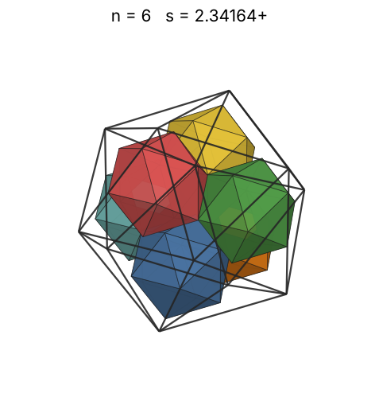 |
| 7 | [2.44931+](icoinico_n07.json) | 2.449316020430 | (149 + 67√5)/122 |  | 1.91293 | 0.4764 | 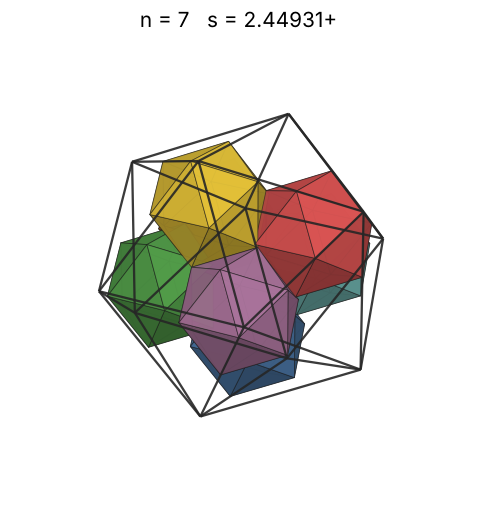 |
| 8 | [2.49661+](icoinico_n08.json) | 2.496616826734 | (81 + 33√5)/62 |  | 2.00000 | 0.5141 | 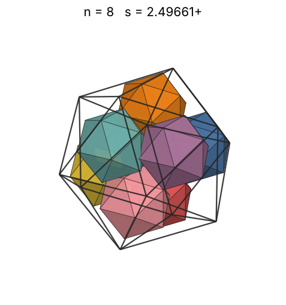 |
| 9 | [2.58359+](icoinico_n09.json) | 2.583592135001 | 16 - 6√5 |  | 2.08008 | 0.5219 | 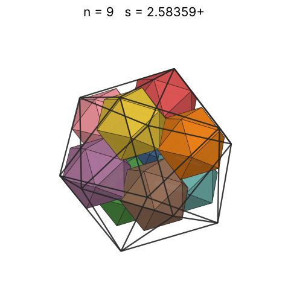 |
| 10 | [2.60989+](icoinico_n10.json) | 2.609892623656 |  |  | 2.15443 | 0.5625 | 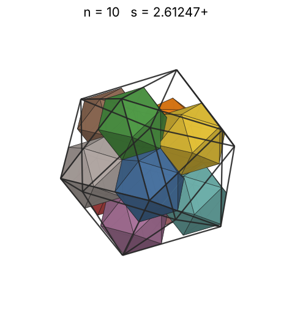 |
| 11 | [2.61803+](icoinico_n11.json) | 2.618033988750 | (3 + √5)/2 |  | 2.22398 | 0.6130 | 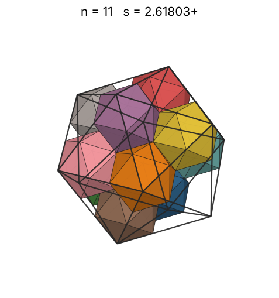 |
| 12 | [2.61803+](icoinico_n12.json) | 2.618033988750 | (3 + √5)/2 |  | 2.28943 | 0.6687 | 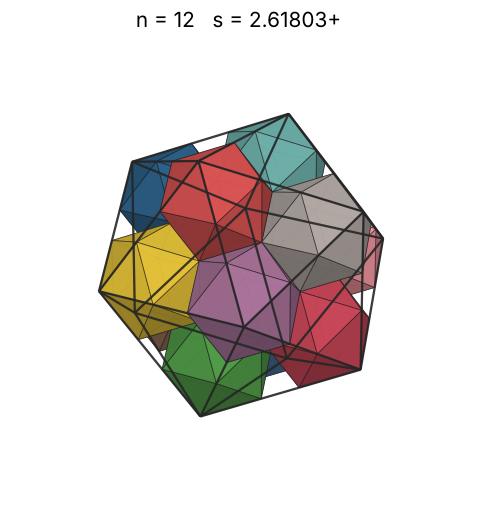 |
| 13 | [2.80901+](icoinico_n13.json) | 2.809016994375 | (9 + √5)/4 |  | 2.35133 | 0.5865 | 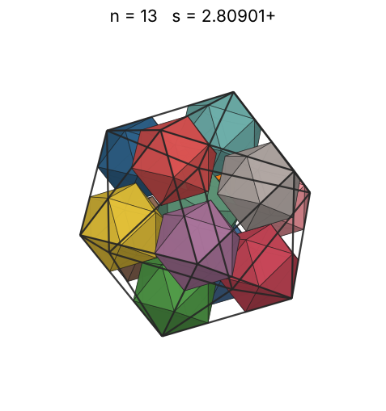 |
| 14 | [3.01780+](icoinico_n14.json) | 3.017801685357 |  |  | 2.41014 | 0.5094 | 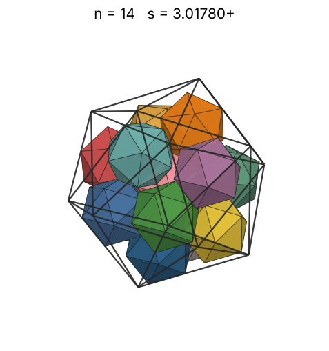 |
| 15 | [3.04832+](icoinico_n15.json) | 3.048320931579 |  |  | 2.46621 | 0.5296 | 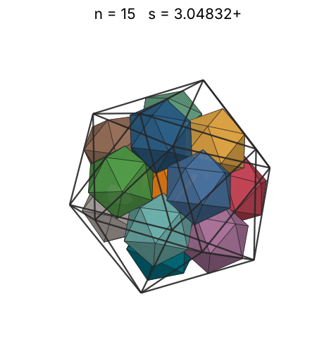 |
| 16 | [3.12130+](icoinico_n16.json) | 3.121305114637 |  |  | 2.51984 | 0.5262 | 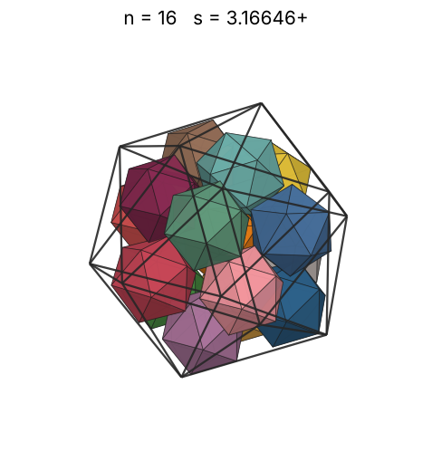 |
| 17 | [3.20237+](icoinico_n17.json) | 3.202372634829 |  |  | 2.57128 | 0.5176 | 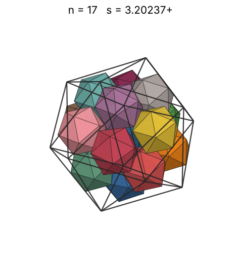 |
| 18 | [3.23780+](icoinico_n18.json) | 3.237804441446 |  |  | 2.62074 | 0.5303 | 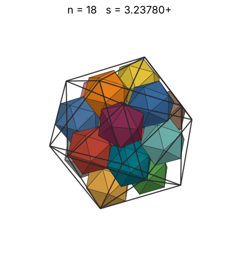 |
| 19 | [3.31401+](icoinico_n19.json) | 3.314013348982 |  |  | 2.66840 | 0.5220 | 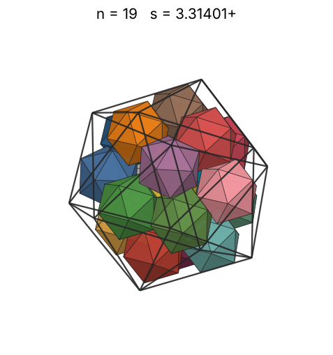 |
| 20 | [3.35994+](icoinico_n20.json) | 3.359948583393 |  |  | 2.71442 | 0.5273 | 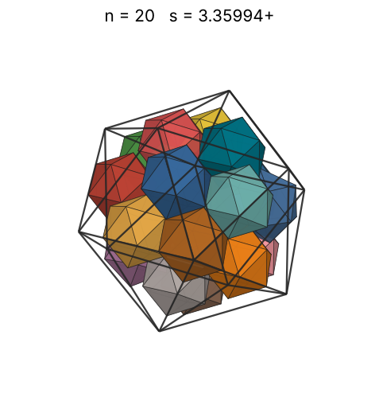 |
| 21 | [3.40705+](icoinico_n21.json) | 3.407051990028 |  |  | 2.75892 | 0.5310 | 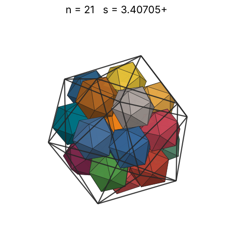 |
| 22 | [3.49174+](icoinico_n22.json) | 3.491741777447 |  |  | 2.80204 | 0.5168 | 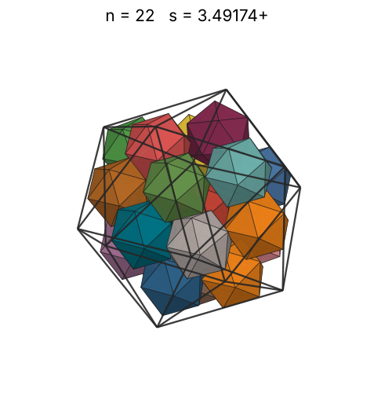 |
| 23 | [3.56688+](icoinico_n23.json) | 3.566882454614 |  |  | 2.84387 | 0.5068 | 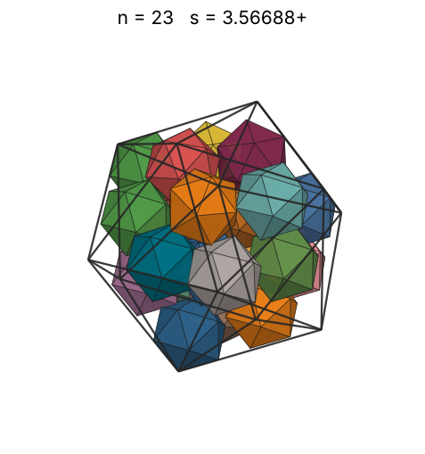 |
| 24 | [3.60039+](icoinico_n24.json) | 3.600396889307 |  |  | 2.88450 | 0.5142 | 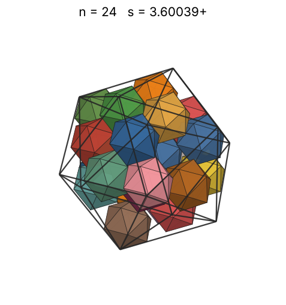 |
| 25 | [3.61400+](icoinico_n25.json) | 3.614000649032 |  |  | 2.92402 | 0.5296 | 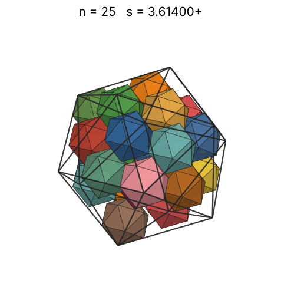 |
| 26 | [3.67648+](icoinico_n26.json) | 3.676487428080 |  |  | 2.96250 | 0.5232 | 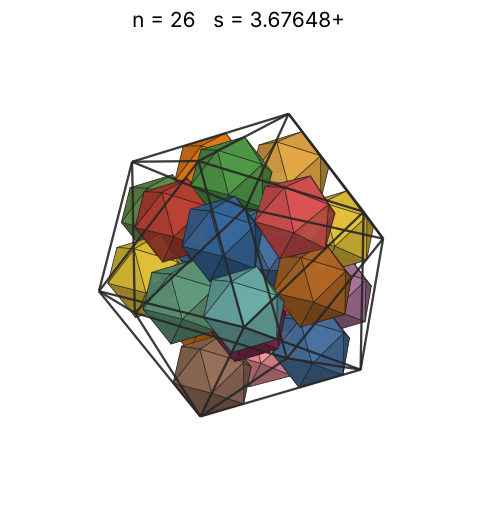 |
| 27 | [3.75395+](icoinico_n27.json) | 3.753955905608 |  |  | 3.00000 | 0.5104 | 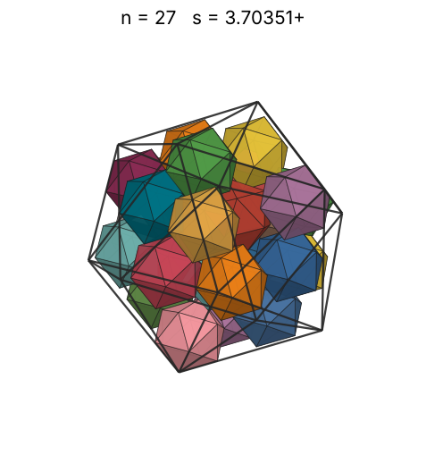 |
| 28 | [3.78010+](icoinico_n28.json) | 3.780108547805 |  |  | 3.03659 | 0.5184 | 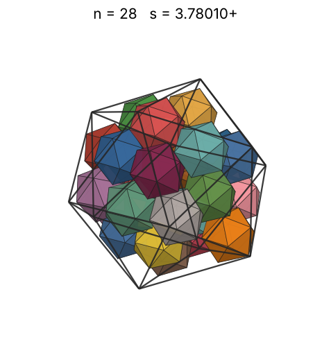 |
| 29 | [3.80425+](icoinico_n29.json) | 3.804259343309 |  |  | 3.07232 | 0.5267 | 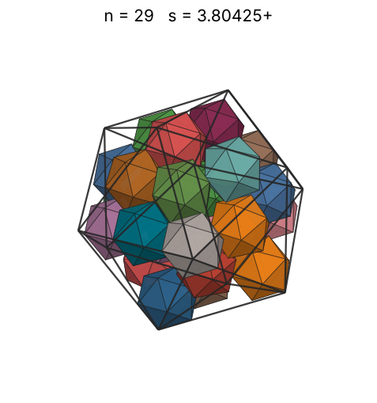 |
| 30 | [3.84772+](icoinico_n30.json) | 3.847723545485 |  |  | 3.10723 | 0.5266 | 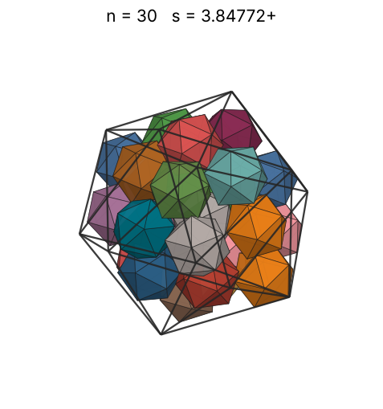 |
| 31 | [3.88746+](icoinico_n31.json) | 3.887459813678 |  |  | 3.14138 | 0.5277 | 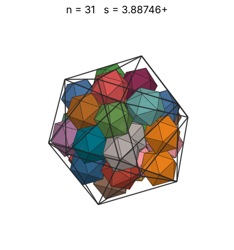 |
| 32 | [3.92699+](icoinico_n32.json) | 3.926991415631 |  |  | 3.17480 | 0.5284 | 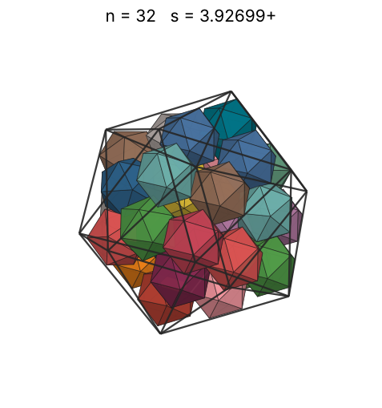 |
| 33 | [3.96775+](icoinico_n33.json) | 3.967754745339 |  |  | 3.20753 | 0.5283 | 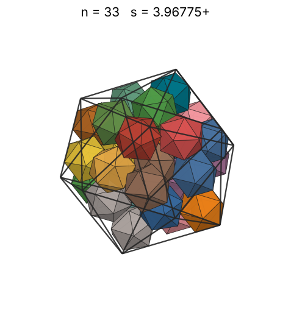 |
| 34 | [3.99416+](icoinico_n34.json) | 3.994167782259 |  |  | 3.23961 | 0.5336 | 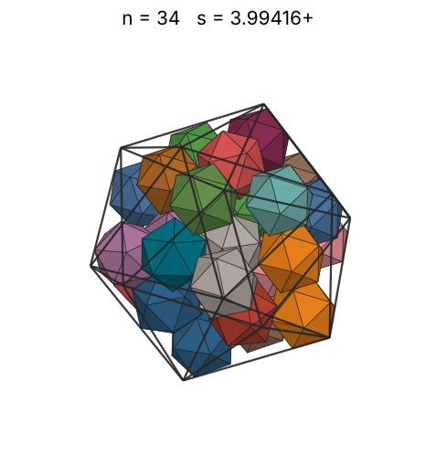 |
| 35 | [4.00571+](icoinico_n35.json) | 4.005713745472 |  |  | 3.27107 | 0.5445 | 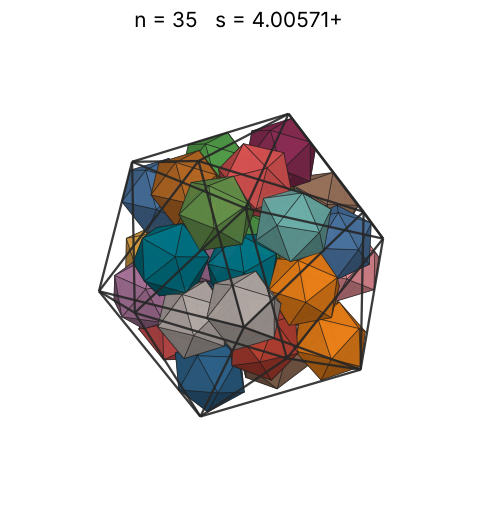 |
| 36 | [4.02423+](icoinico_n36.json) | 4.024232621365 |  |  | 3.30193 | 0.5524 | 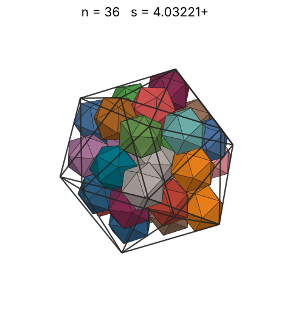 |
| 37 | [4.06882+](icoinico_n37.json) | 4.068824041045 |  |  | 3.33222 | 0.5493 | 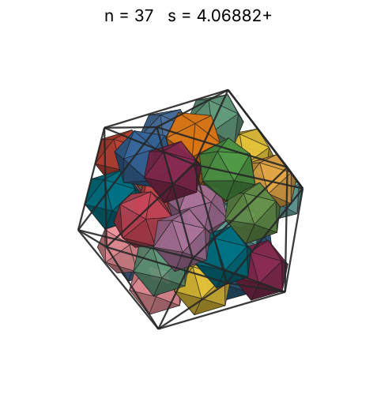 |
| 38 | [4.08849+](icoinico_n38.json) | 4.088498161143 |  |  | 3.36198 | 0.5560 | 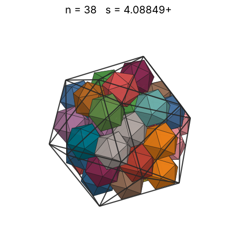 |
| 39 | [4.09440+](icoinico_n39.json) | 4.094403582185 |  |  | 3.39121 | 0.5682 | 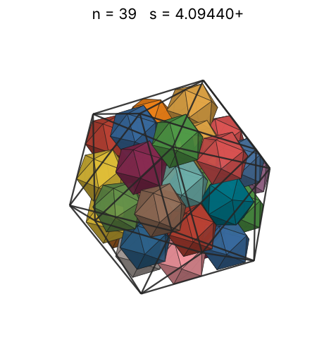 |
| 40 | [4.15077+](icoinico_n40.json) | 4.150778586103 |  |  | 3.41995 | 0.5593 | 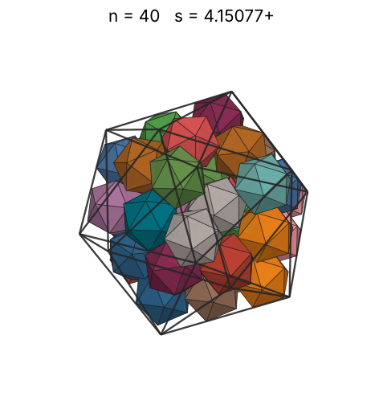 |
