# Octahedra in a cube

s = container edge / piece edge; every row certified in exact arithmetic.

| n | s | touching limit | closed form (conj.) | previous best | volume bound | density | picture |
|---|---|---|---|---|---|---|---|
| 2 | [1.41421+](octincub_n02.json) | 1.414213562373 | √2 |  | 0.98056 | 0.3333 | 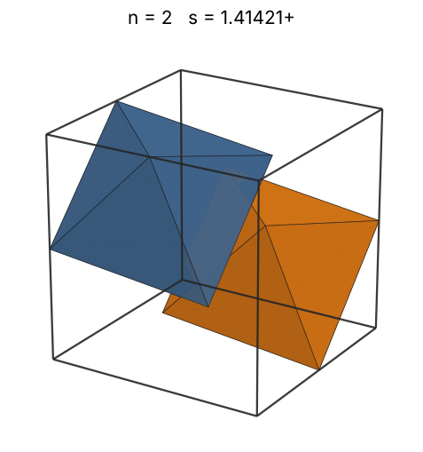 |
| 3 | [1.63634+](octincub_n03.json) | 1.636341178385 |  |  | 1.12246 | 0.3228 | 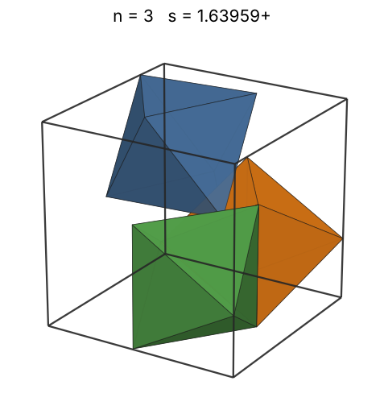 |
| 4 | [1.64991+](octincub_n04.json) | 1.649915822769 | (7√2)/6 |  | 1.23543 | 0.4198 | 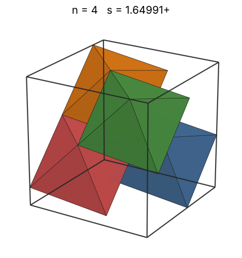 |
| 5 | [1.75859+](octincub_n05.json) | 1.758593095449 |  |  | 1.33083 | 0.4334 | 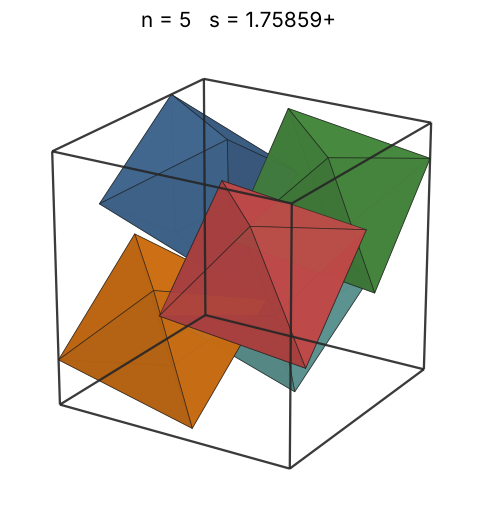 |
| 6 | [1.78599+](octincub_n06.json) | 1.785998586257 |  |  | 1.41421 | 0.4965 | 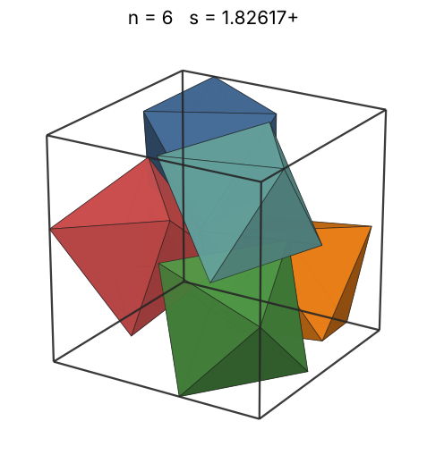 |
| 7 | [1.79133+](octincub_n07.json) | 1.791337179006 |  |  | 1.48878 | 0.5741 | 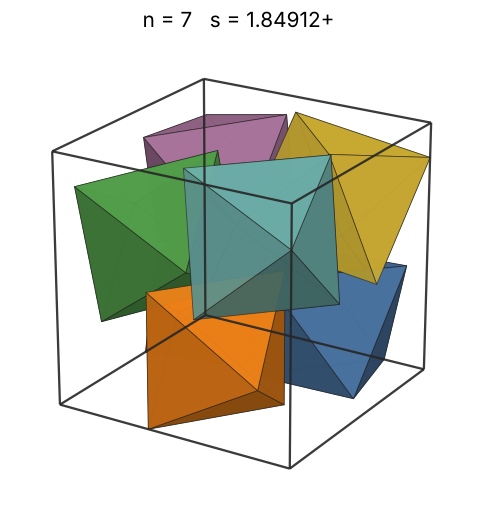 |
| 8 | [1.79133+](octincub_n08.json) | 1.791337179006 |  |  | 1.55654 | 0.6561 | 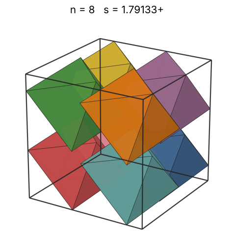 |
| 9 | [1.88561+](octincub_n09.json) | 1.885618083164 | (4√2)/3 |  | 1.61887 | 0.6328 | 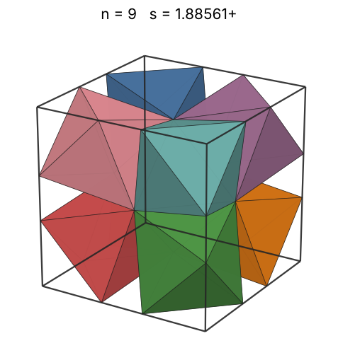 |
| 10 | [2.14936+](octincub_n10.json) | 2.149365928974 |  |  | 1.67674 | 0.4747 | 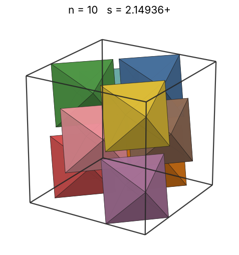 |
| 11 | [2.23853+](octincub_n11.json) | 2.238530698344 |  |  | 1.73086 | 0.4623 | 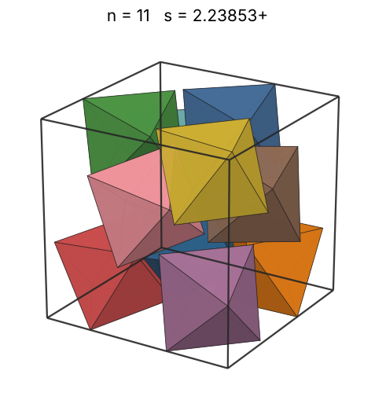 |
| 12 | [2.29536+](octincub_n12.json) | 2.295361692277 |  |  | 1.78180 | 0.4678 | 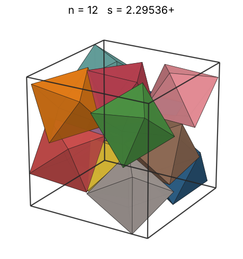 |
| 13 | [2.34424+](octincub_n13.json) | 2.344243982490 |  |  | 1.82998 | 0.4757 | 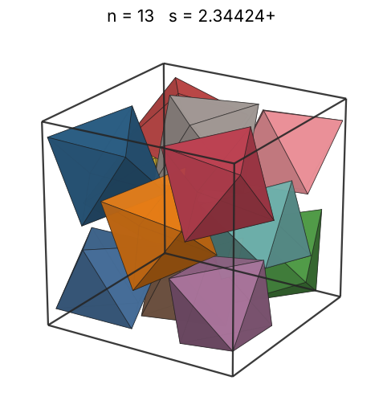 |
| 14 | [2.37154+](octincub_n14.json) | 2.371547018911 |  |  | 1.87575 | 0.4948 | 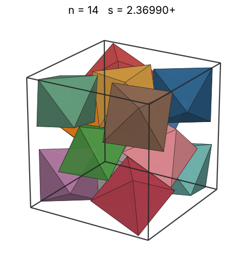 |
| 15 | [2.45186+](octincub_n15.json) | 2.451868246517 |  |  | 1.91938 | 0.4797 | 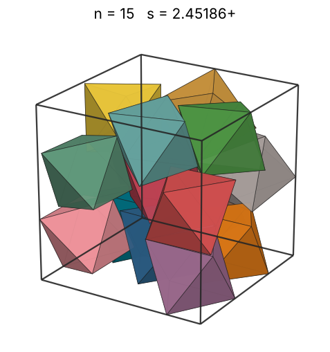 |
| 16 | [2.47676+](octincub_n16.json) | 2.476762037919 |  |  | 1.96112 | 0.4964 | 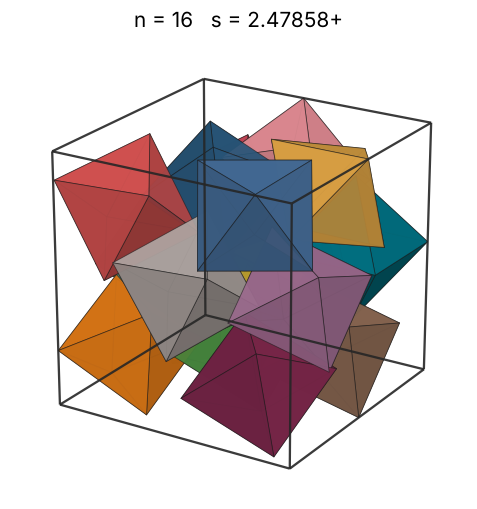 |
| 17 | [2.50659+](octincub_n17.json) | 2.506598266404 |  |  | 2.00116 | 0.5088 | 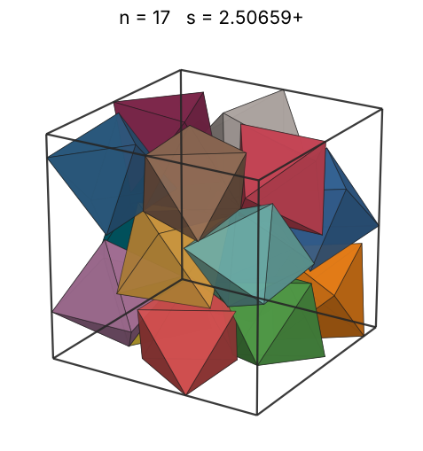 |
| 18 | [2.52117+](octincub_n18.json) | 2.521171789333 |  |  | 2.03965 | 0.5295 | 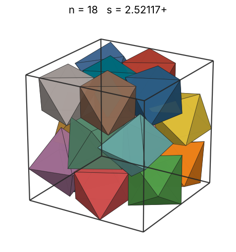 |
| 19 | [2.57590+](octincub_n19.json) | 2.575905312202 |  |  | 2.07674 | 0.5240 | 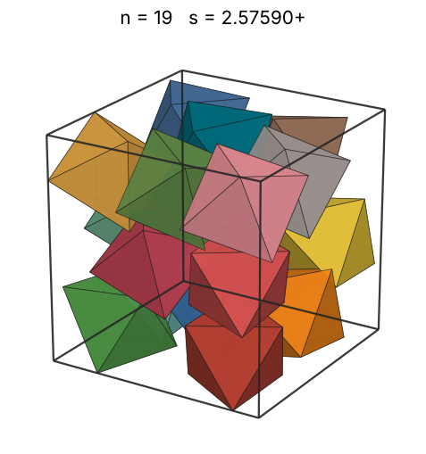 |
| 20 | [2.59027+](octincub_n20.json) | 2.590275986082 |  |  | 2.11255 | 0.5425 | 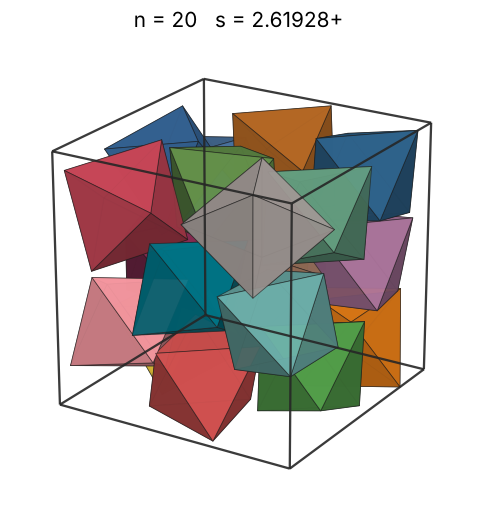 |
| 21 | [2.60666+](octincub_n21.json) | 2.606664499059 |  | 2.59285 (Hyra-results (Haowei Lin), 2026) | 2.14719 | 0.5589 | 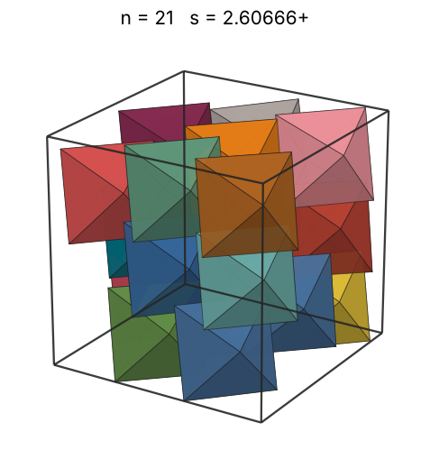 |
| 22 | [2.60792+](octincub_n22.json) | 2.607925893371 |  |  | 2.18075 | 0.5847 | 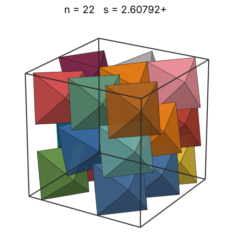 |
| 23 | [2.62562+](octincub_n23.json) | 2.625620410120 |  |  | 2.21330 | 0.5990 | 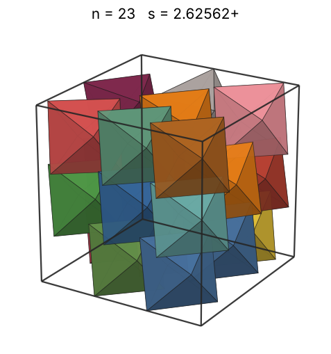 |
| 24 | [2.64498+](octincub_n24.json) | 2.644988914333 |  | 2.63319 (Hyra-results (Haowei Lin), 2026) | 2.24492 | 0.6114 | 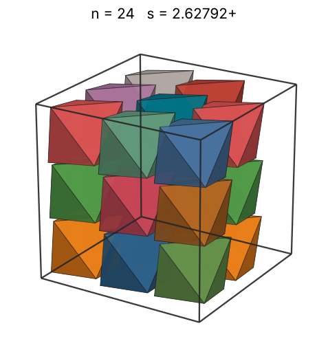 |
| 25 | [2.64532+](octincub_n25.json) | 2.645327422083 |  |  | 2.27568 | 0.6366 | 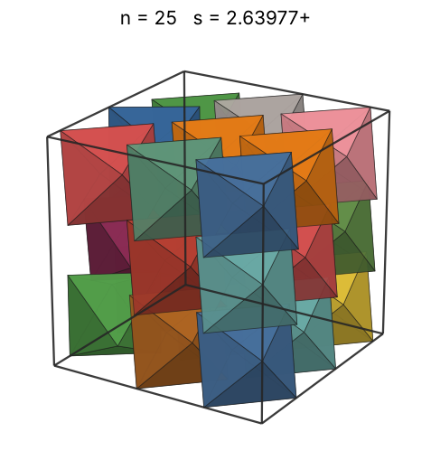 |
| 26 | [2.65155+](octincub_n26.json) | 2.651553782691 |  |  | 2.30563 | 0.6575 | 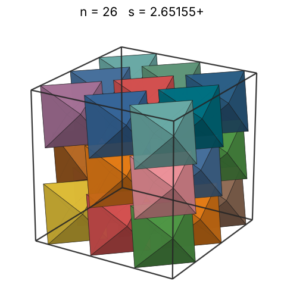 |
| 27 | [2.70076+](octincub_n27.json) | 2.700761987066 |  |  | 2.33482 | 0.6461 | 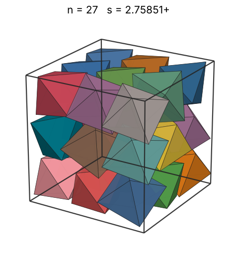 |
| 28 | [2.76264+](octincub_n28.json) | 2.762643720407 |  |  | 2.36329 | 0.6260 | 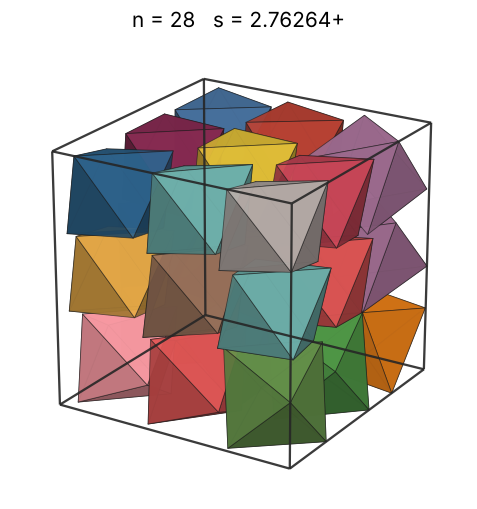 |
| 29 | [2.82842+](octincub_n29.json) | 2.828427124746 | 2√2 |  | 2.39110 | 0.6042 | 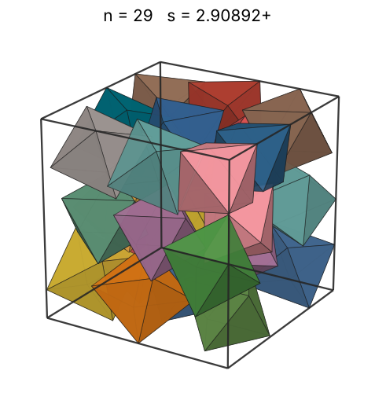 |
| 30 | [2.88782+](octincub_n30.json) | 2.887824248376 |  |  | 2.41827 | 0.5872 | 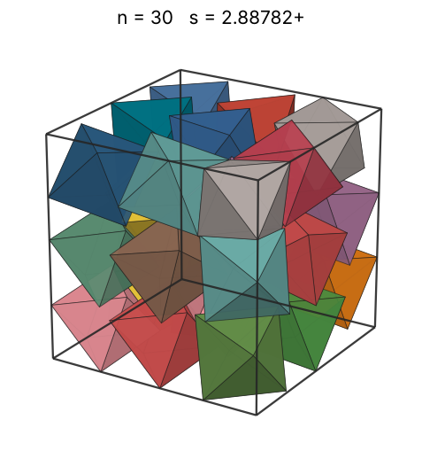 |
| 31 | [2.94302+](octincub_n31.json) | 2.943022766242 |  |  | 2.44485 | 0.5733 | 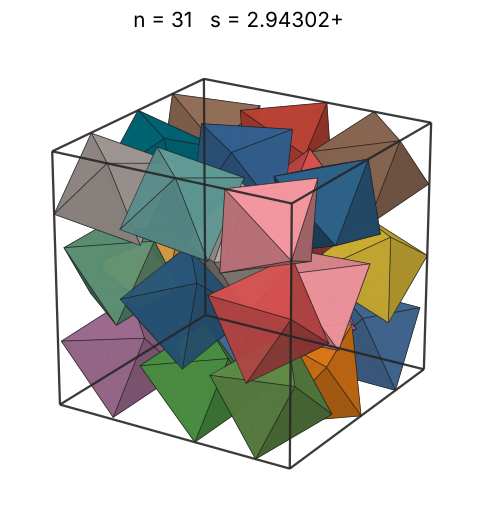 |
| 32 | [2.99416+](octincub_n32.json) | 2.994162461477 |  |  | 2.47086 | 0.5620 | 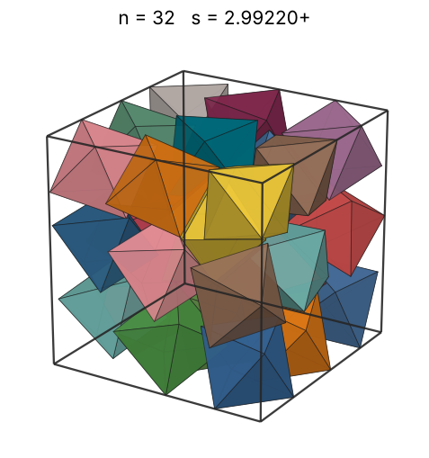 |
| 33 | [3.04674+](octincub_n33.json) | 3.046743745407 |  |  | 2.49633 | 0.5500 | 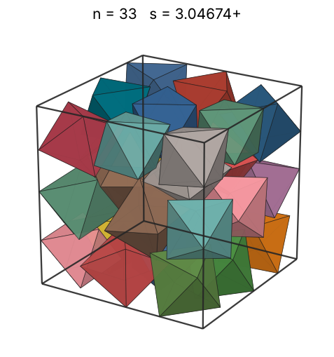 |
| 34 | [3.09101+](octincub_n34.json) | 3.091019174315 |  |  | 2.52130 | 0.5427 | 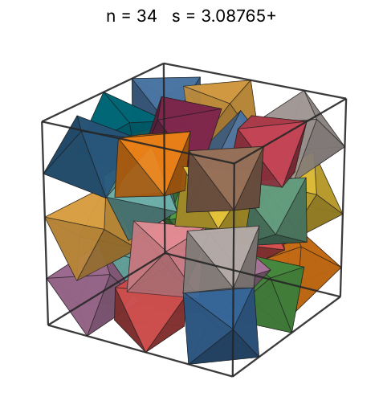 |
| 35 | [3.10262+](octincub_n35.json) | 3.102629148940 |  |  | 2.54578 | 0.5524 | 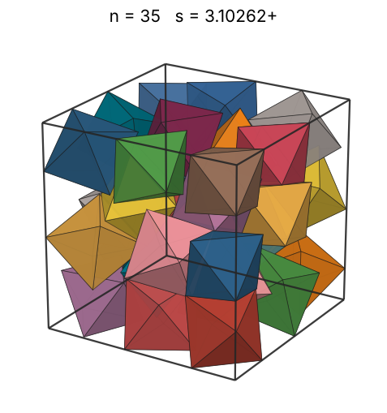 |
| 36 | [3.15126+](octincub_n36.json) | 3.151262011018 |  |  | 2.56980 | 0.5423 | 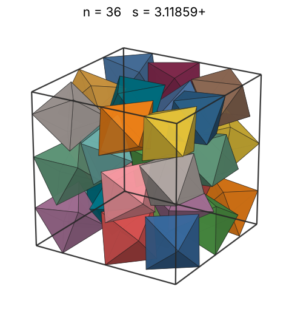 |
| 37 | [3.18243+](octincub_n37.json) | 3.182434158111 |  |  | 2.59337 | 0.5411 | 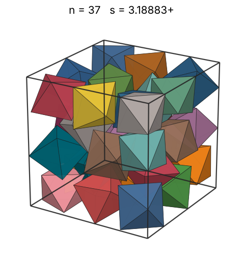 |
| 38 | [3.20488+](octincub_n38.json) | 3.204883079188 |  |  | 2.61653 | 0.5442 | 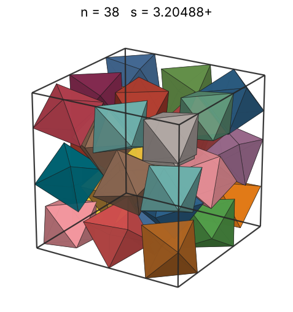 |
| 39 | [3.24327+](octincub_n39.json) | 3.243276892882 |  |  | 2.63928 | 0.5389 | 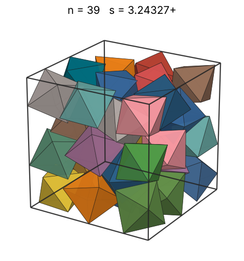 |
| 40 | [3.24737+](octincub_n40.json) | 3.247371586399 |  |  | 2.66165 | 0.5506 | 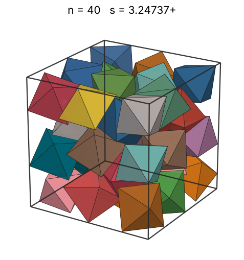 |
