# Octahedra in an icosahedron

s = container edge / piece edge; every row certified in exact arithmetic.

| n | s | touching limit | closed form (conj.) | volume bound | density | picture |
|---|---|---|---|---|---|---|
| 2 | [1.08036+](octinico_n02.json) | 1.080363093110 | √(28 - 12√5) | 0.75604 | 0.3427 | 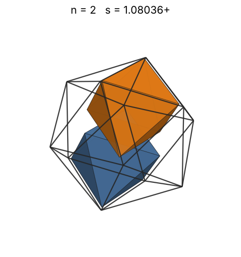 |
| 3 | [1.29397+](octinico_n03.json) | 1.293972680989 |  | 0.86545 | 0.2992 | 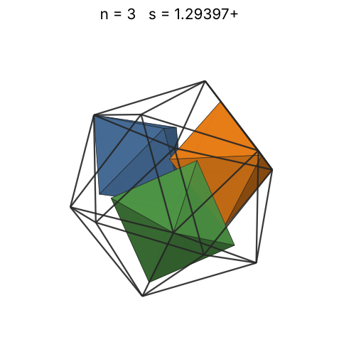 |
| 4 | [1.36155+](octinico_n04.json) | 1.361557615223 |  | 0.95255 | 0.3424 | 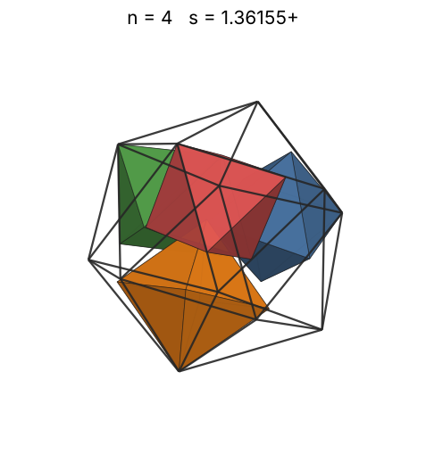 |
| 5 | [1.44205+](octinico_n05.json) | 1.442054869166 |  | 1.02610 | 0.3603 | 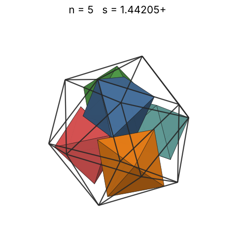 |
| 6 | [1.48797+](octinico_n06.json) | 1.487977365067 |  | 1.09039 | 0.3935 | 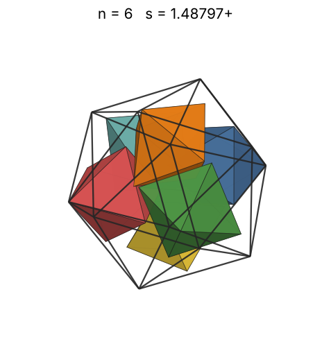 |
| 7 | [1.54934+](octinico_n07.json) | 1.549341331657 |  | 1.14789 | 0.4067 | 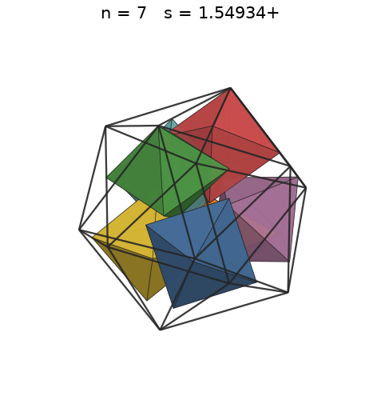 |
| 8 | [1.57136+](octinico_n08.json) | 1.571362567620 |  | 1.20013 | 0.4455 | 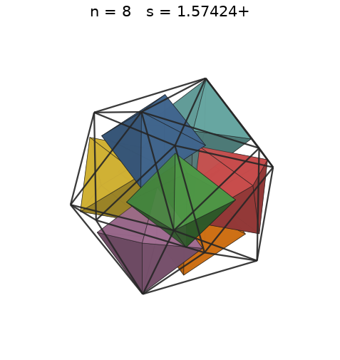 |
| 9 | [1.62979+](octinico_n09.json) | 1.629792166748 |  | 1.24819 | 0.4492 | 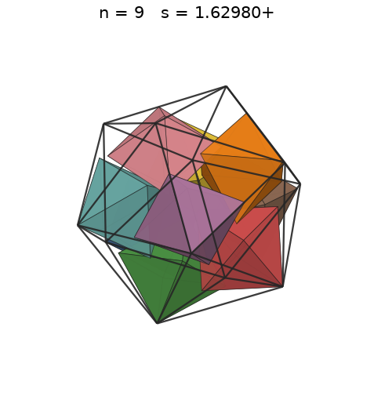 |
| 10 | [1.66511+](octinico_n10.json) | 1.665114364763 |  | 1.29281 | 0.4680 | 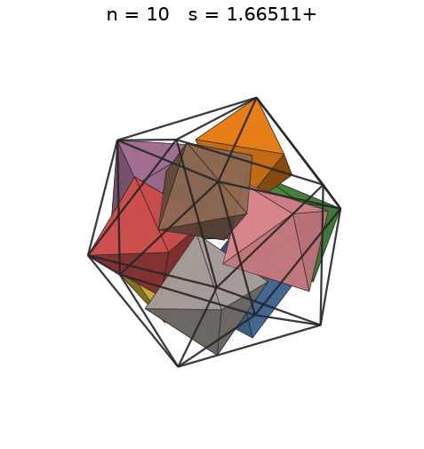 |
| 11 | [1.68882+](octinico_n11.json) | 1.688821911863 |  | 1.33454 | 0.4934 | 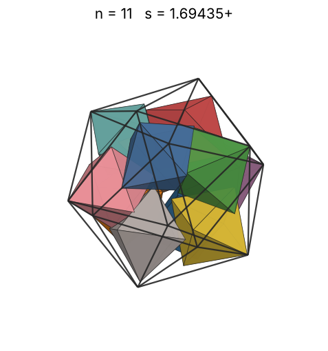 |
| 12 | [1.69583+](octinico_n12.json) | 1.695830247868 |  | 1.37381 | 0.5317 | 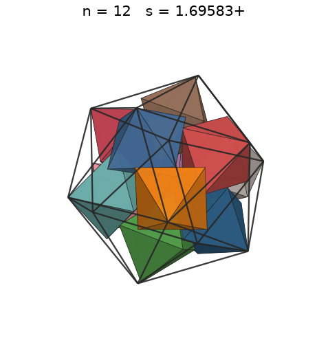 |
| 13 | [1.73530+](octinico_n13.json) | 1.735300358510 |  | 1.41096 | 0.5376 | 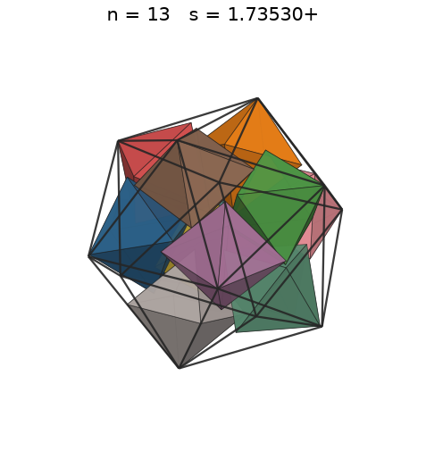 |
| 14 | [1.79967+](octinico_n14.json) | 1.799678300854 |  | 1.44625 | 0.5190 | 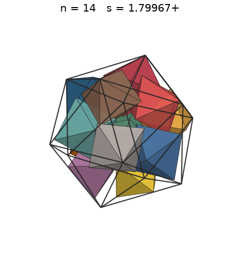 |
| 15 | [1.83909+](octinico_n15.json) | 1.839092704639 |  | 1.47989 | 0.5211 | 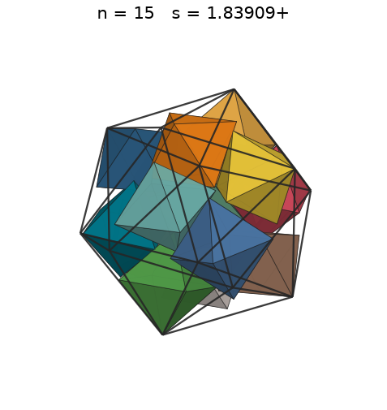 |
| 16 | [1.89259+](octinico_n16.json) | 1.892599419197 |  | 1.51207 | 0.5100 | 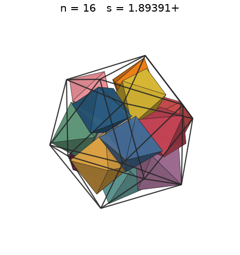 |
| 17 | [1.93714+](octinico_n17.json) | 1.937147478079 |  | 1.54294 | 0.5053 | 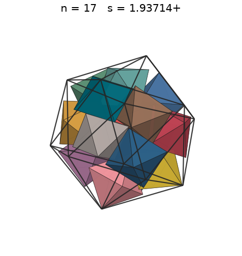 |
| 18 | [1.97928+](octinico_n18.json) | 1.979280568707 |  | 1.57262 | 0.5016 | 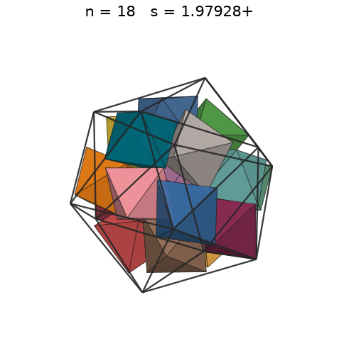 |
| 19 | [2.01303+](octinico_n19.json) | 2.013035471282 |  | 1.60122 | 0.5033 | 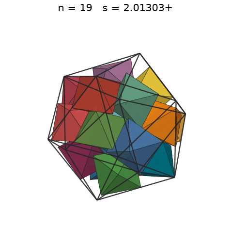 |
| 20 | [2.05290+](octinico_n20.json) | 2.052903649349 |  | 1.62883 | 0.4995 | 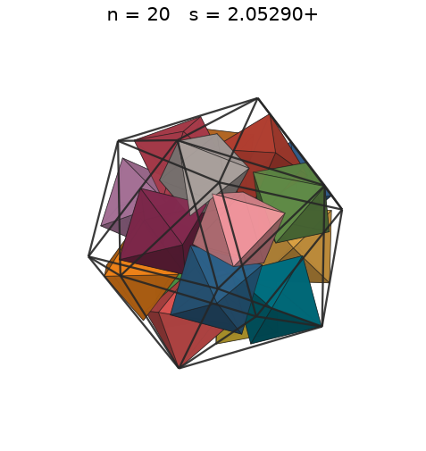 |
| 21 | [2.09071+](octinico_n21.json) | 2.090715291011 |  | 1.65554 | 0.4965 | 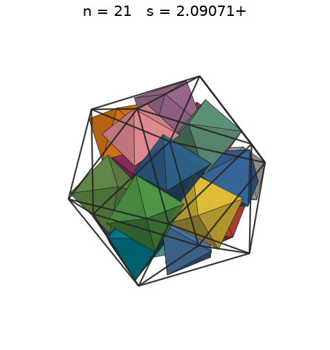 |
| 22 | [2.13473+](octinico_n22.json) | 2.134732175671 |  | 1.68141 | 0.4886 | 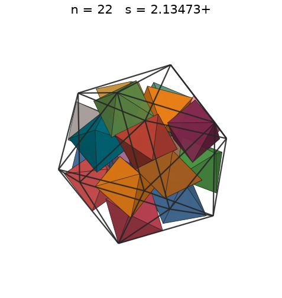 |
| 23 | [2.15210+](octinico_n23.json) | 2.152108637206 |  | 1.70651 | 0.4986 | 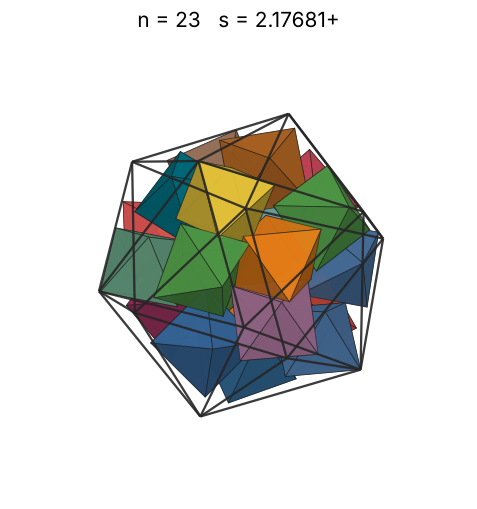 |
| 24 | [2.19441+](octinico_n24.json) | 2.194419283980 |  | 1.73089 | 0.4907 | 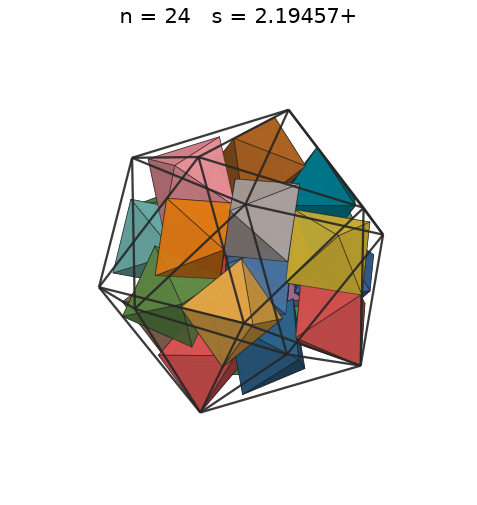 |
| 25 | [2.19865+](octinico_n25.json) | 2.198652560134 |  | 1.75461 | 0.5082 | 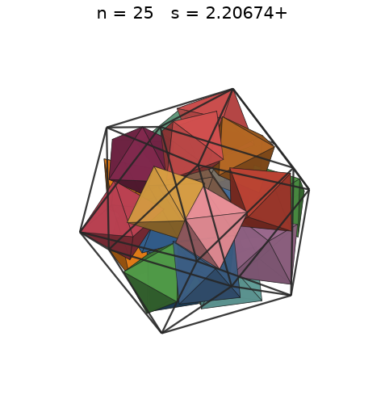 |
| 26 | [2.22986+](octinico_n26.json) | 2.229862723028 |  | 1.77770 | 0.5067 | 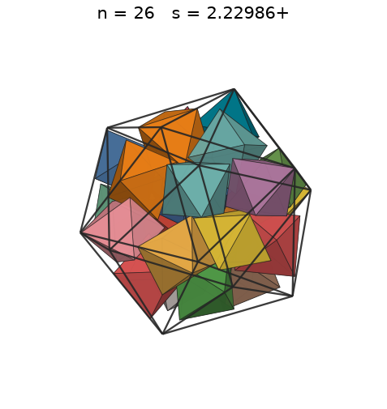 |
| 27 | [2.25784+](octinico_n27.json) | 2.257844618472 |  | 1.80020 | 0.5069 | 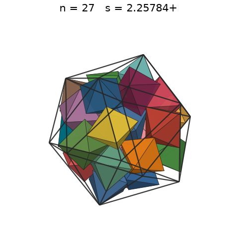 |
| 28 | [2.28195+](octinico_n28.json) | 2.281952849383 |  | 1.82216 | 0.5091 | 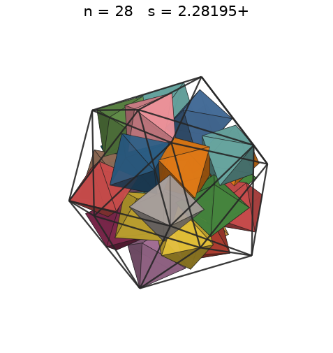 |
| 29 | [2.28520+](octinico_n29.json) | 2.285205889340 |  | 1.84360 | 0.5251 |  |
| 30 | [2.31246+](octinico_n30.json) | 2.312460733049 |  | 1.86455 | 0.5242 | 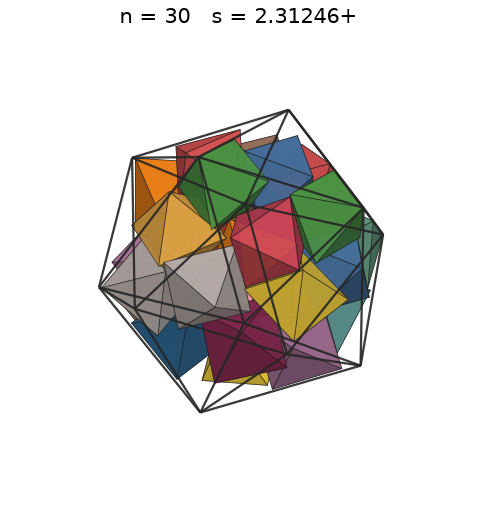 |
| 31 | [2.34481+](octinico_n31.json) | 2.344818013461 |  | 1.88504 | 0.5196 | 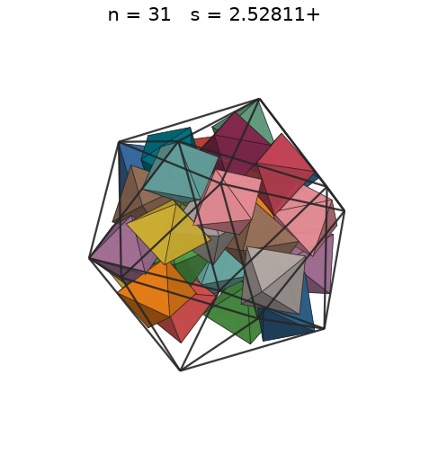 |
| 32 | [2.36516+](octinico_n32.json) | 2.365164305226 |  | 1.90509 | 0.5226 | 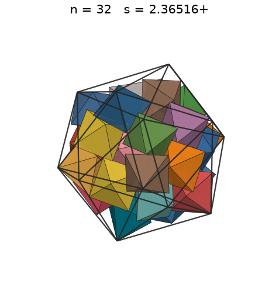 |
| 33 | [2.42348+](octinico_n33.json) | 2.423482120411 |  | 1.92474 | 0.5009 | 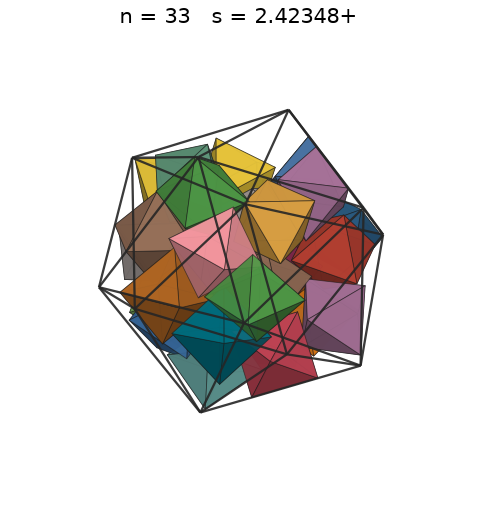 |
| 34 | [2.42348+](octinico_n34.json) | 2.423482122020 |  | 1.94398 | 0.5161 | 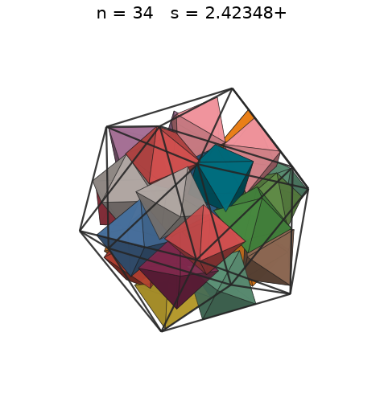 |
| 35 | [2.42348+](octinico_n35.json) | 2.423482124309 |  | 1.96286 | 0.5313 | 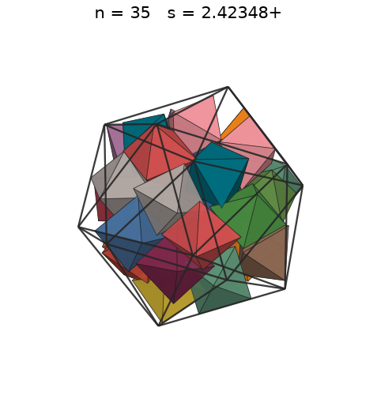 |
| 36 | [2.46236+](octinico_n36.json) | 2.462363341842 |  | 1.98138 | 0.5210 | 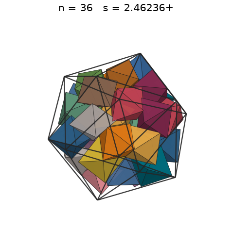 |
| 37 | [2.48286+](octinico_n37.json) | 2.482867430252 |  | 1.99956 | 0.5223 | 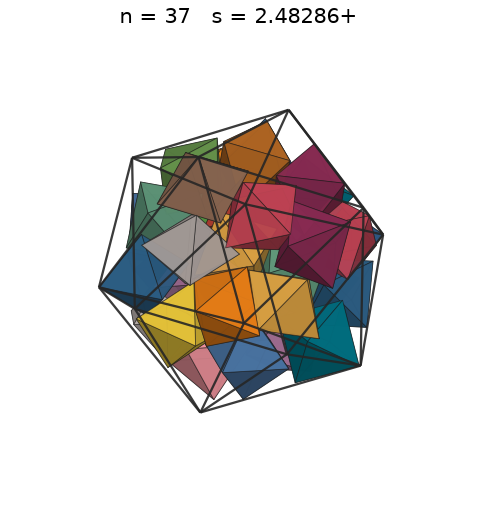 |
| 38 | [2.49667+](octinico_n38.json) | 2.496673276875 |  | 2.01741 | 0.5276 | 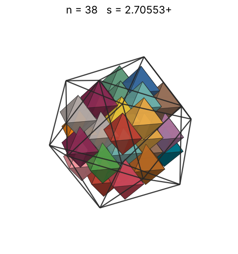 |
| 39 | [2.51045+](octinico_n39.json) | 2.510455167636 |  | 2.03495 | 0.5326 | 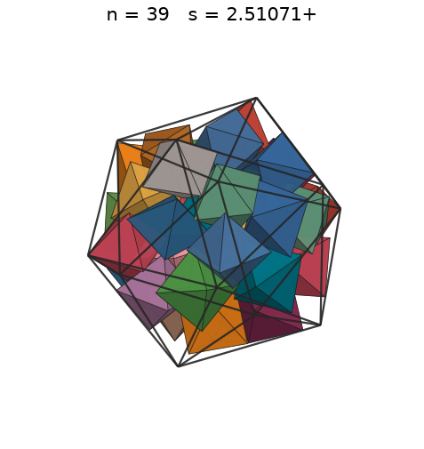 |
| 40 | [2.52375+](octinico_n40.json) | 2.523753136121 |  | 2.05220 | 0.5377 | 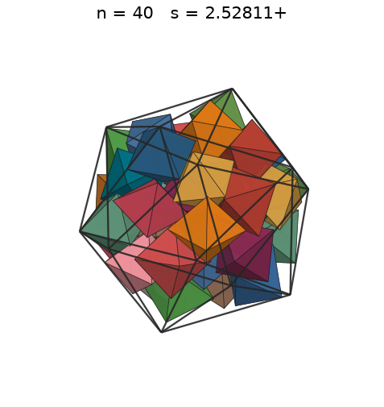 |
| 41 | [2.52811+](octinico_n41.json) | 2.528111737350 |  | 2.06916 | 0.5483 |  |
| 42 | [2.54367+](octinico_n42.json) | 2.543670134174 |  | 2.08585 | 0.5514 |  |
| 43 | [2.56979+](octinico_n43.json) | 2.569799503467 |  | 2.10227 | 0.5475 |  |
| 44 | [2.58233+](octinico_n44.json) | 2.582338121800 |  | 2.11845 | 0.5521 |  |
| 45 | [2.59875+](octinico_n45.json) | 2.598757616340 |  | 2.13438 | 0.5540 |  |
| 46 | [2.60675+](octinico_n46.json) | 2.606750402313 |  | 2.15007 | 0.5611 |  |
| 47 | [2.61574+](octinico_n47.json) | 2.615743075445 |  | 2.16554 | 0.5674 |  |
| 48 | [2.61982+](octinico_n48.json) | 2.619826693136 |  | 2.18079 | 0.5768 |  |
| 49 | [2.64819+](octinico_n49.json) | 2.648191434204 |  | 2.19583 | 0.5701 |  |
| 50 | [2.65162+](octinico_n50.json) | 2.651623671019 |  | 2.21067 | 0.5795 |  |
| 51 | [2.67178+](octinico_n51.json) | 2.671787305977 |  | 2.22531 | 0.5778 |  |
| 52 | [2.69001+](octinico_n52.json) | 2.690010720316 |  | 2.23976 | 0.5772 |  |
| 53 | [2.70747+](octinico_n53.json) | 2.707477745332 |  | 2.25402 | 0.5770 |  |
| 54 | [2.73524+](octinico_n54.json) | 2.735240711400 |  | 2.26811 | 0.5702 |  |
| 55 | [2.74637+](octinico_n55.json) | 2.746378616902 |  | 2.28203 | 0.5737 |  |
| 56 | [2.76318+](octinico_n56.json) | 2.763182257112 |  | 2.29577 | 0.5735 |  |
| 57 | [2.77106+](octinico_n57.json) | 2.771064578465 |  | 2.30936 | 0.5788 |  |
| 58 | [2.80571+](octinico_n58.json) | 2.805716685562 |  | 2.32279 | 0.5674 |  |
| 59 | [2.81676+](octinico_n59.json) | 2.816765513782 |  | 2.33606 | 0.5704 |  |
| 60 | [2.83537+](octinico_n60.json) | 2.835373348134 |  | 2.34918 | 0.5687 |  |
| 61 | [2.84039+](octinico_n61.json) | 2.840395100512 |  | 2.36216 | 0.5752 |  |
| 62 | [2.86492+](octinico_n62.json) | 2.864923449978 |  | 2.37500 | 0.5697 |  |
| 63 | [2.86819+](octinico_n63.json) | 2.868196978581 |  | 2.38770 | 0.5769 |  |
| 64 | [2.88578+](octinico_n64.json) | 2.885784878544 |  | 2.40027 | 0.5754 |  |
| 65 | [2.97754+](octinico_n65.json) | 2.977543249870 |  | 2.41271 | 0.5320 |  |
| 66 | [2.99307+](octinico_n66.json) | 2.993079612242 |  | 2.42502 | 0.5318 |  |
| 67 | [2.99933+](octinico_n67.json) | 2.999332698163 |  | 2.43720 | 0.5365 |  |
| 68 | [3.04553+](octinico_n68.json) | 3.045533805561 |  | 2.44927 | 0.5201 |  |
| 69 | [3.04657+](octinico_n69.json) | 3.046577835828 |  | 2.46122 | 0.5272 |  |
| 70 | [3.04699+](octinico_n70.json) | 3.046998328568 |  | 2.47305 | 0.5347 |  |
| 71 | [3.04853+](octinico_n71.json) | 3.048533322494 |  | 2.48477 | 0.5415 |  |
| 72 | [3.05840+](octinico_n72.json) | 3.058404090277 |  | 2.49638 | 0.5438 |  |
| 73 | [3.08884+](octinico_n73.json) | 3.088846916156 |  | 2.50788 | 0.5352 |  |
| 74 | [3.09283+](octinico_n74.json) | 3.092831490607 |  | 2.51928 | 0.5405 |  |
| 75 | [3.09550+](octinico_n75.json) | 3.095501263404 |  | 2.53058 | 0.5463 |  |
| 76 | [3.09819+](octinico_n76.json) | 3.098193296804 |  | 2.54178 | 0.5522 |  |
| 77 | [3.10171+](octinico_n77.json) | 3.101717688226 |  | 2.55288 | 0.5575 |  |
| 78 | [3.10330+](octinico_n78.json) | 3.103306525258 |  | 2.56388 | 0.5639 |  |
| 79 | [3.10426+](octinico_n79.json) | 3.104262351215 |  | 2.57479 | 0.5706 |  |
| 80 | [3.10699+](octinico_n80.json) | 3.106991390648 |  | 2.58561 | 0.5763 |  |
| 81 | [3.17514+](octinico_n81.json) | 3.175144562404 |  | 2.59634 | 0.5468 |  |
| 82 | [3.19046+](octinico_n82.json) | 3.190462451803 |  | 2.60698 | 0.5456 |  |
| 83 | [3.19892+](octinico_n83.json) | 3.198923667038 |  | 2.61754 | 0.5479 |  |
| 84 | [3.20093+](octinico_n84.json) | 3.200934218617 |  | 2.62801 | 0.5534 |  |
| 85 | [3.22039+](octinico_n85.json) | 3.220392949599 |  | 2.63839 | 0.5499 |  |
| 86 | [3.22039+](octinico_n86.json) | 3.220392950701 |  | 2.64870 | 0.5564 |  |
| 87 | [3.22039+](octinico_n87.json) | 3.220392965999 |  | 2.65893 | 0.5628 |  |
| 88 | [3.26288+](octinico_n88.json) | 3.262888159083 |  | 2.66908 | 0.5474 |  |
| 89 | [3.29055+](octinico_n89.json) | 3.290553048305 |  | 2.67915 | 0.5397 |  |
| 90 | [3.29055+](octinico_n90.json) | 3.290553049131 |  | 2.68914 | 0.5458 |  |
| 91 | [3.29055+](octinico_n91.json) | 3.290553065156 |  | 2.69907 | 0.5519 |  |
| 92 | [3.32209+](octinico_n92.json) | 3.322095786196 |  | 2.70892 | 0.5422 |  |
| 93 | [3.32209+](octinico_n93.json) | 3.322095791567 |  | 2.71870 | 0.5481 |  |
| 94 | [3.32209+](octinico_n94.json) | 3.322095803232 |  | 2.72841 | 0.5540 |  |
| 95 | [3.32209+](octinico_n95.json) | 3.322095810890 |  | 2.73805 | 0.5599 |  |
| 96 | [3.34896+](octinico_n96.json) | 3.348968960691 |  | 2.74762 | 0.5523 |  |
| 97 | [3.34896+](octinico_n97.json) | 3.348968974739 |  | 2.75713 | 0.5580 |  |
| 98 | [3.37226+](octinico_n98.json) | 3.372268621161 |  | 2.76657 | 0.5522 |  |
| 99 | [3.38075+](octinico_n99.json) | 3.380758697350 |  | 2.77595 | 0.5536 |  |
| 100 | [3.38075+](octinico_n100.json) | 3.380758697350 |  | 2.78527 | 0.5592 |  |
