# Octahedra in a octahedron

Smallest octahedron found that holds n unit-edge octahedra; s = container edge / piece edge. Every row is certified in exact arithmetic (`certify_exact.py`).

| n | s | s (touching limit) | closed form (conjectured) | volume lower bound | density | picture |
|---|---|---|---|---|---|---|
| 2 | [1.93311+](octinoct_n02.json) | 1.933119581160 |  | 1.25992 | 0.2769 | 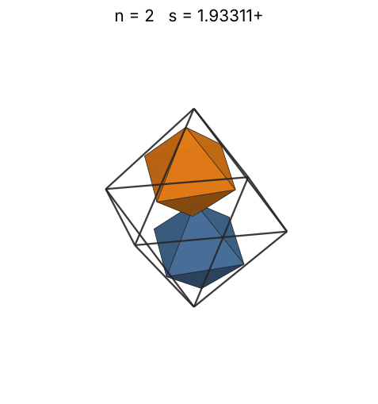 |
| 3 | [2.00000+](octinoct_n03.json) | 2.000000000000 | 2 | 1.44225 | 0.3750 | 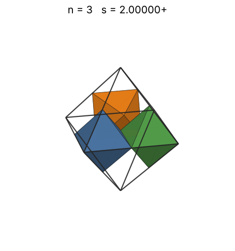 |
| 4 | [2.00000+](octinoct_n04.json) | 2.000000000000 | 2 | 1.58740 | 0.5000 | 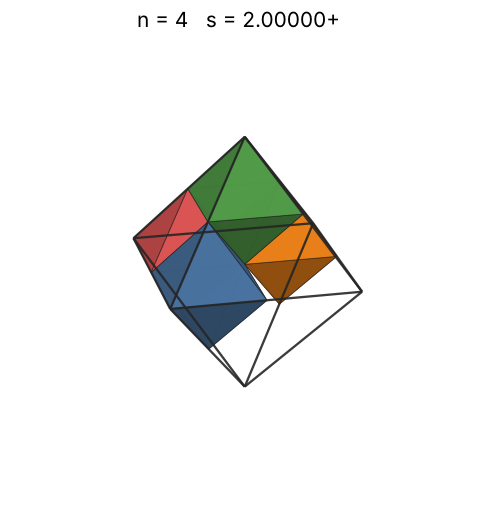 |
| 5 | [2.00000+](octinoct_n05.json) | 2.000000000000 | 2 | 1.70998 | 0.6250 | 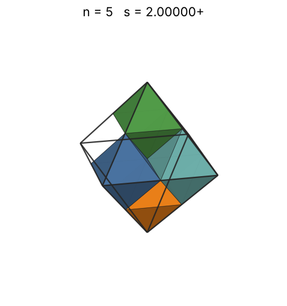 |
| 6 | [2.00000+](octinoct_n06.json) | 2.000000000000 | 2 | 1.81712 | 0.7500 | 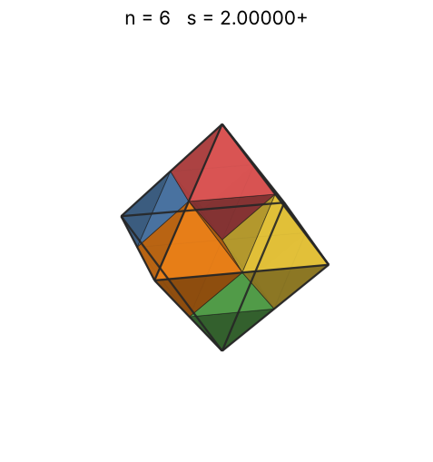 |
| 7 | [2.50000+](octinoct_n07.json) | 2.500000000000 | 5/2 | 1.91293 | 0.4480 | 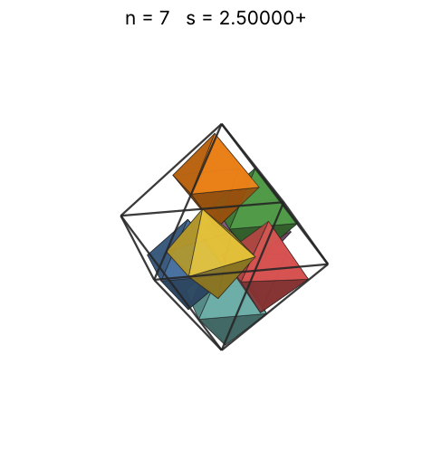 |
| 8 | [2.50000+](octinoct_n08.json) | 2.500000000000 | 5/2 | 2.00000 | 0.5120 | 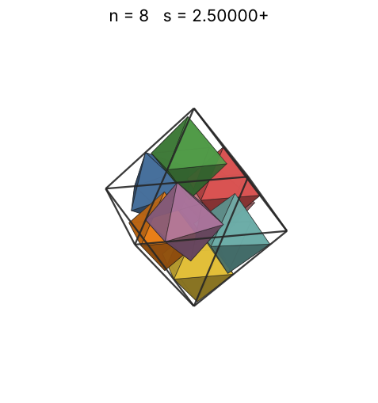 |
| 9 | [2.50000+](octinoct_n09.json) | 2.500000000000 | 5/2 | 2.08008 | 0.5760 | 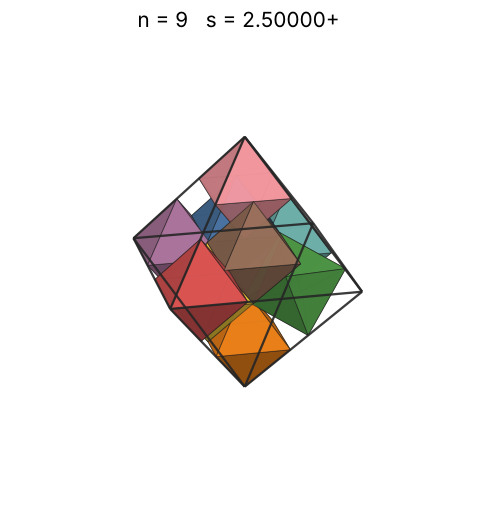 |
| 10 | [2.66666+](octinoct_n10.json) | 2.666666666667 | 8/3 | 2.15443 | 0.5273 | 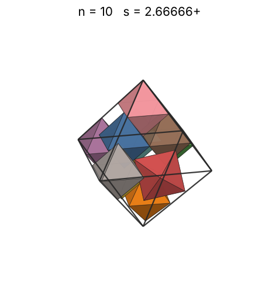 |
| 11 | [2.66666+](octinoct_n11.json) | 2.666666666667 | 8/3 | 2.22398 | 0.5801 | 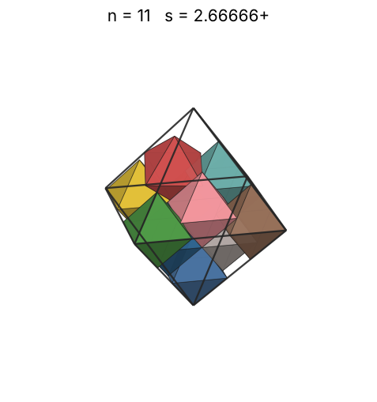 |
| 12 | [2.81649+](octinoct_n12.json) | 2.816496580928 | (6 + √6)/3 | 2.28943 | 0.5371 | 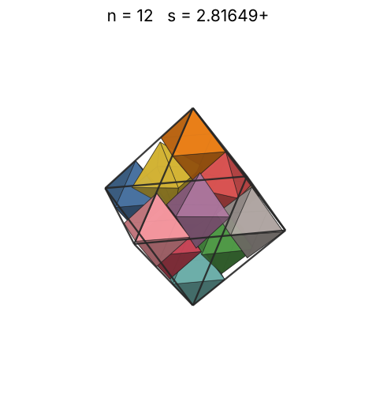 |
| 13 | [2.89054+](octinoct_n13.json) | 2.890544866031 |  | 2.35133 | 0.5383 | 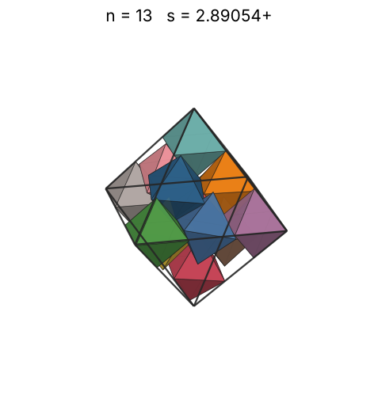 |
| 14 | [2.95879+](octinoct_n14.json) | 2.958794722704 |  | 2.41014 | 0.5405 | 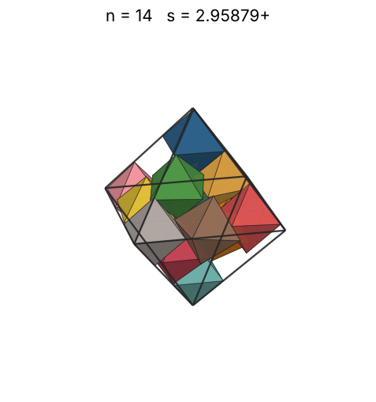 |
| 15 | [2.98859+](octinoct_n15.json) | 2.988598570136 |  | 2.46621 | 0.5619 | 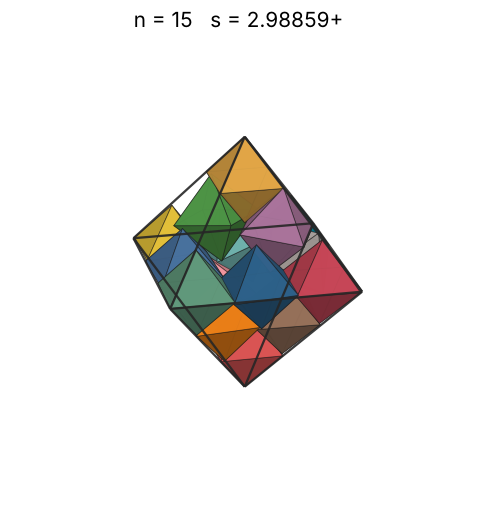 |
| 16 | [3.00000+](octinoct_n16.json) | 3.000000000000 | 3 | 2.51984 | 0.5926 | 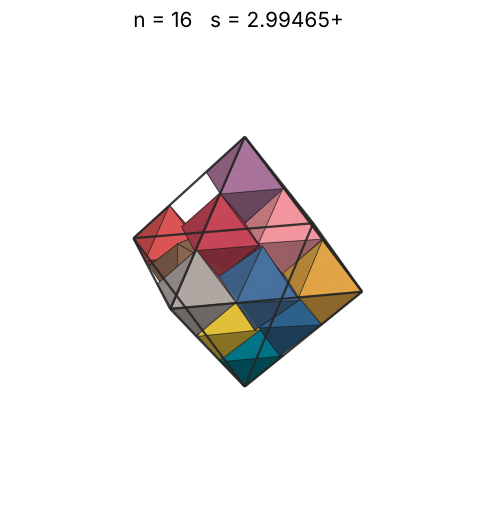 |
| 17 | [3.00000+](octinoct_n17.json) | 3.000000000000 | 3 | 2.57128 | 0.6296 | 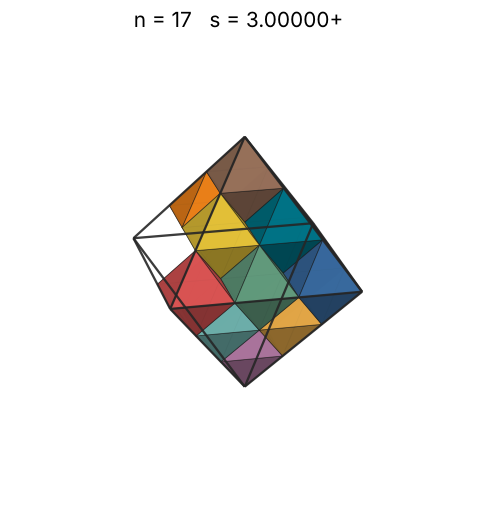 |
| 18 | [3.00000+](octinoct_n18.json) | 3.000000000000 | 3 | 2.62074 | 0.6667 | 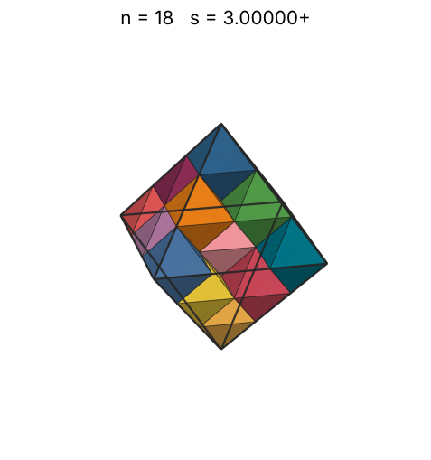 |
| 19 | [3.00000+](octinoct_n19.json) | 3.000000000000 | 3 | 2.66840 | 0.7037 | 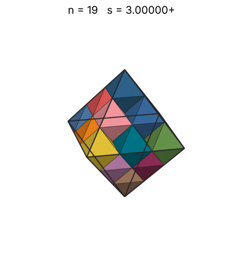 |
| 20 | [3.16653+](octinoct_n20.json) | 3.166536535529 |  | 2.71442 | 0.6299 | 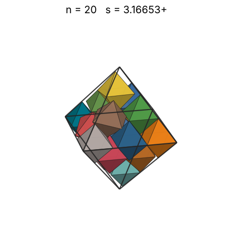 |
