# Octahedra in an octahedron

s = container edge / piece edge; every row certified in exact arithmetic.

| n | s | touching limit | closed form (conj.) | previous best | volume bound | density | picture |
|---|---|---|---|---|---|---|---|
| 2 | [1.93311+](octinoct_n02.json) | 1.933119581160 |  |  | 1.25992 | 0.2769 |  |
| 3 | [2.00000+](octinoct_n03.json) | 2.000000000000 | 2 |  | 1.44225 | 0.3750 |  |
| 4 | [2.00000+](octinoct_n04.json) | 2.000000000000 | 2 |  | 1.58740 | 0.5000 |  |
| 5 | [2.00000+](octinoct_n05.json) | 2.000000000000 | 2 |  | 1.70998 | 0.6250 |  |
| 6 | [2.00000+](octinoct_n06.json) | 2.000000000000 | 2 |  | 1.81712 | 0.7500 |  |
| 7 | [2.50000+](octinoct_n07.json) | 2.500000000000 | 5/2 |  | 1.91293 | 0.4480 |  |
| 8 | [2.50000+](octinoct_n08.json) | 2.500000000000 | 5/2 |  | 2.00000 | 0.5120 |  |
| 9 | [2.50000+](octinoct_n09.json) | 2.500000000000 | 5/2 |  | 2.08008 | 0.5760 |  |
| 10 | [2.50000+](octinoct_n10.json) | 2.500000000000 | 5/2 |  | 2.15443 | 0.6400 |  |
| 11 | [2.66666+](octinoct_n11.json) | 2.666666666667 | 8/3 |  | 2.22398 | 0.5801 |  |
| 12 | [2.75000+](octinoct_n12.json) | 2.750000000000 | 11/4 |  | 2.28943 | 0.5770 |  |
| 13 | [2.87885+](octinoct_n13.json) | 2.878858097680 |  |  | 2.35133 | 0.5449 |  |
| 14 | [2.95259+](octinoct_n14.json) | 2.952595478626 |  |  | 2.41014 | 0.5439 |  |
| 15 | [2.98749+](octinoct_n15.json) | 2.987495287233 |  |  | 2.46621 | 0.5626 |  |
| 16 | [2.99770+](octinoct_n16.json) | 2.997705869107 |  |  | 2.51984 | 0.5940 |  |
| 17 | [3.00000+](octinoct_n17.json) | 3.000000000000 | 3 |  | 2.57128 | 0.6296 |  |
| 18 | [3.00000+](octinoct_n18.json) | 3.000000000000 | 3 |  | 2.62074 | 0.6667 |  |
| 19 | [3.00000+](octinoct_n19.json) | 3.000000000000 | 3 |  | 2.66840 | 0.7037 |  |
| 20 | [3.16653+](octinoct_n20.json) | 3.166536535529 |  |  | 2.71442 | 0.6299 |  |
| 21 | [3.20000+](octinoct_n21.json) | 3.200000000000 | 16/5 |  | 2.75892 | 0.6409 | 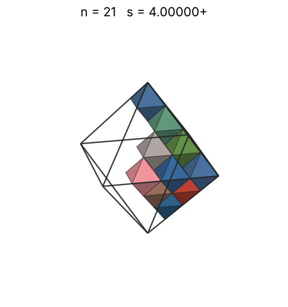 |
| 22 | [3.25000+](octinoct_n22.json) | 3.250000000000 | 13/4 |  | 2.80204 | 0.6409 | 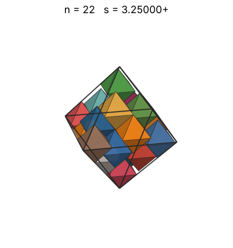 |
| 23 | [3.28571+](octinoct_n23.json) | 3.285714285714 | 23/7 |  | 2.84387 | 0.6484 | 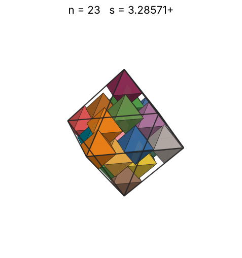 |
| 24 | [3.39224+](octinoct_n24.json) | 3.392243190505 |  |  | 2.88450 | 0.6148 | 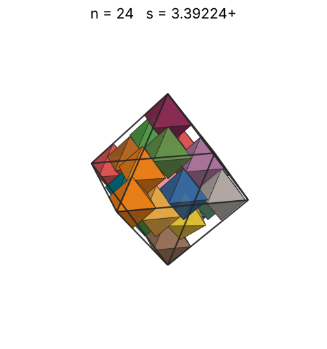 |
| 25 | [3.42854+](octinoct_n25.json) | 3.428540937922 |  |  | 2.92402 | 0.6203 | 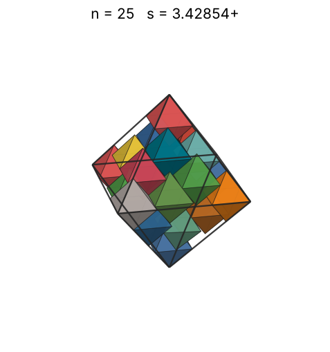 |
| 26 | [3.50000+](octinoct_n26.json) | 3.500000000000 | 7/2 |  | 2.96250 | 0.6064 | 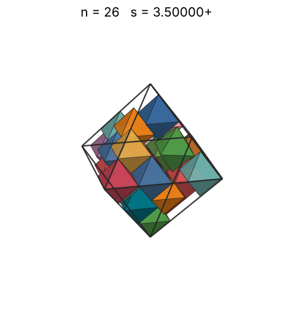 |
| 27 | [3.54910+](octinoct_n27.json) | 3.549108831138 |  |  | 3.00000 | 0.6040 | 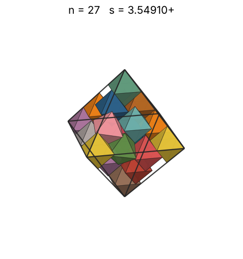 |
| 28 | [3.64513+](octinoct_n28.json) | 3.645138115782 |  |  | 3.03659 | 0.5781 | 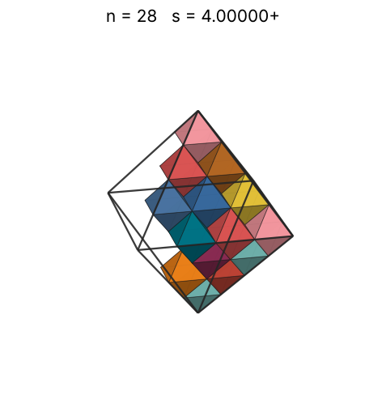 |
| 29 | [3.66666+](octinoct_n29.json) | 3.666666666689 |  |  | 3.07232 | 0.5883 | 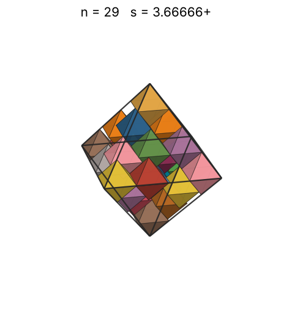 |
| 30 | [3.66666+](octinoct_n30.json) | 3.666666666691 |  |  | 3.10723 | 0.6086 | 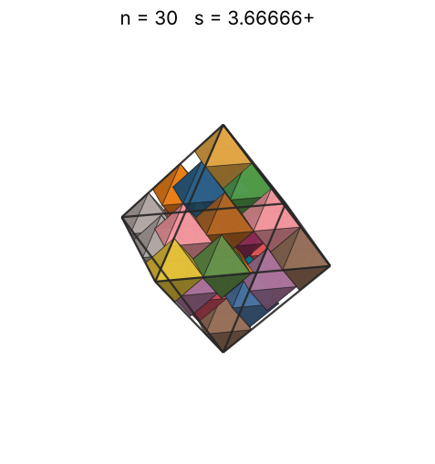 |
| 31 | [3.81661+](octinoct_n31.json) | 3.816616998226 |  |  | 3.14138 | 0.5576 | 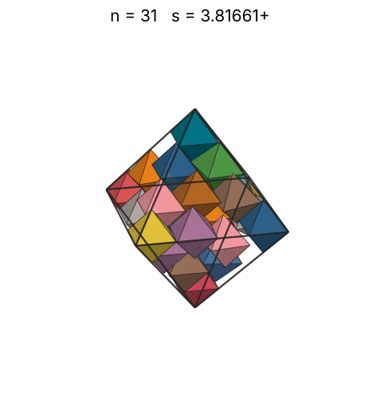 |
| 32 | [3.82376+](octinoct_n32.json) | 3.823765595422 |  |  | 3.17480 | 0.5724 | 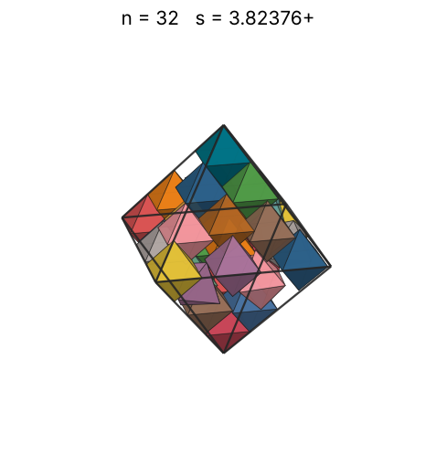 |
| 33 | [3.84574+](octinoct_n33.json) | 3.845745747683 |  |  | 3.20753 | 0.5802 | 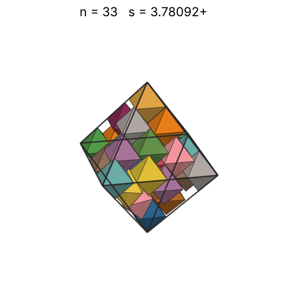 |
| 34 | [3.86373+](octinoct_n34.json) | 3.863739232644 |  |  | 3.23961 | 0.5895 | 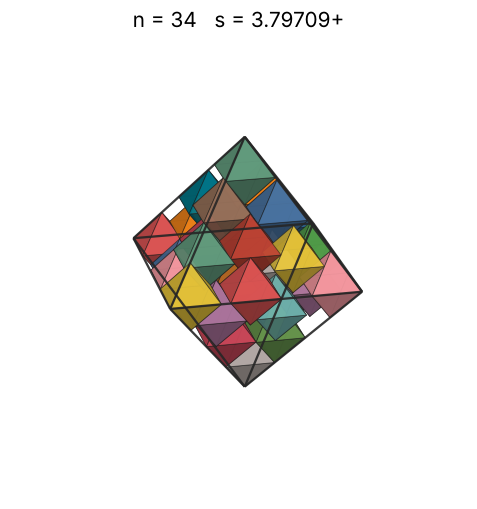 |
| 35 | [3.86766+](octinoct_n35.json) | 3.867668146123 |  |  | 3.27107 | 0.6050 | 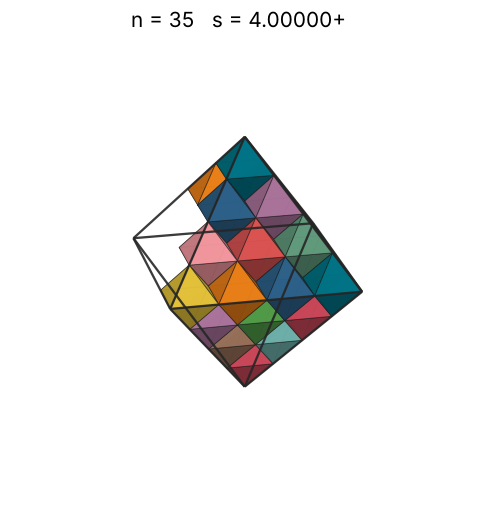 |
| 36 | [3.88291+](octinoct_n36.json) | 3.882917532150 |  |  | 3.30193 | 0.6149 | 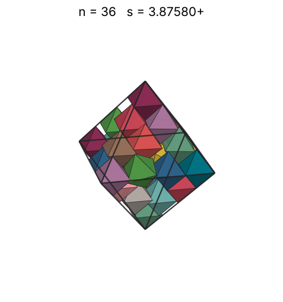 |
| 37 | [3.90970+](octinoct_n37.json) | 3.909708459398 |  |  | 3.33222 | 0.6191 | 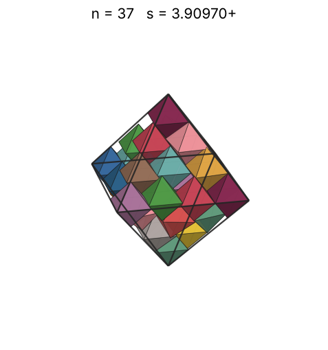 |
| 38 | [3.97743+](octinoct_n38.json) | 3.977436798706 |  |  | 3.36198 | 0.6039 | 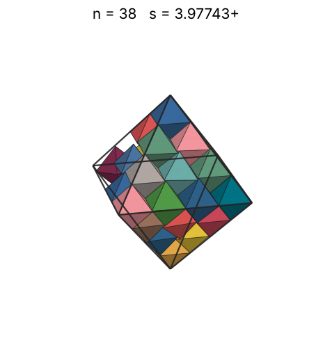 |
| 39 | [3.97981+](octinoct_n39.json) | 3.979812626258 |  |  | 3.39121 | 0.6187 | 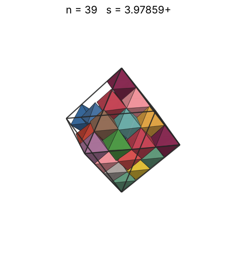 |
| 40 | [3.98002+](octinoct_n40.json) | 3.980027006780 |  |  | 3.41995 | 0.6345 | 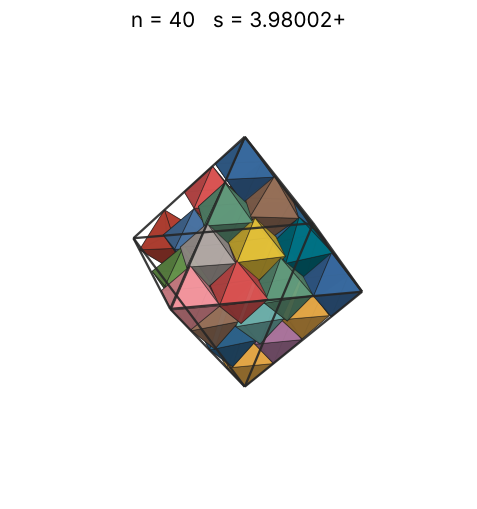 |
