# Tetrahedra in a dodecahedron

s = container edge / piece edge; every row certified in exact arithmetic.

| n | s | touching limit | closed form (conj.) | volume bound | density | picture |
|---|---|---|---|---|---|---|
| 2 | [0.58268+](tetindod_n02.json) | 0.582688071525 |  | 0.31332 | 0.1555 | 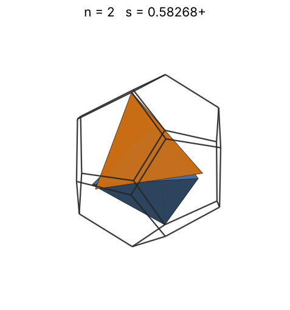 |
| 3 | [0.61803+](tetindod_n03.json) | 0.618034039261 |  | 0.35866 | 0.1954 | 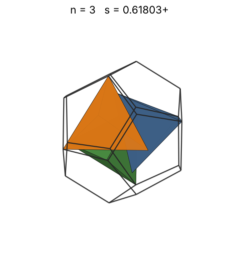 |
| 4 | [0.62677+](tetindod_n04.json) | 0.626774623208 |  | 0.39476 | 0.2498 | 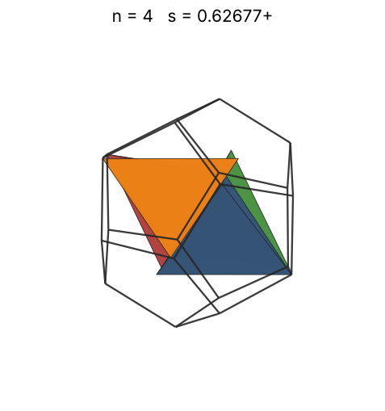 |
| 5 | [0.63166+](tetindod_n05.json) | 0.631661448162 |  | 0.42524 | 0.3051 | 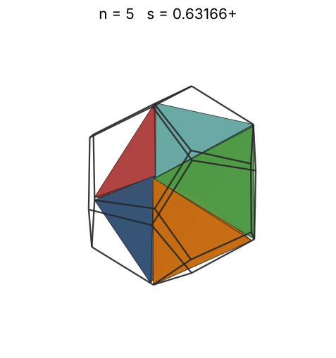 |
| 6 | [0.68232+](tetindod_n06.json) | 0.682321004660 |  | 0.45188 | 0.2905 | 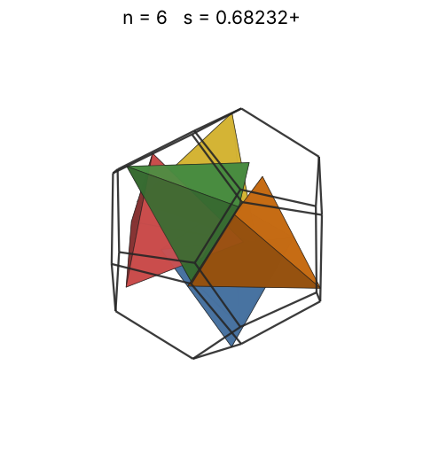 |
| 7 | [0.69512+](tetindod_n07.json) | 0.695122974988 |  | 0.47571 | 0.3205 | 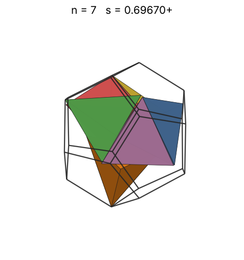 |
| 8 | [0.71553+](tetindod_n08.json) | 0.715534821150 |  | 0.49736 | 0.3358 | 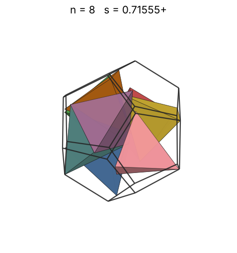 |
| 9 | [0.71861+](tetindod_n09.json) | 0.718614140166 |  | 0.51728 | 0.3730 | 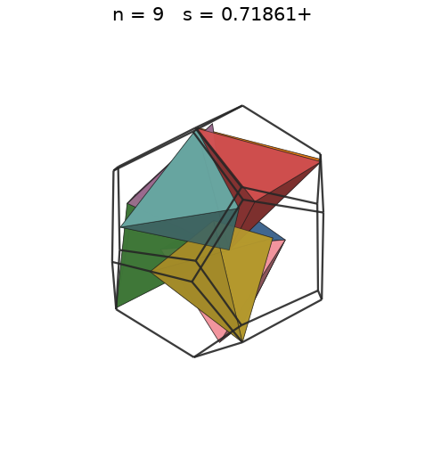 |
| 10 | [0.73155+](tetindod_n10.json) | 0.731556426520 |  | 0.53577 | 0.3928 | 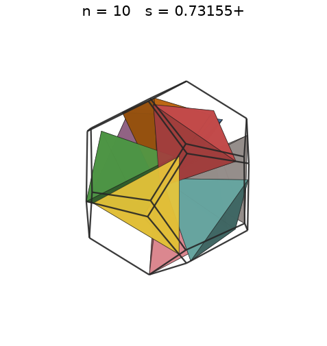 |
| 11 | [0.74015+](tetindod_n11.json) | 0.740150205529 |  | 0.55306 | 0.4172 | 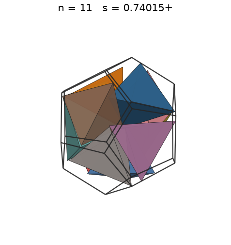 |
| 12 | [0.75020+](tetindod_n12.json) | 0.750208453147 |  | 0.56934 | 0.4371 | 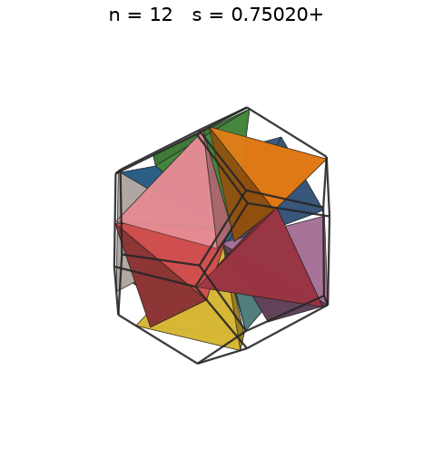 |
| 13 | [0.75559+](tetindod_n13.json) | 0.755593638757 |  | 0.58473 | 0.4635 | 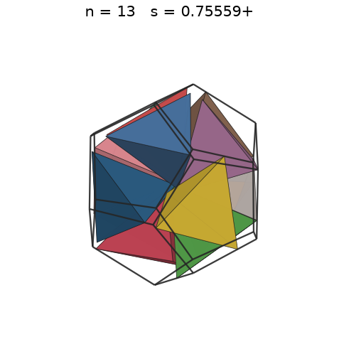 |
| 14 | [0.76024+](tetindod_n14.json) | 0.760249853563 |  | 0.59936 | 0.4900 | 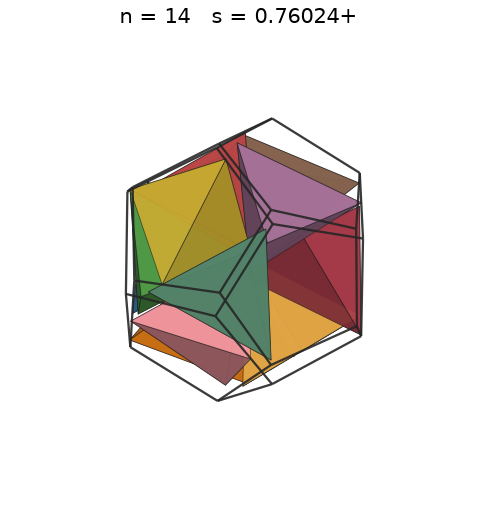 |
| 15 | [0.76607+](tetindod_n15.json) | 0.766076412292 |  | 0.61330 | 0.5131 | 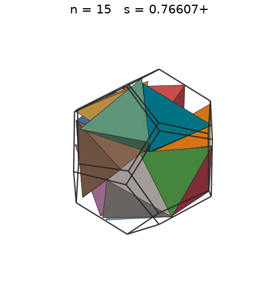 |
| 16 | [0.77294+](tetindod_n16.json) | 0.772947412341 |  | 0.62664 | 0.5328 | 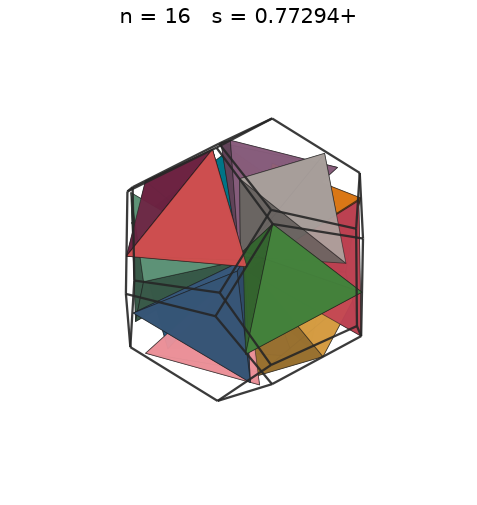 |
| 17 | [0.77897+](tetindod_n17.json) | 0.778978077154 |  | 0.63943 | 0.5531 | 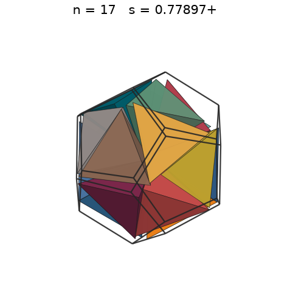 |
| 18 | [0.78225+](tetindod_n18.json) | 0.782258954764 |  | 0.65173 | 0.5783 | 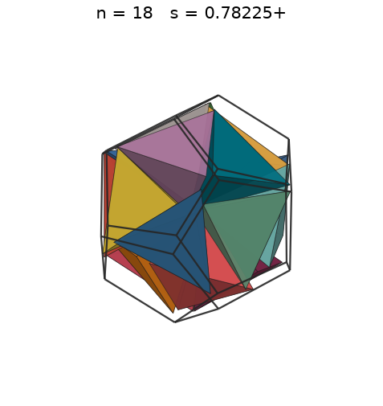 |
| 19 | [0.78865+](tetindod_n19.json) | 0.788659186860 |  | 0.66358 | 0.5957 | 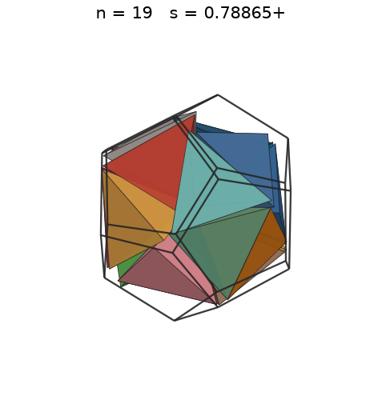 |
| 20 | [0.79101+](tetindod_n20.json) | 0.791013111740 |  | 0.67502 | 0.6215 | 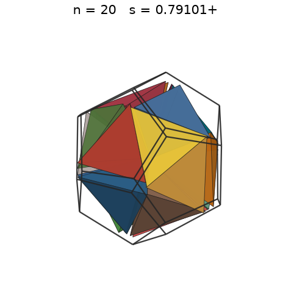 |
| 21 | [0.81511+](tetindod_n21.json) | 0.815113618885 |  | 0.68609 | 0.5963 | 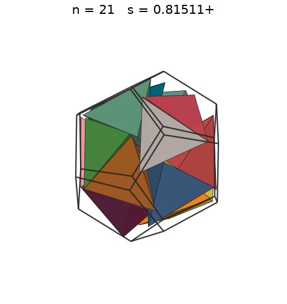 |
| 22 | [0.82308+](tetindod_n22.json) | 0.823083224318 |  | 0.69681 | 0.6068 | 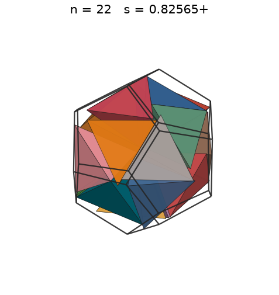 |
| 23 | [0.84497+](tetindod_n23.json) | 0.844977146364 |  | 0.70722 | 0.5863 | 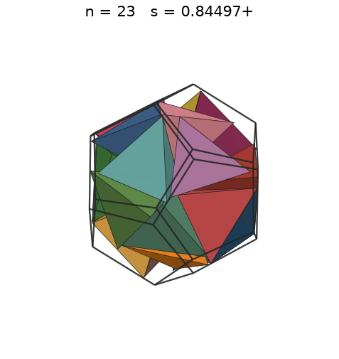 |
| 24 | [0.85421+](tetindod_n24.json) | 0.854219224613 |  | 0.71732 | 0.5921 | 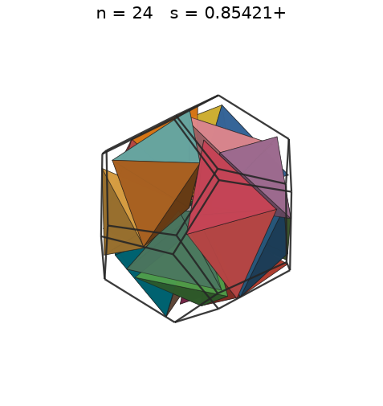 |
| 25 | [0.87537+](tetindod_n25.json) | 0.875376167040 |  | 0.72715 | 0.5732 | 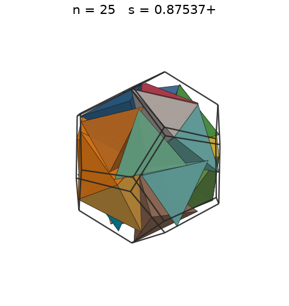 |
| 26 | [0.91284+](tetindod_n26.json) | 0.912843103924 |  | 0.73672 | 0.5257 | 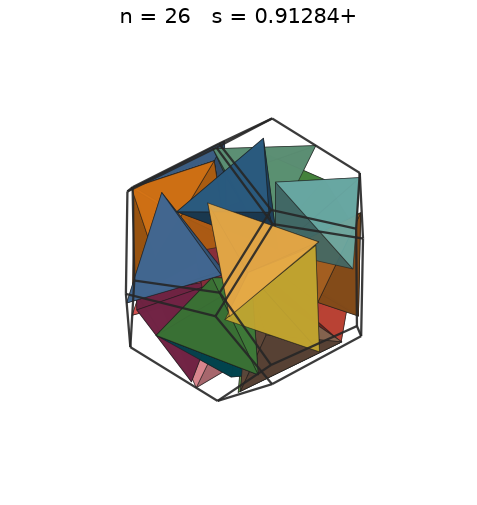 |
| 27 | [0.91758+](tetindod_n27.json) | 0.917586420108 |  | 0.74604 | 0.5375 | 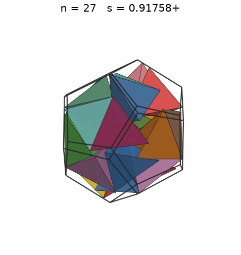 |
| 28 | [0.91889+](tetindod_n28.json) | 0.918893815723 |  | 0.75514 | 0.5550 | 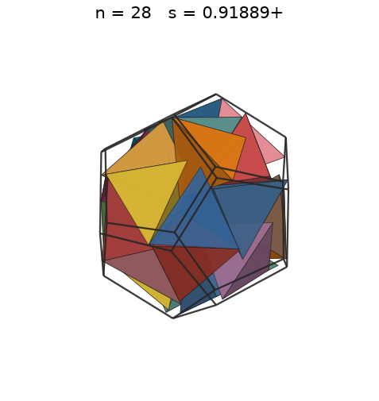 |
| 29 | [0.96326+](tetindod_n29.json) | 0.963266339005 |  | 0.76403 | 0.4990 |  |
| 30 | [0.96326+](tetindod_n30.json) | 0.963266344532 |  | 0.77271 | 0.5162 | 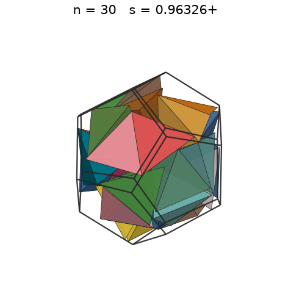 |
| 31 | [0.98799+](tetindod_n31.json) | 0.987998968225 |  | 0.78120 | 0.4943 | 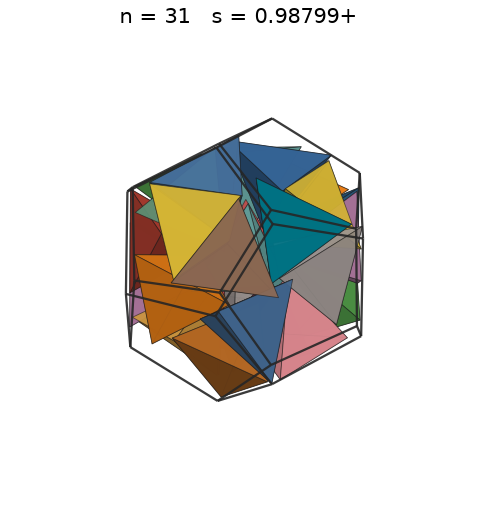 |
| 32 | [0.99808+](tetindod_n32.json) | 0.998085751748 |  | 0.78951 | 0.4950 | 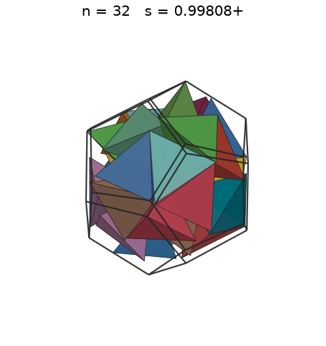 |
| 33 | [1.00703+](tetindod_n33.json) | 1.007032126583 |  | 0.79765 | 0.4969 | 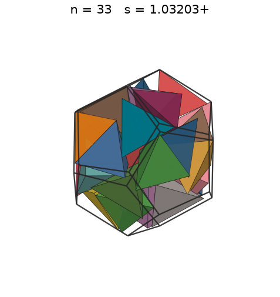 |
| 34 | [1.01873+](tetindod_n34.json) | 1.018730686655 |  | 0.80563 | 0.4946 | 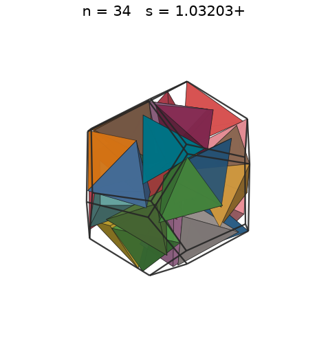 |
| 35 | [1.03203+](tetindod_n35.json) | 1.032034484168 |  | 0.81345 | 0.4897 | 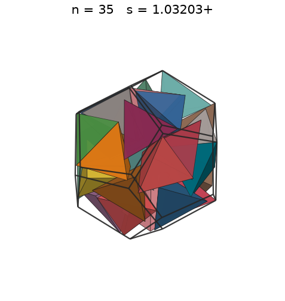 |
| 36 | [1.03451+](tetindod_n36.json) | 1.034510632520 |  | 0.82113 | 0.5001 | 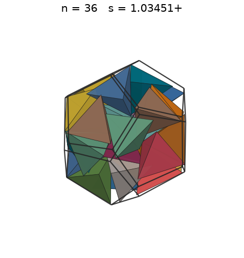 |
| 37 | [1.06143+](tetindod_n37.json) | 1.061433574867 |  | 0.82866 | 0.4758 | 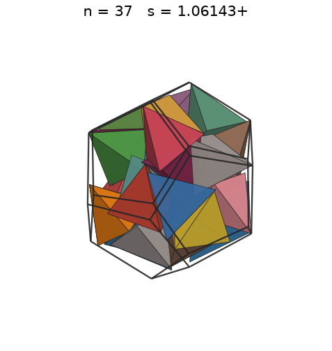 |
| 38 | [1.06816+](tetindod_n38.json) | 1.068161397974 |  | 0.83606 | 0.4795 | 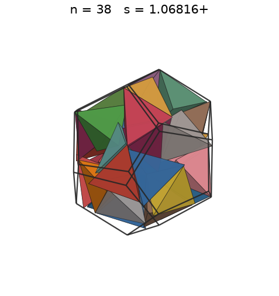 |
| 39 | [1.07274+](tetindod_n39.json) | 1.072741334719 |  | 0.84333 | 0.4859 | 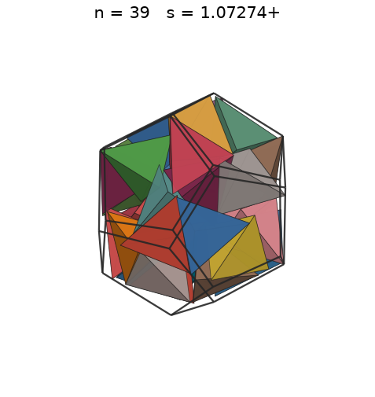 |
| 40 | [1.07825+](tetindod_n40.json) | 1.078257922233 |  | 0.85048 | 0.4907 | 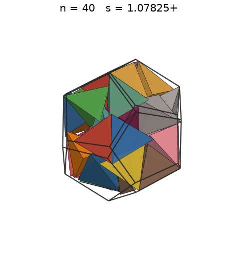 |
| 41 | [1.07858+](tetindod_n41.json) | 1.078586756590 |  | 0.85751 | 0.5025 |  |
| 42 | [1.07858+](tetindod_n42.json) | 1.078586756590 |  | 0.86442 | 0.5148 |  |
| 43 | [1.07858+](tetindod_n43.json) | 1.078586756590 |  | 0.87123 | 0.5270 |  |
| 44 | [1.07858+](tetindod_n44.json) | 1.078586766792 |  | 0.87793 | 0.5393 |  |
| 45 | [1.09505+](tetindod_n45.json) | 1.095059556112 |  | 0.88453 | 0.5270 |  |
| 46 | [1.09936+](tetindod_n46.json) | 1.099368527588 |  | 0.89104 | 0.5324 |  |
| 47 | [1.10699+](tetindod_n47.json) | 1.106992141991 |  | 0.89745 | 0.5328 |  |
| 48 | [1.11315+](tetindod_n48.json) | 1.113158208022 |  | 0.90377 | 0.5352 |  |
| 49 | [1.11382+](tetindod_n49.json) | 1.113824871248 |  | 0.91000 | 0.5453 |  |
| 50 | [1.12178+](tetindod_n50.json) | 1.121783896671 |  | 0.91615 | 0.5447 |  |
| 51 | [1.12370+](tetindod_n51.json) | 1.123706691411 |  | 0.92222 | 0.5528 |  |
| 52 | [1.13452+](tetindod_n52.json) | 1.134525404081 |  | 0.92820 | 0.5476 |  |
| 53 | [1.14257+](tetindod_n53.json) | 1.142577743101 |  | 0.93412 | 0.5464 |  |
| 54 | [1.14924+](tetindod_n54.json) | 1.149248608144 |  | 0.93996 | 0.5471 |  |
| 55 | [1.15393+](tetindod_n55.json) | 1.153935670214 |  | 0.94572 | 0.5505 |  |
| 56 | [1.15577+](tetindod_n56.json) | 1.155776779468 |  | 0.95142 | 0.5578 |  |
| 57 | [1.16990+](tetindod_n57.json) | 1.169903947047 |  | 0.95705 | 0.5475 |  |
| 58 | [1.17713+](tetindod_n58.json) | 1.177129914384 |  | 0.96261 | 0.5469 |  |
| 59 | [1.17715+](tetindod_n59.json) | 1.177154052447 |  | 0.96811 | 0.5563 |  |
| 60 | [1.18056+](tetindod_n60.json) | 1.180568813872 |  | 0.97355 | 0.5608 |  |
| 61 | [1.20326+](tetindod_n61.json) | 1.203266707038 |  | 0.97893 | 0.5385 |  |
| 62 | [1.20596+](tetindod_n62.json) | 1.205960144799 |  | 0.98425 | 0.5437 |  |
| 63 | [1.21078+](tetindod_n63.json) | 1.210787999852 |  | 0.98952 | 0.5458 |  |
| 64 | [1.21459+](tetindod_n64.json) | 1.214592119414 |  | 0.99472 | 0.5493 |  |
| 65 | [1.23046+](tetindod_n65.json) | 1.230468219884 |  | 0.99988 | 0.5366 |  |
| 66 | [1.23276+](tetindod_n66.json) | 1.232767037281 |  | 1.00498 | 0.5418 |  |
| 67 | [1.23428+](tetindod_n67.json) | 1.234286484987 |  | 1.01003 | 0.5480 |  |
| 68 | [1.23509+](tetindod_n68.json) | 1.235096909135 |  | 1.01503 | 0.5551 |  |
| 69 | [1.24892+](tetindod_n69.json) | 1.248929847432 |  | 1.01998 | 0.5447 |  |
| 70 | [1.25954+](tetindod_n70.json) | 1.259549638716 |  | 1.02489 | 0.5387 |  |
| 71 | [1.27089+](tetindod_n71.json) | 1.270893615242 |  | 1.02974 | 0.5319 |  |
| 72 | [1.27206+](tetindod_n72.json) | 1.272066502545 |  | 1.03455 | 0.5379 |  |
| 73 | [1.28741+](tetindod_n73.json) | 1.287415511827 |  | 1.03932 | 0.5261 |  |
| 74 | [1.28899+](tetindod_n74.json) | 1.288997143391 |  | 1.04405 | 0.5314 |  |
| 75 | [1.29334+](tetindod_n75.json) | 1.293340463237 |  | 1.04873 | 0.5332 |  |
| 76 | [1.30085+](tetindod_n76.json) | 1.300850623579 |  | 1.05337 | 0.5310 |  |
| 77 | [1.30567+](tetindod_n77.json) | 1.305670248591 |  | 1.05797 | 0.5320 |  |
| 78 | [1.30920+](tetindod_n78.json) | 1.309201001264 |  | 1.06253 | 0.5346 |  |
| 79 | [1.30935+](tetindod_n79.json) | 1.309350135783 |  | 1.06705 | 0.5412 |  |
| 80 | [1.31398+](tetindod_n80.json) | 1.313987509330 |  | 1.07153 | 0.5423 |  |
| 81 | [1.32157+](tetindod_n81.json) | 1.321577777455 |  | 1.07598 | 0.5397 |  |
| 82 | [1.33099+](tetindod_n82.json) | 1.330991347988 |  | 1.08039 | 0.5348 |  |
| 83 | [1.33225+](tetindod_n83.json) | 1.332250946543 |  | 1.08476 | 0.5398 |  |
| 84 | [1.34162+](tetindod_n84.json) | 1.341621885111 |  | 1.08910 | 0.5350 |  |
| 85 | [1.36724+](tetindod_n85.json) | 1.367244548812 |  | 1.09341 | 0.5115 |  |
| 86 | [1.36945+](tetindod_n86.json) | 1.369450227826 |  | 1.09768 | 0.5150 |  |
| 87 | [1.37860+](tetindod_n87.json) | 1.378603737678 |  | 1.10192 | 0.5107 |  |
| 88 | [1.37904+](tetindod_n88.json) | 1.379049500351 |  | 1.10612 | 0.5160 |  |
| 89 | [1.37904+](tetindod_n89.json) | 1.379049504400 |  | 1.11030 | 0.5219 |  |
| 90 | [1.38044+](tetindod_n90.json) | 1.380449043286 |  | 1.11444 | 0.5261 |  |
| 91 | [1.38225+](tetindod_n91.json) | 1.382251277008 |  | 1.11855 | 0.5299 |  |
| 92 | [1.40146+](tetindod_n92.json) | 1.401463078192 |  | 1.12264 | 0.5140 |  |
| 93 | [1.40495+](tetindod_n93.json) | 1.404957335069 |  | 1.12669 | 0.5157 |  |
| 94 | [1.40572+](tetindod_n94.json) | 1.405728011240 |  | 1.13071 | 0.5204 |  |
| 95 | [1.40790+](tetindod_n95.json) | 1.407906417873 |  | 1.13471 | 0.5235 |  |
| 96 | [1.41633+](tetindod_n96.json) | 1.416331387302 |  | 1.13868 | 0.5196 |  |
| 97 | [1.42017+](tetindod_n97.json) | 1.420179588158 |  | 1.14262 | 0.5208 |  |
| 98 | [1.42017+](tetindod_n98.json) | 1.420179591178 |  | 1.14653 | 0.5262 |  |
| 99 | [1.43241+](tetindod_n99.json) | 1.432410572725 |  | 1.15041 | 0.5180 |  |
| 100 | [1.43851+](tetindod_n100.json) | 1.438514053742 |  | 1.15428 | 0.5166 |  |
