# Tetrahedra in an icosahedron

s = container edge / piece edge; every row certified in exact arithmetic.

| n | s | touching limit | closed form (conj.) | volume bound | density | picture |
|---|---|---|---|---|---|---|
| 2 | [0.85851+](tetinico_n02.json) | 0.858515365522 |  | 0.47627 | 0.1707 | 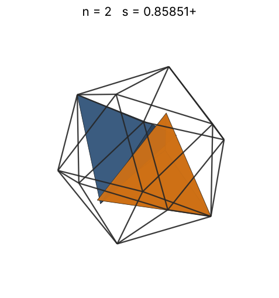 |
| 3 | [0.93217+](tetinico_n03.json) | 0.932176302083 |  | 0.54520 | 0.2001 | 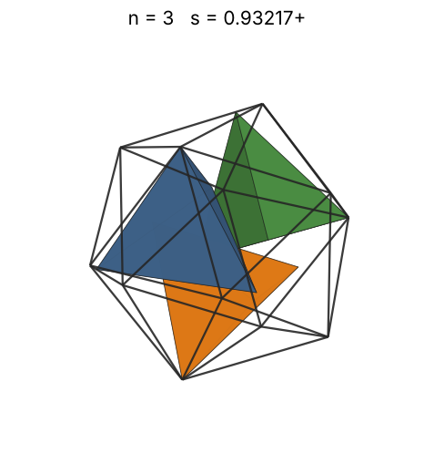 |
| 4 | [0.98651+](tetinico_n04.json) | 0.986514118901 |  | 0.60007 | 0.2251 | 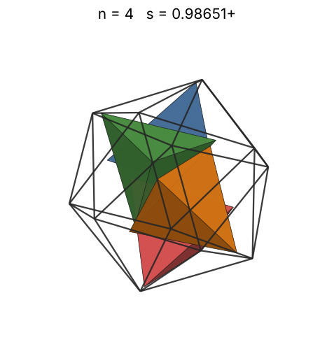 |
| 5 | [1.00910+](tetinico_n05.json) | 1.009100454629 |  | 0.64640 | 0.2628 | 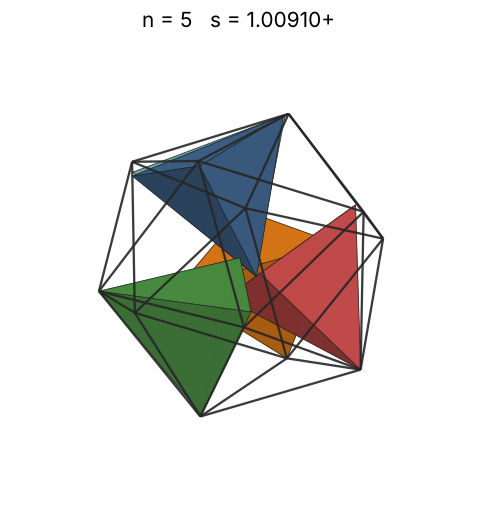 |
| 6 | [1.01873+](tetinico_n06.json) | 1.018736988907 |  | 0.68691 | 0.3066 | 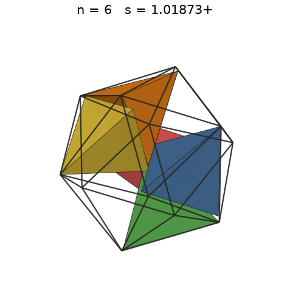 |
| 7 | [1.02192+](tetinico_n07.json) | 1.021923681078 |  | 0.72312 | 0.3543 | 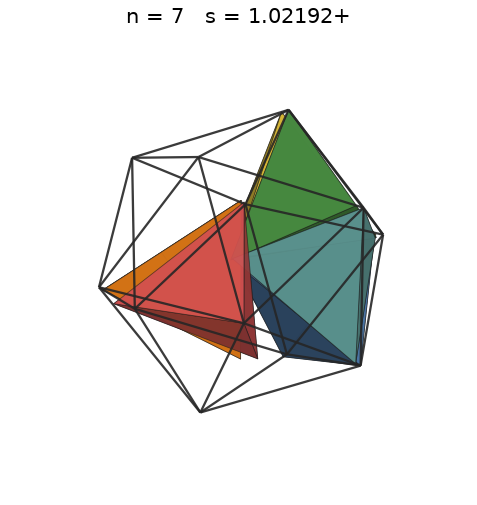 |
| 8 | [1.02972+](tetinico_n08.json) | 1.029729161663 |  | 0.75604 | 0.3958 | 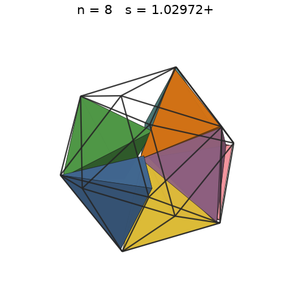 |
| 9 | [1.03275+](tetinico_n09.json) | 1.032751304494 |  | 0.78631 | 0.4414 | 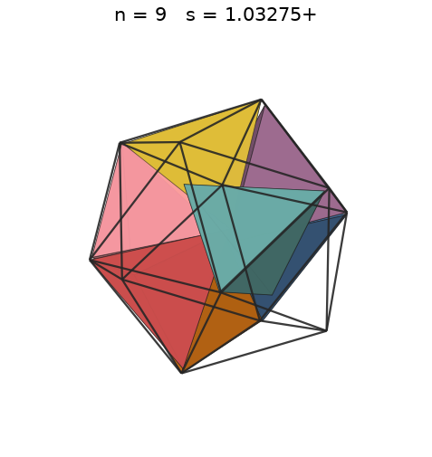 |
| 10 | [1.04133+](tetinico_n10.json) | 1.041332849878 |  | 0.81442 | 0.4784 | 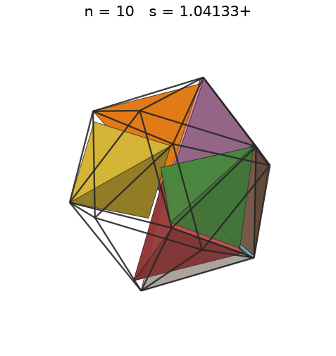 |
| 11 | [1.04642+](tetinico_n11.json) | 1.046426129145 |  | 0.84071 | 0.5186 | 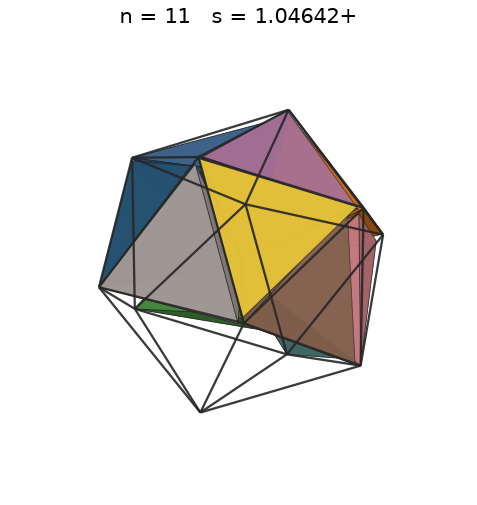 |
| 12 | [1.05210+](tetinico_n12.json) | 1.052102189845 |  | 0.86545 | 0.5566 | 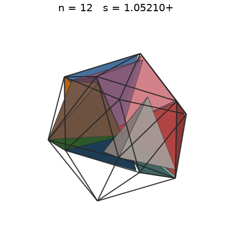 |
| 13 | [1.05901+](tetinico_n13.json) | 1.059015516571 |  | 0.88885 | 0.5913 | 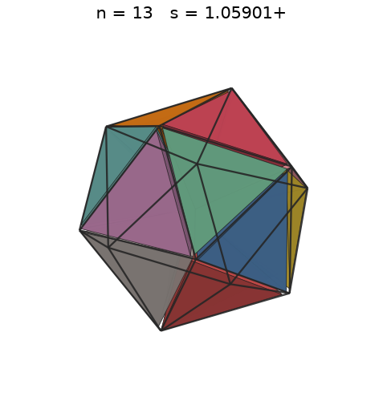 |
| 14 | [1.06085+](tetinico_n14.json) | 1.060859202994 |  | 0.91108 | 0.6334 | 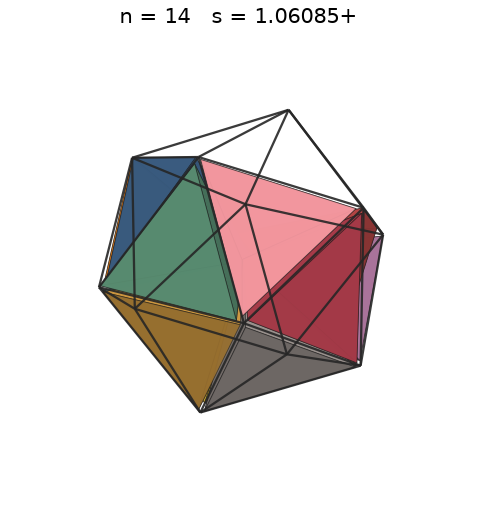 |
| 15 | [1.06512+](tetinico_n15.json) | 1.065126608877 |  | 0.93227 | 0.6705 | 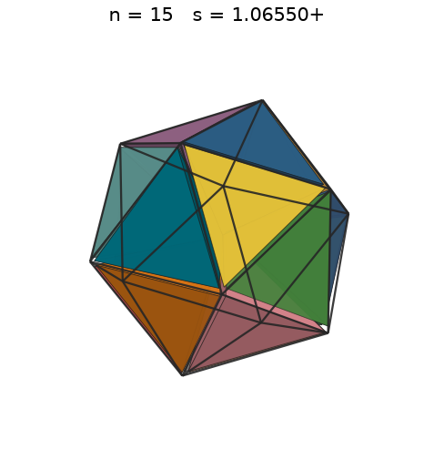 |
| 16 | [1.06958+](tetinico_n16.json) | 1.069580596605 |  | 0.95255 | 0.7063 | 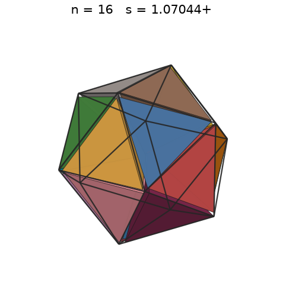 |
| 17 | [1.07326+](tetinico_n17.json) | 1.073261596333 |  | 0.97199 | 0.7428 | 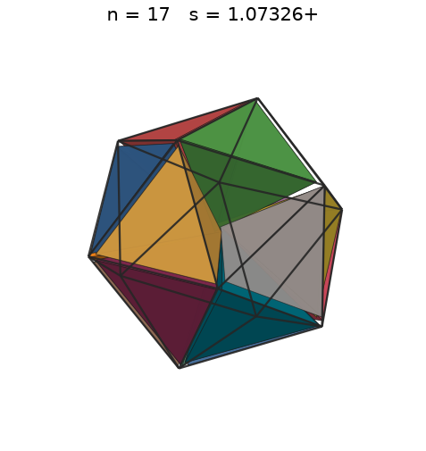 |
| 18 | [1.07485+](tetinico_n18.json) | 1.074855531657 |  | 0.99069 | 0.7830 | 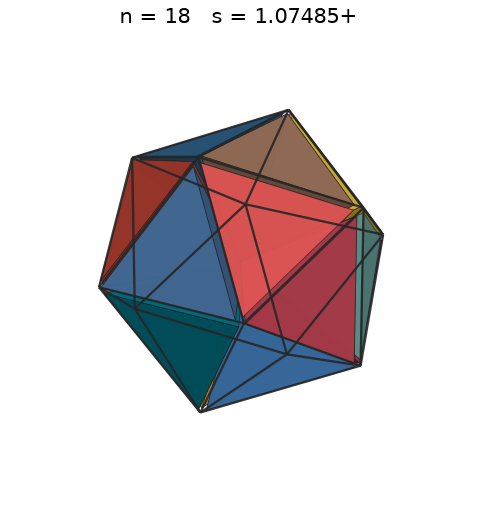 |
| 19 | [1.07687+](tetinico_n19.json) | 1.076875537546 |  | 1.00871 | 0.8219 | 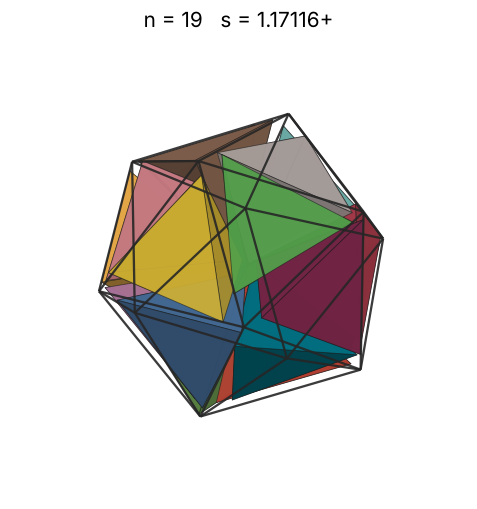 |
| 20 | [1.07879+](tetinico_n20.json) | 1.078797130313 |  | 1.02610 | 0.8605 | 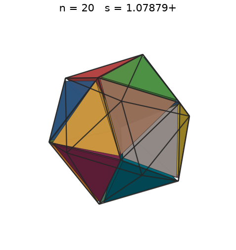 |
| 21 | [1.22051+](tetinico_n21.json) | 1.220513848115 |  | 1.04292 | 0.6239 | 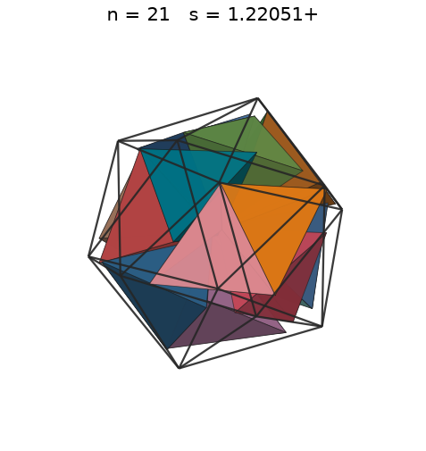 |
| 22 | [1.23572+](tetinico_n22.json) | 1.235728455756 |  | 1.05922 | 0.6298 | 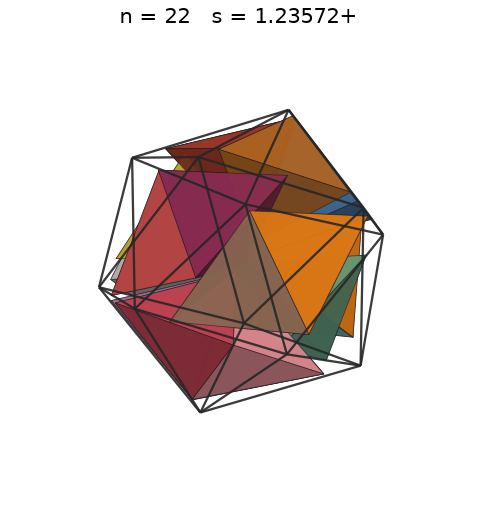 |
| 23 | [1.27089+](tetinico_n23.json) | 1.270892471272 |  | 1.07503 | 0.6053 | 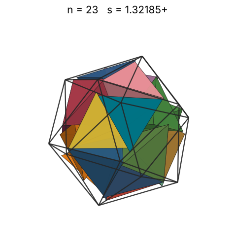 |
| 24 | [1.31955+](tetinico_n24.json) | 1.319556910595 |  | 1.09039 | 0.5642 | 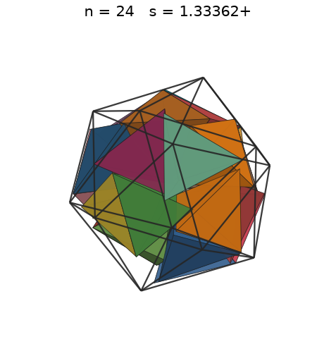 |
| 25 | [1.32584+](tetinico_n25.json) | 1.325849540799 |  | 1.10533 | 0.5794 | 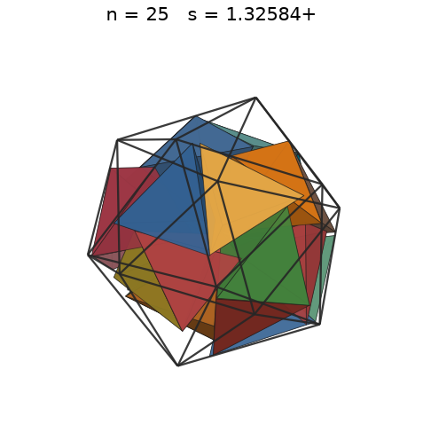 |
| 26 | [1.38484+](tetinico_n26.json) | 1.384844477658 |  | 1.11988 | 0.5288 | 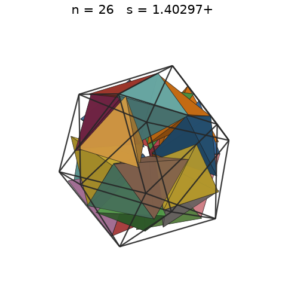 |
| 27 | [1.40297+](tetinico_n27.json) | 1.402974178883 |  | 1.13406 | 0.5281 | 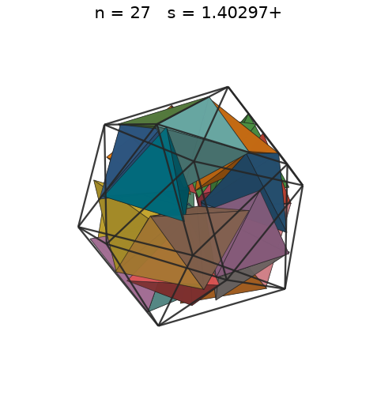 |
| 28 | [1.40297+](tetinico_n28.json) | 1.402974178886 |  | 1.14789 | 0.5477 | 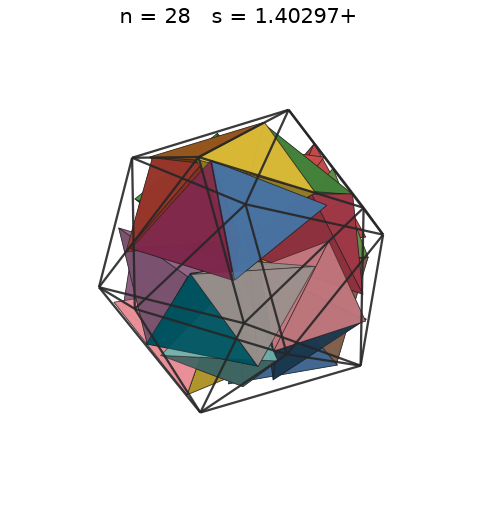 |
| 29 | [1.46398+](tetinico_n29.json) | 1.463984074919 |  | 1.16139 | 0.4993 | 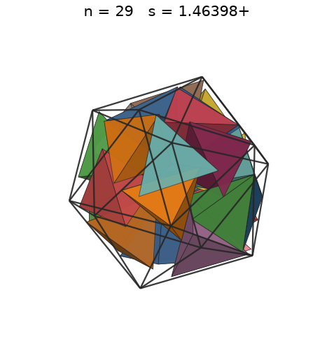 |
| 30 | [1.48504+](tetinico_n30.json) | 1.485046428193 |  | 1.17459 | 0.4948 | 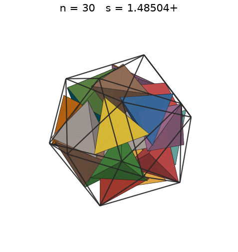 |
| 31 | [1.50970+](tetinico_n31.json) | 1.509708628853 |  | 1.18750 | 0.4867 | 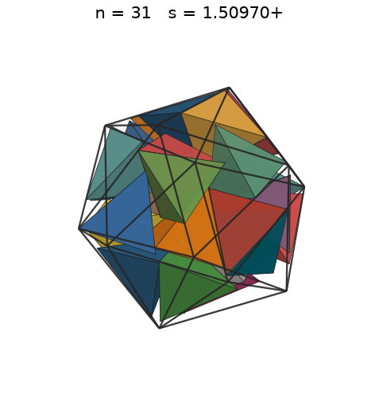 |
| 32 | [1.53248+](tetinico_n32.json) | 1.532483248031 |  | 1.20013 | 0.4803 | 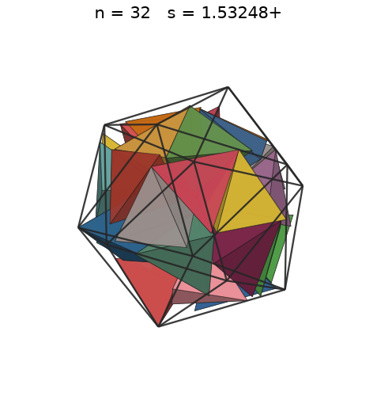 |
| 33 | [1.56468+](tetinico_n33.json) | 1.564688934961 |  | 1.21251 | 0.4653 | 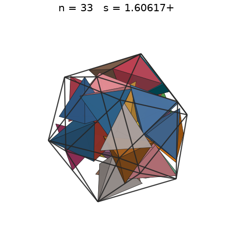 |
| 34 | [1.57026+](tetinico_n34.json) | 1.570266741883 |  | 1.22463 | 0.4743 | 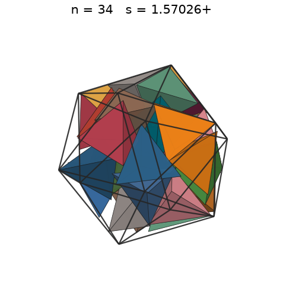 |
| 35 | [1.57026+](tetinico_n35.json) | 1.570266763833 |  | 1.23652 | 0.4883 | 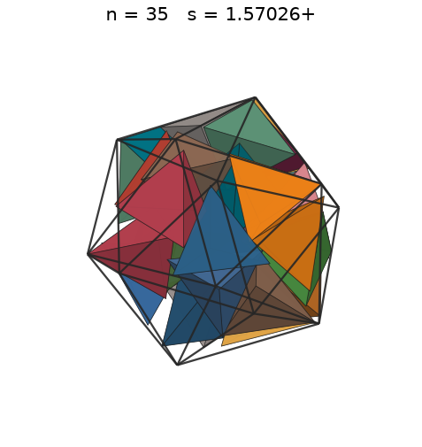 |
| 36 | [1.58760+](tetinico_n36.json) | 1.587601700916 |  | 1.24819 | 0.4860 | 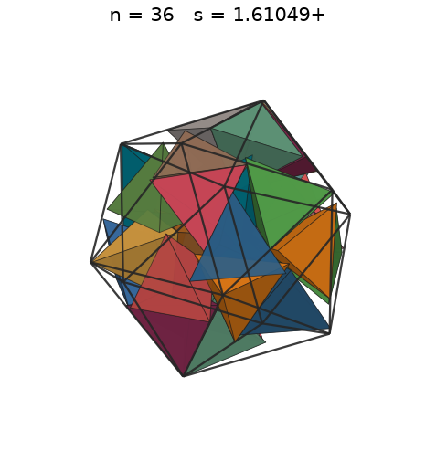 |
| 37 | [1.59245+](tetinico_n37.json) | 1.592457545679 |  | 1.25964 | 0.4949 | 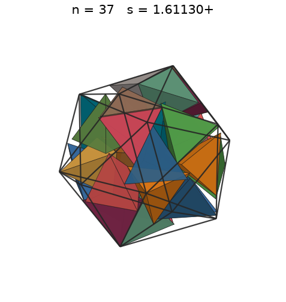 |
| 38 | [1.60076+](tetinico_n38.json) | 1.600761640213 |  | 1.27089 | 0.5004 | 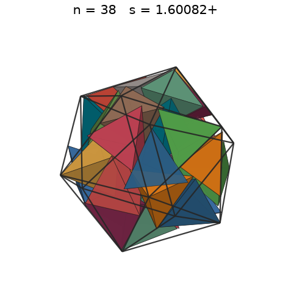 |
| 39 | [1.60888+](tetinico_n39.json) | 1.608880236831 |  | 1.28194 | 0.5059 |  |
| 40 | [1.60983+](tetinico_n40.json) | 1.609832079051 |  | 1.29281 | 0.5179 | 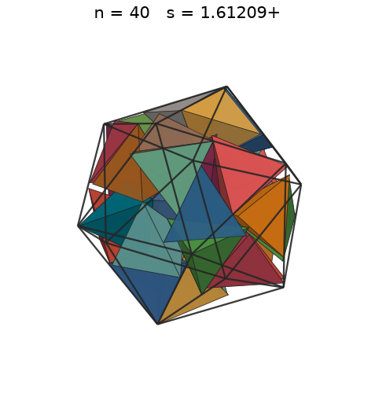 |
| 41 | [1.61231+](tetinico_n41.json) | 1.612319401279 |  | 1.30349 | 0.5284 |  |
| 42 | [1.61265+](tetinico_n42.json) | 1.612657307629 |  | 1.31400 | 0.5410 |  |
| 43 | [1.62200+](tetinico_n43.json) | 1.622004003500 |  | 1.32435 | 0.5443 |  |
| 44 | [1.63194+](tetinico_n44.json) | 1.631948394642 |  | 1.33454 | 0.5469 |  |
| 45 | [1.65196+](tetinico_n45.json) | 1.651966995660 |  | 1.34457 | 0.5392 |  |
| 46 | [1.66748+](tetinico_n46.json) | 1.667486601890 |  | 1.35446 | 0.5359 |  |
| 47 | [1.67192+](tetinico_n47.json) | 1.671928225003 |  | 1.36420 | 0.5432 |  |
| 48 | [1.68874+](tetinico_n48.json) | 1.688740925905 |  | 1.37381 | 0.5384 |  |
| 49 | [1.69341+](tetinico_n49.json) | 1.693412995594 |  | 1.38329 | 0.5451 |  |
| 50 | [1.71749+](tetinico_n50.json) | 1.717495542719 |  | 1.39263 | 0.5331 |  |
| 51 | [1.73174+](tetinico_n51.json) | 1.731741579528 |  | 1.40186 | 0.5305 |  |
| 52 | [1.73174+](tetinico_n52.json) | 1.731741580430 |  | 1.41096 | 0.5409 |  |
| 53 | [1.73174+](tetinico_n53.json) | 1.731741583687 |  | 1.41995 | 0.5513 |  |
| 54 | [1.73768+](tetinico_n54.json) | 1.737685000851 |  | 1.42882 | 0.5559 |  |
| 55 | [1.74317+](tetinico_n55.json) | 1.743176977375 |  | 1.43759 | 0.5609 |  |
| 56 | [1.75369+](tetinico_n56.json) | 1.753691933084 |  | 1.44625 | 0.5609 |  |
| 57 | [1.77033+](tetinico_n57.json) | 1.770330353995 |  | 1.45481 | 0.5549 |  |
| 58 | [1.78242+](tetinico_n58.json) | 1.782421003603 |  | 1.46326 | 0.5533 |  |
| 59 | [1.79914+](tetinico_n59.json) | 1.799143163670 |  | 1.47163 | 0.5473 |  |
| 60 | [1.80771+](tetinico_n60.json) | 1.807717692082 |  | 1.47989 | 0.5487 |  |
| 61 | [1.85611+](tetinico_n61.json) | 1.856113891558 |  | 1.48807 | 0.5153 |  |
| 62 | [1.88118+](tetinico_n62.json) | 1.881180114880 |  | 1.49616 | 0.5031 |  |
| 63 | [1.88118+](tetinico_n63.json) | 1.881180136003 |  | 1.50416 | 0.5112 |  |
| 64 | [1.88118+](tetinico_n64.json) | 1.881180137606 |  | 1.51207 | 0.5193 |  |
| 65 | [1.91056+](tetinico_n65.json) | 1.910568700810 |  | 1.51991 | 0.5035 |  |
| 66 | [1.93713+](tetinico_n66.json) | 1.937139810038 |  | 1.52766 | 0.4905 |  |
| 67 | [1.94363+](tetinico_n67.json) | 1.943638136656 |  | 1.53534 | 0.4929 |  |
| 68 | [1.94531+](tetinico_n68.json) | 1.945315749991 |  | 1.54294 | 0.4990 |  |
| 69 | [1.95150+](tetinico_n69.json) | 1.951504010684 |  | 1.55047 | 0.5015 |  |
| 70 | [1.96579+](tetinico_n70.json) | 1.965795654082 |  | 1.55792 | 0.4978 |  |
| 71 | [1.96579+](tetinico_n71.json) | 1.965795663360 |  | 1.56531 | 0.5049 |  |
| 72 | [1.97831+](tetinico_n72.json) | 1.978317862567 |  | 1.57262 | 0.5023 |  |
| 73 | [1.97831+](tetinico_n73.json) | 1.978317863718 |  | 1.57987 | 0.5093 |  |
| 74 | [1.98779+](tetinico_n74.json) | 1.987794132196 |  | 1.58705 | 0.5089 |  |
| 75 | [2.00130+](tetinico_n75.json) | 2.001300506234 |  | 1.59417 | 0.5054 |  |
| 76 | [2.00130+](tetinico_n76.json) | 2.001300506234 |  | 1.60122 | 0.5122 |  |
| 77 | [2.00130+](tetinico_n77.json) | 2.001300506234 |  | 1.60821 | 0.5189 |  |
| 78 | [2.00130+](tetinico_n78.json) | 2.001300506234 |  | 1.61514 | 0.5257 |  |
| 79 | [2.00130+](tetinico_n79.json) | 2.001300506234 |  | 1.62202 | 0.5324 |  |
| 80 | [2.00130+](tetinico_n80.json) | 2.001300506234 |  | 1.62883 | 0.5391 |  |
| 81 | [2.00130+](tetinico_n81.json) | 2.001300506899 |  | 1.63559 | 0.5459 |  |
| 82 | [2.00130+](tetinico_n82.json) | 2.001300506950 |  | 1.64230 | 0.5526 |  |
| 83 | [2.00130+](tetinico_n83.json) | 2.001300508567 |  | 1.64894 | 0.5593 |  |
| 84 | [2.00130+](tetinico_n84.json) | 2.001300509604 |  | 1.65554 | 0.5661 |  |
| 85 | [2.02619+](tetinico_n85.json) | 2.026199456000 |  | 1.66208 | 0.5520 |  |
| 86 | [2.02865+](tetinico_n86.json) | 2.028650516234 |  | 1.66858 | 0.5564 |  |
| 87 | [2.02865+](tetinico_n87.json) | 2.028650516759 |  | 1.67502 | 0.5629 |  |
| 88 | [2.03959+](tetinico_n88.json) | 2.039597897237 |  | 1.68141 | 0.5603 |  |
| 89 | [2.03959+](tetinico_n89.json) | 2.039597910424 |  | 1.68776 | 0.5666 |  |
| 90 | [2.04981+](tetinico_n90.json) | 2.049814562918 |  | 1.69405 | 0.5645 |  |
| 91 | [2.04981+](tetinico_n91.json) | 2.049814566083 |  | 1.70031 | 0.5707 |  |
| 92 | [2.05608+](tetinico_n92.json) | 2.056086159010 |  | 1.70651 | 0.5717 |  |
| 93 | [2.05608+](tetinico_n93.json) | 2.056086161008 |  | 1.71267 | 0.5780 |  |
| 94 | [2.05608+](tetinico_n94.json) | 2.056086161542 |  | 1.71879 | 0.5842 |  |
| 95 | [2.07124+](tetinico_n95.json) | 2.071248963172 |  | 1.72486 | 0.5775 |  |
| 96 | [2.07256+](tetinico_n96.json) | 2.072567086528 |  | 1.73089 | 0.5825 |  |
| 97 | [2.07743+](tetinico_n97.json) | 2.077437671339 |  | 1.73688 | 0.5844 |  |
| 98 | [2.08636+](tetinico_n98.json) | 2.086369102164 |  | 1.74283 | 0.5829 |  |
| 99 | [2.08931+](tetinico_n99.json) | 2.089310366870 |  | 1.74874 | 0.5864 |  |
| 100 | [2.08931+](tetinico_n100.json) | 2.089310367056 |  | 1.75461 | 0.5923 |  |
