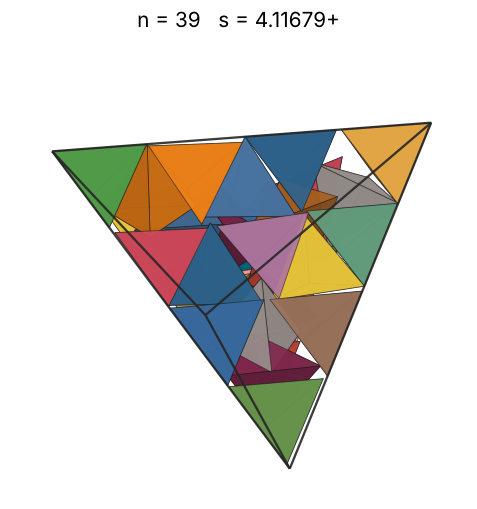
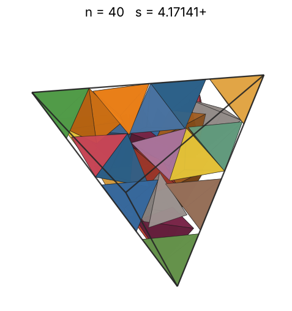

# Tetrahedra in a tetrahedron

s = container edge / piece edge; every row certified in exact arithmetic.

| n | s | touching limit | closed form (conj.) | previous best | volume bound | density | picture |
|---|---|---|---|---|---|---|---|
| 2 | [1.95356+](tetintet_n02.json) | 1.953564244562 |  |  | 1.25992 | 0.2683 |  |
| 3 | [2.00000+](tetintet_n03.json) | 2.000000000000 | 2 |  | 1.44225 | 0.3750 |  |
| 4 | [2.00000+](tetintet_n04.json) | 2.000000000000 | 2 |  | 1.58740 | 0.5000 |  |
| 5 | [2.00000+](tetintet_n05.json) | 2.000000000000 | 2 |  | 1.70998 | 0.6250 |  |
| 6 | [2.29099+](tetintet_n06.json) | 2.290994448736 | (3 + √15)/3 |  | 1.81712 | 0.4990 |  |
| 7 | [2.38195+](tetintet_n07.json) | 2.381950919771 |  |  | 1.91293 | 0.5180 |  |
| 8 | [2.38742+](tetintet_n08.json) | 2.387425886723 | (4 + √10)/3 |  | 2.00000 | 0.5879 |  |
| 9 | [2.61556+](tetintet_n09.json) | 2.615562886146 |  |  | 2.08008 | 0.5030 |  |
| 10 | [2.70630+](tetintet_n10.json) | 2.706302738760 |  |  | 2.15443 | 0.5045 |  |
| 11 | [2.81135+](tetintet_n11.json) | 2.811349188098 |  |  | 2.22398 | 0.4950 |  |
| 12 | [2.86959+](tetintet_n12.json) | 2.869591276504 |  |  | 2.28943 | 0.5078 |  |
| 13 | [2.91745+](tetintet_n13.json) | 2.917457275215 |  |  | 2.35133 | 0.5235 |  |
| 14 | [2.94417+](tetintet_n14.json) | 2.944176826254 |  |  | 2.41014 | 0.5486 |  |
| 15 | [3.00000+](tetintet_n15.json) | 3.000000000000 | 3 |  | 2.46621 | 0.5556 |  |
| 16 | [3.03538+](tetintet_n16.json) | 3.035379871869 |  |  | 2.51984 | 0.5721 |  |
| 17 | [3.10062+](tetintet_n17.json) | 3.100622157389 |  |  | 2.57128 | 0.5703 |  |
| 18 | [3.11481+](tetintet_n18.json) | 3.114814352450 |  |  | 2.62074 | 0.5956 |  |
| 19 | [3.18727+](tetintet_n19.json) | 3.187270285440 |  |  | 2.66840 | 0.5868 |  |
| 20 | [3.24580+](tetintet_n20.json) | 3.245808359090 |  |  | 2.71442 | 0.5849 |  |
| 21 | [3.30794+](tetintet_n21.json) | 3.307939836785 |  |  | 2.75892 | 0.5802 |  |
| 22 | [3.34720+](tetintet_n22.json) | 3.347205848818 |  |  | 2.80204 | 0.5866 |  |
| 23 | [3.40339+](tetintet_n23.json) | 3.403395540574 |  |  | 2.84387 | 0.5834 |  |
| 24 | [3.46756+](tetintet_n24.json) | 3.467563694788 |  |  | 2.88450 | 0.5756 |  |
| 25 | [3.49565+](tetintet_n25.json) | 3.495651620084 |  |  | 2.92402 | 0.5853 |  |
| 26 | [3.58091+](tetintet_n26.json) | 3.580912024531 |  |  | 2.96250 | 0.5662 |  |
| 27 | [3.67236+](tetintet_n27.json) | 3.672359717136 |  |  | 3.00000 | 0.5452 |  |
| 28 | [3.72490+](tetintet_n28.json) | 3.724907310458 |  |  | 3.03659 | 0.5418 |  |
| 29 | [3.77820+](tetintet_n29.json) | 3.778202059150 |  |  | 3.07232 | 0.5377 |  |
| 30 | [3.82369+](tetintet_n30.json) | 3.823695103368 |  |  | 3.10723 | 0.5366 |  |
| 31 | [3.85290+](tetintet_n31.json) | 3.852907374128 |  |  | 3.14138 | 0.5420 |  |
| 32 | [3.87364+](tetintet_n32.json) | 3.873647299602 |  |  | 3.17480 | 0.5505 |  |
| 33 | [3.89636+](tetintet_n33.json) | 3.896367611374 |  |  | 3.20753 | 0.5579 |  |
| 34 | [3.94333+](tetintet_n34.json) | 3.943334971856 |  |  | 3.23961 | 0.5545 |  |
| 35 | [3.96563+](tetintet_n35.json) | 3.965636714828 |  |  | 3.27107 | 0.5612 |  |
| 36 | [3.98519+](tetintet_n36.json) | 3.985196685488 |  |  | 3.30193 | 0.5688 |  |
| 37 | [4.01521+](tetintet_n37.json) | 4.015211496729 |  |  | 3.33222 | 0.5716 |  |
| 38 | [4.04551+](tetintet_n38.json) | 4.045513955803 |  |  | 3.36198 | 0.5739 |  |
| 39 | [4.05826+](tetintet_n39.json) | 4.058267470040 |  |  | 3.39121 | 0.5835 |  |
| 40 | [4.08390+](tetintet_n40.json) | 4.083907773743 |  |  | 3.41995 | 0.5873 |  |
