# Tetrahedra in a tetrahedron

s = container edge / piece edge; every row certified in exact arithmetic.

| n | s | touching limit | closed form (conj.) | previous best | volume bound | density | picture |
|---|---|---|---|---|---|---|---|
| 2 | [1.95356+](tetintet_n02.json) | 1.953564244562 |  |  | 1.25992 | 0.2683 | 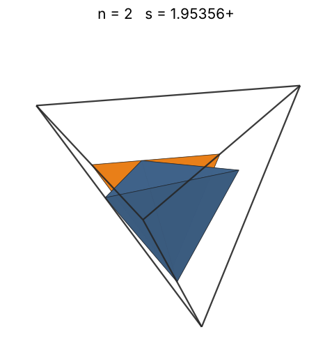 |
| 3 | [2.00000+](tetintet_n03.json) | 2.000000000000 | 2 |  | 1.44225 | 0.3750 | 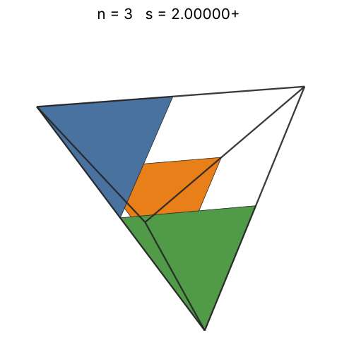 |
| 4 | [2.00000+](tetintet_n04.json) | 2.000000000000 | 2 |  | 1.58740 | 0.5000 | 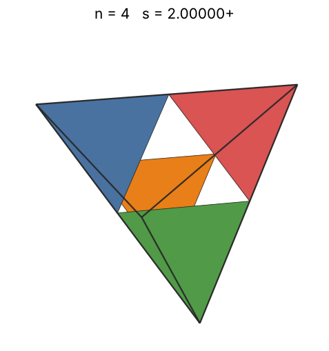 |
| 5 | [2.00000+](tetintet_n05.json) | 2.000000000000 | 2 |  | 1.70998 | 0.6250 | 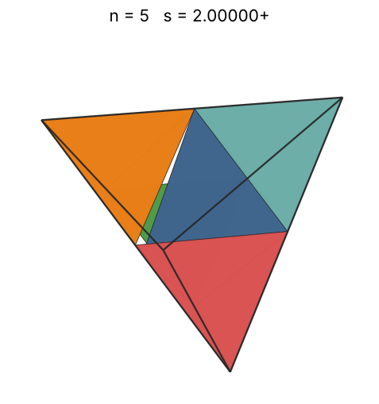 |
| 6 | [2.29099+](tetintet_n06.json) | 2.290994448736 | (3 + √15)/3 |  | 1.81712 | 0.4990 | 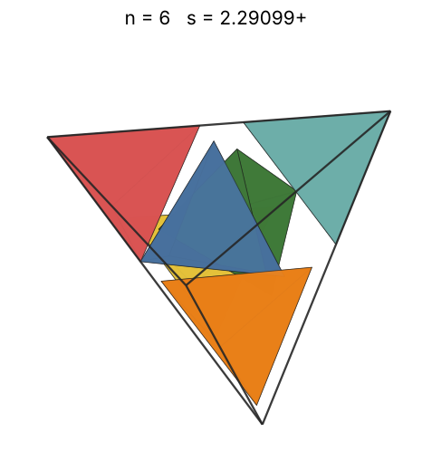 |
| 7 | [2.38195+](tetintet_n07.json) | 2.381950919771 |  |  | 1.91293 | 0.5180 | 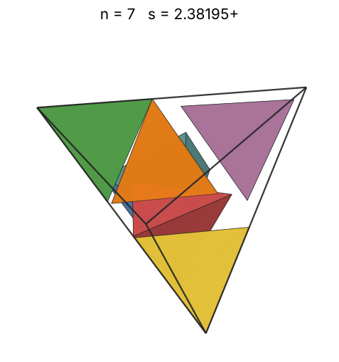 |
| 8 | [2.41421+](tetintet_n08.json) | 2.414213562373 | 1 + √2 |  | 2.00000 | 0.5685 | 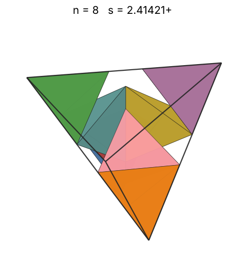 |
| 9 | [2.65503+](tetintet_n09.json) | 2.655035193536 |  |  | 2.08008 | 0.4809 | 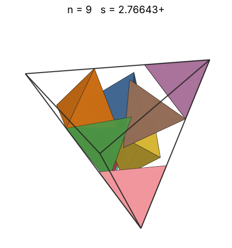 |
| 10 | [2.74153+](tetintet_n10.json) | 2.741532153464 |  |  | 2.15443 | 0.4853 | 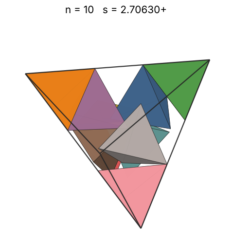 |
| 11 | [2.88886+](tetintet_n11.json) | 2.888860244400 |  |  | 2.22398 | 0.4563 | 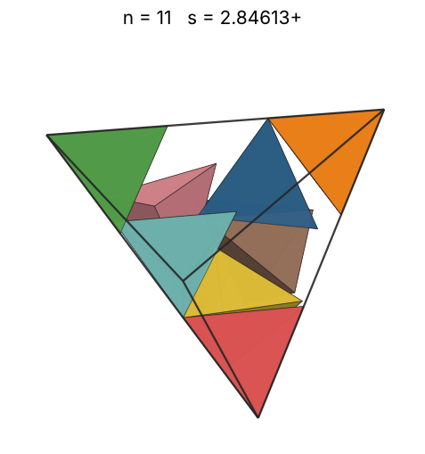 |
| 12 | [2.91844+](tetintet_n12.json) | 2.918447478009 |  |  | 2.28943 | 0.4828 | 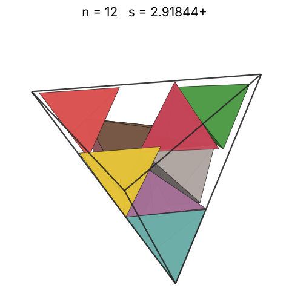 |
| 13 | [2.97194+](tetintet_n13.json) | 2.971939147181 |  |  | 2.35133 | 0.4952 | 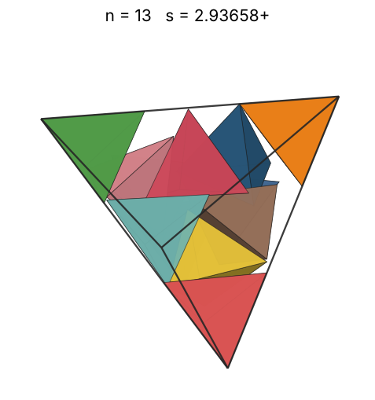 |
| 14 | [3.00000+](tetintet_n14.json) | 3.000000000000 | 3 |  | 2.41014 | 0.5185 | 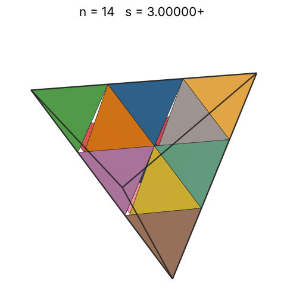 |
| 15 | [3.00000+](tetintet_n15.json) | 3.000000000000 | 3 |  | 2.46621 | 0.5556 | 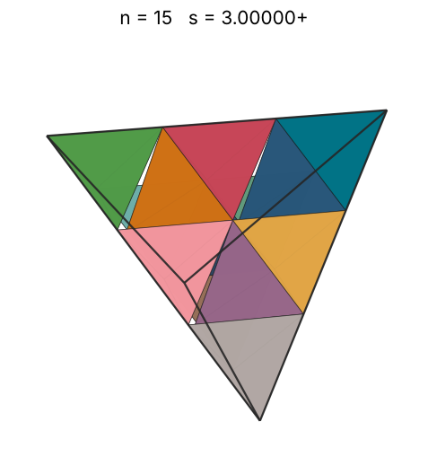 |
| 16 | [3.10703+](tetintet_n16.json) | 3.107036589856 |  |  | 2.51984 | 0.5334 | 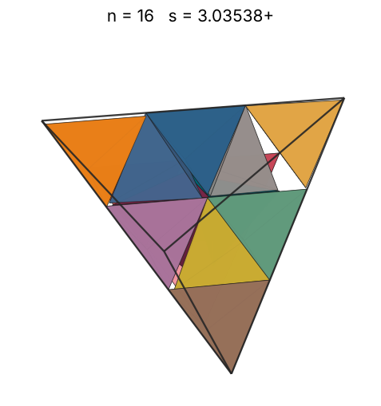 |
| 17 | [3.11687+](tetintet_n17.json) | 3.116875024143 |  |  | 2.57128 | 0.5614 | 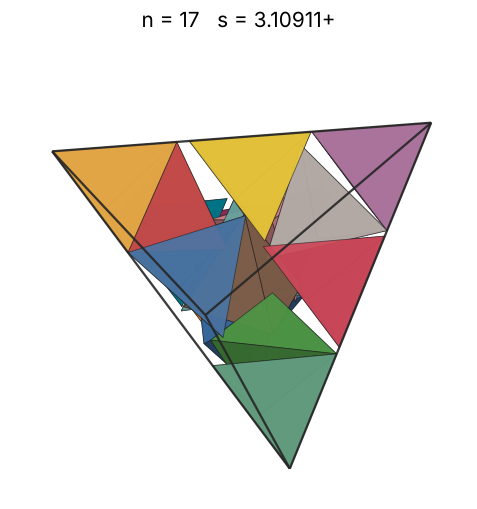 |
| 18 | [3.14314+](tetintet_n18.json) | 3.143147696174 |  |  | 2.62074 | 0.5797 | 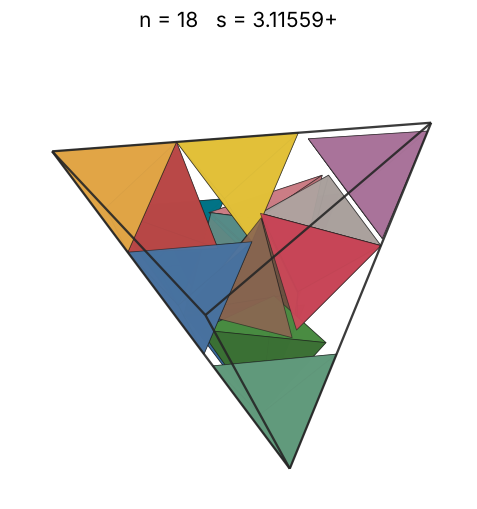 |
| 19 | [3.24448+](tetintet_n19.json) | 3.244488871267 |  |  | 2.66840 | 0.5563 | 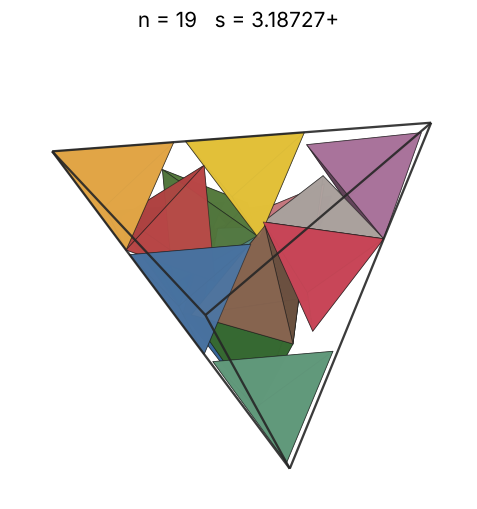 |
| 20 | [3.38073+](tetintet_n20.json) | 3.380735063400 |  |  | 2.71442 | 0.5176 | 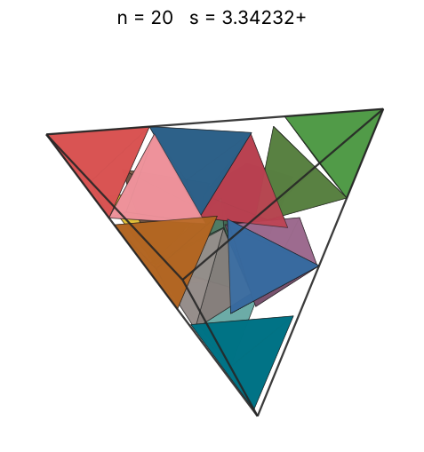 |
| 21 | [4.00000+](tetintet_n21.json) | 4.000000000000 | 4 |  | 2.75892 | 0.3281 | 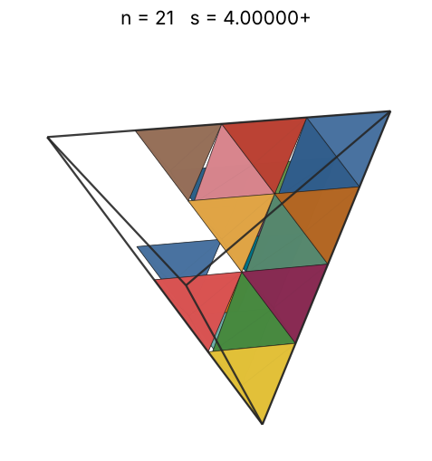 |
| 22 | [4.00000+](tetintet_n22.json) | 4.000000000000 | 4 |  | 2.80204 | 0.3437 | 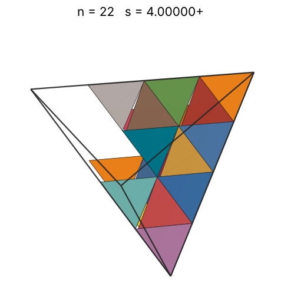 |
| 23 | [4.00000+](tetintet_n23.json) | 4.000000000000 | 4 |  | 2.84387 | 0.3594 | 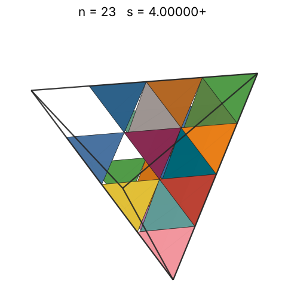 |
| 24 | [4.00000+](tetintet_n24.json) | 4.000000000000 | 4 |  | 2.88450 | 0.3750 | 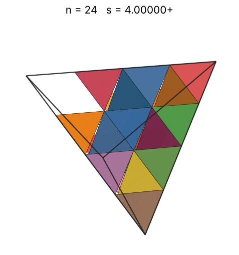 |
| 25 | [4.00000+](tetintet_n25.json) | 4.000000000000 | 4 |  | 2.92402 | 0.3906 | 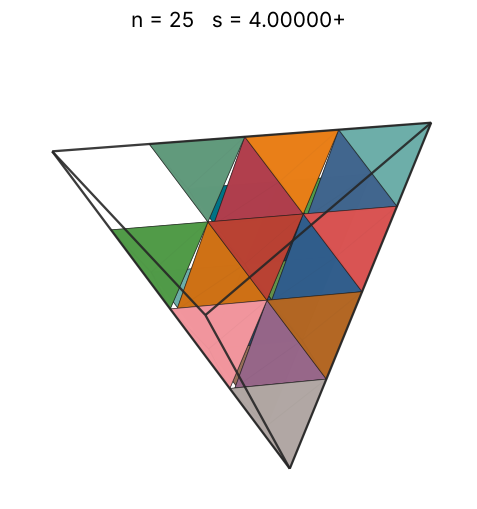 |
| 26 | [4.00000+](tetintet_n26.json) | 4.000000000000 | 4 |  | 2.96250 | 0.4062 | 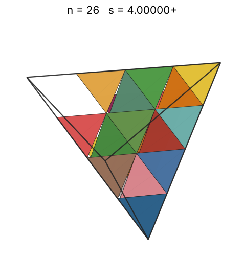 |
| 27 | [4.00000+](tetintet_n27.json) | 4.000000000000 | 4 |  | 3.00000 | 0.4219 | 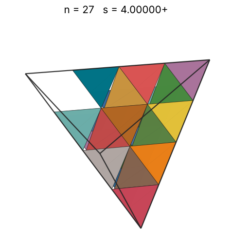 |
| 28 | [4.00000+](tetintet_n28.json) | 4.000000000000 | 4 |  | 3.03659 | 0.4375 | 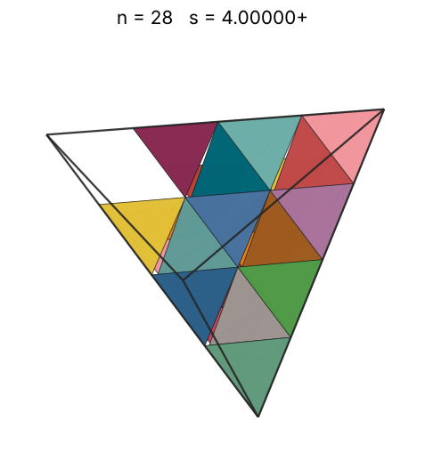 |
| 29 | [4.00000+](tetintet_n29.json) | 4.000000000000 | 4 |  | 3.07232 | 0.4531 | 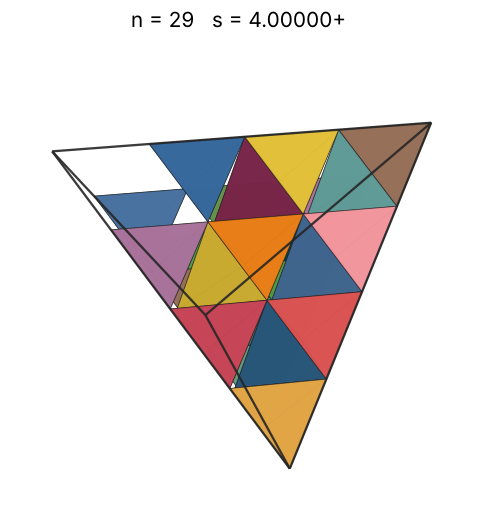 |
| 30 | [4.00000+](tetintet_n30.json) | 4.000000000000 | 4 |  | 3.10723 | 0.4687 | 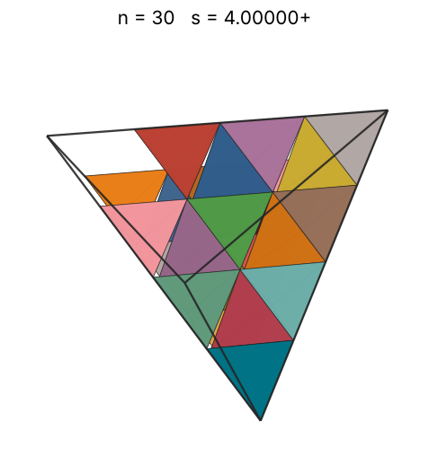 |
| 31 | [4.00000+](tetintet_n31.json) | 4.000000000000 | 4 |  | 3.14138 | 0.4844 | 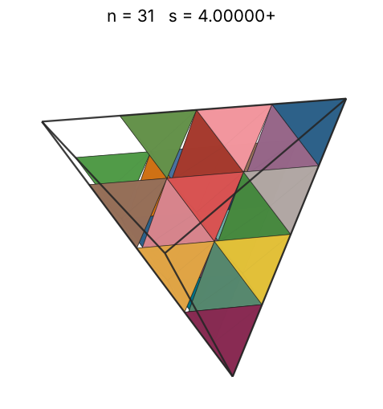 |
| 32 | [4.00000+](tetintet_n32.json) | 4.000000000000 | 4 |  | 3.17480 | 0.5000 | 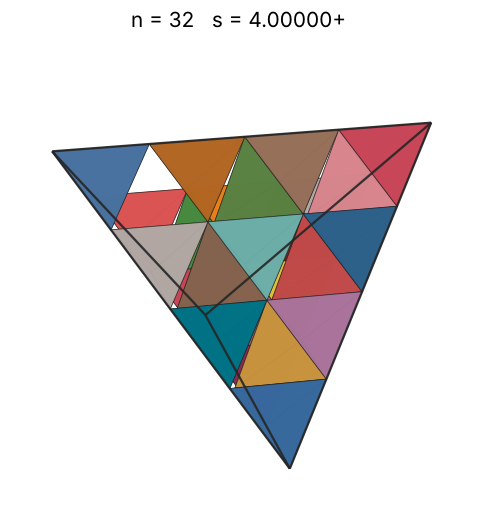 |
| 33 | [4.00000+](tetintet_n33.json) | 4.000000000000 | 4 |  | 3.20753 | 0.5156 | 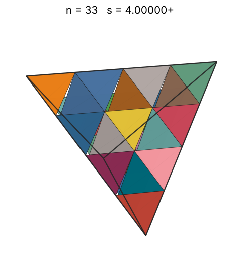 |
| 34 | [4.00000+](tetintet_n34.json) | 4.000000000000 | 4 |  | 3.23961 | 0.5312 | 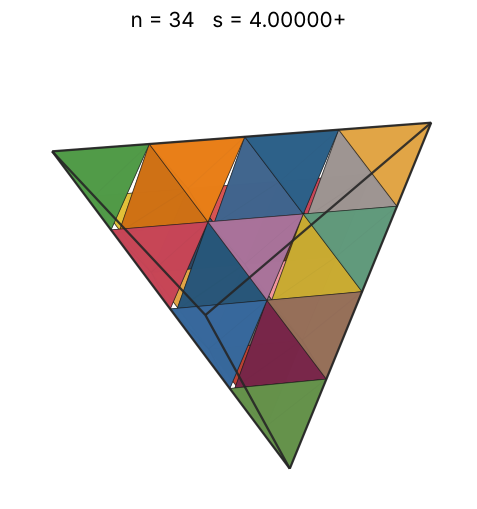 |
| 35 | [4.00588+](tetintet_n35.json) | 4.005885898020 |  |  | 3.27107 | 0.5445 | 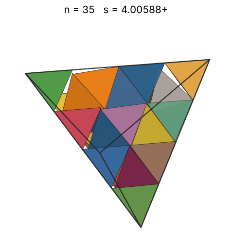 |
| 36 | [4.02362+](tetintet_n36.json) | 4.023625644473 |  |  | 3.30193 | 0.5526 | 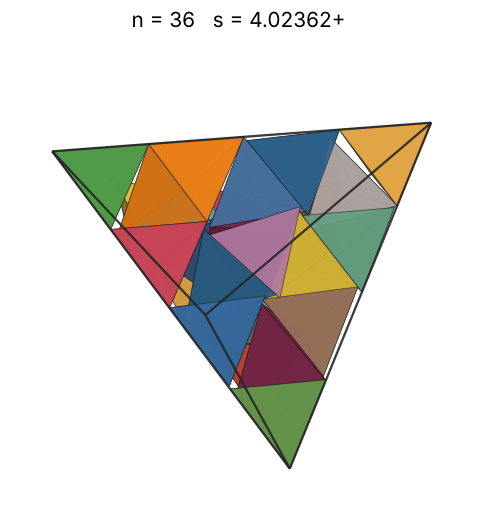 |
| 37 | [4.04601+](tetintet_n37.json) | 4.046010407025 |  |  | 3.33222 | 0.5586 | 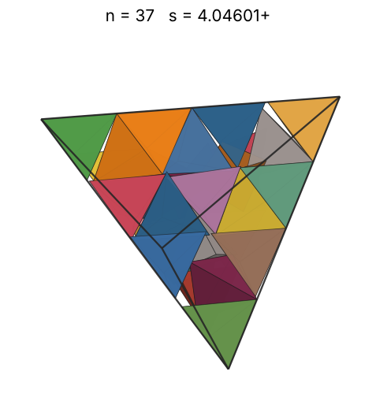 |
| 38 | [4.06715+](tetintet_n38.json) | 4.067158584721 |  |  | 3.36198 | 0.5648 | 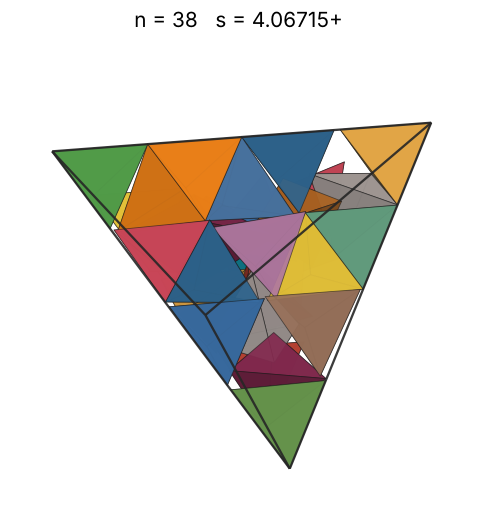 |
