# Tetrahedra in a tetrahedron

s = container edge / piece edge; every row certified in exact arithmetic.

| n | s | touching limit | closed form (conj.) | volume bound | density | picture |
|---|---|---|---|---|---|---|
| 2 | [1.95356+](tetintet_n02.json) | 1.953564244562 |  | 1.25992 | 0.2683 | 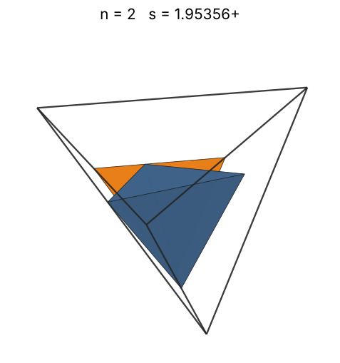 |
| 3 | [2.00000+](tetintet_n03.json) | 2.000000000000 | 2 | 1.44225 | 0.3750 | 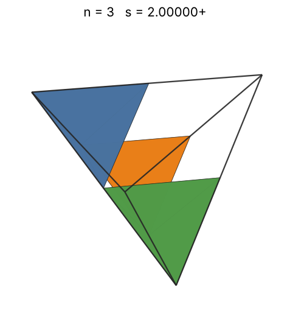 |
| 4 | [2.00000+](tetintet_n04.json) | 2.000000000000 | 2 | 1.58740 | 0.5000 | 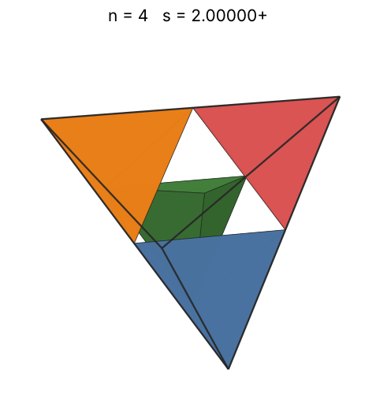 |
| 5 | [2.00000+](tetintet_n05.json) | 2.000000000000 | 2 | 1.70998 | 0.6250 | 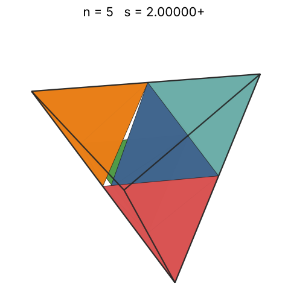 |
| 6 | [2.29099+](tetintet_n06.json) | 2.290994448736 | (3 + √15)/3 | 1.81712 | 0.4990 | 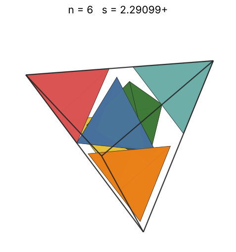 |
| 7 | [2.38195+](tetintet_n07.json) | 2.381950919771 |  | 1.91293 | 0.5180 | 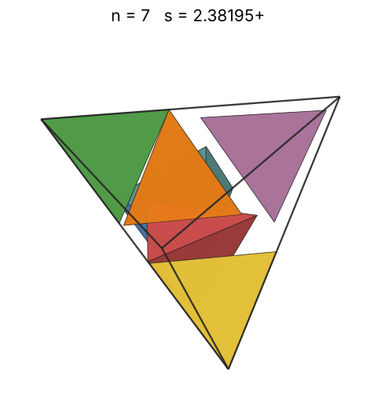 |
| 8 | [2.38742+](tetintet_n08.json) | 2.387425886723 | (4 + √10)/3 | 2.00000 | 0.5879 | 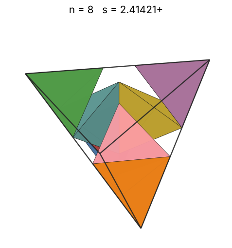 |
| 9 | [2.61556+](tetintet_n09.json) | 2.615562886146 |  | 2.08008 | 0.5030 | 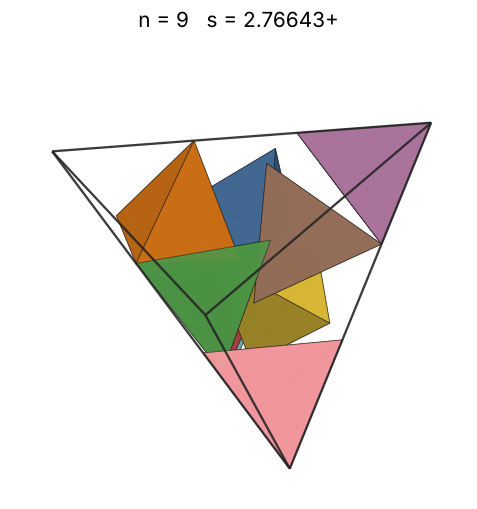 |
| 10 | [2.70630+](tetintet_n10.json) | 2.706302738760 |  | 2.15443 | 0.5045 | 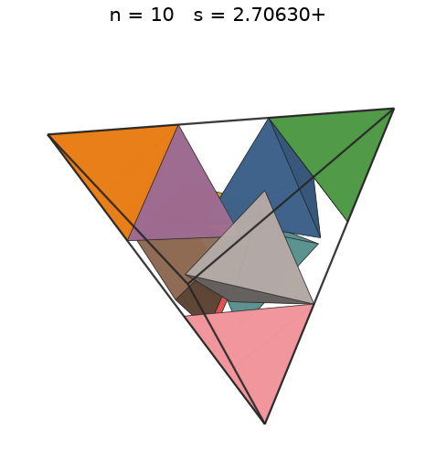 |
| 11 | [2.79826+](tetintet_n11.json) | 2.798268822114 |  | 2.22398 | 0.5020 | 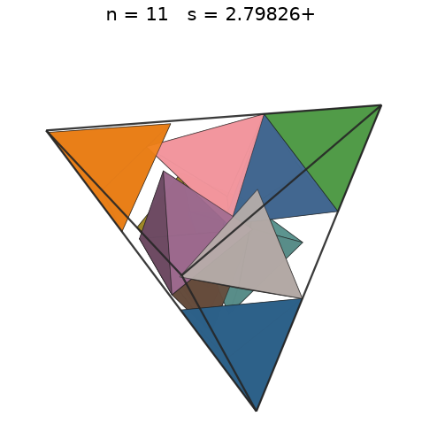 |
| 12 | [2.85760+](tetintet_n12.json) | 2.857604249737 |  | 2.28943 | 0.5143 | 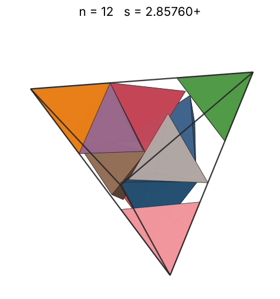 |
| 13 | [2.91514+](tetintet_n13.json) | 2.915144785815 |  | 2.35133 | 0.5248 | 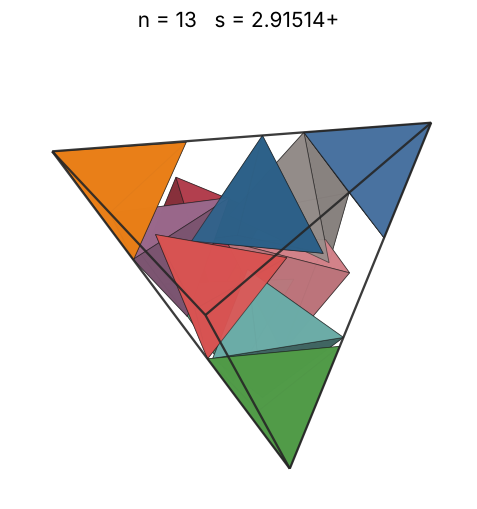 |
| 14 | [2.94300+](tetintet_n14.json) | 2.943004412845 |  | 2.41014 | 0.5492 | 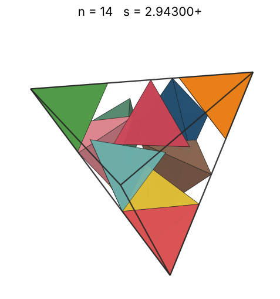 |
| 15 | [2.98883+](tetintet_n15.json) | 2.988832622915 |  | 2.46621 | 0.5618 | 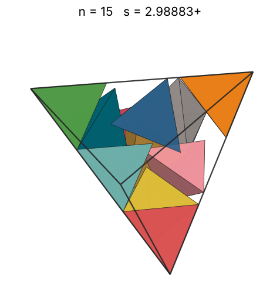 |
| 16 | [3.03538+](tetintet_n16.json) | 3.035379871869 |  | 2.51984 | 0.5721 | 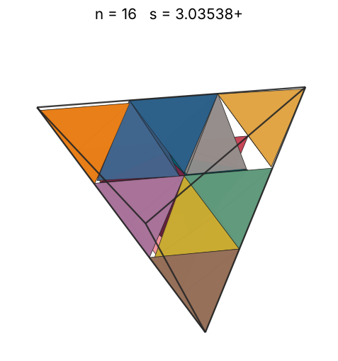 |
| 17 | [3.08936+](tetintet_n17.json) | 3.089367442860 |  | 2.57128 | 0.5766 | 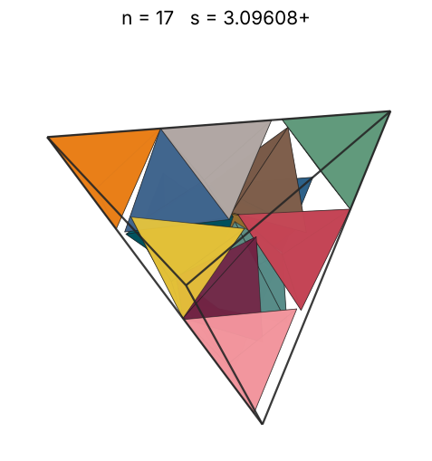 |
| 18 | [3.11466+](tetintet_n18.json) | 3.114665255980 | 251704511789/6577993305 - 6027514273√654/4385328870 | 2.62074 | 0.5957 | 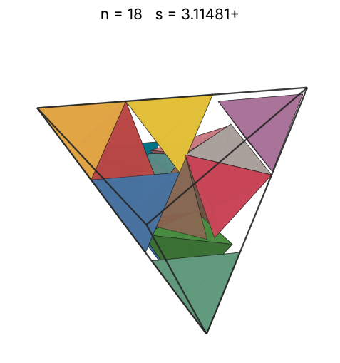 |
| 19 | [3.18717+](tetintet_n19.json) | 3.187172298392 |  | 2.66840 | 0.5869 | 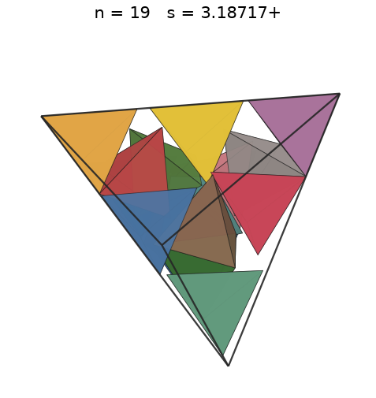 |
| 20 | [3.24321+](tetintet_n20.json) | 3.243214291667 |  | 2.71442 | 0.5863 | 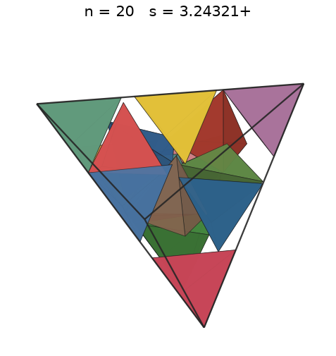 |
| 21 | [3.29827+](tetintet_n21.json) | 3.298271087280 |  | 2.75892 | 0.5853 | 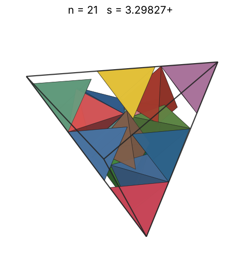 |
| 22 | [3.34340+](tetintet_n22.json) | 3.343400290311 |  | 2.80204 | 0.5886 | 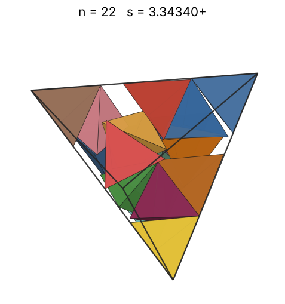 |
| 23 | [3.38259+](tetintet_n23.json) | 3.382591178958 |  | 2.84387 | 0.5943 | 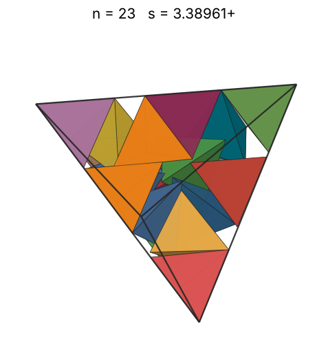 |
| 24 | [3.43388+](tetintet_n24.json) | 3.433882755073 |  | 2.88450 | 0.5927 | 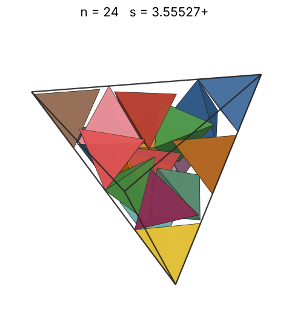 |
| 25 | [3.48910+](tetintet_n25.json) | 3.489101258581 |  | 2.92402 | 0.5886 | 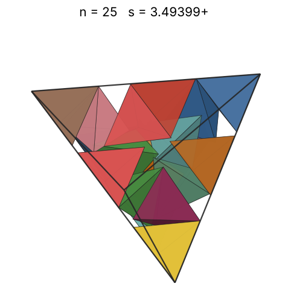 |
| 26 | [3.58091+](tetintet_n26.json) | 3.580912024531 |  | 2.96250 | 0.5662 | 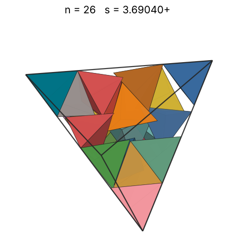 |
| 27 | [3.61602+](tetintet_n27.json) | 3.616026543596 |  | 3.00000 | 0.5710 | 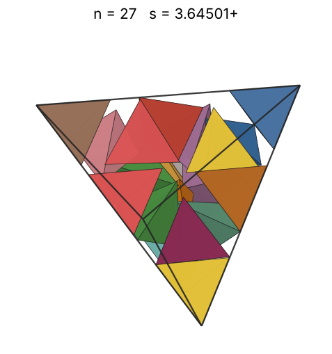 |
| 28 | [3.68963+](tetintet_n28.json) | 3.689630436626 |  | 3.03659 | 0.5575 | 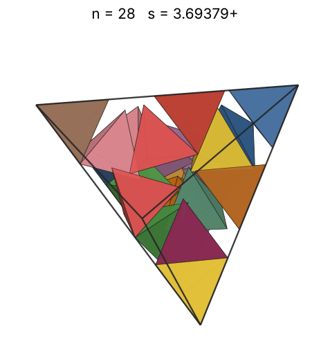 |
| 29 | [3.71166+](tetintet_n29.json) | 3.711666829528 |  | 3.07232 | 0.5671 | 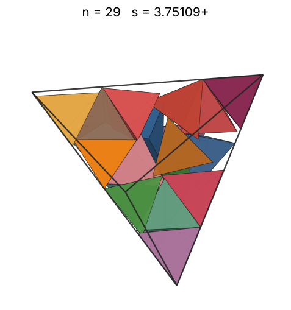 |
| 30 | [3.75412+](tetintet_n30.json) | 3.754127310253 |  | 3.10723 | 0.5670 | 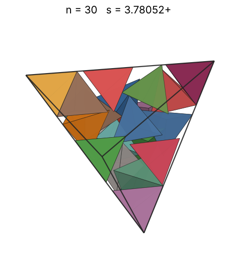 |
| 31 | [3.82327+](tetintet_n31.json) | 3.823270957861 |  | 3.14138 | 0.5547 | 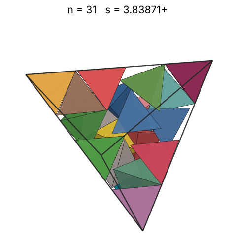 |
| 32 | [3.85384+](tetintet_n32.json) | 3.853840802146 |  | 3.17480 | 0.5591 | 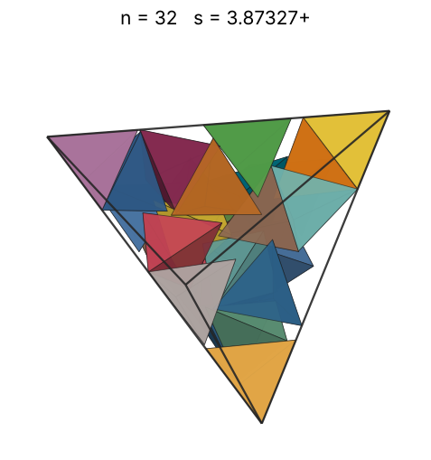 |
| 33 | [3.89213+](tetintet_n33.json) | 3.892137870715 |  | 3.20753 | 0.5597 |  |
| 34 | [3.92757+](tetintet_n34.json) | 3.927572375367 |  | 3.23961 | 0.5612 | 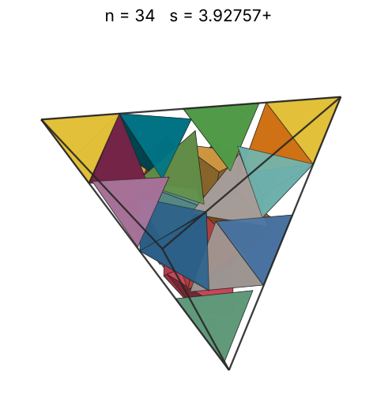 |
| 35 | [3.95251+](tetintet_n35.json) | 3.952509102022 |  | 3.27107 | 0.5668 | 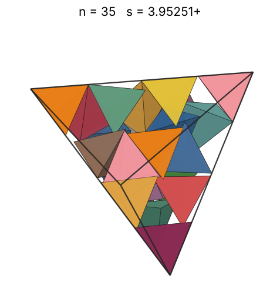 |
| 36 | [3.97133+](tetintet_n36.json) | 3.971339135396 |  | 3.30193 | 0.5748 | 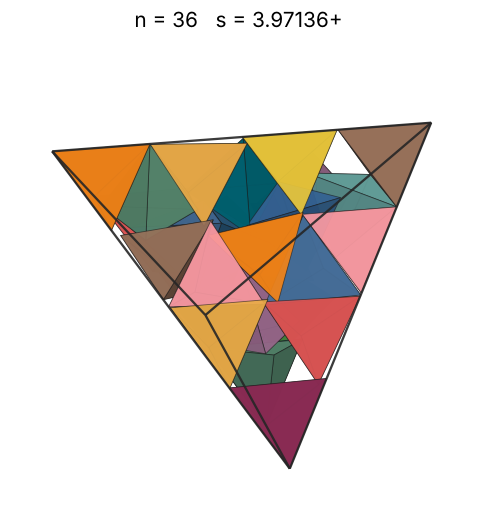 |
| 37 | [3.99814+](tetintet_n37.json) | 3.998141525791 |  | 3.33222 | 0.5789 | 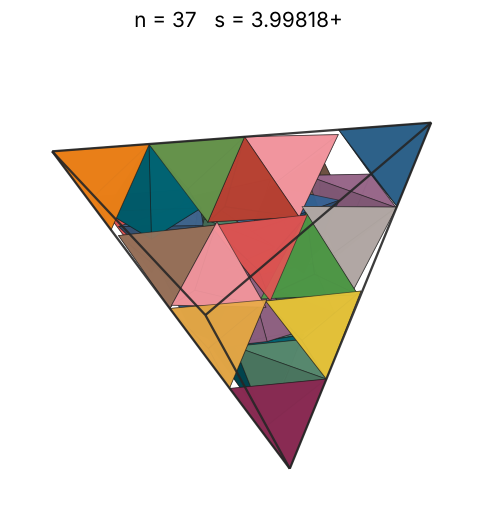 |
| 38 | [4.03555+](tetintet_n38.json) | 4.035550833031 |  | 3.36198 | 0.5782 | 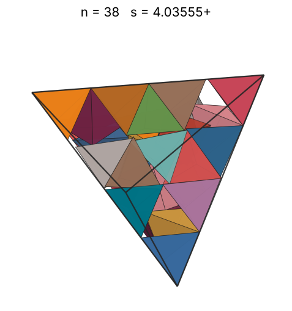 |
| 39 | [4.04630+](tetintet_n39.json) | 4.046303145922 |  | 3.39121 | 0.5887 | 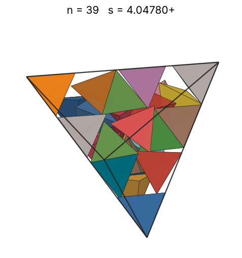 |
| 40 | [4.05505+](tetintet_n40.json) | 4.055057480172 |  | 3.41995 | 0.5999 | 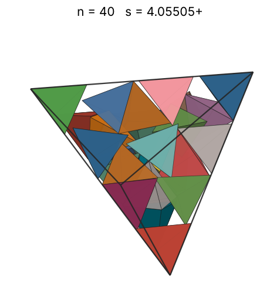 |
| 41 | [4.09742+](tetintet_n41.json) | 4.097428527450 |  | 3.44822 | 0.5960 |  |
| 42 | [4.12193+](tetintet_n42.json) | 4.121936393071 |  | 3.47603 | 0.5997 |  |
| 43 | [4.19277+](tetintet_n43.json) | 4.192776122022 |  | 3.50340 | 0.5834 |  |
| 44 | [4.23486+](tetintet_n44.json) | 4.234861143550 |  | 3.53035 | 0.5793 |  |
| 45 | [4.25822+](tetintet_n45.json) | 4.258222830506 |  | 3.55689 | 0.5828 |  |
| 46 | [4.31061+](tetintet_n46.json) | 4.310615494783 |  | 3.58305 | 0.5743 |  |
| 47 | [4.32750+](tetintet_n47.json) | 4.327507572990 |  | 3.60883 | 0.5799 |  |
| 48 | [4.34979+](tetintet_n48.json) | 4.349798959084 |  | 3.63424 | 0.5832 |  |
| 49 | [4.39412+](tetintet_n49.json) | 4.394122341809 |  | 3.65931 | 0.5775 |  |
| 50 | [4.42260+](tetintet_n50.json) | 4.422601550972 |  | 3.68403 | 0.5780 |  |
| 51 | [4.55550+](tetintet_n51.json) | 4.555506207276 |  | 3.70843 | 0.5395 |  |
| 52 | [4.57953+](tetintet_n52.json) | 4.579536582014 |  | 3.73251 | 0.5414 |  |
| 53 | [4.58025+](tetintet_n53.json) | 4.580250736617 |  | 3.75629 | 0.5516 |  |
| 54 | [4.60028+](tetintet_n54.json) | 4.600283692344 |  | 3.77976 | 0.5547 |  |
| 55 | [4.60738+](tetintet_n55.json) | 4.607380303785 |  | 3.80295 | 0.5623 |  |
| 56 | [4.62839+](tetintet_n56.json) | 4.628392076668 |  | 3.82586 | 0.5648 |  |
| 57 | [4.68135+](tetintet_n57.json) | 4.681357483858 |  | 3.84850 | 0.5556 |  |
| 58 | [4.72397+](tetintet_n58.json) | 4.723973760239 |  | 3.87088 | 0.5502 |  |
| 59 | [4.72397+](tetintet_n59.json) | 4.723973760239 |  | 3.89300 | 0.5597 |  |
| 60 | [4.72397+](tetintet_n60.json) | 4.723973760239 |  | 3.91487 | 0.5692 |  |
| 61 | [4.81164+](tetintet_n61.json) | 4.811647068940 |  | 3.93650 | 0.5476 |  |
| 62 | [4.81223+](tetintet_n62.json) | 4.812230631820 |  | 3.95789 | 0.5564 |  |
| 63 | [4.82639+](tetintet_n63.json) | 4.826391106057 |  | 3.97906 | 0.5604 |  |
| 64 | [4.83517+](tetintet_n64.json) | 4.835176548853 |  | 4.00000 | 0.5662 |  |
| 65 | [4.85878+](tetintet_n65.json) | 4.858781687121 |  | 4.02073 | 0.5667 |  |
| 66 | [4.86501+](tetintet_n66.json) | 4.865016109013 |  | 4.04124 | 0.5732 |  |
| 67 | [4.93415+](tetintet_n67.json) | 4.934151053657 |  | 4.06155 | 0.5577 |  |
| 68 | [4.95474+](tetintet_n68.json) | 4.954746345279 |  | 4.08166 | 0.5590 |  |
| 69 | [4.98487+](tetintet_n69.json) | 4.984873819093 |  | 4.10157 | 0.5570 |  |
| 70 | [4.98851+](tetintet_n70.json) | 4.988517668330 |  | 4.12129 | 0.5639 |  |
| 71 | [5.08148+](tetintet_n71.json) | 5.081481680270 |  | 4.14082 | 0.5411 |  |
| 72 | [5.08148+](tetintet_n72.json) | 5.081481680270 |  | 4.16017 | 0.5487 |  |
| 73 | [5.10986+](tetintet_n73.json) | 5.109863401646 |  | 4.17934 | 0.5471 |  |
| 74 | [5.12660+](tetintet_n74.json) | 5.126602094410 |  | 4.19834 | 0.5492 |  |
| 75 | [5.13469+](tetintet_n75.json) | 5.134695443831 |  | 4.21716 | 0.5540 |  |
| 76 | [5.15013+](tetintet_n76.json) | 5.150134587007 |  | 4.23582 | 0.5564 |  |
| 77 | [5.16130+](tetintet_n77.json) | 5.161309227493 |  | 4.25432 | 0.5600 |  |
| 78 | [5.21556+](tetintet_n78.json) | 5.215562317458 |  | 4.27266 | 0.5498 |  |
| 79 | [5.22912+](tetintet_n79.json) | 5.229124505820 |  | 4.29084 | 0.5525 |  |
| 80 | [5.25146+](tetintet_n80.json) | 5.251461860550 |  | 4.30887 | 0.5524 |  |
| 81 | [5.26321+](tetintet_n81.json) | 5.263211496315 |  | 4.32675 | 0.5556 |  |
| 82 | [5.33428+](tetintet_n82.json) | 5.334288469263 |  | 4.34448 | 0.5402 |  |
| 83 | [5.34864+](tetintet_n83.json) | 5.348649392940 |  | 4.36207 | 0.5424 |  |
| 84 | [5.35932+](tetintet_n84.json) | 5.359323414257 |  | 4.37952 | 0.5457 |  |
| 85 | [5.38024+](tetintet_n85.json) | 5.380240783932 |  | 4.39683 | 0.5458 |  |
| 86 | [5.40581+](tetintet_n86.json) | 5.405816617012 |  | 4.41400 | 0.5444 |  |
| 87 | [5.40951+](tetintet_n87.json) | 5.409513579154 |  | 4.43105 | 0.5496 |  |
| 88 | [5.46375+](tetintet_n88.json) | 5.463751421487 |  | 4.44796 | 0.5395 |  |
| 89 | [5.46919+](tetintet_n89.json) | 5.469195296149 |  | 4.46475 | 0.5440 |  |
| 90 | [5.47141+](tetintet_n90.json) | 5.471412074356 |  | 4.48140 | 0.5495 |  |
| 91 | [5.50766+](tetintet_n91.json) | 5.507669233173 |  | 4.49794 | 0.5447 |  |
| 92 | [5.55117+](tetintet_n92.json) | 5.551173148714 |  | 4.51436 | 0.5378 |  |
| 93 | [5.56229+](tetintet_n93.json) | 5.562295461610 |  | 4.53065 | 0.5404 |  |
| 94 | [5.60469+](tetintet_n94.json) | 5.604696874809 |  | 4.54684 | 0.5339 |  |
| 95 | [5.60974+](tetintet_n95.json) | 5.609744701402 |  | 4.56290 | 0.5381 |  |
| 96 | [5.61831+](tetintet_n96.json) | 5.618310603441 |  | 4.57886 | 0.5413 |  |
| 97 | [5.63280+](tetintet_n97.json) | 5.632800210591 |  | 4.59470 | 0.5427 |  |
| 98 | [5.63280+](tetintet_n98.json) | 5.632800210591 |  | 4.61044 | 0.5483 |  |
| 99 | [5.63816+](tetintet_n99.json) | 5.638159561283 |  | 4.62607 | 0.5524 |  |
| 100 | [5.66124+](tetintet_n100.json) | 5.661241598012 |  | 4.64159 | 0.5511 |  |
